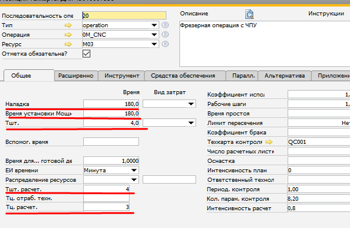
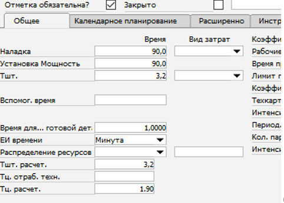
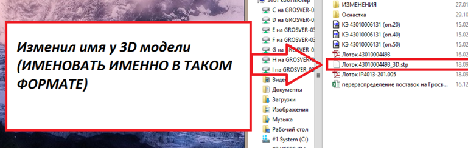
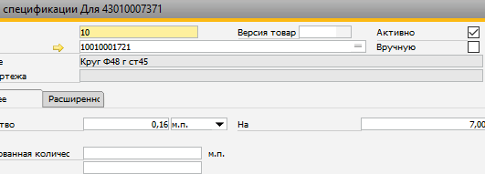
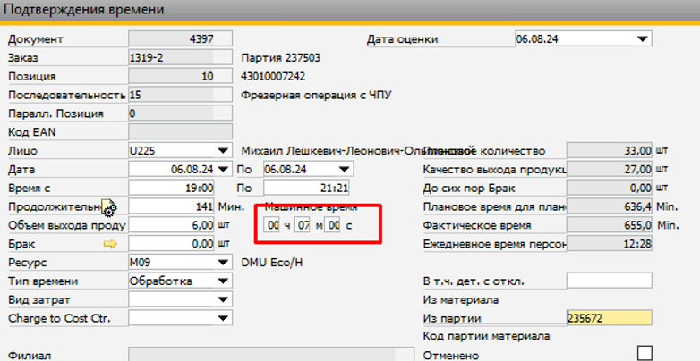
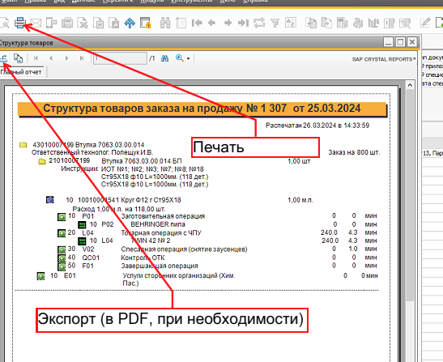
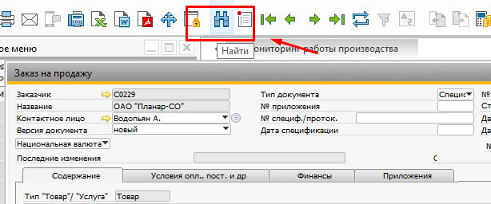
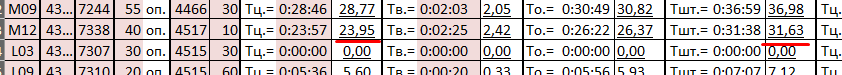

# Коспект - рабочие процессы

## Операции в тех. карте

- Заготовительная. Д16 ф70 L=185 (1 дет) – указываем количество деталей на одну заготовку

Последние операции в тех карте
- Контроль ОТК
- Завершающая 

Слесарная – если конкретно не указано то выбираем первую (слесарная операция – снятие заусенцев)
- в поле доработка указывать время 

Формат заготовительной операции
- Ст20 ф10 L=600мм (23дет) - пруток
- Ст20 #10x50x100  (1 дет) – плита 
- Ст20 S14 L=1000мм(1 дет) – шестигранник 

h11 /h12 – калиброванный пруток (шестигранник или пруток)

г – горячекатаный 

K – калиброванный (квалитет не указан) 

0003 – карточка давальческого материала

1001 – карточка закупочный материал

4301 – без покрытие 

4301 , 2101 -  с покрытием

**При создании карточки обязательно вносим Тц расчетное если есть, подстовляем это в каждом альтернативном станке**
- стрелками указаны обязательные поля
- в дальнейшем будет подтягиваться Тц в производственный заказ и если нет расчетного то браться отсюда при расчете интенсивности, пишем интенсивность 0 т.к. если ничего не вписать то не сохраняться изменения в альтернативе

## Сборка шаблоны

- 500… Шаблон сменного оборудование (сборочная единица)
- 510…. Шаблон сменного оборудование (комплектующее) – нет сборочного чертежа
- 50009999999 – карточка с таким номером берётся для сборки и для деталей, которые не входят в какую-либо сборку.
- 51009999999 – карточка с таким номером присваивается только для деталей, которые входят в какую-либо сборку.

В операции комплектование – сборка вписывается : спецификация + стандартные изделия  (если есть)
- Описывается какие стандартные изделия и их комплектация
- Пример – Спецификация +  Винты М6 L=20мм – на 1 комплект 12 шт.

## Станки 

- Станки – если 3+2 – М03 , М05,М06,М07,М09,М11
- Станки – если 3 – все выше + М10

## Чертежи и информация о деталях (карты контроля и карты эскиза)

Для фрезерных операции – NX технологи

Для токарных операций – программы CIMCO

## Расчет интенсивности

Когда вносим интенсивность и в карте контроля стоит две порядочности считаем по формуле :
- Количество параметров на одну деталь = количество параметров / периодичность контроля 

## Нормирование

Если пустое или красное не совподает с текущими значаениями

Вписываем а таблицу предварительно

После измерений

Далее вписываем в чат текущие измерения с измерениями по умолчанию

Если текущие больше то ставим ! и меняем только в производственном процессе

Если текущие меньше то изменяем в мастер данных и в производственном заказе,только не изменяем расчетные времена титова, их остовляем в соответсвующих полях.

После 
- внесение изменении в мастере данных (если необходимо! )

Меняем в производственном заказе 
- операции меняем только текущие , не меняем закрытые операции

**!Внимательно следить за номером станка при изменений значений, менять там где совпадает номер**

Интенсивность в зависимости от карты контроля – вписали период и количество параметров (смотрим по карте)

Если не указано то 20 (периодичность контроля) и количество параметров 1

Если стоит две порядочности(серым и белым) считаем по формуле :
- Количество параметров на одну деталь = количество параметров(к.п)  / порядочность контроля(п.к)

Например – (20(к.п) / 5(п.к) ) + (49(к.п)  / 15(п.к)) = …

Также меняем в альтернативе 

**! В мастере данных храняться только актуальные расчеты титова, либо фактический которые идут быстрее расчетных титова**

**! Если известно периодичность контроля и параметры контроля то также добовляем в мастер данных чтобы далее автоматом подтягивалось при создании нового производственного заказа**

## Госты

- ГОСТЫ – диск  Производства  -> Инструкции -> Госты
- Диск Д -> ГОСТы, ОСТы и т.п

## Шаблоны карт контроля

Производства -> Nx технологии -> _Шаблон карты контроля  - > под разные листы (под количество)

## Раскрой

Диск Д -> Раскрой …

Создавать папки с номером детали или деталей и дальше уже сохранять чертеж
- название папки датой внесение
- внутри папка с номером детали если известно
- далее сохраняем файл с указание размера заготовки, размера листа и количество

В формате – компас (для себя) и пдф (для отправки)
- если медолви то нужно будет отправить на почту чертежи в формате компас на почту **info@medolvi.by**

## Закинуть чертеж в Windchill

## Знаки – быстрый ввод

± - alt + 0177

° - alt + 0176

× - alt + 0176

ø - alt + 0248

## Создаем оснастку

Пищим шаблон в мастере данных и выбираем необходимый – создаем копию через 

И далее дублировать и после только создаем новый

**Создаем сборку 500000….**
- в сборке указываем первой операцией – комплектование и сборка 
- если есть крепеж то также  указываем в инструкции

Дальше на каждую позицию создаем спецификацию также с помощью шаблонов – только номера 51000…

- через ->

Указываем количество - левее сколько штук для сборки.

В расширенных –>  склад  при создании карточки мы указываем вес – если сборка или чертежа нет и вес неизвестен то указываем 0,01 кг

Создаем его

И после входим вновь созданный и переносим необходимые операции в тех карту

И так на каждую деталь в сборке

**!!!!Материал на оснастку не делают (на детали и саму сборку)**

Важно в заготовительной операции вписывать количество деталей на указанные габариты.

Дальше пересылаем в отдел планирования чтобы создала производственную карту и распечатала, прилагаем чертежи на данную оснастку. При этом в мастере данных должны быть актуальное количество деталей в сборке, чтобы при создании подтягивалось актуальное количество на каждую деталь, пример ниже.

## Принтер 

На рабочем столе – быстрое сканирование – сканировать – потом сохранить (формат пдф)

Хранятся в папке документы скан (раб.стол)

## Получить доступ к расчетам титова

На раб столе (на удаленке) 

Далее ок

И после получаем доступ в таблице расчетов титова

В верхнем поисковике ищем номер детали гроса 4301... 2101...

И далее проваливаемся по 

И видим названия детали заказчика по умолчанию 

По этому названию ведем поиск расчетов 

При поиске прописываем *

Также может быть вариант поиск в "запросах и заказах" ищем соостветсвующего заказчика , открываем и ищем нужный
- будет не легко найти т.к. не конкретно файлы не подписаны, смотрим на время создание, доп сведение в имени файла

## Увидеть исполнителя операции

- В производственных заказах
- Разверчиваем необходимую операцию видим Фамилию и дату

- кликаем по строке исполнителя и можем увидеть более детальную информацию (какой станок, машинное время и т.д)

## Карты контроля 

- Технолог пишет программу и после дает указание на формирование карты контроля
- При необходимости может потребоваться изменение 
- Если технолог не сделал карту то заполняем на основании NX программы если фрезерка иили токарка то должен быть лист с операциями предворительно
- Если ласточкин хвост то периодичность 20 и параметров 1

## Когда приходит уведомление в sap (заказ на продажу)

Далее 

И после уже оформляем затираем все наименования и подписи заказчика и меняем на наши где неоходимо и закидываем  в winch / выше указан процесс детальнее

Кидаем в папку

## Скопировать тех карту с другой детали и т.д.

Вводим номер (не полностью можно)

И вставить

## Создать производственный заказ

- Добавить –> позиции -> добавить

- Ищем созданный товар в мастере
- И далее прописываем количество 
– ок

## Распечатать тех карту

В поиске производственный заказ 
- проваливаемся в документ 

- далее кликаем по строке двойной клик после 

Тех карту обычно передаем мастеру

## Чертежи ТСП 

Хранятся в папке , не передаются в эл. виде третьим лицам.

## Cоздание карточки на материал

Информация о том какой материал довальечский или нет указан в заказе на продажу
- 4301D - довальческий материал - не надо создавать карточку
- 4301S - наш материал - необходимо создавать карточку

**!!!Важно если уже существует карточка c необходимым размером и материалом то не создаем новую а просто используем ее, а в параметрах ставим уже размер заготовки текущего товара и ее количество. Размер заготовки и количество не подтягиваеться глобально к карточке а индивидуально на текущий заказ.**

**Если 2 и более материала указана на заготовке (Ст.30 / Cт.30x) то мы создаем на каждый материал отдельную карточку. И влажимаем эти карточки материала в эту деталь.**

Формат определенный записи

Сначала ищем в поиске если нет то создаем
- *шаблон

- и в поиске – шаблон , расширенно, дублируем и пользуемся, лучше записать отдельно присвоеный номер для удобства поиска в дальнейшем.

**Общий вес:**

В зависимости от параметров заготовки считаем по калькулятору удельный вес в метрах (1м для прутков), для плит по размерам плиты.

- пример для прутков

Если плита то килограммы – берем размер плиты , если алюминий - 1200x3000 , сталь - 1500 x500 , то есть #_(толщина заготовки)x1500x500  и вписываем общий вес плиты после расчета калькулятора

**Вес заготовки**
- Если например пруток – м.п Д16 ф10 L=160 (7дет) – мы пишем количество заготовок на эту длину(на 1м) в карточке материала -  типо 0,16 – 7 шт.

Если заготовка плита - то просто вбиваем значения учитывая габариты и велечину реза
- !Учитывать ширину реза при расчёте нормы расхода при вписание в заготовки плиты 
- вписываем вес заготовки на 1 шт. пример плиты с учетом реза (обычно 3мм)

Пример на пруток, не надо учитывать рез только диаметр и 1 метр по умолчанию

## Разработка тех. карты 

Смотрим размеры для справок для размеров которые не обозначены

Те поверхности которые можно охватить ЩЦ губками и посчитать это охватывающие поверхности или охватываемые, если нельзя так измерять то берем как записано ниже.
- у нас не в системе вала или отверстия (не охватывающие и охватываемые поверхности) то делим допуск на 2 в ту или иную сторону.
- типо допуск +0,36 -> -0,18 / +0,18

Также можем указывать межосевое растояние таким способом если много значений, чтобы не усложнять работу с чертежом и экономить время на создание тех. карты

## Отгрузка из остатков по счету

**В работу не берем и структуру не распечатываем**

## Распечатать структура заказа

- Заказ на продажу
- Выбираем необходимый номер
- В левом верхнем углу -> файл...

## Перейти в текущею папку заказчика

- Проваливаемся по номеру детали
- И далее

## Карточка на материал 

Шаблон в мастере данных

Также доп индефикатор может быть тут

Добовляем в карточку в поле production - килограммы

## Заказы на продажу вносим в свою таблицу

- На рабочем столе папка "Заказы на продажу"
- Крайний левый - номер заказа на продажу (например 1383)

## Общий процесс работы

1. Создается заказ на продажу 
2. Приходит сообщения
3. Далее мы загружаем необходимые чертежи в winch (заказчика и наши измененные), далее заполняем в таблицу "Заказы на продажу" новой графой
4. Если структура уже создана то сразу переходим к пункту 6.
5. Отдали структуру (пустую) в работу технологу в соответствии с процессом изготовление (токарка или фрезерка) + приложили расчеты титова 
6. После того как будет сделан тех процесс на детали -  распечатываем структуру и отдаем исполнителем на соглосование наладочных деталей , далее передаем в отдел планирование (заполняем таблицу "Заказы на продажу" окончательно что передали структуру)
7. В заказе на продажу при передаче меняем статус с версия документа новый на утвержденный 

8. Также записываем в таблицу exell материал на каждую позицию (1 строчка расчеты титова, 2 строчка то что в тех. процессе) - это операцию теперь делает отдел подготовки производства

## Посмотреть сколько закрыл оператор станка

Можем видеть машинное время вбитое оператором

Далее рассчитать сколько времени требуется если отсутвовал на работе (ночью, выходные и т.д.)
- Например 141 мин на 6 операции = 23,5 на одну (Тшт)
- Далее делим все время Тшт на коэф например 1,2(до 30) 
– получаем время ТО и вычитаем из него Тц работы станка
- ТО = Tшт / коэф (23,5 / 1,2)
- Получаем Твспом = To – Tц
- Обычно просто беру Tц что вбил оператор , пишу вспомогательное субъективно из расчета что за деталь как крепилась, обычно токарка 30сек, фрезерка 1-2. И после зная Тц и Твсп находим оперативное а за ним и Тшт.

## Сопроводиловка распечатать

Вводим в поиске номер через *

Далее потвердить

Нажимаем все дни и ищем по фамелии последней закрытой операции

Далее печать

## Код обработки добавить 

- В расширено
- Самая длинная строчка

## С покрытием и без покрытия

Прописана на чертеже, также в примечании заказа на продажу или справа в строчке в заказе на продажу. Если не указано то по умолчанию делает все что указанно на чертеже включая покрытие. Также они могут сделать заказ на продажу а в последствии отредактировать его внеся поправки тем самым тебя подставив, в таком случае смотреть на дату редактирование и фамелию исполнителя относительно даты регистрации.

Дают тех процесс и внизу написано покрытие – это вносим в карточку обертку 4301… на ней то же иногда бывает тех процесс.

Ссылка на 2101 карточку

- проваливаемся в 2101 пишем остальной тех процесс в ней, туда уже материалы подвязываем и т.д.

## Присвоение номера (деталь заказчика) SAP

## Процесс создания карточки 2101000----

## Формирование структуры заказа на продажу

Обновление работы со структурами:
- Структуры должны попадать с проставленными наладочными от технологов
- В конце структуры все ответственные технологи должны её совместно подписать, так же отк должно поставить свою подпись.
- На структуре вы ставите дату и время когда вам её отдали.

## Формирование карты наладки в NX

Выгрузить весь инструмент - цеховая документация

Анализ обработки - вкл заготовку в процесс, и анализ допусков
- вкл заготовку

- анализ допусков 

## Нормирование формулы

**Расчет штучного времени**

**Тшт. = То. * К,**

где Тшт. – штучное время; То. – оперативное время; К – коэффициент, зависящий от Тм. - при Тм. < 30 – К = 1,2; при Тм. > 30 – К = 1,15.

**То. = Тм. + Тв.,**

где Тм. – машинное время, Тв. – вспомогательное время.

**Расчет интенсивности**

Для ресурсов токарной группы интенсивность равняется 0,8, если Тц. ≤ 1,5 минуты, в ином случае считается по формуле:

**И = 1 – Тсв. / То.,**

где И – интенсивность; Тсв. – свободное время при одностаночном обслуживании.

Для ресурсов фрезерной группы интенсивность равняется 0,8, если Тц. ≤ 3 минут, в ином случае считается по формуле:

**И = 1 – Тсв. / То.**

**Тсв. = (То. – (Тв. + Тк. + Та.н.)) * Кс.о.ц.,**

где Тк. – время контроля; Та.н. – время активного наблюдения; Кс.о.ц. – коэффициент совпадения окончания циклов.

**Тк. = Nк.п. * 0,3 * (1 / P),**

где Nк.п – количество контролируемых параметров; 0,3 – среднее время контроля одного параметра; P – периодичность контроля.

**Та.н. = Тц. * 0,05.**

Кс.о.ц. для ресурсов токарной группы равен 0,96; для ресурсов фрезерной группы равен 0,98.

## Поиск заказа на продажу

Продажи - заказ на продажу

Вводим номера заказа и нажимаем поиск.

Также номер заказа на продажу находиться в производсвенном заказе

## Карта разрешение (согласование в сторонней организации)

Есть на рабочем столе файл с номерами кабинетов и телефонов всех лиц - "...кабинеты"

Необходмые подписи и т.д. у нас в организации:
- Берем карты в ОТК

- Обязательно должно быть 2 экземпляра на каждую деталь , один остовляем у них , второй забираем мы
- Далее подписываем у зам. директора – главный инженер, все экземпляры и далее ставим печать в бугалтерии (у них имееться печать)
- После распечатываем чертежи на эти детали , помечаем маркером указанные несоответсвие на чертеже. Это для удобство при подписи в дальнейшем у конструктора в организации.
- Предворительно звоним чтобы сделали временный пропуск

Необходмые подписи и т.д. у заказчика:
- **Обязательно берем с собой паспорт** 
- Далее едим на подпись
- Согласовываем с менеджером время, он также делает пропуск временный
- Сначало подпись у конструктора (ответсвенный за эту деталь)
- После главного конструктора (спросить кто в текущий момент отвественный у того и подписывать)
- После у главного технолога в отделе (кабинет указан)
- В последнию очередь на подпись остовляем у зам. директора в приемной (кабинет указан)
- После отдаем ихние экземпляры а архив (кабинет указан)
- И далее привести наши экземпляры.

## Для отчета планового и реального времени

**!Не всегда атуальные данные подтягивает, лучше формировать вручную**

В главном меню SAP
- Производство / Утвержденние времени

- В таблице выбираем параметры поиска - убираем голочки все закрытые
- после вбиваем номер детали в поиске ниже
- получаем таблицу с нормированными данными технолога

Пример данных из таблицы и отчета
- В таблице нормирование

- В отчете 

## Для отчета за период от.. до...

В главном меню SAP
- Новый отчет по фактическим временнам / Утвержденное время

- Выбираем период с.. и по ...

## Мониторинг времени обработки

Технолог обязан регулярно отслеживать время обработки на каждом станке и сравнивать его с заложенным расчетным временем посредством чата “Изменение трудоёмкости обработки”.

При обнаружении увеличения времени обработки технолог должен: 
- Провести консультации с оператором станка для получения дополнительной информации.
- Проанализировать изменения в программе станка, которые могли привести к увеличению времени.

Технолог должен определить возможные причины увеличения времени обработки, такие как: 
- Изменение режимов резания.
- Корректировка операций. 
- Износ инструмента или оборудования.
На основании анализа технолог обязан предпринять следующие действия:
- Внести необходимые изменения в программу станка для оптимизации времени обработки.
- Указать оператору на проблемы с режимами станка для их последующего устранения.
- При необходимости инициировать техническое обслуживание оборудования.

Используем чек-лист наладки и чек-листы оператора для проведения систематической проверки всех параметров и настроек оборудования.
- На основании данных из чек-листов проводим анализ, выполнена ли наладка и текущая настройка корректно и в соответствии с установленными режимами обработки
- В случае обнаружения несоответствий инициирует корректирующие действия для устранения выявленных проблем.

## Нормирование времени точечно

- Сбор производственных данных
- Подтверждения времени для производства

- дальше вбиваем дату , после станок и т.д., проваливаемся в текущию операцию и вписываем или редактируем время

## Бюджет новый - производства (заполнения таблицы)

Для анализа затрат и понимание экономики ввели глобальную таблицу.

**В нашу часть входит заполнения данных времени расчетного и фактического по каждой операции связанное с токарной и фрезерной обработкой, аутсортинг и так далее считаеться отдельно в другой таблице**

Ссылка на таблицу - https://docs.google.com/spreadsheets/d/1_ILf928vI77LzpUXwGq9ufzxZfONXhTvoyzEbvEJPYs/edit?gid=969399035#gid=969399035

**Заполняются только столбцы, выделенные желтым**		

**ВАЖНО! Если кол-во заказов превышает отведенное в таблице кол-во строк, необходимо, добавив строки, скопировать них содержимое (формулы) строк выше**

Ответственные за предоставление данных:Лаймейко Виталий	(экономист) - он заполняет у себя в таблице , и его данные подтягиваються в нашу таблицу, и после мы заполняем все токарные и фрезерные операции **беря в расчет фактическое время не из мастера данных а из прозводственного заказа**

Если мы лично не нормировали операцию а брали данные из winnum или подтвержденное время оператором - то не ставим галочку подтвержденное время, если лично мерили то ставим галочку (подтвердили лично мы).

После внесения **всех операций на данной детали** ставим галочку производство оконченно.

## Добавить оснастку как инструмент

Модуль -> Запасы -> Управление инструментам

Далее создаем новый инструмент 
- название
- описание
- подтягивает сделанную оснастку

**Добовляем сам инструмент (оснастку) к детали**
- мастер данных
- в операцию
- инсрумент 
- добовляем созданный инструмент

**Если уже создан производственный заказ то добовляем инструмент (оснастку) и в него**

## Убить процесс SAP или 1C

В поиске -> PS Killer

