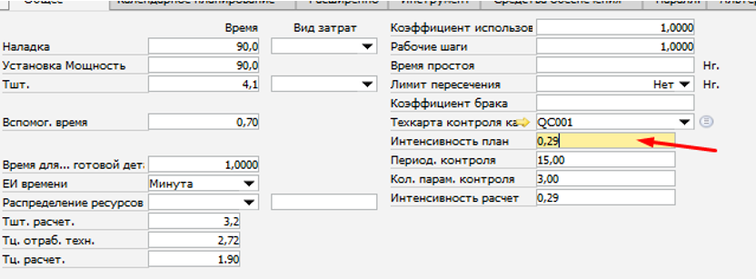
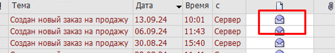

# Коспект - рабочие процессы

## Операции в тех. карте

Последние операции в тех карте
- Заготовительная. Д16 ф70 L=185 (1 дет) – указываем количество деталей на одну заготовку
- Контроль ОТК
- Завершающая 

Слесарная – если конкретно не указано то выбираем первую (слесарная операция – снятие заусенцев)

Слесарные операции в поле доработка указывать время 

Формат заготовительной операции
- Ст20 ф10 L=600мм (23дет) - пруток
- Ст20 #10x50x100  (1 дет) – плита 
- Ст20 S14 L=1000мм(1 дет) – шестигранник 

h11 /h12 – калиброванный пруток (шестигранник или пруток)

г – горячекатаный 

K – калиброванный (квалитет не указан) 

0003 – карточка давальческого материала

1001 – карточка закупочный материал

4301 – без покрытие 

4301 , 2101 -  с покрытием

## Сборка шаблоны

- 500… Шаблон сменного оборудование (сборочная единица)
- 510…. Шаблон сменного оборудование (комплектующее) – нет сборочного чертежа
- 50009999999 – карточка с таким номером берётся для сборки и для деталей, которые не входят в какую-либо сборку.
- 51009999999 – карточка с таким номером присваивается только для деталей, которые входят в какую-либо сборку.

В операции комплектование – сборка вписывается : спецификация + стандартные изделия  (если есть)
- Описывается какие стандартные изделия и их комплектация
- Пример – Спецификация +  Винты М6 L=20мм – на 1 комплект 12 шт.

## Станки 

- Станки – если 3+2 – М03 , М05,М06,М07,М09,М11
- Станки – если 3 – все выше + М10

## Чертежи и информация о деталях (карты контроля и карты эскиза)

Для фрезерных операции – NX технологи

Для токарных операций – программы CIMCO

## Расчет интенсивности

Когда вносим интенсивность и в карте контроля стоит две порядочности считаем по формуле :
- Количество параметров на одну деталь = количество параметров / периодичность контроля 

## Нормирование

Если пустое или красное не совподает с текущими значаениями

Вписываем а таблицу предварительно

После измерений

Далее вписываем в чат текущие измерения с измерениями по умолчанию

Если текущие больше то ставим ! и меняем только в производственном процессе

Если текущие меньше то изменяем в мастер данных и в производственном заказе

После внесение изменении в мастере данных – если необходимо!!!

Меняем в производственном заказе 
- операции меняем только текущие , не меняем закрытые операции

**!Внимательно следить за номером станка при изменений значений, менять там где совпадает номер**

Интенсивность в зависимости от карты контроля – вписали период и количество параметров (смотрим по карте)

Если не указано то 20 (периодичность контроля)

Стоит две порядочности(серым и белым) считаем по формуле :
- Количество параметров на одну деталь = количество параметров(к.п)  / порядочность контроля(п.к)

Например – (20(к.п) / 5(п.к) ) + (49(к.п)  / 15(п.к)) = …

Также меняем в альтернативе 

## Госты

- ГОСТЫ – диск  Производства  -> Инструкции -> Госты
- Диск Д -> ГОСТы, ОСТы и т.п

## Шаблоны карт контроля

Производства -> Nx технологии -> _Шаблон карты контроля  - > под разные листы (под количество)

## Раскрой

Диск Д -> Раскрой …

Создавать папки с номером детали или деталей и дальше уже сохранять чертеж

В формате – компас (для себя) и пдф (для отправки)

## Закинуть чертеж в Windchill

## Знаки – быстрый ввод

± - alt + 0177

° - alt + 0176

× - alt + 0176

ø - alt + 0248

## Создаем комплектацию на примере 

Пищим шаблон в мастере данных и выбираем необходимый – создаем копию через 

И далее дублировать и после только создаем новый

Создаем сборку 500000….

Далее в сборке указываем первой операцией – комплектование и сборка , если есть крепеж то также  указываем в инструкции

Дальше на каждую позицию создаем спецификацию также с помощью шаблонов – только номера 51000…

через

Указываем количество - левее сколько штук для сборки.

В расширенных –>  склад  мы указываем вес – если сборка или чертежа нет и вес неизвестен то указываем 0,01 кг

Создаем его

И после входим вновь созданный и переносим необходимые операции в тех карту

И так на каждую деталь в сборке

**!!!!Материал на оснастку не делают (на детали и саму сборку)**

Дальше пересылаем елене что создала производственную карту и распечатала

## Принтер 

На рабочем столе – быстрое сканирование – сканировать – потом сохранить (формат пдф)

Хранятся в паке документы скан (раб.стол)

## Получить доступ к расчетам титова

На раб столе (на удаленке) 

Далее ок

И после получаем доступ в таблице расчетов титова

В верхнем поисковике ищем номер детали гроса 4301... 2101...

И далее проваливаемся по 

И видим названия детали заказчика по умолчанию 

По этому названию ведем поиск расчетов 

При поиске прописываем *

## Увидеть исполнителя операции

Разверчиваем необходимую операцию видим Фамилию и дату 

## Карты контроля 

- Технолог пишет программу и после дает указание на формирование карты контроля
- При необходимости может потребоваться изменение 
- Если технолог не сделал то обычно по умолчанию по очереди заполняем карту
- Если ласточкин хвост то периодичность 20 и параметров 1

## Когда приходит уведомление в sap (заказ на продажу)

Далее 

И после уже оформляем затираем все наименования и подписи заказчика и меняем на наши где неоходимо и закидываем  в winch / выше указан процесс детальнее

Кидаем в папку

## Скопировать тех карту с другой детали и т.д.

Вводим 

И вставить

## Создать производственный заказ

Добавить –> позиции -> добавить

Ищем созданный товар в мастере

И далее прописываем количество – ок

## Распечатать тех карту

В поиске производственный заказ 
- проваливаемся в документ 

- далее кликаем по строке двойной клик после 

Тех карту обычно передаем мастеру

## Чертежи ТСП 

Хранятся в папке , не передаются в эл. Виде третьим лицам

## Cоздании карточки на материал

Формат определенный записи

Сначала ищем в поиске если нет то создаем

*шаблон

И в поиске – шаблон и т.д.

**Общий вес:**

В зависимости от параметров заготовки считаем по калькулятору удельный вес в метрах (1м для прутков), для плит по размерам плиты.

Если плита то были бы килограммы – и берем размер плиты , если алюминий то 1200x3000 ,если сталь то1500 x500 , то есть #_(толщина заготовки)x1500x500  и вписываем общий вес плиты.

**Вес заготовки**
- Если например пруток – м.п Д16 ф10 L=160 (7дет) – мы пишем заготовки количество на эту длину(на 1м) в карточке материала -  типо 0,16 – 7 шт.

Если заготовка плита - то просто вбиваем значения учитывая гобариты и велечину реза

!Учитывать ширину реза при расчёте нормы расхода при вписание в заготовки плиты 

Сюда вписываем вес заготовки на 1 шт. пример плиты с учетом реза

Пример на пруток, не надо учитывать рез только диаметр и 1 метр по умолчанию

## Разработка тех карты 

Смотрим размеры для справок

Те поверхности которые можно охавтить ЩЦ и посчитать это охватывающие поверхности или охватываемые, если нельзя так измерять то берем как записано ниже.

Тут берем значения по допускам – т.к у нас не в системе вала или отверстия то делим допуск на 2 в ту или иную сторону

## Отгрузка из остатков по счету

**В работу не берем и структуру не распечатываем**

## Распечатать структура заказа

## Перейти в текущею папку заказчика

## Карточка на материал 

Шаблон в мастере данных

Также доп индефикатор может быть тут

[рис_93 ](./md_img/рис_93.png)

## Заказы на продажу пишем а таблицу

На рабочем столе папка

Крайний левый номер заказа на продажу

1 дата поставки

## Общий процесс работы

- Создается заказ на продажу 
- приходит сообщения
- далее мы загружаем необходимые чертежи в winch заказчика и наши измененные – далее заполняем в таблицу заказа первой графой 
– после того как будет сделан тех процесс на детали – то мы распечатываем карту контроля и отдаем исполнителем и далее Алене в работу (заполняем а таблице заказов на продажу окончательно)
- также записываем в таблицу exell материал на каждую позицию (1 строчка расчеты титова, 2 строчка то что в тех. процессе)

## Посмотреть сколько закрыл оператор станка

Далее рассчитать сколько времени требуется
- Например 141мин на 6 операции = 23,5 на одну
- Далее делим все время Тшт на коэф например 1,2(до 30) 
– получаем время ТО и вычитаем из него Тц работы станка
- ТО = Tшт / коэф (23,5 / 1,2)
- Твспом = To – Tц

## Сопроводиловка распечатать

Вводим в поиске номер через *

далее потвердить

нажимаем все дни и ищем по фамелии последней закрытой операции

далее печать

## Код обработки добавить 

- В расширено
- Самая длинная строчка

## С покрытием и без покрытия

Прописана на чертеже , в примечании заказа на продажу или справа в строчке в заказе на продажу

Как выглядит

Дают тех процесс и внизу написано покрытие – это вносим в карточку обертку 4301…

Ссылка на 2101 карточку

А далее в нее влаживаем уже карточку с покрытием остальной тех процесс 2101 карточка, туда уже материалы подвязываем и т.д.

## Присвоение номера (деталь заказчика) SAP

## Процесс создания карточки 2101000----

## Формирование структуры заказа на продажу

## Формирование карты наладки в NX

Выгрузить весь инструмент - цеховая документация

Анализ обработки - вкл заготовку в процесс, и анализ допусков

