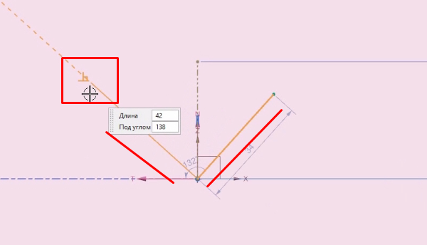
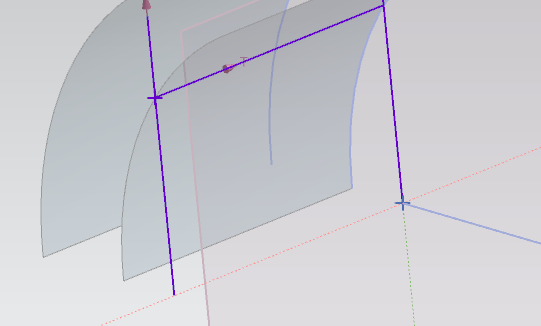

# NX CAD. Моделирование в NX

## NX CAD. Моделирование в NX. Урок 1

**Введение, интерфейс , принципы работы, эскизы, вытягивание**

**Зона графического окна**
- самая большая область в системе
- там находиться система координат нашего файла (3 оси по абсолютной системе координат , можно скрыть )

**Создание файла (часть)**

- Выбираем саму модель уже преднастроенную, также можем выбирать другие варианты
- Выбираем единицы измерения
- Тип системы
 

**Панель ресурсов** 

- Навигатор сборки - компоненты нашей сборки
- Навигатор модели - отображаються операции по построению моделей
- Роли - виды представления интерфейса (роль расширенно это максимальный полный интерфейс, по умолчанию использовать расширенную роль)
- Навигатор историй - храняться вся история файлов

**Панель выбора**

- Находяться все возможные закладки
- Можно искать параметры интерфейса через Меню ->... (под каждым параметром можно задать горячие клавиши)
- В меню все команды дублируеться из ленточного меню + скрытый интерфейс

**Ленточное меню**

Закладки:
- Исходное - часто используемые команды 
- Сборка - команды для работы со сборкой
- Кривая - работа с кривыми поверхностями
- Поверхности - работа с поверхностями
- Анализ - всякие измерение и тесты
- Вид - это метод представления 
- Приложения - различные модули системы (от моделирование до обработки)

Можно добовлять другие элементы ленточного меню (закладки), правой кнопкой мыши...

Также можем убирать или добовлять команды в закладках

Многие команды не помещаються на ленточном меню - они есть во вкладке - Дополнительно ...

**Оптимизация изображения по экрану**

Правой кнопкой мыши , и на этой кнопке отпускаем мышь, модель заняла все место на экране..

**Пример - например создаем цилиндр**

- Задаем его габариты
- Также можем предворительно посмотреть результат
- Также можно задать вектор (направления) и точку начала координат (можно задать и кастомную задавая точные координаты по всем x,y,z)

При создании в навигаторе модели появиться первая операция

В подродностях ниже видим более детальную информацию

Можем опять таки дважды кликнув по операции и изменить ее, также это доступно и в подробностях, при выборе подсвечиваеться определенным цветом, снять выделение на пустую зону или нажать клавишу escape.

Также есть другое контекстное меню в самой операции

**Перемещение детали**

- Масштаб колесико мыши
- Перемещение модели -  нажать на колесико и правая кнопки мыши
- Нажать на колесико и можем вращать модель

- Востановить вид по умолчанию 

Нажимаем на стрелку и можем крутить ее в определенное положения

**Контекстное меню**

- Зависит от контекста (поля в котором его вызваем)
- правая кнопка мыши

**Способы отображения**

Есть разные способы отображения

Можем изменить отображения объекта ,отобразить - изменить отображения объекта...

В виде указан масштаб модели

Можем изменить отображения модели в навигаторе модели, для активации дважды кликнуть

**Добовляем отверстие**

В панели все настройки идут сверху вниз

- Указываем позицию
- Направление
- Размер
- Команда вычетание (булевая)
- Можно включить предварительный просмотр  

Также справа параметры привязки

Можем отобразить определенный вид с видам нашего выреза

При работе с круглыми поверхностями обычно ищем точку квадранта - точка равная 0, 90,180,360 градус, либо можем искать центр посредством наведения на поверхность окружности вне точек квадранта.

**Выбор твердого тела или компонента**

- есть быстрые клавиши

Выбираем например грань и нажимаем F8 и она становиться паралельно экрана, это выбранная грань

**Привязка**

При моделировании поверхности помнят своих родителей, относительно чего они привязывались - это назыветься асоциотивность, и моделька каждый раз пересчитываеться и проверяеться.

### Построим данную модель

Будем делать через эскиз

Эскиз - это связанное ограничениями и размерами кривые, находящиеся в одной плоскости и воспринимаемые системой как одна команда.

По создаим эских по плоскости - Эскиз -> по плоскости...

Выбираем метод измерения и задание размера

Можно изменять параметры размеров в меню кликнув по этому размеру

Выравнивание по горизонтали

Ловит относительно касательные точки автоматический

Вручную сделать касательный отрезок 

Можно изменить размер через размерную линию и она автоматический подтянет за собой размеры модели

При вытягивании мы устанавливаем вектор вытягивание, ее размеры, также булевые при контексте пересечения плоскостей

Можем создать эскиз по одной из поверхности модели, а далее с этим уже новым эскизом работаю с новой плоскостью - Тиснения.. (или просто создать новый эскиз по плоскости и работать). Тиснение как бы подстраивает элемент под наше новое вытягивание.

**3.27**
## NX CAD. Моделирование в NX. Урок 2

**Эскизы, активные и вспомогательные  кривые, ограничения, размеры, вращения**

Кривая - эскиз в среде задач (удобно создавать плоские объекты)
- эскиз можно сделать по плоскости
- по траектории

Есть ограничение принудительные а есть которые машина сама накладывает системно.

Аогоритм такой
1. Создание примерного контура
2. Наложения ограничений (в новых версиях создаються аватоматический) и размеров
3. Проверка правильности постороения

Можно включить и выключить некоторые ограничения 

Создаем профиль - создает ряд связанных прямых

Можем сразу двигать наш профиль и он будет автоматический меняться, можем его двигать он никак не привязан к системе координат

Можно выбирать тип размера

Nx будет подсказывать что геометрия уже задана будет подсвечивать красным лишнии размерные линии, можем эти размерные линии сделать справочными для этого необходимо правой кнопкой мыши - и нажать сделать справочными 

Можно добавить геометрические ограничения - но это устаревший метод в среде задач (в поиске можно найти), этот метод закрывал моделирование, но сейчас просто эски продолжает моделирование.

У нас есть браузер постоянных отношений которые можем изменить эти отношения

После получения эскиза его можем вытянуть - но важно чтобы эскиз был замкнут!!!

Можем попасть через вытягивание - опять в эскиз кликнув на значок

Можно сделать эскиз внутренним только лишь для этого вытягивание, и чтобы потом получить к нему доступ необходимо провалиться опять же в вытягивание.

Можно построить эскиз по троектории, сначало чертим прямую, далее формируем эскиз по троектории, и выбираем вектор и отдаляем на нужную велечину по троектории

Процентное соотношения можно дуги нашей траектории можно менять

Сделали эскиз и относительно его задали ось вращения показали вектор и относительную точку смещения (мы как раз сместили эскиз от центра)

При работе в эскизе необходимо чтобы было включено - "создать контекстное ограничения" , она будет создавать узлы и связи при построении, при отключении все свободно сдвигаеться.

При построении система сама подсказывает некие ограничения в построении - например подсвеченные линии система хочет сделать перпендикулярными, если нам этого не нужно то мы просто сдвигает немного мышку в сторону чтобы убить автоматизацию или нажимаем кнопку alt.

## NX CAD. Моделирование в NX. Урок 3

**Продолжения , ограничение, размеры, построения моделей**

"Кривая пересечения" - в эскизе кривой, показывает пересечения одной плоскости относительно другой.Также есть похожая команда - "Точка пересечения". И "проецирования кривой".

Ассоциативность - свойство отслеживать родительские объекты и перестраиваться из за их изменения.

Дочерние объекты, которые зависят от нашего объекта.

Родительские объекты - объекты в навигаторе модели которые использованы при построении какой либо геометрии в NX.

Также можно изменять контекст работы в эскизе. Чтомы можем будучи в одном эскизе способны работать с другими, или же ограничиваем область работы.

Построить эквидестатнуту - кривую смещения на заданный размер относительно текущего.

Массив кривых - строим массова из одной кривой множество.

Отзеркалить элемент - хотя в данном случае можно получить сразу все углы с помощью массива кривых.

Показать ссылочные кривые - после завершения эскиза в параметрах.

### Задание построить данную модель

Когда в команде видим "контексный" то это означает что машина сама типо понимает что мы от нее хотим.

## NX CAD. Моделирование в NX. Урок 4

**Продолжения , настройки эскиза, перепривязки эскиза, построения моделей**

По мере того как будут наложены ограничения авторазмеры будут у нас отпадать.

Можно изменить авторазмер в настойщий , подписать размер - например высота или ширина.

Попасть к наложению ограничения - дополнительно -> браузер зависемостей в эскизах, либо просто через поиск.
- с красным крестикам, это те размеры которые находяться в конфликте
- можно удалять ограничения
- отобразить степени свободы точек (может совершать перемещения и по вертикали и по горизонтали)
- если линия полносьтью ограничена и у нее нет степеней свободы она подспечиваеться кружком
- вызов ограничения - клавиша "S"

В эскизе также присутствуют фильтры при работе, нгастройка контекста работы

Можем перемещать или копировать различные фигуры, двигая за элемент координата в ту или иную сторону.

Перебазировать сделанный эскиз
- изменить с откатам
- перепривязать
- показываем вектор
- задаем точку начальную эскиза

Можно настраивать эскиз
- подпись метки
- размеры линии
- и т.д.

### Построим модель шплинта

Используем - заметание вдоль направляющей чтобы сечения продлить вдоль кривой.

Скругляем все поверхности и готова

## NX CAD. Моделирование в NX. Урок 5 !!(с субтитрами далее пересмотреть )

**Создание отверстий без использования эскиза. Создание отверстий на основе разметки в эскизе. Вытягивание. Построение модели**

При построении отверстий выбрать точку не подхватывая грань.Отказаться от точки удерживая shift. Если хотим другой тип отверстия придеться выполнить несколько команд отверстий.Также можно указать с цековкой или зенковкой данное отверстие.

Можно рамочкой указать те отверстия которые не нужны и shift удалить.

Удленение в начале - выше точки уже не формирует отверстия. Также можно вписывать свой вектор.

Если построении указываем плоскость то поподаем опять же в эскиз в среде задач.После задаем точки - и каждая точка будет формировать на эскизе отверстие.

Обычно отверстия строиться по умоолчанию пернедикулярно поверхности.

Можем указывать вдоль вектора обозначенного при построении отверстия.

При построении из скруглении выше или ниже, при выборе удлиненние в начале пол отверстия ниже центра скругления убереться.

Частично увидеть отверстия в виде каркасного вкладка - отобразить -> shaded type -> частичная закраска 

Можно указать точки на поверхности модели или же включить эскиз на поверхности и на ней отложить точки.Также проваливаемся также назад в эскиз если необходимо и изменяем..

Также можно ан эскизе вписать прямоугольник не отлаживая точки и после по граням прямоугольника строим отверстие.

Командой фаской можем смещать угол определенный в ту или иную сторону, перемещая за линию.

Можно с помощью одной линии задавать карман - вытягиванием.Другой вариант указать плоскость паралельную и вятнуть карман

Чтобы взять линию эскиза с модели то нам нужно - дополнительно -> выбираем кривую -> и от нее можем строить эскиз

## NX CAD. Моделирование в NX. Урок 6

**Опорная геометрия. Базовые примитивы.Аск и РСК.Булевы команды. Пример построения модели**

Опорная геометрия 
- координатная плоскость
- координатные оси 
- базовый СК (система координат)

Базовый СК - набор трех осей и трех плоскостей вместе с центральной точкой.Не являються математическими, не задают координаты точек или объектов.

Их можно создать сколь угодно множество СК

Можем построить эскиз на любой плоскости базовой системы координат

Есть абсолютная система координат - это неподвижная система координат, находящаяся в центре модельного прространства, которая орпеделяет координаты всех геометрических объектов модели. Она явно никак не отображаеться ! Это первая базовая система координат.Оси и направления не меняються, она всегда неподвижна

Относительная система координат (РСК) (синий, красный и зеленый вектора по умолчанию)- это подвижная система координат, перемещаемая куда угодно, которая также определяет координаты геометрических объектов модели. Явно отображаеться! w - включить или выключить отображение.

Можно динамический изменять РСК

Можем видеть растояние относительно абсолютной системы координат. Можно установить по базовой ситсеме координат. 

Другое построение навигатора по операциям а не по телам- как модель (убираем галочку в параметрах порядок построения)

На некоторых предприятиях булевые команды внутренние запрещены так как путают пользователя, поэтому используют внешнию команду - объединения

Строим плоскости, если указать одновремеено 2 грани то машина строит плоскость бисектрисы, shift отмена граней. Либо указать множество точек. Также есть и другие типы построений. Также строить относительно кривой и заданной точки.Существует масса способов, все способы расмотреть невозможно.  Касательные граней.Сами плоскости математический бесконечны, границы для удобства.
 

Координатные плоскости - пользуеться редко, для указание осей массива, какого либо направления, от координатной оси можно отложить размер. Строить оси пересечения, вектора по кривой, 

### Построим модель фланца

Из граней тиснения - есть параметры чтобы угол не увеличивал размер а строился от текущего и т.д., множество режимов

Чтобы построить фланец на другом конце трубы необходимо построить базовую систему координат на правом фланце и базовую систему координат на торце трубы конца.

Скопировать фланец с другой стороны -> Дополнительно -> Массив геометрий -> общий -> система координат -> выбираем выбранную -> выбираем СК вторую куда скопируем.

Дальше можем объединить в одну деталь всю элементы - объеденения ...

