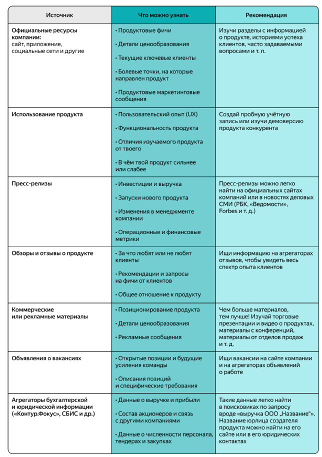
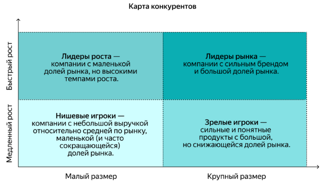
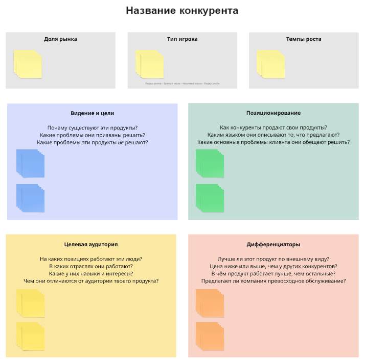
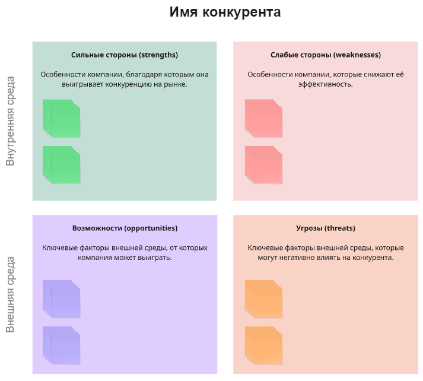
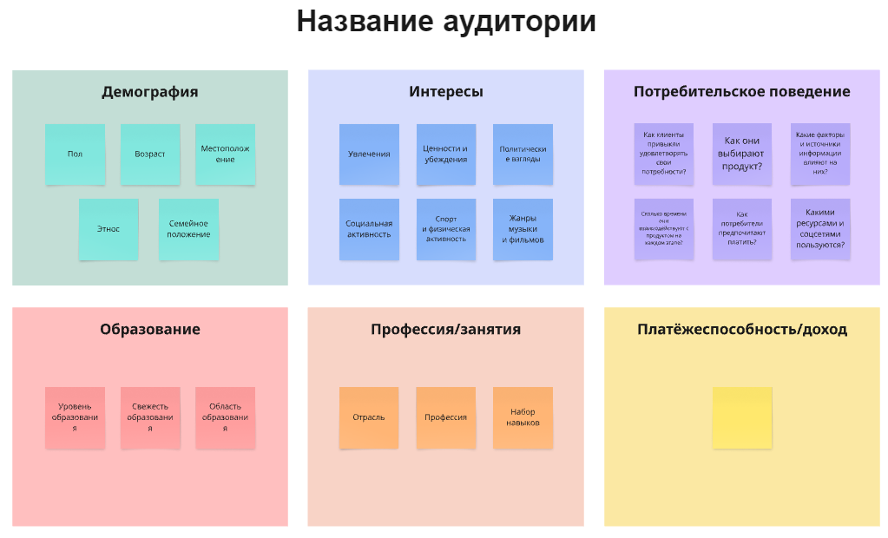
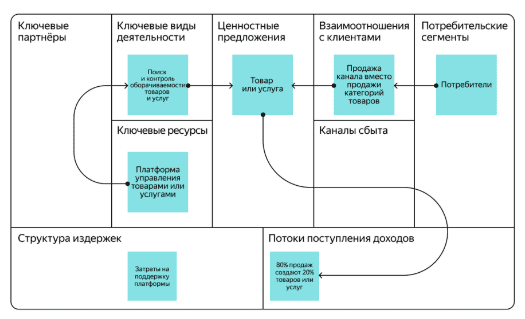
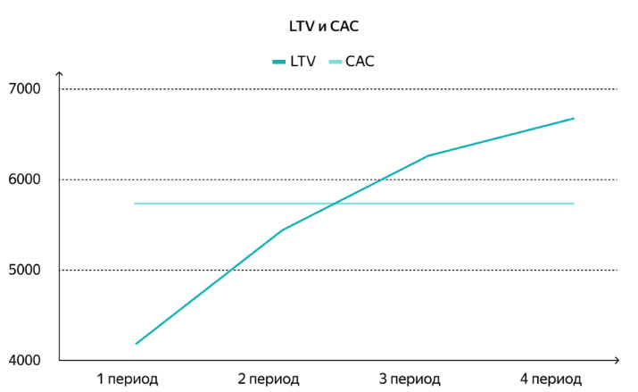
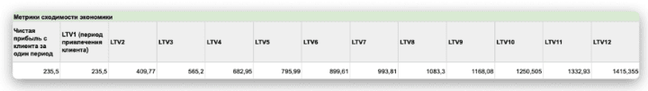
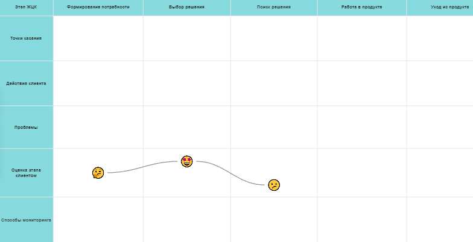
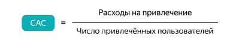

Одна из главных целей продакт-менеджера — поиск product/market fit, соответствия продукта рыночным потребностям.

# Спринт 1

## Введение в исследования рынка

Чтобы понять, что нужно клиентам, нужно исследовать клиентов и рынок в целом. Нельзя опираться только на свои представления и догадки.

###  Что такое рынок?

Твой цифровой продукт — это не просто набор функциональных возможностей (фич), сайт или мобильное приложение.

Цифровой продукт удовлетворяет потребности и решает задачи клиентов, у которых есть возможность выбрать другое решение своих задач. Каждый продукт находится во внешней среде — на рынке, где действуют разные участники: твоя компания, конкуренты, клиенты и так далее.

**Рынок** — это экономические отношения между потребителями цифрового продукта и его создателями.

Чтобы твой продукт был успешен, нужно учитывать внешнюю среду. Тебе нужно знать, кто готов купить твой продукт, а также кто помогает (или поможет в будущем) клиенту закрыть ту же потребность, что и твой продукт.

Удачной идеи продукта недостаточно для его успеха. Важно, как эта идея реализована и насколько она отвечает потребностям рынка.

Именно поэтому продакт-менеджеры инвестируют своё время и силы в исследования рынка — в понимание среды, в которой находится продукт.

### Что даёт исследование рынка?

Анализ рынка полезен по нескольким причинам.

1. **Исследование рынка бережёт время и ресурсы**

В результате твоя команда может проверить, насколько жизнеспособна ваша идея. Многие продукты провалились, так как на них не было достаточного спроса, или рынок оказался слишком узким, или команда сделала ставку на устаревшие технологии, или было ещё что-то. Если вложиться в изучение рынка перед запуском продукта, этих ошибок можно избежать.

**Пример.** Твоя команда сделала сервис: конструктор резюме. Вы оценили рынок жителей России, которым нужно составить резюме. Также вы установили стоимость ежемесячной подписки для клиентов: сравнили её с западными аналогами и сопоставили со средней зарплатой по стране. При этом вы не исследовали целевую аудиторию.

После запуска твоя команда увидела, что людей, готовых платить за сборку резюме, не так много (узкий рынок). Из-за особенностей и цикла поиска работы клиенты крайне редко продлевали подписку: они не увидели в ней ценности для себя. Всё это можно было выяснить до запуска и сэкономить ресурсы.

2. **Исследование рынка помогает рассчитать окупаемость**

Понимание рынка и оценка его объёма помогают убедиться в том, что выручка от продукта окупит инвестиции в него. Также исследование рынка повысит шансы на привлечение денег инвесторов. Используя цифры и факты, тебе нужно показать руководству и инвесторам, что ты знаком с рынком и аудиторией, а бизнес-идея продукта имеет потенциал.

**Пример.** Инвестиционный фонд хочет вложить деньги в сегмент телемедицины — удалённого предоставления медицинских услуг. На примете у фонда есть два стартапа на ранней стадии со схожей концепцией продукта.

Первый стартап в своей презентации оценил рынок телемедицины аж в 10% всего рынка медицинских услуг. Откуда такая цифра? Команда посмотрела на показатели некоторых зарубежных стран.

Вторая компания представила более скромную и реалистичную оценку рынка — втрое меньше. В презентации стартап описал ключевые драйверы и ограничения на рынке, а также представил результаты исследований клиентов и конкурентов по каждому сегменту медицинских услуг.

В итоге инвестфонд выбрал второй стартап, который показал, что сделал свою домашнюю работу и лучше понимает рынок.

3. **Исследование рынка помогает оценить состояние запущенного продукта**

На реальных рыночных данных проще понять, насколько продукт соответствует потребностям рынка, нужно ли менять его стратегию или бизнес-модель (так называемый пивот).

**Пример.** Макс уже сталкивался с исследованием рынка, но, видимо, забыл об этом. Когда он работал менеджером проектов в Melody, его команда делала новый продукт — прослушивание подкастов.

После запуска продакт-менеджер увидел, что изначальный план по привлечённым клиентам не выполняется. Чтобы разобраться, что не так, команда провела исследование. В итоге выяснилось, что клиенты были и так довольны другими сервисами, которые уже работали на рынке.

При этом у многих слушателей оставалась нерешённой другая проблема: сортировка подкастов по темам, популярным в их стране (путешествия, психология, саморазвитие и тому подобное). Благодаря новым вводным команда скорректировала идею продукта и сделала его более успешным.

4. **Исследование рынка определяет, как продвигать продукт**

Зная целевую аудиторию, проще выбрать каналы коммуникации с клиентами.

**Пример.** Твоя компания планирует запустить рекламу в метро. При этом исследование рынка показало, что большинство ваших клиентов водят машину и каждый день проводят за рулём час и более. В таком случае будет разумнее задействовать другие каналы и рекламные носители: например билборды вдоль крупных автодорог.

**Задание**. У продукта, который делает твоя команда, есть несколько проблем. В каких случаях нужно провести исследование рынка, а в каких можно обойтись без него?
Нужно:
- Вы собираетесь запустить продукт в новом регионе
- Вы хотите оценить потенциал развития продукта на три года
- Вы не знаете, отстаёт ли продукт от конкурентов
Не нужно:
- Вы стали медленнее выводить на рынок новые фичи продукта
- У продукта растут затраты и падает маржинальность

### Результаты анализа рынка

Итак, у нас есть продукт или идея продукта и мы хотим провести исследование рынка. В самом начале важно определить цель: что именно мы хотим изучить, на какие вопросы ответить? Вот что обычно содержится в таком исследовании.
- Описание рынка: границы, ключевые особенности, тенденции и так далее.
- Прогнозируемая доля рынка у нашего продукта: предполагаемая выручка, необходимые вложения, время достижения цели и так далее.
- Анализ конкурентов: доля рынка, главные фичи их продуктов, преимущества и недостатки.
- Анализ целевой аудитории продукта: описание, особенности и так далее.

Это ключевые вопросы в исследовании рынка. В следующих уроках мы подробнее разберём, как ответить на каждый из них.

Задание
Что мы можем узнать в результате исследования рынка? Отметьте все правильные варианты.
- Правильный ответ / Потенциал рынка, доступный для конкуренции
- Прогноз прибыли нашего продукта
- Правильный ответ /  Список ключевых конкурентов
- Оценка прибыльности продукта
- Тренды в отрасли и экономике . Исследование рынка включает в себя анализ экономических факторов, влияющих на рынок, а также ключевых тенденций самого рынка
- Правильный ответ / Приблизительный размер целевой аудитории

## Ключевые параметры рынка

Рынок состоит из экономических отношений между потребителями цифрового продукта и его создателями.

В этом уроке мы рассмотрим ключевые параметры рынка и факторы, которые на них влияют.

Современные рынки, особенно цифровые, имеют сложную структуру и характеристики. Всё это меняется вместе с предпочтениями потребителей и внешними факторами в ходе конкуренции между участниками.

Возьмём, к примеру, пассажирские перевозки. Пару веков назад горожане удовлетворяли эту потребность с помощью гужевых экипажей с извозчиками, которых они находили на улице.

Сейчас в крупнейших городах есть индустрия такси. В неё, помимо собственно водителей и их автомашин, входят таксопарки, платформы-агрегаторы такси, страховые и финансовые компании, поставщики автомобилей, государственные регуляторы и другие.

Для создания продукта, который будет решать задачи твоего клиента, нужно понимать систему всего рынка: из чего он состоит и каковы его ключевые параметры.

### Из чего состоит рынок?

Ключевые параметры рынка — это показатели, которые составляют рынок и позволяют оценить его состояние. Есть четыре основных параметра рынка.

1. **Спрос**

Это объём товаров или услуг, который готовы купить потенциальные покупатели. Также «спросом» называют количество товаров или услуг, которое потребители уже купили за определённый период времени по определённой цене.

**Пример.** Cпрос на рынке такси за месяц — это число поездок, которое хотели совершить пассажиры. Не весь спрос стал поездками: часть заказов сорвалась из-за высокой цены или отсутствия свободных машин.

В нашем примере пользователи 300 млн раз открыли приложение и согласились ехать по цене в 300 рублей. А вот такси за 400 рублей вызывали реже: 250 млн раз.

2. **Предложение**

Это количество товаров или услуг, которое продавцы готовы предложить на рынке в определённое время и по определённой цене.

**Пример.** Предложение на рынке такси в месяц — это число поездок, которое таксопарки и частные водители готовы совершить по запросу пассажиров. Например, сервис Яндекс Go собирает всё предложение в своём продукте (агрегирует) и предлагает поездки пользователям.

На рынке такси предложение зависит от доступности машин и баланса со спросом. Например, при цене в 300 рублей предложение составляет 200 млн поездок. Цена в 400 рублей таксистам ещё интереснее: предложение увеличивается до 250 млн поездок.

Агрегаторы такси балансируют предложение со спросом за счёт цены и комиссии, которую они удерживают за своё посредничество. Это стимулирует таксопарки увеличивать число машин, подключённых к агрегаторам, а водителей — менять продолжительность своего рабочего дня. На разных уровнях цен разные уровни спроса и предложения находят баланс.

В нашем примере при цене в 400 рублей такси вызвали 250 млн раз. Таким оказался баланс спроса и предложения, который принёс выручку в 100 млрд рублей.

3. **Внешняя среда и регулирование**

Это то, что влияет на рынок и регулирует его: экономика региона, законы, государство и так далее.

**Пример.** Пандемия коронавируса привела к тому, что потребители начали экономить на всех услугах и товарах. Из-за этого шокового события спрос на такси резко упал: весной 2020 года число поездок сократилось примерно вдвое по сравнению с мартом 2019 года. 

**Другой пример.** Чтобы поездки на такси были безопасными, государство вводит различные требования: например лимит часов, которые водитель может проводить за рулём.

4. **Поставщики и партнёры**

Это организации, которые оказывают услуги и поставляют товары другим организациям для создания ими собственных услуг и товаров.

**Пример.** Яндекс Go предоставляет услуги пассажирам и водителям, но не владеет машинами такси. В свою очередь таксопарки сдают автомобили в аренду водителям, которые возят клиентов Яндекс Go. В этой цепочке таксопарки — партнёры Яндекс Go.

Четыре пункта, описанные выше, — это ключевые параметры рынка. Их нужно анализировать вместе с внутренним состоянием компании.

**Задание**.
Какой параметр рынка нужно проанализировать, чтобы ответить на поставленный вопрос? Выбери вариант из выпадающего списка.
- Является ли новая продуктовая фича уникальной на рынке? / Предложение
- Сколько клиентов хотят решить эту проблему? / Спрос
- Какие законы вступят в силу с 1 января и как они повлияют на продукт? / Внешняя среда
- С какими дистрибьюторами можно быстрее вырастить твой продукт? / Поставщики и партнёры
- Сколько потребители готовы заплатить за подписку на твой продукт? / Спрос

### Спрос и его ключевые параметры

**Спрос** — это количество товаров или услуг, которое покупатели готовы приобрести по определённой цене, чтобы удовлетворить свою потребность.

**Ключевой закон спроса:** чем выше цены на продукт, тем ниже спрос, — и наоборот.

Когда цена снижается, потребители могут приобрести большее количество продукта. Также у продукта может вырасти целевая аудитория за счёт тех, кому подходит новая, сниженная цена.

Спрос на рынке имеет **эластичность по цене** — степень, с которой изменение цены влияет на объём спроса.

Спрос считается эластичным, когда снижение или увеличение цены заметно увеличивает или снижает продажи продукта. В случае неэластичного спроса колебания цены будут, напротив, слабо влиять на объём спроса.

На рынке, который ты анализируешь, могут быть сегменты спроса с разной эластичностью по цене. Например, в течение последних 10 лет снижение цен на рынке такси обычно вело к росту числа поездок, особенно в экономсегменте (спрос был эластичен).

В то же время удешевление поездок в бизнес-сегменте могло и не вызвать такого скачка в числе заказов: для этой категории клиентов цены не так критичны (спрос был менее эластичен).

Помимо цен, на объём спроса влияют неценовые факторы, которые важно учитывать.
- Структура и характеристики **населения**. Чем больше людей попадают в вашу целевую аудиторию и чем больше у них денег, тем выше спрос.
- Доступность **заменителей** твоего продукта. Когда клиентам дешевле и проще купить заменитель твоего продукта, удовлетворяющий ту же самую потребность, у конкурентов, спрос на твой продукт снижается.
- Смена потребительских **предпочтений**. Чтобы пользоваться спросом, твой продукт должен подходить под требования клиентов. Со временем они меняются. Речь о таких характеристиках, как состав продукта, внешний вид, упаковка, экологичность, сервис, скорость доставки, формат оплаты и так далее.
- Государственное **регулирование** и налогообложение. В частности, чем больше налогов нужно платить при покупке и обслуживании продукта, тем ниже будет спрос на него.

### Ключевые типы клиентов

При анализе спроса важно учитывать, кто является клиентами твоего продукта. От этого зависит сам продукт, который ты предлагаешь, а также способы его продвижения, привлечения клиентов, дистрибуции и коммуникации. Выделяют несколько типов рынков с точки зрения клиентов.

#### Потребительский рынок

Его также называют рынком business to customer(B2C), розничным или массовым рынком. Клиенты — это население, физические лица. 

Например, ключевой рынок для онлайн-ритейлера Ozon — B2C. В магазине Ozon может сделать заказ любое частное лицо: ты, твои родные или знакомые.

Для потребительского рынка важны следующие характеристики клиентов.
- Культурно-демографические: пол и возраст клиентов, география, круг их интересов и так далее.
- Экономические: уровень дохода, занятость, профессия.
- Потребительские привычки и паттерны поведения. Например, сколько по времени они пользуются мобильными приложениями или компьютером.

#### Корпоративный рынок

Он же business to business (B2B), бизнес-рынок. Клиенты здесь — юридические лица.

У того же Ozon есть продукты для B2B-рынка, клиентами которых являются юрлица со своими особенностями (например, ритейлер может заниматься продажей и доставкой канцелярских товаров в офисы компаний).

Для анализа корпоративного рынка нужно учитывать:
- доходы и расходы клиентов,
- ключевые потребности,
- особенности потребления.

Разновидность B2B — рынок, где клиентами являются госорганы или институты с государственным участием. Это рынок business to government (B2G).

#### Алгоритм анализа спроса

Для анализа спроса удобно использовать пошаговый алгоритм.
- Подсчитать число клиентов на рынке и определить их характеристики.
- Вычислить средний чек клиента, а также показатели, за счёт которых он растёт (например, общее число операций и доход с одной операции).
- Рассчитать общую величину спроса.
- Определить факторы, которые влияют и будут влиять на число клиентов.
- Определить факторы, которые влияют и будут влиять на средний чек.
- Проанализировать фактическую динамику спроса (при наличии данных) и сделать прогноз на будущее.

**Задание**. Определи, к чему ведёт каждый из перечисленных факторов: к росту или к снижению спроса на продукт?

Рост спроса:
- Ускорение доставки товара при той же цене
- Увеличение доходов потенциальных клиентов
- Рост населения в регионе

Снижение спроса:
- Появление дешёвых аналогов
- Рост налога на добавленную стоимость (НДС)

### Предложение и его ключевые параметры

**Предложение** — это деятельность поставщиков, которые производят и предлагают свой продукт на рынке для удовлетворения имеющегося спроса. Предложение считается как объём товаров или услуг, который готовы производить или оказывать компании в определённый момент времени по определённой цене.

Для тебя и твоего продукта предложение рынка — это игроки, конкурирующие с твоей командой за интерес и деньги клиентов. 

На предложение влияют ценовые и неценовые факторы. К неценовым факторам относятся:
- **Альтернативные возможности** производителя продукта. Если он имеет возможность быстро переключиться на производство более прибыльного продукта, на который растёт спрос, вместо текущего, менее привлекательного, то предложение текущего продукта снизится.
- Развитие **технологий** позволяет создавать более функциональный продукт при тех же или меньших затратах. Это подстёгивает рост предложения.
- Наличие у компаний **ресурсов** для запуска продукта также увеличивает предложение.
- Рост **налогов** снижает прибыльность продукта и ослабляет стимулы наращивать предложение — и наоборот.

**Алгоритм анализа предложения**
- Определить число и характеристики поставщиков; выделить ключевых поставщиков на рынке.
- Оценить выручку и средний чек поставщиков.
- Определить факторы, которые влияют и будут влиять на число поставщиков.
- Определить факторы, которые влияют и будут влиять на число клиентов.
- Проанализировать фактическую динамику объёма предложения и долей игроков; сделать прогноз на будущее.

**Задание**
Какие факторы вызовут рост предложения на рынке, а какие — снижение?

Рост предложения:
- Рост прибыльности производства продукта
- Дефицит предложения на рынке при растущем спросе
- Несколько компаний достигают product/market fit, их аудитории устойчиво растут

Снижение предложения
- Государство увеличило требования к затратам на продукт
- Растут затраты на персонал, спрос на продукт сохраняется

### Как меняются спрос и предложение?

Факторы, влияющие на спрос и предложение, со временем меняются. Поэтому важно регулярно анализировать спрос и предложение, чтобы отслеживать новые возможности и риски.

**Пример.** После ухода ряда зарубежных игроков из России в 2022 году появились новые сегменты, привлекательные для местных компаний. На месте, которое ранее занимал сервис для бронирования отелей Booking.com, возник неудовлетворённый спрос и рыночная возможность на несколько миллиардов рублей. В результате зашевелились как действующие, так и новые игроки, готовые побороться за долю рынка.

**Жизненный цикл рынка**

По спросу и предложению видно, на каком этапе жизненного цикла находится рынок. Жизненный цикл рынка схож с этапами развития продуктов и организаций, которые на нём действуют.

Так, в период становления рынка мы увидим высокие темпы роста, низкую конкуренцию и отсутствие продуктов-заменителей. На этом этапе у компаний есть большой потенциал. Этого нельзя сказать об этапе старения, на котором царит высокая конкуренция, мало современных технологий и идёт спад продаж по всем направлениям.

**Пример.** Рынок смартфонов во второй половине 2000-х и первой половине 2010-х годов был растущим, на нём появлялось много новых игроков.

Сейчас это зрелый рынок, и предложения гораздо больше, чем спроса. Многие производители готовы продавать гаджеты с низкой прибылью для себя, чтобы продукция не залёживалась на складах. Фокус производителей сместился на объёмы продаж, операционную эффективность и получение прибыли от сопутствующих цифровых услуг.

## Методы исследования рынков

Есть много методов сбора и систематизации данных в исследованиях рынка. Выбор метода зависит от целей продукта, сроков, бюджета и доступности информации.

В этом уроке мы определим основные типы исследований и опишем методы, которые продакт-менеджеры используют чаще всего.

### Категории исследовательских методов

Все исследовательские методы можно условно разделить на две крупные категории.
- **Количественные методы** основаны на сборе, анализе и сравнении числовых данных, которые могут быть измерены количественно и сопоставлены с другими типами данных. Отвечают на вопрос «Сколько?».
- **Качественные методы** носят описательный характер. Они направлены на получение глубокой и детальной информации о предмете исследования. Чаще отвечают на вопросы «Кто?», «Как?» и «Почему?».

И количественные, и качественные исследования применимы к задачам по исследованию рынка и продукта. Рассмотрим каждую категорию поподробнее.

### Количественные исследования

Количественные исследования дают числовой ответ на ваш исследовательский вопрос. Они обладают следующими особенностями.
- Требуют большого количества наблюдений: тебе нужно либо собрать данные самому, либо взять имеющиеся на рынке.
- Имеют строго структурированный формат искомых данных и источников для их поиска.
- Основаны на математических моделях и статистических методах.
- Дают ответы на заранее определённое ограниченное число вопросов.

Количественные исследования помогают со многими бизнес-задачами: от оценки объёма рынка и потенциала выручки до ценообразования и выбора маркетинговых каналов.

**Пример.** Компания делает образовательный продукт для детей и хочет выйти на новый для неё рынок Латинской Америки.

На первом этапе нужно понять, какие проблемы стоят перед её потенциальными клиентами. У компании есть ряд гипотез по приоритетным клиентам и продукту. Для каждой гипотезы она пытается оценить рынок и потенциал среднего чека.

Для этого компания проводит количественное исследование — онлайн-опрос клиентов. На большой выборке результаты опроса помогут выявить структуру сегментов и оценить сумму, которую клиенты готовы заплатить за решение своих проблем (средний чек).

**Преимущества количественных исследований**
- Основаны на большом числе наблюдений, которые позволяют сделать надёжные выводы.
- Исследования можно легко повторить на том же или на другом рынке.
- Увеличение размера выборки не приводит к пропорциональному увеличению затрат на проведение.
- Работу с данными можно ускорить и упростить за счёт автоматизации.

### Методы количественных исследований

Существует четыре основных метода количественных исследований. 

1. **Наблюдение**

**Наблюдение** — это метод, по которому исследователи целенаправленно и организованно следят за поведением группы пользователей.

Исследователи не вмешиваются в поведение клиента, а стараются увидеть естественное поведение. Данные используются для дальнейшего анализа.

Наблюдение бывает двух видов:
- прямое — когда исследователь изучает сам объект и его поведение;
- непрямое — когда исследователь изучает объект через косвенные данные, например, факты, статистику, мнения очевидцев и так далее.

**Пример.** Продакт-менеджер решила изучить поведение клиентов при выборе автомобиля офлайн. В течение месяца она с помощью исследовательской компании наблюдала за клиентами и фиксировала поведение всех приходящих в автосалон. Также она провела непрямое наблюдение: изучила архивные данные о покупках.

2. **Опрос**

**Опрос** — это исследование большого числа людей, которым задают один и тот же набор простых вопросов.

Цель: понять, что клиенты или группа людей думают о продукте, услугах на рынке и так далее. Может применяться в офлайн- и в онлайн-форматах. Опрос считается одним из самых популярных и экономически эффективных методов исследования рынка.

Опрос может проводиться разными способами: через анкетирование онлайн, обзвон базы респондентов, общение с прохожими на улице и так далее.

**Пример.** Компания из телеком-отрасли регулярно проводит опросы клиентов на своей онлайн-платформе и в офлайне силами сотрудников салонов. Исследование нужно как для общей оценки рынка и прощупывания конкурентов, так и для ответа на более конкретные вопросы. Например:
- Что пользователи думают о новых продуктах в области путешествий?
- Какие опции для семейного использования востребованы клиентами?
- Почему пользователи приобрели услугу или отказались от неё?
- Как часто за прошедший квартал пользователи посещали наши магазины и магазины конкурентов?
- Насколько пользователи удовлетворены оказываемыми услугами?

3. **Эксперимент**

**Эксперимент, или экспериментальное исследование**, — это метод, при котором исследователь активно вмешивается в процесс, чтобы выявить взаимосвязь между разными факторами. Исследователь изменяет один фактор и наблюдает, что происходит с другим фактором, с которым не производится никаких манипуляций. 

Эксперимент полезен, когда у продакта есть несколько недоказанных гипотез, которые тяжело проверить на практике до запуска. Тогда менеджер специально моделирует ситуацию и проводит эксперимент для подтверждения или опровержения гипотезы. 

При помощи этого метода продакты чаще всего хотят ответить на вопрос: как отреагирует клиент, если мы примем такое-то бизнес-решение?

**Пример.** Компания собирается запустить новую линейку тарифов, но не понимает, как это отразится на спросе. Продакт-менеджер проводит эксперимент. Он сравнивает метрики спроса у двух групп пользователей: той, которой рассказали про экспериментальные тарифы, и той, которой рассказали про существующие тарифы.

4. **Корреляционный анализ**

**Корреляционный анализ** — это метод исследования, который использует инструменты статистики и математики, чтобы определить отношения между двумя параметрами. С помощью корреляционного анализа можно увидеть, как один показатель влияет на другой.

**Пример.** Продакт-менеджер маркетплейса выдвинул гипотезу, что сильнее всего влияет на число покупок в категории косметики. Он собрал данные по изменению разных факторов и провёл корреляционный анализ.

В итоге он выяснил, что спрос больше всего зависит от сезонности, динамики отзывов в соцсетях и числа push-уведомлений в приложении. А вот реклама в других каналах и величина скидки влияют на продажи в меньшей степени.

**Задание**
Сопоставь задачу продакта и наиболее подходящий метод количественных исследований.
- Проверить гипотезу о том, что снижение цены на ваш продукт приведёт к понижению спроса на продукт конкурентов / Эксперимент
- Оценить число клиентов в разных сегментах, которые пользуются приложениями конкурентов / Опрос
- Проанализировать связь спроса на одну из категорий одежды на маркетплейсах с погодой и днями недели / Корреляционный анализ
- Используя данные Банка России, выявить тенденции спроса на кредитные продукты по регионам РФ перед экспансией продукта / Наблюдение

### Качественные исследования

**Качественные методы** стремятся ответить на вопросы «Почему?», «Кто?» и «Как?». С их помощью исследователь изучает субъективные мнения, убеждения, опыт, эмоции, отношения и взаимодействия клиентов путём сбора и анализа данных, которые плохо поддаются количественной оценке.

**Пример.** Команда продукта для обучения иностранным языкам хочет увеличить средний чек и снизить отток новых пользователей в первый квартал после привлечения.

Для поиска новых гипотез продакт-менеджер провела глубинные интервью с клиентами и партнёрами сервиса. Она выяснила, что клиенты имеют больше стимулов приходить на следующее занятие, когда чувствуют ответственность перед другими людьми. Продакт предположила, что добавить ответственности можно за счёт проведения уроков с двумя и более учениками схожего уровня.

Исследование конкурентов показало, что на рынке нет сервисов, предлагающих гибкую схему совмещения индивидуальных занятий с групповыми. Продуктовая команда запустила возможность группового обучения. В итоге клиенты стали чаще появляться на занятиях, зная, что их партнёры тоже придут на урок.

**Преимущества качественных исследований**
- Выявляют важные идеи, которые не могут быть раскрыты с помощью одних лишь цифр. В частности, помогают сформулировать новые гипотезы или расширить первоначальный взгляд исследователя на решаемую бизнес-задачу.
- Больше сфокусированы на опыте и мнениях конкретных людей.
- Более гибкие, чем другие методы: вопросы можно добавлять и изменять по ходу получения новой информации во время исследования.
- Способствуют более естественному общению, поскольку ответы не должны вписываться в заранее установленные ограничения.
- Фиксируют перемены взглядов и настроений внутри целевой группы.

Одним из ограничений качественных методов может быть субъективизм: одни и те же данные можно трактовать по-разному. Поэтому исследователи должны быть внимательны к методологии таких исследований, а также верифицировать результаты другими инструментами, в том числе количественными.

### Методы качественных исследований

Существует пять основных методов качественных исследований. Давай подробно рассмотрим каждый их них.

1. **Фокус-группа**

**Фокус-группа** — это обсуждение темы в группе из 5–10 человек, имеющих общие характеристики, под руководством модератора. Метод помогает узнать, что группа думает о конкретной проблеме или продукте.

Известно, что Стив Джобс ненавидел фокус-группы. «Очень сложно создавать продукты по фокус-группам. Люди часто не знают, чего хотят, пока вы им это не покажете», — говорил экс-глава Apple.

Когда ты работаешь над инновационным продуктом, не имеющим аналогов, фокус-группы действительно могут быть неэффективны. Но когда твой продукт можно назвать более традиционным и ты хочешь знать, нужен ли он или его новая функция твоим клиентам, фокус-группы будут очень полезны.

**Пример.** Продакт-менеджер нового музыкального стримингового сервиса с функциями соцсети собрал фокус-группу. Его цель — понять, как люди используют существующие сервисы, какие фичи для них важны и как они воспринимают социальную составляющую продукта.

2. **Наблюдение**

**Наблюдение** может быть как количественным, так и качественным методом исследования. Как мы уже отмечали выше, это метод, при котором исследователь целенаправленно и организованно фиксирует поведение группы пользователей.

В отличие от количественного, при качественном наблюдении исследователь фокусируется на сборе данных, которые сложно описать лишь цифрами. Например, на потребностях и желаниях аудитории, критериях отбора товара и часто задаваемых вопросах в поддержку и консультантам.

**Пример.** По итогам фокус-группы продакт-менеджер нового музыкального стримингового сервиса и соцсети сформулировал набор гипотез. Для их подтверждения он провёл наблюдение за пользователями других сервисов. В итоге он увидел, как часто и в каких случаях пользователи делятся информацией из сервиса в других социальных сетях.

3. **Интервью**

**Интервью** — разговор с клиентом. Выделяют три типа интервью.
- Структурированное интервью: ты составляешь строгий и подробный сценарий интервью, от которого нельзя отходить.
- Неструктурированное интервью: ты обозначаешь набор тем и направлений для обсуждения, а далее модерируешь свободную неформальную дискуссию.
- Полуструктурированное интервью — смешанный формат: у тебя есть заранее определённые темы или вопросы, но ты допускаешь их свободное обсуждение.

**Экспертное интервью** — разновидность интервью, в котором ты задаёшь вопросы не клиентам, а эксперту. Экспертами могут быть аналитики, маркетологи, сотрудники компаний или отраслевых ассоциаций, журналисты и блогеры, изучающие нужную тему.

**Пример.** У продакт-менеджера есть задача запустить сервис продажи подержанных автомобилей в Азии. В первую очередь, ему нужно сформировать понимание рынка и паттернов поведения клиентов. Он находит нескольких потенциальных клиентов с опытом продажи автомобилей за последние 12 месяцев и проводит с ними интервью.

4. **Опрос**

Опросы могут быть и количественными, и качественными.

В частности, **открытый опрос** — это метод качественного исследования. При открытом опросе исследователь задаёт респондентам вопросы для понимания их мыслей и идей по поводу продукта, их болей и потребностей, которые невозможно заранее сформулировать в виде определённых вариантов ответа.

**Пример.** Чтобы глубже понять процесс продажи подержанных автомобилей в Азии, вслед за интервью продакт-менеджер провёл онлайн-опрос группы клиентов. Он попросил их прокомментировать его гипотезы и добавить собственные.

5. **Эксперимент**

Эксперимент может быть качественным методом исследования с фокусом на более детальном рассмотрении каждого отдельного эксперимента без необходимости получить числовые результаты.

**Пример.** Продакт-менеджер занимается развитием форума по строительству загородных домов. Ей нужно понять, как клиент будет вести себя в сервисе, если в текущей модели монетизации появится новый сервис:
- по продаже услуг строителей;
- по продаже строительных материалов;
- по подбору строительной компании.

В итоге продакт-менеджер решила сделать несколько дизайнов MVP, провести эксперименты по использованию новых сервисов и зафиксировать мнение пользователей в каждом случае.

**Задание**.
Сопоставь задачу продакта и метод качественных исследований.
- Определить тенденции развития продукта конкурентов / Экспертное интервью
- Узнать у большой выборки клиентов, что им нравится и что не нравится в продуктах конкурентов / Опрос
- Узнать мнение группы людей о запуске нового личного кабинета компании и сравнить его с кабинетами конкурента / Фокус-группа
- Изучить привычки и проблемы небольшой группы клиентов, связанные с покупкой продукта / Интервью

## Первичный и вторичный анализ рынка

В предыдущем уроке мы разобрали, что такое количественные и качественные методы исследования.

В этом уроке мы поговорим про исследования рынка в другом разрезе: первичные и вторичные. Мы опишем, когда уместно проводить тот или иной тип исследований.

### Виды исследований по подходу к сбору информации

Для проведения эффективного анализа рынка важно иметь достаточное количество данных. Собрать эти данные можно разными способами. На основе способа можно выделить два вида исследования рынка.
- Исследование проводится тобой, твоей компанией или от её имени. Тебе нужно самостоятельно собрать данные, чтобы решить конкретную проблему. Это называется **первичным исследованием рынка**.
- Ты используешь существующие данные (например, собранные другими организациями). В таком случае ты проводишь **вторичное исследование рынка**.

**Пример**. Ты работаешь на компанию, которая запускает новый продукт. Твоя задача — помочь компании выбрать приоритетную платформу: веб, iOS или Android. Чтобы сделать это, тебе нужны данные по текущим и прогнозным долям рынка мобильных платформ.

В рамках первичного исследования ты можешь провести опрос целевой аудитории с вопросом: «Какое устройство вы используете для решения проблемы?» Вторичным исследованием тут будет поиск информации в интернете, в отчётах аналитиков и ваших конкурентов.

Теперь давай подробнее остановимся на каждом типе исследования.

### Первичное исследование

**Первичное исследование** — это сбор данных из первых рук: ты самостоятельно исследуешь объект своего интереса. Первичные исследования также называют «полевыми исследованиями».

При проведении первичного исследования ты обычно собираешь информацию, которая специфична для конкретной бизнес-задачи в конкретный период. Например, если тебе нужны данные о том, как изменилась платёжеспособность клиентов продукта за последние три месяца, то методы первичного исследования — отличный способ выполнить задачу.

**Преимущества первичного исследования:**
- Ты имеешь контроль над методологией исследования.
- Ты получаешь свежие данные: видишь текущие тенденции, а не прошлогодние.
- Можно изучить нужный сегмент, а не рынок целиком.
- Ты и твоя компания как сборщик данных сохраняете право собственности на них.
- У конкурентов нет доступа к результатам.

**Ограничения первичного исследования**
- Стоит дорого.
- Занимает много времени.
- Требует профессиональной подготовки: нужно составлять методологию и организовывать проведение исследования.

### Методы первичных исследований

Самые популярные способы проведения первичного исследования описаны в предыдущем уроке: это интервью, наблюдение, эксперименты, опросы и фокус-группы.

Выбор подходящего метода исследования зависит от цели исследования, доступных ресурсов и дедлайна для получения результатов. На основе этих вводных методы можно разделить на два типа.

1.**знакомительное исследование**. Этот вид первичного исследования рынка меньше связан с анализом тенденций и больше касается потенциальных проблем, которые стоило бы решить. Обычно ознакомительное исследование делается для подготовки к другому исследованию. Методы: интервью или опросы небольшого числа людей.
**Пример**. Компания планирует выводить продукт на новый рынок. Для начала продакт-менеджеру очень важно определить проблемы клиентов, характерные для нового рынка. Поэтому в рамках ознакомительного исследования продакт проводит интервью небольшой группы потенциальных клиентов с этого рынка.

2. **Специфическое исследование**. Оно следует за ознакомительным исследованием и используется, чтобы углубиться в проблемы или возможности, которые бизнес ранее определил как важные. В специфических исследованиях бизнес может сфокусироваться на целевом сегменте своей аудитории и задавать вопросы, направленные на решение конкретной проблемы.
**Пример**. После первичного ознакомления продакт-менеджер сформировала список ключевых фич, которые должны быть у продукта. Чтобы определить, насколько клиентам важна каждая из этих фич, продакт проводит специфическое исследование: опрос аудитории с закрытым списком конкретных вопросов.

### Вторичные исследования

**Вторичное исследование** — это тип исследования рынка, в котором используются данные из вторых рук. Эти данные были собраны и проанализированы другими людьми, и ты вынужден принять все ограничения и особенности их целей и методологии.

Большинство источников информации для вторичного исследования можно использовать бесплатно. Такие исследования также называют «кабинетными исследованиями».

Вторичное исследование идеально подходит в двух случаях.
- Когда продакт-менеджеру нужно провести исследование быстро и недорого. Например, если стоит задача получить первоначальное представление о рынке и конкурентах.
- Когда по твоему вопросу можно найти достоверную статистику по рынку. Если нужные данные уже есть, проводить своё первичное исследование будет напрасной тратой ресурсов.

**Преимущества вторичного исследования:**
- Стоит недорого.
- Помогает быстро получить общее представление о предмете.
- Результаты вторичных исследований помогают решить, нужно ли инвестировать в более дорогие первичные исследования.
- Данные несложно найти.
- Не требует компетенций для разработки методологии, организации и проведения собственного исследования.

**Ограничения вторичного исследования:**
- Не всегда можно найти специфичную информацию, нужную именно тебе.
- Найденная информация может устареть к текущему моменту.
- Не всегда можно использовать выводы из других исследований в твоей ситуации. Например, данные могут быть собраны для другой цели или сегмента рынка, которые не связаны с твоим продуктом.
- Нужно хорошо разобраться в методологии чужого исследования, чтобы быть уверенным в его достоверности и применимости для твоих целей.

### Источники вторичного исследования

Источники данных для вторичного исследования можно условно разделить на три группы.

1. **Публичные источники**.

Это ваш первый и наиболее доступный источник информации. Поскольку данные находятся в свободном доступе, исследование публичных источников обойдётся не так дорого. Вот список источников, на которые стоит обратить особое внимание:
- государственная статистика;
- данные отраслевых ассоциаций;
- отчёты исследовательских и консалтинговых компаний;
- сайты и отчёты конкурентов;
- СМИ и блоги;
- эксперты отрасли;
- сервисы аналитики и мониторинга данных (например, Яндекс Wordstat, SimilarWeb, Google Trends).

2. **Коммерческие источники**.

Это рыночные отчёты с отраслевой информацией, составленной исследовательскими и консалтинговыми компаниями (Gartner, Forrester и так далее). Как правило, полные отчёты являются платными, хотя зачастую можно бесплатно ознакомиться с их демо-версиями.

3. **Внутренние источники**.

Это рыночные данные, которые уже есть в вашей организации. Во многих компаниях можно найти ту или иную аналитику по рынку: оценки его объёма; исторические данные о состоянии старых и новых учётных записей клиентов; данные клиентской службы и сотрудников команды продаж; экспертное мнение коллег, давно работающих в отрасли.

**Задание**.
Сопоставь задачу и наиболее подходящий источник вторичной информации.
- Оценить популярность услуг психоаналитиков в интернете / Сервис статистики запросов в Яндексе
- Отследить динамику ставки по ипотечным кредитам в России / Отчёт Банка России
- Оценить уровень цен в онлайн-кинотеатрах / Сайты конкурентов
- Определить наиболее перспективные сегменты цифровых сервисов в Бразилии / Отчёты сервисов аналитики
- Узнать ключевые преимущества и недостатки товаров конкурентов (по мнению клиентов) / Отзывы и оценки на маркетплейсах

### Комбинирование видов исследования

Первичные и вторичные исследования рынка отличаются, но ни в коем случае не исключают друг друга.

Первичное исследование опишет рынок с фокусом на твоём бизнесе. Оно обычно стоит дороже и занимает больше времени, но даст более верифицированные результаты, чем вторичное исследование. 

Вторичное исследование расскажет, как обстоят дела у других компаний и как результаты твоих собственных исследований соотносятся с более крупной выборкой. Продакт-менеджеру нужно балансировать и комбинировать методы обоих типов.

**Задание**.
Какой вид исследования лучше использовать для поставленной бизнес-задачи?

Первичное исследование:
- Оценить долю клиентов, которые используют два и более источника для поиска вакансий за рубежом
- Определить лояльность клиентов к брендам ключевых игроков на рынке
- Выявить основные боли людей, которые покупают подержанный смартфон

Вторичное исследование:
- Определить крупнейших игроков на рынке страхования
- Понять структуру выручки и маржинальность конкурентов

## Анализ конкурентов

### Что такое анализ конкурентов и зачем он нужен?

**Анализ конкурентов (или конкурентный анализ)** — это процесс оценки сильных и слабых сторон компаний, которые предлагают продукты, аналогичны
е твоему или решающие те же задачи пользователей.

Анализ конкурентов позволяет получить данные для решения разных управленческих задач. Например:
- оценить текущую ситуацию — позиции и рыночные доли конкурентов;
- определить продуктовые возможности — какие продукты уже есть на рынке, а какие только появляются или уходят;
- изучить лучшие практики в части продуктовых фич, взаимоотношений с клиентами, ценообразования, дистрибуции и так далее;
- увидеть угрозы — рост конкурентов, запуск ими новых продуктов, начало стратегического сотрудничества с твоими партнёрами и так далее;
- понять ситуацию с конкурентами на новых рынках и подготовиться к выходу на них;
- подготовить новый продукт к запуску — отстроиться от продуктов конкурентов, собрать отзывы первых клиентов и так далее.

### Как провести конкурентный анализ?

Чтобы провести тщательный анализ конкурентов, тебе нужно сделать четыре шага.
- Определись с целью.
- Составь список прямых и косвенных конкурентов.
- Собери информацию о конкурентах из всех доступных источников (сайты компаний, отзывы клиентов, финансовая информация, пресс-релизы, собственный опыт использования и так далее).
- Собери аналитический отчёт по конкурентам (например, с помощью SWOT-анализа).

### Шаг 1. Определись с целью исследования

Определись, для чего тебе и твоей команде анализ конкурентов. Пойми, на какие аспекты исследования нужно сделать упор, и выбери дополнительный фокус (определённые рынки или сегменты), если это необходимо.

**Пример.** Продакт-менеджер онлайн-кинотеатра узнал, что клиентская база у нескольких конкурентов растёт в разы быстрее, чем у его площадки. Поэтому он решил провести исследование конкурентов. Он сфокусировался на трёх аспектах: продукте, дистрибуции и ценообразовании.

### Шаг 2. Выявление ключевых, прямых и косвенных конкурентов

На этом этапе нужно определить, с кем или с чем твой продукт соревнуется за клиентов на рынке. Есть три типа конкурентов.

1. **Ключевые конкуренты** — это компании (продукты таких компаний), которые работают в одном сегменте рынка и предоставляют похожие услуги. Клиенты могут переходить от одного ключевого конкурента к другому и существенно влиять на их прибыль.

Например, для сотового оператора МТС ключевыми конкурентами являются «Билайн», «МегаФон» и Tele2. Клиенты могут без смены номера телефона переходить из одной компании в другую и этим влиять на ключевые показатели компаний.

2. **Прямые конкуренты** — это компании, которые работают в одном сегменте рынка, производят похожий продукт и продают его одной и той же целевой аудитории.

Например, «Тинькофф мобайл» тоже предоставляет услуги сотовой связи и может считаться конкурентом МТС. Однако продукт «Тинькофф» нацелен в основном на клиентов одноимённого банка. Кроме того, «Тинькофф мобайл» не предоставляет такой широкий спектр услуг, как ключевые игроки рынка.

3. **Косвенные конкуренты** — это компании, которые производят продукты с разными характеристиками или совсем непохожие продукты, но продают их одной и той же целевой аудитории.

Например, WhatsApp и Telegram могут считаться косвенными конкурентами МТС, так как там можно совершать звонки и отправлять сообщения. Эти услуги заменяют людям голосовую сотовую связь и СМС-сообщения.

Составить полный список конкурентов помогут следующие источники.
- **Отзывы клиентов**. Пользователи часто упоминают твоих конкурентов в соцсетях, а также в общении с командой продаж или поддержкой твоего продукта.
- **Выдача поисковиков**. Введи категорию или ключевые слова твоего продукта (например, «онлайн-доска») в поисковую систему и посмотри, какие продукты появятся в результатах.
- **Платформы по аналитике**: SimilarWeb, Яндекс Wordstat и другие. С помощью аналитических платформ ты сможешь оценить темпы роста аудитории конкурентов и динамику спроса в сегменте.
- **Отраслевые журналы и порталы**. В них часто можно найти аналитику по конкурентам и новости о запусках. Совсем молодые продукты можно найти на сайтах Product Hunt и TechСrunch.

Оценка ключевых, прямых и косвенных конкурентов является ценным упражнением. 

Понимание сильных и слабых сторон твоих ключевых и прямых конкурентов поможет тебе обнаружить возможности, чтобы выделиться среди них и получить рыночное преимущество. 

Когда ты узнаешь о том, за чем твои потенциальные клиенты приходят к косвенным конкурентам, то сможешь разглядеть потребности, которые твой продукт мог бы удовлетворить более эффективно.

**Задание**. Представь, что твой продукт — это онлайн-платформа с самыми разными курсами дополнительного образования для взрослых.
Определи, к какому типу конкурентов относятся указанные продукты.

Ключевой
- Образовательный сервис Coursera
- Онлайн-сервис с образовательными курсами по культуре и истории

Прямой
- Приложение с мини-курсами цифровых профессий
- Офлайн-курсы дополнительного образования

Косвенный
- YouTube
- «Википедия»

### Шаг 3. Сбор информации о конкурентах

После того, как ты определил своих ключевых, прямых и косвенных конкурентов, начинай собирать ключевую информацию о каждом из них. Анализ конкурентов требует изучения широкого круга источников по каждому конкуренту: от обзоров продуктов и рекламных материалов до пресс-релизов и финансовой отчётности. 

Ключевые источники информации и возможные выводы представлены в таблице ниже.

### Шаг 4. Формирование выводов и результатов анализа
Структурируй всю информацию по следующим пяти пунктам.

1. **Общее понимание рынка и долей**

Представь себе карту конкурентов в виде сегментов, исходя из их размера и темпов роста (размер и рост можно считать, например, по выручке или по числу пользователей). Распредели своих конкурентов по четырём группам, описанным на картинке:

Затем ответь на вопросы:
- Почему растут лидеры рынка?
- Как лидеры рынка могут расти несмотря на и без того сильные рыночные позиции?
- Почему зрелые и нишевые игроки растут не так быстро?
- И любые другие вопросы по схеме.

2. **Видение и цели**

Определи ви́дение (англ. vision) конкурентов: в каком направлении они развивают свои продукты и чего стремятся достичь на рынке. Ответь на вопросы:
- Почему существуют эти продукты?
- Какие проблемы они призваны решить?
- Какие проблемы эти продукты не решают?

3. **Позиционирование**

Узнай, на какой позиции конкуренты видят себя на общем рынке. Лучше искать эту информацию в их же маркетинговых сообщениях на официальных сайтах, в соцсетях и отраслевых медиа.

Ключевые вопросы для анализа:
- Как конкуренты продают свои продукты?
- Каким языком они описывают то, что предлагают клиентам?
- Какие основные проблемы клиента они обещают решить?

4. **Целевая аудитория**

Узнай больше о целевой аудитории конкурирующих продуктов. На основе своего опыта использования этих продуктов и информации о них составь портреты пользователей — образы идеальных клиентов твоих конкурентов. Сверь эти образы с отзывами клиентов в интернете, поищи закономерности.

Вопросы для анализа:
- На каких позициях работают люди из целевых аудиторий конкурентов?
- В каких отраслях они работают?
- Какие у них навыки и интересы?
- Чем они отличаются от аудитории твоего продукта?

5. **Дифференциаторы**

Определи дифференциаторы — то, что заметно отличает продукт каждого конкурента от твоего продукта и остального рынка.

В ходе исследования сосредоточься на самых важных для потребителя факторах: простоте онбординга, доступности интерфейса, качестве обслуживания и цене.

Ключевые вопросы для анализа:
- Лучше ли этот продукт по внешнему виду?
- Его цена ниже или выше, чем у других конкурентов?
- В чём продукт работает лучше, чем остальные?
- Предлагает ли компания превосходное обслуживание?

### Шаблон для анализа конкурентов

На доске в Miro мы подготовили шаблон, который ты можешь использовать для оформления выводов из анализа каждого конкурента. Ты найдёшь его по ссылке. https://miro.com/app/board/uXjVMRKiY4k=/?moveToWidget=3458764552113181037&cot=14

### Выводы и результаты анализа конкурентов. Пример

На доске в Miro мы подготовили пример анализа Яндекс Музыки — прямого конкурента Melody. 

### SWOT-анализ

Есть ещё один хороший способ структурировать выводы по конкурентам: SWOT-анализ. Он состоит из четырёх частей, касающихся внутренней и внешней среды конкурентов.

**Внутренняя среда конкурентов**
- Сильные стороны (strengths) компании, благодаря которым она выигрывает конкуренцию на рынке. Ими могут быть, к примеру, интеллектуальная собственность, уникальные для рынка продукты или сильная команда.
- Слабые стороны (weaknesses) компании ухудшают её позицию на рынке и снижают эффективность её работы. Примеры: слишком сложное ценообразование, долгие ответы в службе поддержки, частая смена менеджмента.

**Внешняя среда конкурентов**
- Возможности (opportunities) — ключевые события во внешней среде, от которых компания может выиграть. Например, растущий спрос на рынке, развитие технологий или смягчение законодательства.
- Угрозы (threats) — ключевые события во внешней среде, которые могут плохо повлиять на компанию. Например, повышение налогов, экономический кризис или уход поставщиков из-за санкций.

На доске в Miro мы подготовили шаблон, который ты можешь использовать для проведения SWOT-анализа. Он доступен по ссылке.

### SWOT-анализ. Пример

На доске в Miro по ссылке мы провели анализ Яндекс Музыки — прямого конкурента Melody.

### Что делать со SWOT-анализом?

После того, как ты заполнишь матрицу по каждому конкуренту, ты сможешь сделать выводы для своего продукта. А именно:
- понять, как использовать их слабые стороны и угрозы;
- придумать, чем ответить на их сильные стороны: догонять и усиливать те же strengths в своей компании или сделать своим коньком что-то другое;
- определить собственные фокусы для позиционирования на рынке с учётом характеристик конкурентов.

**Задание**.
Определи, какие из характеристик, перечисленных ниже, относятся к сильным и слабым сторонам, возможностям и угрозам.
- Известный бренд / Сильные стороны
- Неэффективные B2B-продажи / Слабые стороны
- Ужесточение государственных требований к хранению персональных данных / Угрозы
- Простой и приятный онбординг в продукт (по отзывам клиентов) / Сильные стороны
- Уход зарубежных конкурентов / Возможность
- Высокая текучесть кадров / Внутренний недостаток управления командой — слабая сторона конкурента.
- Повышение налогов / Угрозы
- Развитая рекомендательная система в продукте / Сильные стороны
- Рост проникновения интернета в стране / Возможность
- Высокий уровень метрик лояльности / Сильные стороны

## Анализ аудитории

Успех продукта зависит от привлечения достаточного числа правильных клиентов. Поэтому анализ аудитории — важный этап исследования рынка. В этом уроке мы рассмотрим:
- что такое анализ аудитории и как его проводить;
- по каким характеристикам можно определить свою аудиторию;
- что такое сегментация рынка и как её проводить.

### Что такое анализ аудитории и зачем он нужен?

**Анализ аудитории** — это изучение группы людей, которые пользуются или могли бы пользоваться твоим продуктом.

Твоя конечная цель — определить целевую аудиторию и своего идеального клиента. Тебе нужно описать его или её уникальные характеристики: предпочтения, интересы, потребности и так далее.

Результаты анализа помогут тебе построить бизнес-стратегию, лучше адаптировать продукт к рынку и выбрать маркетинговые активности для вовлечения пользователей.

### Как определить свою аудиторию?

**Целевая аудитория** — это люди, которые с наибольшей вероятностью будут потреблять твой продукт. Поэтому в процессе анализа нужно определить черты, которые характерны для твоей целевой аудитории. Также важно определить её сегменты и характеристики, которые не являются фокусными для твоего продукта.

**Пример.** Твой продукт — деловой онлайн-журнал на русском языке, работающий в России. В теории ты можешь охватить любого человека, у которого есть доступ в интернет.

При этом далеко не всем будет интересен твой продукт. Большинство предпочтёт другие темы, которые ближе им по интересам. Поэтому имеет смысл сузить свою аудиторию. Например — до руководителей крупных отделов или целых компаний.

Чем точнее ты определишь целевую аудиторию и выберешь критерии для её выделения, тем успешнее будут твои продуктовая и маркетинговая стратегии.

1. **Демография**

Демографические характеристики связаны с численностью и структурой населения в регионе. Для определения целевой аудитории используются такие критерии, как:
- возраст,
- пол,
- местоположение,
- этническая принадлежность,
- семейное положение.

**Пример**. Твой продукт — нишевой интернет-магазин товаров для геймеров. Его аудитория в основном состоит из мужчин в возрасте от 20 до 25 лет. Зная это, ты смотришь за тем, чтобы рассылки о продукте соответствовали этой группе, затрагивали интересные ей темы.

Обрати внимание, что определять аудиторию только по демографическим факторам некорректно. Нужно брать в расчёт и другие факторы.

2. **Интересы**

Интересы могут включать в себя следующие пункты (не исчерпывающий список):
- увлечения,
- ценности и убеждения,
- политические взгляды,
- социальная активность,
- спорт и физическая активность,
- жанры музыки и фильмов.

Если ты согласуешь свои сообщения с убеждениями людей из своей аудитории, они с большей вероятностью зауважают твой продукт как бренд и захотят выслушать то, что ты им говоришь. А также — купить то, что ты продаёшь.

**Пример**. В ходе исследования ты выяснил, что целевые клиенты твоего продукта обеспокоены сохранением окружающей среды. Твоя компания может учесть эти ценности в своей бизнес-модели. Например, регулярно сообщать клиентам о снижении негативного влияния на экологию и уменьшать количество пластика и пакетов в упаковке заказа.

3. **Потребительское поведение**

Чтобы понять покупательские привычки и предпочтения клиентов, нужно изучить их поведение. Для этого важно уметь поставить себя на место клиента. Стоит прояснить следующие вопросы:
- Как клиенты привыкли удовлетворять свои потребности?
- Как они выбирают продукт?
- Какие факторы и источники информации влияют на них?
- Сколько времени они взаимодействуют с продуктом (твоим или конкурента) на каждом этапе?
- Как потребители предпочитают платить?
- Какими информационными ресурсами и соцсетями они пользуются?

**Пример**. Ты подсчитал, что от первого знакомства клиента с твоим продуктом до покупки проходит в среднем 3–4 месяца. Исходя из этого поведения, ты настраиваешь коммуникации с аудиторией в продукте и во внешних каналах. Ты подогреваешь интерес клиента к продукту и напоминаешь о себе в течение всего периода до предполагаемой покупки.

4. **Образование**

Узнай больше об образовании клиентов твоего продукта и продукта конкурентов, а именно:
- уровень образования,
- область образования,
- свежесть образования.

У подростков-школьников будут иные потребности, чем у тех, кто получает первое высшее или пишет докторскую диссертацию. Твой продукт и позиционирование должны соответствовать тому, на каком этапе своей жизни находятся клиенты.

**Пример**. Ты выяснил, что продукт онлайн-курсов профессиональной переподготовки лучше подходит для людей, у которых уже есть один диплом, но они получили его достаточно давно и по другой специальности.

Зная эти вводные, ты можешь точнее настроить под пользователя продукт и онбординг.  Например, тем, кто получил диплом вуза 10–15 лет назад, пригодятся инструкции по пользованию ключевыми диджитал-инструментами (Zoom, Miro, Пачка и другие), а также блок с советами, как эффективно организовать обучение на онлайн-курсе.

5. **Профессия/занятия**

Люди выбирают карьеру по определённым причинам. Их работа влияет на их интересы и образ жизни. Когда ты узнаёшь круг профессий или отраслей, в которых трудятся люди из твоей целевой аудитории, то сразу получаешь представление об их навыках, проблемах и потребностях.

**Пример**. Ты делаешь продукт для врачей. В рабочее время врачи часто сильно включены в работу с пациентами. Они не могут отвлекаться ни на что, в том числе на твой продукт. Исходя из этого, тебе нужно определить лучшее время для коммуникации с клиентами, чтобы не надоедать уведомлениями и звонками в самые неподходящие моменты.

6. **Доходы и платёжеспособность**

От уровня дохода и платёжеспособности потребителей зависит, будет ли твой продукт по карману целевой аудитории и по какой цене.

**Пример**. В сервисах такси (например Яндекс Go) есть разные тарифы. Их можно даже назвать разными продуктами для разных аудиторий: «Эконом», «Комфорт», «Комфорт+», «Бизнес» и так далее.

Самый дешёвый тариф подойдёт пользователям с низким и средним уровнем дохода. Более дорогие опции выберет финансово обеспеченная аудитория.

### Шаблон для анализа аудитории

На доске в Miro мы подготовили шаблон, который ты можешь использовать для оформления выводов из анализа аудитории. 

### Определение аудитории. Пример

Для примера мы провели анализ целевой аудитории Melody. 

**Задание**.
Вы — продакт B2C-продукта. Какие из этих данных нужно учесть при анализе аудитории, а какие — нет?

Учитываем:
- Предпочтения клиентов по контенту
- Привычки поиска информации о продукте
- Уровень образования потенциальных клиентов
- Уровень дохода аудитории

Не учитываем:
- Фичи продуктов конкурентов
- Готовое исследование особенностей B2B-рынка для твоего продукта
- Исследование структуры аудитории аналогичного продукта в Китае

### Как проводить анализ аудитории?

**Анализ аудитории включает в себя шесть этапов**.
1. Определение целей и гипотез исследования.
2. Выбор подходящего метода.
- Личные интервью дают более глубокое понимание клиентов, их болей и потребностей.
- Опросы аудитории. Анкеты и вопросы можно рассылать клиентам твоего продукта через имейл, push-уведомления, SMS, всплывающие окна или соцсети. Онлайн-опросы можно делать с помощью сервисов SurveyMonkey, Typeform и их аналогов.
- Фокус-группы помогут получить конкретную информацию по очень узкой теме. Например, какой логотип предпочитает твоя аудитория: синий или красный?
- Анализ отзывов в соцсетях и магазинах приложений позволит понять, как клиенты относятся к продуктам на рынке.
3. Определение критериев отбора респондентов, чтобы исключить нечестные ответы и искажения результатов исследования.
4. Сбор информации.
5. Анализ, обобщение и выводы.
6. Сегментация рынка (в зависимости от целей исследования).

### Что такое сегментация рынка и зачем она нужна?

**Сегментация рынка** — это процесс разделения широкой целевой аудитории на более узкие и конкретно определённые группы. 

Вот ключевые преимущества сегментации.
- Разработка более востребованных продуктов и фич. Сегментация помогает уточнить потребности твоей аудитории и придумать, как их удовлетворить.
- Более адресные сообщения аудитории. Когда ты знаешь конкретные болевые точки клиентов, то можешь не пытаться донести до всех общий одинаковый посыл и адаптировать сообщения под каждый сегмент.
- Выше эффективность рекламных кампаний. Чем точнее определена группа людей, тем выше будет конверсия в таргетинге и отдача от платной рекламы.
- Рост лояльности к бренду. Ты можешь удовлетворить больше потребностей, когда знаешь разные сегменты своей аудитории. От этого пользователи будут счастливее и с большей вероятностью останутся лояльными к бренду.
- Расширение охвата. Ты можешь выделить нишевые рынки. Если бы ты работал со всей своей аудиторией целиком, то мог бы их просто не заметить.

### Как проводить сегментацию рынка?

Компании используют пять основных типов сегментации рынка. 

1. **Демографическая сегментация**

Этот тип сегментации обычно полезен в бизнесе B2C, потому что демография характеризует базовые характеристики клиентов. 

Для начала нужно собрать информацию о целевой аудитории. Затем — разделить её по личным характеристикам (возрастная группа, пол, семейное положение, размер семьи и уровень образования).

Аналогом для B2B-рынков является фирмографическая сегментация. В ней ты используешь переменные для юридических лиц. Например: отрасль, местоположение, число сотрудников или размер выручки.

2. **Географическая сегментация**

Ты делишь аудиторию на основе того, где территориально она находится. 

Географическая сегментация важна для самых разных бизнесов: B2B, B2C, международных компаний, малых и средних предприятий, поставщиков услуг, розничных продавцов. 

С географией связаны язык и часовой пояс, а также покупательские привычки, уровень цен и культурные особенности потребителей.

3. **Поведенческая сегментация**

При поведенческой сегментации ты создаёшь группы на основе поведения потребителей офлайн и онлайн.

Для цифрового продукта, описанного показателями вовлечённости, в поведенческую сегментацию чаще всего входят такие факторы, как частота посещений, продолжительность посещений, показатель отказов и кликабельность (CTR). 

Можно исследовать и другие параметры. Например:
- каналы, по которым посетители попадают на сайт продукта;
- устройства, которые они используют для доступа к контенту продукта;
- предпочтительный способ оплаты.

Поведенческая сегментация полезна для любого бизнеса вне зависимости от сегмента или размера. Она характеризует ключевые паттерны взаимодействия с продуктом и решения проблем клиентов.

4. **Психографическая сегментация**

Учитывает интересы, ценности и эмоции посетителей сайта, их знания о твоей компании и её продуктах.

Психографические характеристики используются, чтобы помочь разработать позиционирование продуктов и маркетинговые сообщения для разных целевых групп.

Среди прочего психография помогает узнать:
- Как потребители на самом деле воспринимают твои продукты и услуги?
- Чего на самом деле хотят потребители и почему?
- Какие пробелы и болевые точки есть в твоих продуктах сейчас?
- Какие есть возможности для будущего взаимодействия?
- Как лучше общаться с целевой аудиторией?

5. **Уровень дохода**

Делим аудиторию по уровню дохода.

Для конечных потребителей в B2C мы берём деньги, которые человек получает за месяц или за год в виде зарплаты, доходов от бизнеса или инвестиций.

Пример: выделяем для продукта сегменты «эконом» (доход 20 тысяч рублей в месяц), «бизнес» (доход — 200 тысяч рублей в месяц) и другие.

Для клиентов-юрлиц (B2B) можно также взять размер компании и её выручку за месяц или за год. Часто берут такие сегменты:
- Малые компании со штатом до 100 сотрудников и годовой выручкой до 100 млн рублей.
- Средние компании с численностью до 500 сотрудников и годовой выручкой до 500 млн рублей.
- Крупные компании с численностью от 1000 человек и выручкой от 1 млрд рублей в год.

### Как выбрать нужный тип сегментации?

Подход к сегментации зависит от особенностей твоего продукта и бизнеса. Большинство компаний используют не один-единственный метод сегментации, а их сочетание.

Возьмём для примера Melody и музыкальные стриминги.

1. **Демографическая сегментация**

Хотя стриминг музыки популярен у всех возрастов, больше спроса — у молодой аудитории. Около трети пользователей относятся к сегменту 25–34 года; ещё четверть — моложе 24 лет.

2. **Географическая сегментация**

Около 80% аудитории — жители городов-миллионников. При этом 50% общей аудитории приходятся на две столицы.

3. **Поведенческая сегментация**

Среди пользователей по особенностям поведения можно выделить:
- слушателей собственного плейлиста;
- поклонников отдельных исполнителей;
- слушателей конкретных жанров;
- слушателей рекомендованного контента.

Пользователям обычно нравится персонализированный опыт, предлагаемый платформой. Более трети времени, проведённого в музыкальных стримингах, приходится на прослушивание плейлистов и рекомендаций. Для Melody релевантны последние два сегмента, поскольку команда сделала упор на развитие хорошей рекомендательной системы.

4. **Психографическая сегментация**

Популярность музыкальных стримингов коррелирует с отношением к аудиоконтенту среди молодой аудитории: 69% представителей поколения Z говорят, что прослушивание музыки каждый день делает их более счастливыми (исследование Spotify).

5. **Сегментация по доходам**

Наиболее заинтересованы в платных подписках и сервисах люди с доходами выше средних по своим городам.

**Задание**

Сопоставь критерий сегментации и её тип.
- Регион присутствия / Географическая
- Половозрастная структура / Демографическая
- Активность использования продукта / Поведенческая
- Семейный статус / Демографическая
- Отношение клиентов к здоровому образу жизни / Психографическая

## Анализ трендов рынка

Ситуация на рынках постоянно меняется. Чтобы выстроить правильную стратегию и тактику ведения бизнеса, нужно понимать направление и скорость трендов, которые влияют на рынок и твой продукт. Для этого проводят анализ трендов рынка.

В этом уроке мы рассмотрим, что такое тренд, какие тренды бывают и как их выявлять.

### Что такое тренд?

**Тренд** — это основная тенденция изменения чего-либо. Она наблюдается в определённый временной период через набор релевантных сигналов (фактов, явлений), которые подтверждают развитие тренда.

При анализе рынка под «трендами» подразумевают перемены в экономике, отрасли, технологиях, потребительских ожиданиях и моделях поведения. Процесс регулярного поиска трендов называют «трендвотчинг».

Тренд формируется под воздействием драйверов внешней среды. Драйвер — это значимый фактор, определяющий скорость и направление развития тренда. Иногда драйверы меняют тренд медленно и постепенно, иногда — очень быстро.

**Пример**. Появление интернета и проникновение его во все сферы жизни — это драйвер. Его влияние на другие отрасли и тренды нарастало десятилетиями. Интернет стимулировал разные тренды, в том числе постепенное распространение удалённой работы. Потом началась пандемия коронавируса, и переход на удалёнку произошёл за очень короткий срок.

### Зачем анализировать тренды?

1. Чтобы понимать возможные варианты развития рынка, на котором развивается твой продукт. Будет ли рынок расти, замедляться или падать?
2. Чтобы видеть потенциал и новые возможности, которые позволяют существенно улучшить результаты продукта. Например, изменения технологий и спроса создают новые драйверы роста.
3. Чтобы лучше понимать потенциальные угрозы на рынке, менять тактику и стратегию развития продукта. Важно вовремя заметить новую технологию на рынке, чтобы использовать её возможности и не отстать от конкурентов.
4. Чтобы предвидеть, где окажется рынок спустя какое-то время и создавать инновации на основе этого прогноза. Метафора из хоккея: находиться не там, где шайба сейчас, а там, где она будет. Полезно понимать, куда придут рынок и твоя аудитория через три года, чтобы делать нужный продукт уже сейчас.

### Виды трендов по степени и времени влияния

1. **Долгосрочные тренды**

Тренды со сроком влияния десять лет и более. Они протекают повсеместно и могут длиться десятилетиями.

Среди долгосрочных трендов выделяют мегатренды (характерные для всего мира) и макротренды (ограничены территорией страны или континента).

**Примеры долгосрочных трендов:** старение населения, развитие интернета, экономика совместного потребления (англ. sharing economy).

2. **Среднесрочные тренды**

Горизонт действия — от трёх до десяти лет. Среднесрочные тренды связаны с конкретной технологией и актуальны для отдельных отраслей или нескольких стран.

**Пример:** бум аренды самокатов и велосипедов (среднесрочный тренд) является частью долгосрочного тренда развития совместного потребления.

3. **Краткосрочные тренды**

Небольшое по масштабам изменение в отдельной отрасли, которое длится до трёх лет.

**Пример:** запуск аренды нишевых предметов (например, зонтов). Такие сервисы быстро перестают быть популярными, так как оказывается дешевле купить такие вещи, чем тратиться на их шеринг.

**Задание**
Раздели тренды по их типам.

Краткосрочный:
- Всплеск спроса на загородную недвижимость в пандеми
- Люди стали намного меньше путешествовать в 2020 году

Среднесрочный:
- Распространение планшетов в 2010-х годах

Долгосрочный:
- Постоянный рост потока информации
- Рост покупок с мобильных устройств

### Подход 1. Сверху вниз (top-down)

Это поиск трендов через формирование гипотез о верхнеуровневых глобальных тенденциях развития человечества. На верхнем уровне господствуют масштабные тренды, основанные на глубинных потребностях человека.

**Пример**. У человека от природы есть глубинный страх смерти и инстинкт самосохранения. Это порождает тренды на осознанное потребление и здоровый образ жизни. 

**Другой пример**. У людей есть желание быть взаимосвязанными с миром. Сейчас люди стремятся быть постоянно подключёнными к сети (англ. connectivity). Интернет охватывает всё большую часть планеты и проникает во все сферы жизни.

Продакт-менеджеру важно иметь в голове картинку самых крупных трендов, которые долгосрочно влияют на его продукт и движут клиентами.

### Подход 2. Снизу вверх (bottom-up)

Исследование снизу вверх заключается в поиске сигналов тренда, которые поддерживают, дополняют и формируют тренд. 

**Пример**. Мы видим развитие тренда на здоровый образ жизни в:
- росте популярности запросов в сети по ключевым словам;
- ускоряющемся росте продаж спортивного и здорового питания, товаров для спорта;
- росте сегмента фитнес-браслетов и приложений для отслеживания состояния здоровья.

В процессе поиска сигналов трендов мы увидим не только сигналы уже известных и понятных, но и новых трендов. Вот, где можно их найти.
- **Инвестиции**. Вкладываются ли инвесторы в новые технологии, новые отрасли или новые парадигмы, которые могут определить будущее?
- **Стартапы**. Появляются ли новые стартапы вокруг какой-то отрасли? Отслеживание новых финансовых вложений на сайтах вроде Crunchbase и AngelList поможет тебе понять, что происходит на разных стартап-рынках.
- **Изменение привычек потребителей**. Тратят ли они на что-то больше, чем тратили в прошлом?
- **Конкуренты**. Какие новые сервисы и фичи они запускают? Наращивают ли рекламные бюджеты?
- **Быстрый рост запросов** пользователей или публикаций на определённые темы.

Подход снизу вверх более трудозатратный, но при этом критически важный. Он позволяет собрать кейсы и сигналы не только для подтверждения, уточнения или опровержения существующих гипотез, но и для формирования новых.

Гипотезы, которые формируются подходом сверху вниз, подтверждаются сигналами, которые ищутся с помощью подхода снизу вверх. Вместе два подхода дают объёмную картинку существующих и зарождающихся трендов на рынке.

**Задание**.
Нужно ли учитывать эти сигналы в анализе рыночных трендов?
Да:
- Два сильных конкурента твоего продукта запустили новые подписки для премиум-пользователей
- Целевая аудитория твоего продукта увеличивала траты на мобильные приложения несколько кварталов подряд
- Инвесторы сократили вложения в сегмент рынка твоего продукта по сравнению с другими сегментами

Нет:
- На рынке выросли продажи и новые регистрации после рекламных кампаний «чёрной пятницы»
- Подорожали акции твоего конкурента. Ранее он отчитался о росте квартальной прибыли из-за снижения административных затрат

### Алгоритм анализа трендов**

На основе двух подходов по выявлению трендов можно составить алгоритм:
- Составить список трендов «Сверху вниз» в ключевых сферах.
- Составить список трендов «Снизу вверх» через сигналы в ключевых сферах.
- Приоритизировать тренды по степени важности для продукта.
- Проанализировать самые важные тренды по шаблону.
- Сделать выводы для продукта.

А теперь более детально разберём шаги алгоритма.

### В каких сферах анализировать тренды?

- **Политика и законодательство**. То, как политические события (конфликты, решения правительства и так далее) влияют на рынок твоего продукта; политика государства в отношении сегмента рынка, который ты исследуешь.
- **Экономика**. Уровень роста экономики, показатели инфляции, процентных ставок в банках, безработицы. Важно понимать, делаешь ли ты продукт в условиях экономического подъёма или спада.
- **Общество**. Численность населения, его менталитет и уровень образования.
- **Потребление**. Привычки и паттерны экономического поведения пользователей.
- **Технологии**. Крупные прорывы и постепенные улучшения технологий приведут к новым рыночным условиям и изменят ожидания клиентов.

### В каких источниках узнавать о трендах?

- **Новости в СМИ, отраслевые сайты и блогеры**. Составь список источников, которым ты доверяешь, и регулярно мониторь их. В результате ты сможешь отслеживать тренды, подтверждать или опровергать свои гипотезы кейсами и сигналами.
- **Описание долгосрочных трендов консалтинговыми компаниями (McKinsey, BCG, Deloitte и другие) и экспертами в твоей отрасли**. Также есть консалтинговые фирмы, которые специализируются на трендах (TrendWatching, Trend Hunter, TrendOne, Zukunftsinstitut). Выбор источников зависит от опыта конкретной компании в твоей отрасли.
- **Глубинные интервью с пользователями продукта и игроками рынка**. Спрашивай у целевой аудитории твоего продукта и продуктов конкурентов об их актуальных потребностях, способах их удовлетворения и так далее. Если в потребительских привычках происходят значительные изменения, то и продукт должен меняться.
- **Глубинные интервью с людьми, которые давно в отрасли**: коллегами по компании и внешними экспертами. Они могут указать тебе на неочевидные или только-только зарождающиеся тренды.

### По какому шаблону анализировать тренд?

На доске в Miro мы подготовили шаблон, который ты можешь использовать для анализа трендов. Ты найдёшь его по ссылке.

Шаблон включает в себя идентификацию тренда, описание текущей ситуации, анализ тренда, его влияния на твой продукт и рынок в целом, а также генерацию идей о том, как твой продукт может использовать тренд в свою пользу.

Шаблон помогает структурировать факты, отделить их от логических выводов и спуститься с верхнего уровня тренда к действиям в конкретном продукте. Чтобы работать с шаблоном быстрее, ты можешь не заполнять его целиком, а взять лишь отдельные, наиболее критичные, блоки.

### А можно пример?

Мы заполнили шаблон на примере тренда, который актуален для сервиса Melody, — роста потребления легального контента в интернете. 

## Определение размера рынка

В этом уроке мы рассмотрим ключевые показатели и методики оценки рыночного потенциала продукта.
Знание размеров рынка и доли твоего продукта на нём позволяет:
- ставить реалистичные цели по доходам;
- прогнозировать прибыль;
- понять, в чём инвестиционная привлекательность продукта.

### Ключевые метрики

Чтобы понять потенциал продукта, ты должен проанализировать единственную ключевую переменную — размер рынка (также её называют «потенциал рынка»). Под этим подразумевается общее число потенциальных клиентов или объём продаж за период времени (обычно год).

Есть три ключевые метрики для оценки рынка: TAM, SAM и SOM. Давай подробнее рассмотрим каждую из них.

### Общий объём рынка — TAM

**TAM** (total addressable market) — это весь объём рынка, на котором существует твой продукт.

**Пример**. Ты планируешь запустить интернет-магазин по продаже одежды в России. Тогда TAM для твоего продукта будет сумма всех продаж одежды в стране за год: как офлайн, так и онлайн.

Поскольку TAM — это размер всего рынка, в реальности маловероятно, что твоему продукту удастся занять его на 100%. Иначе можно говорить, что на рынке существует монополия какого-то крайне успешного игрока или государства.

И тем не менее TAM полезен для инвесторов, которые хотят оценить потенциальную масштабируемость стартапа и его максимально возможный доход на рынке.

### Доступный объём рынка — SAM

**SAM** (serviceable addressable market) — это часть потенциального рынка TAM, ограниченная географическими, нормативными, качественными и ценовыми параметрами.

SAM представляет собой часть рынка, на которую есть доступ у твоего продукта с учётом ограничений твоей бизнес-модели, стратегии, ресурсов, а также каналов продаж и дистрибуции.

**Пример**. Для интернет-магазина одежды SAM — это объём продаж одежды за год только через интернет-каналы: маркетплейсы, сай

### Реально достижимый объём рынка — SOM

**SOM** (англ. serviceable obtainable market) — это часть доступного рынка SAM, на достижение которой ты реально ориентируешь свой продукт с учётом ограниченности ресурсов, сильных конкурентов и уровня твоей осведомлённости о рынке.

Маловероятно, что твой продукт сможет захватить весь доступный рынок, тем более сразу после старта. SOM часто является краткосрочной целью компании. Также метрика часто выступает критерием, по которому потенциальные инвесторы оценивают успешность компании.

**Пример**. Для интернет-магазина одежды SOM — это доля рынка торговли одеждой в России, которую компания реалистично сможет занять с учётом конкуренции на рынке и своих возможностей в течение, допустим, трёх лет.

### Какую же метрику лучше взять?

Не стоит выбирать только одну из трёх метрик. Каждая из метрик подсвечивает рынок с определённой стороны, поэтому их все стоит включить в анализ.
- ТАМ оценивает потенциал роста твоего рынка.
- SAM оценивает сегмент рынка, который твой продукт может захватить в долгосрочной перспективе.
- SOM оценивает, какую часть SAM продукт сможет занять на короткой дистанции.

**Задание**.
Выбери, какой метрике лучше всего подходит описание.

TAM:
- Помогает инвесторам увидеть широкую картину потенциала всего рынка
- Оценивает объём дохода при полном захвате рынка

SAM:
- Учитывает ресурсные ограничения продукта и стратегические решения
- Описывает объём рынка, который может занять текущая версия продукта

SOM:
- Оценивает объём потенциального дохода в ближайшие год
- Учитывает наличие сильных лидеров на рынке

### Как посчитать TAM, SAM и SOM?

Определить размер рынка — это сложная (и интересная) исследовательская задача. 

Нет единого способа расчёта, который подходит для всех рынков. Какие-то рынки более понятны: уже есть информация по их объёму, структуре и ключевым метрикам. Какие-то — могут быть новыми или непрозрачными с точки зрения статистики. 

Нужно искать достоверные источники информации, критически относиться к собранным данным и пытаться верифицировать их альтернативными способами.

Также важно пользоваться оптимальными методиками для расчётов. Далее мы рассмотрим некоторые из них.

### Как посчитать TAM?

Для начала определи рынок, на котором ты работаешь.

Часто границы рынка бывают очевидны и понятны. Например, если ты продаёшь одежду, то твой рынок — это торговля одеждой.

Если границы рынка не вполне ясны, то нужно очертить пространство, где решается определённая проблема клиента, и анализировать его.

**Пример**. Твоя команда придумала новую систему — базу данных собственников и свободных помещений в уличном ритейле.

Такой системы на рынке нет. Твои потенциальные клиенты закрывают свою потребность через другие инструменты: порталы с объявлениями и базы данных отдельных брокеров. Поэтому в качестве рынка для твоего нового продукта ты берёшь рынок всех этих инструментов.

Как только рынок определён, можно посчитать его объём по одной из двух формул.
- **ТАМ = Количество продаж на рынке * Средняя стоимость продажи**
- **ТАМ = Количество на рынке * Средний чек клиента**

Давай рассмотрим каждую составляющую формулы.

### Средняя стоимость продаж и средний чек

Если твой продукт существует на рынке какое-то время, среднюю величину заказа можно посчитать на основе имеющихся данных.

Если продукт ещё не запущен и реальных данных нет, можно проанализировать статистические данные в открытом доступе, поговорить с действующими или потенциальными клиентами, а также поспрашивать у игроков рынка.

**Пример**. Продакт-менеджер нового онлайн-магазина одежды опросила нескольких своих клиентов и выяснила, что средняя цена купленной ими единицы одежды находится в диапазоне от 100 до 10 тысяч рублей. Эти данные мы и будем использовать для анализа.

### Количество продаж или клиентов

Для подсчёта числа клиентов или сделок с ними есть два способа.

**Способ 1. Top-down (сверху вниз)**

Оценка сверху вниз опирается на крупные макроэкономические тренды рынка. Часто такую оценку делают на основе отчётов отраслевых аналитиков. 

Области анализа будут включать потребительские тенденции, демографические данные, динамику ВВП, торговый баланс, цены на сырьё, опросы, промышленную активность, потребление энергии и так далее.

**Пример**. Продакт-менеджер хочет оценить объём продаж одежды в России. Она делает следующее.

Первый шаг: оценивает демографические данные, чтобы определить, сколько в стране людей за вычетом младенцев. Для России продакт решила взять приблизительную цифру в 140 миллионов человек.

Второй шаг: она делает допущение о том, сколько единиц одежды покупает средний россиянин за год. Для этого продакт собирает статистику и проводит опрос покупателей одежды в России. Итоговая оценка: примерно 10 единиц одежды на человека в год. 

Итак, получается: 140 миллионов человек * 10 единиц одежды на человека = 1,4 млрд единиц одежды в год.

**Способ 2. Bottom-up (снизу вверх)**

Ты оцениваешь количество продаж на небольшой области рынка. Например, у тебя есть данные некоторых компаний и на их основе ты описываешь весь рынок.

**Пример**. Для оценки рынка одежды продакт-менеджер нашла информацию об объёме продаж одежды через розничные сети — около 1 млрд единиц одежды в год.

Из опросов клиентов она узнала, что только каждый второй клиент покупает одежду в розничных сетях. Она предположила, что другая половина клиентов на рынке покупает примерно столько же, так что: 1 млрд единиц одежды в год * 2 = 2 млрд единиц одежды в год.

Продакт свела оценки сверху вниз и снизу вверх и получила диапазон от 1,4 млрд до 2 млрд единиц одежды в год.

### Как же оценить TAM?

Продакт-менеджер перемножила минимальные значения количества и цены единицы одежды (1,4 млрд единиц * 100 рублей) и максимальные значения этих метрик (2 млрд единиц * 10 тысяч рублей). Результат: финальное значение TAM лежит в диапазоне от 140 млрд до 20 трлн рублей. 

В зависимости от целей анализа можно взять минимальный (консервативный), максимальный (оптимистичный) или средний (компромиссный) вариант оценки. 

Для дальнейшего анализа продакт-менеджер взяла округлённое среднее арифметическое диапазона: (140 млрд + 20 трлн) / 2 ≈ 10 трлн рублей.

**Задание**.
Твой продукт — сервис онлайн-бронирования посуточной аренды квартир и домов в России. Ты хочешь оценить рынок съёмных квартир. У тебя есть следующие вводные:
- Объём предложения квартир для сдачи в аренду в России — 200 тысяч объектов.
- Средний показатель загрузки (доля дней, когда объект забронирован, от общего числа дней в году) — 55%.
- Средняя стоимость одних суток аренды — 1800 рублей.
- Средняя комиссия сервисов бронирования — 20%.

Рассчитай TAM.
Переведи ответ в миллиарды рублей. Округли число до одного знака после запятой и впиши в окошко ниже без указания валюты и слова «миллиардов» (например: 3,1).

Ваш ответ неправильный
3.1

Рассчитаем потенциальный объём рынка по формуле: TAM = Количество продаж на рынке * Средняя стоимость продажи.

Количество продаж на рынке = Число объектов * Число суток в году * Средняя загрузка = 200 000 квартир * 365 суток * 55% = 40 150 000 суток.

Средняя стоимость продажи = Средняя стоимость суток аренды * Средняя комиссия сервисов бронирования = 1800 * 20% = 360 рублей.

TAM = Количество продаж на рынке * Средняя стоимость продажи = 40 150 000 * 360 рублей = 14 454 000 000 рублей ≈ 14,5 млрд рублей (в окошко вписываем 14,5).

### Как посчитать SAM?

Доступный объём рынка (SAM) характеризует те сегменты потенциального рынка (TAM), которые твой продукт может обслужить. Отсюда формула:
- **SAM = TAM * Процент проникновения в ТАМ**

Уровень проникновения — это процент пользователей товара или услуги от всего объёма рынка. Эту долю можно вычислить двумя способами.
- В рамках опросов об использовании товаров или услуг. Например, можно задать пользователям вопросы об их любимом бренде молока и как часто они его покупают.
- Используя открытую статистику по числу покупателей товаров или услуг. Например, можно найти информацию о количестве автомобилей, зарегистрированных в том или ином регионе и таким образом оценить потенциал рынка автошин.

Также SAM можно вычислить через продажи или клиентов:
- **SAM = Колиечтсво доступных продаж * Средняя стоимость продажи**
- **SAM = Количество доступных клиентов * Средний чек клиента**

**Пример**. Продакт-менеджер считает SAM для интернет-магазина одежды. С учётом развития рынка и стратегии компании она делает фокус на онлайн-продажах в Москве и Санкт-Петербурге. Она отвечает на два вопроса.

Какой процент от всего населения России составляет население Москвы и Санкт-Петербурга? В Москве и Санкт-Петербурге вместе с Московской и Ленинградской областями проживает около 27 млн человек, что составляет около 19% населения страны.

Какова доля онлайн-продаж в продажах одежды в этих регионах? Продакт-менеджер нашла данные, что процент проникновения онлайн-продаж в Москве в сегменте одежды составляет 15%. Она делает предположение, что примерно та же доля будет в Подмосковье, Петербурге и Ленинградской области.

Данные для формулы собраны, можно посчитать доступный объём рынка: SAM = TAM * Процент проникновения в TAM = 10 трлн рублей * 19% * 15% = 285 млрд рублей.

**Задание**.
Вернёмся на рынок бронирования жилья. В предыдущем задании мы вычислили, что TAM составляет 14,5 млрд рублей. Теперь тебе нужно вычислить SAM — доступный объём рынка. Есть два ограничения для твоего продукта.
- Онлайн-бронирования составляют 40% от всех бронирований.
- Твоя компания не может обслуживать часовые пояса Сибири и Дальнего Востока, на которые приходится около 15% российского рынка.

Посчитай SAM.

Переведи ответ в миллиарды рублей. Округли число до одного знака после запятой и впиши в окошко ниже без указания валюты и слова «миллиардов» (например: 3,1).

Ваш ответ неправильный
3.1

SAM = TAM * Процент проникновения в SAM = TAM * Доля онлайн-бронирования * Доля географически доступного рынка = 14,5 млрд рублей * 40% * (100% - 15%) ≈ 4,9 млрд рублей.

### Как посчитать SOM?

SOM показывает долю, которую компания реалистично может занять на рынке в течение кратко- или среднесрочного периода, то есть на горизонте одного-трёх лет. SOM можно рассчитать по формуле:
- **SOM = SAM * Достижимая рыночная доля**

Для оценки достижимой рыночной доли нужно оценить ситуацию с конкурентами, а также возможности компании по производству, дистрибуции и маркетингу.

**Пример**. Продакт-менеджер интернет-магазина одежды проанализировала десятку своих сильнейших конкурентов. Она пришла к выводу, что с учётом конкурентной ситуации и доступных ресурсов её компания может претендовать на 5% рынка.

Это значит, что компания вряд ли войдёт в пятерку крупнейших онлайн-ритейлеров одежды, а вот в десятку вполне может (порог входа там как раз около 5%).

SOM = 285 млрд рублей * 5% = 14,25 млрд рублей.

Зная SOM, компания может сделать вывод о том, насколько потенциал ниши онлайн-продаж одежды соответствует амбициям основателей на ближайшие несколько лет.

**Задание**.
Нужно посчитать SOM для продукта — сервиса онлайн-бронирования квартир. 

На рынке сейчас есть пять лидеров: «Авито», «Циан», «Суточно.ру», Tvil.ru и Ostrovok.ru. На долю лидеров приходится около 80% выручки от всех бронирований. Доли остальных конкурентов в топ-10: от 1% до 3%.

Понимая свой бюджет и бюджеты на маркетинг конкурентов, ты понимаешь, что реалистично твой продукт может занять среднюю долю игроков, занимающих с 6 по 10 места на рынке.

Рассчитай SOM. В предыдущем задании мы рассчитали, что SAM составляет 4,9 млрд рублей.

Переведи ответ в миллиарды рублей. Округли число до одного знака после запятой и впиши в окошко ниже без указания валюты и слова «миллиардов» (например: 3,1).

Ваш ответ неправильный
3.1

Берём формулу: SOM = SAM * Потенциально достижимая доля на рынке

Потенциально достижимая доля на рынке — 2% (среднее между 1% и 3%). Итого: SOM = 4,9 млрд рублей * 2% ≈ 0,1 млрд рублей.

### А что насчёт точности?

Твоя оценка объёмов рынка часто будет неточной. Можно улучшить ситуацию: подготовь логическое обоснование своей оценки, так чтобы её можно было проверить и объяснить пользователям твоего анализа.

Например, откуда в твоём отчёте данные о том, что средний житель России покупает 10 единиц одежды в год? Какой источник у этой цифры? Корректна ли методология её расчёта? Насколько свежа эта информация? Поскольку на цифре 10 строятся все дальнейшие вычисления, важно, чтобы она была максимально точной.

Чем больше ты будешь анализировать рынок и проверять предпосылки на практике, тем точнее будет твоя оценка.
- Время
- Практика
- Рост точности оценки рынка

Также важно отдавать себе отчёт, как полученная оценка влияет на бизнес-решения, которые принимает команда. Насколько сильно они поменяются, если ты ошибёшься в оценке в полтора, в четыре, в десять раз? Проанализируй чувствительность финансового результата продукта к ошибке и проработай шаги по снижению рисков реализации проекта.

## Этапы исследования рынка. Сценарный анализ

В предыдущих восьми уроках мы изучили ключевые термины и концепции для проведения исследования рынка.
В этом уроке мы узнаем:
- как применить все эти знания сразу для проведения исследования рынка;
- как учесть неопределённость внешней среды при помощи сценарного анализа.

Проведение исследования рынка можно разделить на пять ключевых этапов.

### Шаг 1. Определить проблему

Нужно точно определить проблему, которую ты планируешь решить с помощью анализа рынка, определить цель исследования. Важно понять, может ли исследование рынка решить твою проблему.

**Пример**. У тебя проблема: замедлился рост выручки. Исследование рынка с такой формулировкой проблемы тебе не поможет. Но будет полезно ответить на вопрос, почему твой флагманский продукт растёт медленнее конкурентов.

### Шаг 2. Разработать план исследования

Ключевые вопросы этапа: какая информация необходима, чтобы достигнуть поставленной цели, и как можно её получить? 

Как мы говорили в прошлых уроках, в рамках анализа рынка можно провести следующие исследования:
- Определение границ рынка.
- Анализ аудитории, потребительских ценностей и сегментация.
- Анализ конкурентов.
- Определение размера рынка.
- Определение динамики и ключевых трендов рынка.

При ответе на вопрос, какие методы исследования должны быть использованы, тебе нужно сделать выбор подходящих инструментов исследования, балансируя между тремя ключевыми факторами:
- интересы ключевых сторон, заинтересованных в исследовании;
- глубина исследования;
- стоимость исследования и имеющиеся ресурсы.

Иными словами, тебе нужно максимизировать пользу от исследования для компании и при этом правильно выбрать его глубину в рамках доступных ресурсов. Чем выше возможная цена ошибки, тем больше внимания и инвестиций нужно вложить в анализ рынка.

**Пример**. Тебе нужно понять, насколько ценообразование твоего продукта соответствует рыночной практике, чтобы принять решение о том, какая должна быть цена на новый тариф при запуске.

При этом цена ошибки невелика: ты ожидаешь, что этот тариф принесёт не более 1,5% выручки. При этом изменить цену тарифа в большую или меньшую сторону можно будет достаточно быстро без привлечения команды разработки. Поэтому ты решаешь провести быстрое исследование цен на тарифы конкурентов и поставить среднее по ним значение. 

### Шаг 3. Провести исследование

Собственно исследование и сбор данных при помощи выбранных первичных и вторичных методов.

### Шаг 4. Проанализировать данные и сформировать рекомендации

Анализ собранных данных, интерпретация полученных результатов. Формирование отчёта по найденным инсайтам, формирование рекомендаций и ответов на вопросы в соответствии с поставленной бизнес-задачей.

### Шаг 5. Реализовать рекомендации в бизнесе

Сюда входит определение плана для применения выводов анализа в продукте, разработка и развитие продукта, а также уточнение выводов анализа рынка после внедрения рекомендаций.

### Исследование как регулярный процесс

Исследование рынка — это не только разовая задача, которая призвана решить краткосрочную потребность в информации.

Исследование рынка должно быть регулярным процессом, который позволит:
- поддерживать актуальность продукта;
- понимать, куда движется рынок и конкуренты;
- использовать рыночные возможности;
- минимизировать влияние рисков;
- лучше понимать и удовлетворять потребности клиентов.

Поэтому сразу после внедрения сформированных рекомендаций нужно снова переходить на первый этап, к определению проблемы, и двигаться далее по циклу.

Отдельные исследования рынка, которые можно собирать оперативно, лучше автоматизировать и регулярно собирать в отдельный дэшборд.

**Задание**.
По запросу клиента о добавлении фичи в продукт ты решаешь провести исследование рынка. Сопоставь свои действия и этап проведения исследования.
- Провести опрос клиентов и исследовать коммерческие предложения конкурентов / Шаг 3. Провести исследование
- Выявить самые частые запросы клиентов, сопоставить их с предложениями конкурентов, выстроить план разработки / Шаг 4. Проанализировать данные и сформировать рекомендации
- Сформулировать желаемый результат исследования вместе с командой / Шаг 1. Определить проблему
- Запустить фичу и проанализировать реакцию рынка на неёеняются на практике. / Шаг 5. Реализовать рекомендации в бизнесе
- Выбор оптимального набора инструментов для исследования рынка / Шаг 2. Разработать план исследования

### Сценарный анализ

За последние несколько лет как российская, так и мировая экономики столкнулись с рядом внезапных вызовов и шоков. Какие-то из них можно было спрогнозировать, какие-то — нет. Все они значимо повлияли и продолжают влиять на успех отдельных продуктов, компаний и целых индустрий.

Анализ рынка, который ты проведёшь, будет описывать один статичный вариант развития событий в будущем. При этом есть много факторов неопределённости, из-за которых реальность в итоге может сильно отличаться от твоего прогноза.

**Пример**. Ты делаешь продукт для рынка ипотеки. В предыдущие годы рынок рос, и ты прогнозируешь, что этот рост продолжится. Ты нанимаешь новых сотрудников в начале года. В мире происходит некое шоковое событие, из-за которого все сделки замораживаются на несколько месяцев. Твой стартап, не имея плана Б, вынужден резко урезать затраты, остановить развитие или даже закрыться.

Для того, чтобы твоя стратегия и операционная деятельность были более гибкими, можно использовать инструмент сценарного анализа.

**Сценарный анализ** — это создание предположений о том, каким будет будущее и как со временем изменится бизнес-среда для вашего продукта с учётом этого будущего.

В процессе сценарного анализа определяются самые критические неопределённости. Разрабатываются сценарии. Далее тебе вместе с командой нужно обсудить, какие последствия будут у каждого из сценариев и как на них реагировать.

В процессе определения сценариев ты фиксируешь определённые параметры будущего, чтобы снизить неопределённость. Если твоя команда заранее продумает, что может произойти и как на это реагировать, то у неё будет больше шансов адаптироваться к изменению реальности — даже если события пойдут не по одному из ожидаемых сценариев.

Чтобы лучше продумать сценарии и возможности развития твоего продукта в каждом из них, часто нужно собрать команду и экспертов внутри компании для брейншторма и обсуждения.

Сценарный анализ хорош тем, что:
- расширяет кругозор и понимание будущего;
- помогает снизить риски и затраты, а также не упустить возможности;
- помогает принимать более гибкие и обоснованные решения, которые выдерживают проверку большинством вариантов развития событий в будущем.

Рассмотрим последовательность действий при сценарном анализе.

### Алгоритм проведения сценарного анализа

1. **Определить ключевые драйверы будущего**

Определи, какие изменения в обществе, экономике, технологиях и политике могут сильнее всего повлиять на твой продукт в будущем.

**Пример**. Продакт-менеджер делает продукт онлайн-бронирования отелей. 

В марте 2022 года Booking.com приостановил работу России. В результате освободилось около 80% рынка поиска отелей. Поэтому возникла рыночная возможность запустить аналогичный продукт и занять долю на рынке.

Перед тем как это сделать, продакт-менеджер провёл сценарный анализ. Он начал с определения изменений, которые могут повлиять на потенциал его продукта. Список получился такой: возможный возврат Booking.com, развитие других конкурентов, динамика экономики России, изменение предпочтений клиентов.

2. **Выбрать две ключевые неопределённости**

Выбери из списка всех движущих сил рынка две, которые сильнее всего влияют на твой продукт.

**Пример**. Продакт-менеджер определил, что двумя критичными факторами неопределённости являются возможное возвращение Booking.com в Россию и динамика ВВП страны.

3. **Разработка наиболее вероятных сценариев**

Для проработки сценариев нарисуем матрицу с двумя критическими неопределённостями в качестве осей. В зависимости от того, в каком направлении будет развиваться каждая из неопределённостей, ты можешь описать четыре возможных сценария.

**Пример**. Вот какую матрицу составил продакт для сервиса онлайн-бронирования отелей в России.

4. **Обсуждение последствий**

Теперь тебе нужно описать возможные последствия каждого сценария для твоего бизнеса и сформулировать свои цели и планы с учётом каждого сценария.

**Пример**. Для каждого из сценариев продакт-менеджер сервиса онлайн-бронирования отелей сделал следующее:
- определил доступный объём рынка SAM;
- сопоставил с размером инвестиций в продукт;
- просчитал окупаемость инвестиций;
- прикинул варианты минимизации рисков;
- составил план возможных действий.

В результате он понял, что в трёх из четырёх сценариев продукт окупит инвестиции за три года. В одном из сценариев (Booking.com внезапно возвращается + в России сильный экономический кризис) окупаемость не соответствует критериям инвестирования.

По результатам сценарного анализа продакт-менеджер всё-таки решил разработать и запустить новый продукт бронирования отелей. Чтобы снизить риск неокупаемости инвестиций, он оптимизировал roadmap продукта и предусмотрел сокращение издержек в случае возврата Booking.com.

**Задание**.
Чтобы сформулировать стратегию, ты проводишь брейншторм команды по сценариям развития рынка на пять лет вперёд. Сопоставь результат деятельности группы и этап проведения сценарного анализа.
- Сформулировали десять самых важных изменений внешней бизнес-среды продукта / Шаг 1. Определение ключевых драйверов будущего
- Сформулировали ключевые риски и способы их смягчения в разных вариантах будущего / Шаг 4. Обсуждение последствий
- Спрогнозировали состояние рынка компании для четырёх возможных вариантов развития будущего / 
Шаг 3. Разработка наиболее вероятных сценариев
- С помощью голосования выбрали два фактора в будущем, к которым наиболее чувствителен финансовый результат компании / Шаг 2. Определение ключевых неопределённостей

## Итоги темы

Тема «Исследование рынка» подошла к концу. В ней мы узнали, почему продакт-менеджеру важно регулярно анализировать рынок, а также изучили методы и фреймворки для обзора рынка с разных сторон.

Мы разобрали, как продакт-менеджеру лучше анализировать конкурентов, целевую аудиторию, тренды и прогнозировать будущее рынка, а также оценить его объём, так чтобы это позволило принимать качественные бизнес-решения.

## Воркшоп
- Вебинар - знакомства

## Проектная работа
- Обязательная часть
- Дополнительная часть

# Cпринт 2

## Что такое бизнес-модель

Добро пожаловать в первый урок темы «Экономика и бизнес-модель продукта»!

Эта тема — фундаментальная, потому что продукт не живёт лишь как набор фич или функциональности, которой пользуются клиенты.

Продукт, как человек, зарабатывает и тратит деньги. Зарабатывает — с помощью покупок и платежей пользователей. Тратит — на зарплаты сотрудникам, оплату серверов, аренду офиса, маркетинговые кампании и прочее.

Чтобы продукт долго и успешно развивался, у него в перспективе должна быть положительная экономика: доходы должны превышать расходы.

В этом уроке мы рассмотрим несколько основных понятий:
- компания;
- производственная цепочка;
- цепочка формирования ценности;
- бизнес-модель, а также два её представления: количественное и качественное.

### Зачем нужны компании?

Прежде чем разбирать, как работают современные компании, взглянем на один из самых ярких примеров экономического рывка в истории человечества — Нидерланды начала XVII века.

В течение полутора столетий эта маленькая республика смогла создать самые крупные и современные по тем временам флот, биржу, мануфактуры, производство металлов, сельское хозяйство и эффективную армию.

Нидерланды экспортировали свои знания, навыки и технологии по всему миру, включая Россию Петра Великого. Голландская Ост-Индская компания превосходила британскую по размеру флота и количеству перевезённых грузов. До сих пор она считается самой большой по капитализации компанией в истории (хотя спустя два века она и сдала свои позиции британцам).

Одной из ключевых причин невероятного успеха стало умение голландцев объединять незначительные ресурсы множества людей во имя единой цели.

Одним из крупных проектов Нидерландов стало создание польдеров — искусственно осушенных участков морского дна, которые использовались в сельском хозяйстве. Для такого проекта нужно было построить целую инфраструктуру: дамбы, мельницы и сами поля. Это огромные вложения капитала, труда и времени.

Чтобы справиться с задачей, феодалы, зажиточные фермеры и государство объединяли ресурсы — создавали совместные предприятия по освоению новых земель. Созданные владения распределялись согласно договору концессий. 

Таким образом, кооперация стала основой экономики Нидерландов, хоть сам этот феномен появился задолго до возникновения этого государства. В современном мире подобные инициативы по объединению ресурсов называют «фирмой», или «компанией».

### Что такое компания?

**Компания** — это объединение людей или других компаний, создаваемое для достижения целей, которые не могут быть достигнуты по отдельности каждым из участников с желаемой степенью эффективности.

У компании есть свойства, которых нет у отдельных её частей или участников. Вот что может компания.
- **Аккумулировать ресурсы:** капитал, землю, оборудование, технологии, права на интеллектуальную собственность и так далее.
- **Снизить транзакционные издержки** на ведение экономической деятельности, что в конечном итоге позволит экономить на масштабе. Например, большинство сетевых продуктовых магазинов торгуют товарами, которые сами не производят. При этом магазины несут дополнительные издержки на покупку и логистику этих товаров до своих магазинов. Создание собственных торговых марок увеличивает маржинальность продаж и снижает часть издержек. Это значительно увеличивает прибыль в масштабе всей сети.
- **Выстроить производственные процессы** для достижения своих целей через конвертацию ресурсов, которыми обладает компания, в товары и услуги.

Итак, основа предпринимательской деятельности компаний — это возможность аккумулировать разные ресурсы, чтобы выстроить производственную цепочку по их превращению в товары и услуги для достижения поставленных целей с минимальными транзакционными издержками.

### Что такое производственная цепочка?

Процесс конвертации ресурсов в товары, услуги и прибыль называется **производственной цепочкой**. В зависимости от отрасли она может значительно отличаться по числу и сути своих этапов.

**Пример**. Вот так упрощённо выглядит производственная цепочка для молочной продукции, которую поставляют в сеть магазинов здорового питания.
1. Формируется рецептура изделия. Она отправляется на завод производителя.
2. Производитель выпускает товар по рецептуре. Например, сметану.
3. Сметану разливают по ёмкостям в фирменной упаковке.
4. Единицы товара собирают в большие партии и упаковывают.
5. Логисты развозят большие партии по логистическим хабам. Там их разгружают, инвентаризируют и разбивают на партии поменьше.
6. Другие логисты развозят партии по магазинам.
7. Магазины принимают партии на складах и распаковывают.
8. Сотрудники магазина выставляют свежий товар в холодильники.
9. Покупатели берут товар с витрины и оплачивают на кассе.
10. Проводится учёт проданных товаров. На его основе делается следующий заказ на сметану на уровне логистического хаба.

Как и в случае с голландскими польдерами, чтобы люди могли купить сметану в магазине у дома и добавить её в пельмени, задействуется много людей, производств и ресурсов.

### Цепочка формирования стоимости

Каждое звено в производственной цепочке имеет своё предназначение и стоимость. Такую цепочку часто называют **цепочкой формирования стоимости** (англ. value chain). Идея в том, что конечная стоимость товара строится на основе затрат в предыдущих звеньях цепочки.

Этот термин ввёл Майкл Портер — один из столпов современного менеджмента и экономики.

Производственная цепочка выстроена вокруг основной деятельности компании. Помимо неё, Портер выделяет вспомогательную деятельность, которая идёт параллельно основной цепочке: управление инфраструктурой и кадрами, развитие технологий, материально-техническое снабжение и так далее.

Может показаться, что в IT-компаниях, создающих цифровые продукты, понятие производственной цепочки нивелировалось. Однако это не так. Изменилась форма, но не содержание. Производство превратилось в разработку, а логистика — в деплой.

### Понятие бизнес-модели

Что действительно изменилось в цифровых продуктах, так это принцип формирования стоимости. В цифровых продуктах часто нет материального товара, а структура издержек отличается от офлайн-мира. Это привело к появлению новых способов монетизации ценности. Одновременно стало больше каналов привлечения, выросли их сложность и разнообразие.

Любая современная компания решает три основные бизнес-задачи:
- понять, какую ценность нужно создать;
- как донести ценность до потребителя;
- как получить от этого прибыль.

То есть можно говорить о **цепочке предоставления ценности потребителю**. Она начинается с определения потребности и заканчивается её удовлетворением.

Конфигурация сегмента потребителей, а также способов создания, дистрибуции и монетизации ценности для выполнения целей компании называется **бизнес-моделью**.

### Связь стартапа и бизнес-модели

Термин «стартап» популяризовали предприниматели Стив Бланк и Боб Дорф, которые создали методологию **customer development**. Согласно ей стартап — это временная организация, созданная с целью поиска масштабируемой бизнес-модели.

Получается, суть стартапа не в том, чтобы создать прорывной продукт с друзьями в гараже. Реальная задача стартапа: найти такую конфигурацию потребности клиента, продукта, каналов привлечения и монетизации, которая позволила бы свести экономику и предсказуемо масштабироваться.

### Два представления бизнес-модели

Звучит сложно, но любой хаос можно упорядочить. Чтобы научиться думать бизнес-моделями, тебе нужно выделить в ней самые главные элементы и посмотреть на взаимоотношения между ними. 

Для этого мы будем использовать два представления бизнес-модели.
- **Качественное представление** определяет главные элементы в структуре твоего бизнеса. В этом деле тебе пригодится шаблон бизнес-модели (англ. Business Model Canvas).
- **Количественное представление** определяет взаимоотношения между разными частями бизнес-модели, выраженные в метриках. С этим нам поможет модель юнит-экономики.

Каждое из этих представлений мы подробно разберём в следующих уроках темы.

**Задание**
Выбери верные утверждения.
- Объединение людей и организаций позволяет им достичь целей, которых они не смогли бы достичь по отдельности. В этом — основное преимущество компаний.
- Процесс производства товаров называется производственной цепочкой (-)
- Конечная стоимость товара определяется на основе суммы затрат на всех этапах производственной цепочки.
Это одна из причин, по которой Майкл Портер ввёл понятие цепочки формирования стоимости.
- Бизнес-модель — это конфигурация сегмента потребителей, а также способов создания, дистрибуции и монетизации ценности для выполнения целей компании.
- Основная цель стартапа — как можно быстрее принести прибыль.(-)

## Business Model Canvas

Чтобы построить производственную цепочку и отладить превращение ресурсов в прибыль, нужно уметь концептуально описывать то, что компания для этого делает. 

В этом уроке мы разберём, из чего состоит качественное представление бизнес-модели — Business Model Canvas (шаблон бизнес-модели), — и подробно остановимся на каждом его элементе.

### Структура шаблона

Методику Business Model Canvas разработал швейцарский бизнес-теоретик Александр Остервальдер.

Этот шаблон состоит из девяти прямоугольников. Каждый из них описывает один блок бизнес-модели.

Цифры от 1 до 9 на шаблоне показывают, в каком порядке лучше заполнять разные секции шаблона. Эта последовательность также отражает порядок формирования ценности и стоимости продукта.

В начале идут сегмент и его потребность (1 — что удовлетворяем), потом ценностное предложение (2 — как и за счёт чего удовлетворяем), каналы и взаимоотношения с клиентами (3 и 4 — как дистрибутируем ценность), доходы (5 — как на этом зарабатываем), ресурсы, деятельность и партнёры (6, 7 и 8 — как обеспечиваем всё это), издержки (9 — на что расходуем деньги).

Рассмотрим каждый блок подробнее на примере Melody.

### Потребительские сегменты

Понимание своего потребителя — это то, с чего начинается любой бизнес. Важно выбрать критерии и отделить по ним клиентов, которым ты приносишь ценность, от всех остальных потребителей на рынке.

В результате у тебя может получиться как один большой сегмент, так и несколько сегментов меньшего размера. Разделение на несколько сегментов нужно, когда:
- запросы разных групп требуют разных предложений;
- взаимодействие с ними происходит в разных каналах сбыта;
- с ними нужно по-разному строить отношения;
- суммы денег, которые они готовы платить за продукт, сильно отличаются;
- их привлекают разные качества твоего предложения.

**Пример**. Melody — стриминговая платформа, на которой слушают музыку и в Москве, и в Саратове, и те, кому 20, и те, кому два раза по 20, и на работе, и за рулём.

То есть продукт нацелен на широкий сегмент потребителей. Так и запишем в нашем шаблоне бизнес-модели Melody.

**Задание**

Ниже описаны потребительские сегменты.  Выбери продукт, который соответствует каждому сегменту или набору сегментов.

Поиск авиабилетов:
Сегмент 1: путешественники, летающие внутри страны на небольшие расстояния (в основном прямыми рейсами внутренних авиалиний).
Сегмент 2: путешественники за рубеж, в том числе летающие на дальние расстояния со стыковочными рейсами.
Сегмент 3: бизнес-путешественники, часто летающие в командировки.

Интернет-магазин одежды для взрослых и детей:
Сегмент 1: семьи с детьми с невысоким доходом. Предпочитают экономить на покупках и покупать товары со скидкой.
Сегмент 2: женщины и мужчины, работающие в офисе с дресс-кодом. Имеют потребность подбирать одежду в офис каждый день.
Сегмент 3: женщины с высоким доходом, живущие в крупных городах. Следят за новинками и трендами моды, часто обновляют гардероб.

Онлайн-кинотеатр:
Сегмент 1: женщины и мужчины в возрасте 50 лет и старше, выросшие на советских фильмах. Часто пересматривают киноклассику.
Сегмент 2: молодые люди 20–30 лет. Увлекаются популярными сериалами и фильмами-новинками.
Сегмент 3: семьи с детьми. Вместе смотрят мультфильмы.

Электронный почтовый ящик:
Сегмент 1: офисные сотрудники, ведущие деловую переписку по электронной почте каждый день.
Сегмент 2: люди любого возраста. Используют электронную почту в личных целях: пишут письма друзьям и близким, следят за рассылками интернет-магазинов и так далее.

### Ценностные предложения

В этом блоке нужно описать, в чём ценность товара или услуги, которую мы предлагаем, для каждого сегмента потребителей. 

Ценностное предложение создаёт преимущество. Преимущества могут быть количественными (например, цена или скорость обслуживания) или качественными (например, дизайн или сильные эмоции у клиента).

**Пример**. Самое большое преимущество Melody — это доступ к огромному количеству музыкальных треков для прослушивания.

Не нужно покупать сами треки и альбомы или скачивать их на устройство — все композиции доступны онлайн. Но если у кого-то возникает потребность слушать музыку без интернета, можно закачать треки на телефон в приложении.

Также на главной странице пользователь видит ежедневно обновляющиеся рекомендации популярных треков и альбомов. Из понравившихся треков можно собирать свои плейлисты или использовать удобный поиск по артистам, песням или альбомам.

Ещё в сервис зашиты алгоритмы искусственного интеллекта, которые обучаются на предпочтениях пользователей и рекомендуют им подходящую их вкусам музыку. Алгоритмы дают пользователю возможность нажать кнопку Play и слушать бесконечный музыкальный поток, так чтобы вообще не тратить время на поиск и выбор песен.

Наконец в Melody недавно появились подкасты, а сейчас разрабатывается детский режим специально для семей с детьми.

**Задание**.
Представь, что ты — продакт-менеджер продукта по сдаче квартир в аренду для собственников под ключ.

Собственнику нужно только оставить заявку на сдачу своей квартиры на сайте, а дальше всю работу по сдаче берёт на себя твой продукт (показы потенциальным арендаторам, заключение договора, страхование от неоплаты и ущерба арендатора, оплату налогов на прибыль с аренды).

Выбери, какие ценностные предложения есть у твоего продукта.
- Экономия времени и сил при сдаче объекта в аренду (+)
- Помощь и сопровождение последующей продажи объекта (-)
- Своевременное поступление денег за аренду (+)
- Поддержание чистоты объекта (-)

### Каналы

Каналы сбыта нам нужны, чтобы доставить наши ценностные предложения до клиентов. Автор Business Model Canvas Остервальдер выделяет пять этапов, которые проходят клиенты.
1. Информационный. Как клиенты узнают о твоём продукте?
2. Оценочный. Как ты помогаешь им оценить твоё предложение?
3. Продажный. Какие возможности для приобретения ты предоставляешь?
4. Доставка. Как ты доставляшь ценностные предложения? Как продукт передаётся от компании потребителю? Если речь о товарах, то имеется в виду физическая доставка. В случае цифровых продуктов клиент получает продукт через официальный сайт, магазины приложений и так далее.
5. Постпродажный. Как ты обслуживаешь клиента после покупки?

Важно отметить, что такое разделение каналов — лишь рекомендация со стороны Остервальдера, но не обязательное условие. Она помогает вам глубже проанализировать каналы, но для простоты от неё можно отказаться.

**Пример**. Рассмотрим все пять этапов применительно к Melody.
1. Информационный.

Главными каналами привлечения в сервис Melody является реклама в Яндекс Директе и веб-сайт, куда идёт органический трафик.

Также Melody запускает брендинговую рекламу и даёт рекламу (делает маркетинговые посевы) у популярных музыкальных блогеров. Чтобы выйти за пределы только интернет-аудитории, Melody теперь рекламируется на телевидении.

2. Оценочный.

Оценочный канал позволяет клиенту оценить ценность продукта для себя. Например, у сервиса Melody есть бесплатный период для новых пользователей с доступом к полному каталогу музыки. Также пользователи могут выбрать при регистрации своих любимых исполнителей и сразу же оценить мощь рекомендательного алгоритма сервиса.

3. Продажный.

Пользователи могут оформить ежемесячную подписку.

4. Доставка.

Пользователи могут взаимодействовать с сервисом либо на сайте, либо скачать приложение в магазине приложений. Недавно Melody сделали интеграцию своего сервиса с популярными моделями умных колонок и дали возможность слушать музыку через них.

5. Постпродажный.

Melody обеспечивает техническую поддержку с чат-ботом, который отвечает на наиболее распространённые вопросы пользователей. Еженедельные дайджесты в личном кабинете рассказывают о вышедших релизах любимых артистов и новых функциях сервиса.

**Задание**

Соотнеси канал сбыта продукта с этапом.
- Экспресс-доставка  физического товара покупателю / Доставка
- Бесплатная версия продукта на 14 дней с возможностью последующей оплаты / Оценочный
- Имейл-рассылки c новинками для действующих клиентов / Постпродажный
- Разные уровни платной подписки / Продажный
- Статья с обзором продукта на сайте новостного сервиса РБК / Информационный

### Взаимоотношения с клиентами

Здесь мы описываем отношения, которые мы хотим установить с каждым потребительским сегментом. Один из самых популярных способов структурировать своё мышление в этом вопросе — модель «пиратской» воронки AARRR (акроним, напоминающий крик пирата).

При взаимодействии с компанией клиент проходит через воронку, начиная с привлечения в продукт и заканчивая уходом из него или раздачей реферальных ссылок друзьям.
- Привлечения (Acquisition)
- Активация (Activation)
- Удержание (Retention)
- Выручка (Revenue)
- Распространение (Referral)

Попробуйте перебрать все этапы воронки, чтобы полностью описать схему взаимодействия с клиентами (к воронке AARRR мы вернёмся ещё не раз в этом курсе).

**Пример**. Вот такие взаимоотношения с потребителями выстраивает Melody на каждом из этапов.

**Acquisition**. Взаимодействие с Melody происходит без привлечения сотрудников для решения задач пользователей: последним достаточно открыть приложение и выбрать нужную функцию. Зарегистрироваться в Melody можно через разные сервисы идентификации, например, «Сбер ID» или Яндекс Паспорт.

**Activation**. Чтобы узнать предпочтения и настроить рекомендательные алгоритмы Melody предлагает прослушать разные треки после регистрации и выбрать жанр музыки, которая нравится пользователю. Благодаря этому повышается вероятность, что пользователи зацепятся за приложение с самого начала и захотят слушать музыку именно там (другими словами, произойдёт активация пользователей).

**Retention**. Чтобы возвращать пользователей в сервис, Melody рассылает push-уведомления с информацией о новых синглах или альбомах любимых исполнителей.

**Revenue**. При оплате данные банковской карточки пользователя запоминаются, что позволяет лишний раз не вводить её при списании платежа за следующий месяц.

**Referral**. Возможность шеринга треков и плейлистов позволяет завлечь в сервис тех, кто ещё не является пользователями Melody.

### Потоки поступления дохода

Время считать деньги. Потоки поступления дохода — это артерии, по которым бизнес подпитывается выручкой от каждого сегмента пользователей продукта.

Выделяют три основных модели монетизации.
- Подписная: регулярный доход от периодических платежей или подписки.
- Транзакционная: источник доходов — разовые сделки с пользователями.
- Рекламная: доход от показа рекламы пользователям.

Остальные механики поступления дохода — это вариации и сочетания трёх основных, в том числе:
- покупка единицы товара или услуги;
- покупка пакета товаров или услуг;
- аренда — покупка времени использования или доступа;
- аукцион;
- комиссия за что-либо;
- бартер;
- кросс-селлинг (англ. cross-selling) — увеличение чека клиента за счёт добавления другого товара или услуги;;
- апселлинг (англ. upselling) — замена товара или услуги на аналог, как правило, более дорогой;
- предоплата;
- постоплата — оплата по факту использованных ресурсов;
- фримиум — бесплатная версия с предложением заплатить за дополнительный функционал.

**Пример**. Melody использует модель подписки для монетизации своей ценности. При этом есть фримиум-версия с ограниченным функционалом.

**Задание**.
Выбери модель монетизации, которая приносит деньги продукту.
- Онлайн-кинотеатр с возможностью получить доступ к полному каталогу при оплате подписки / Подписная
- Интернет-магазин по продаже детских товаров / Транзакционная
- Новостной сайт с бесплатным доступом ко всем материалам и рекламными баннерами / Рекламная

### Ключевые ресурсы

В этом блоке нужно описать наиболее важные активы, необходимые для работы компании.

Ключевые ресурсы могут быть материальными, финансовыми, интеллектуальными или человеческими. Компания может владеть этими ресурсами, брать их в аренду или же получать от ключевых партнёров.

**Пример**. Ключевые ресурсы Melody связаны с обеспечением её деятельности. Это само мобильное приложение и стриминговая платформа, серверы, огромная библиотека с музыкой, ML-алгоритмы и команда разработки, которая всё это создаёт и поддерживает.

**Задание**.
Сопоставь ресурс и его тип.
- Серверы / Материальный
- Патенты на изобретения / Интеллектуальный
- Резервный запас денежных средств на балансе компании  / Финансовый
- Компьютеры для работы сотрудников / Материальный
- Команда разработчиков / Человеческий

### Ключевые виды деятельности

Это самые важные активности компании, без которых её успешная работа невозможна.

Для описания ключевых ресурсов и видов деятельности можно вспомнить понятие производственной цепочки и попытаться расписать её от начала до конца. В Business Model Canvas не нужно вписывать абсолютно все шаги этой цепочки — достаточно указать лишь самые значимые.

**Пример**. В случае Melody ключевыми видами деятельности являются получение лицензий правообладателей музыки, оптимизация ML-алгоритмов для рекомендации музыки и биллинг для совершения регулярных платежей.

### Структура издержек

Структура издержек — это самые важные расходы, за счёт которых работает бизнес-модель. 

В этом блоке также будет полезно обратиться к value chain (цепочке формирования стоимости), поскольку её основная задача — показать, на каких этапах создания и дистрибуции ценности компания тратит деньги.

Для некоторых бизнес-моделей издержки имеют более критичное значение, чем для других. Например, авиакомпании-лоукостеры строят свои бизнес-модели на основе низких издержек. Если вы когда-нибудь летали рейсами лоукостера, то наверняка прочувствовали эту тотальную экономию на себе.

**Пример**. Ключевые издержки Melody — зарплаты команды, серверное оборудование и покупка лицензий на музыку.

### Ключевые партнёры

Как писал английский поэт Джон Донн, «нет человека, который был бы как Остров, сам по себе». Так нет и бизнеса, который бы существовал без партнёров.

В этом блоке Business Model Canvas мы описываем поставщиков и подрядчиков, благодаря которым функционирует бизнес-модель.

Остервальдер выделяет четыре типа партнёрских отношений:
1. Стратегическое сотрудничество между неконкурирующими компаниями.
2. Соконкуренция: стратегическое партнёрство между конкурентами.
3. Совместные предприятия для запуска новых бизнес-проектов.
4. Отношения производителя с поставщиками для гарантии получения качественных комплектующих.

**Пример**. Ключевым партнёром Melody будут правообладатели, которые предоставляют музыку для сервиса.

**Задание**
Ты работаешь над продуктом-приложением по заказу такси онлайн. Выбери из списка ниже своих партнёров.
- Таксопарки (+)
- Сервисы карт и геолокации (+)
- Онлайн-кинотеатры (-)
- Страховые компании (+)

### Готово!

Мы закончили описание всех блоков Business Model Canvas для Melody. Такой формат визуализации облегчает понимание бизнес-модели, её анализ и поиск творческих решений, а также стимулирует её обсуждение в команде.

Остервальдер предлагал использовать для заполнения шаблона большие листы бумаги и стикеры, чтобы как можно больше людей могли работать с бизнес-моделью.

С теми же целями удобно использовать виртуальные 
доски в Miro. Ты можешь взять пустой шаблон Business Model Canvas по этой ссылке или поближе рассмотреть шаблон, заполненный на примере Melody, по другой ссылке.https://miro.com/app/board/uXjVMMGIv-8=/?moveToWidget=3458764553441442405&cot=14

## Популярные бизнес-модели

Бизнес-модель — это конфигурация сегмента потребителей и способов создания, дистрибуции и монетизации ценности, которая удовлетворяет потребности клиентов.

Качественным способом представления бизнес-модели является шаблон Business Model Canvas, включающий девять структурных блоков.

В этом уроке при помощи Business Model Canvas мы изучим несколько популярных бизнес-моделей и посмотрим, какие задачи решает каждая из них.

### Розничная торговля

Простейшая бизнес-модель — это торговля в розницу, когда потребитель покупает единицу товара или услуги за оговорённую цену в рублях, долларах, драгоценных металлах, деривативах или лисьих шкурах.

**Пример**. Курс, который ты сейчас проходишь, продаётся по бизнес-модели розничной торговли. В обмен на оплату в рублях Практикум оказывает тебе образовательную услугу.

Из-за разнообразия условий на рынках, потребителей и условий поставок у этой модели есть много модификаций. Вот несколько примеров.

У тебя была опция не оплачивать стоимость курса сразу целиком, а разбить её на части, которые ты выплачиваешь постепенно. По этому принципу продаётся высшее образование. Ты не платишь за весь бакалавриат сразу, а отдаёшь деньги поэтапно, за каждый год учёбы.

Это меняет блок «Потоки поступления доходов»: вместо оплаты за весь курс там будет оплата за годы получения услуги. При этом сама бизнес-модель от этого не меняется.

В какой-то момент люди поняли, что если одинаковые товары объединить в группы и скидывать часть цены, то можно увеличить спрос. Так родилась **оптовая торговля**. Хороший пример — это торговцы магнитиками на холодильник, которые снижают цену за каждый магнит, если ты покупаешь сразу несколько. 

Если к основному товару предложить покупателю дополняющий товар из другой категории, можно увеличить сумму среднего чека. Так работает **кросс-селл-модель** (от англ. cross-sell).

По ней работает магазин, который продал Максу корм для попугаев и ещё кучу всего в придачу, а также ритейлеры электроники, которые предлагают покупателю смартфона также приобрести чехол, защитное стекло и пауэрбанк.

Ещё можно предложить клиенту заменить один товар на другой такой же, более качественный и дорогой. Это уже **апселл-модель** (от англ. upsell). Например, при покупке ноутбука продавец предлагает клиенту другую модель — с более мощным процессором, большим объёмом памяти или большей диагональю экрана.

### Длинный хвост

Самый популярный способ торговли потребительскими товарами для широкой аудитории — это бизнес-модель длинного хвоста. 

Её суть: чтобы удовлетворить спрос большинства, нужно предложить максимальное количество товаров из разных категорий. При этом часть товаров или категорий товаров продаётся намного лучше, чем большинство других.

Эта бизнес-модель названа «длинным хвостом» в честь графика, отражающего эту идею:

На горизонтальной оси отложены разные наименования товаров. На вертикальной — объём продаж каждого из них. Этот график говорит о том, что 20% ассортимента товаров компании приносят ей 80% дохода. Соответственно, остальные 80% товаров приносят 20% дохода.

**Пример**. По этой модели торгуют все крупные магазины, ориентированные на массового потребителя: «Пятерочка», «Магнит», «Перекресток», Amazon, Ozon, Netflix, книжные издательства и так далее. Всюду есть хиты продаж и все остальные товары.

Возникает вопрос: почему бы просто не взять и не отрубить хвост? Ведь таким образом можно было бы сократить издержки на хранение и логистику, связанную с 80% ассортимента.

Дело в том, что эти 80% позволяют применять различные схемы вовлечения в покупку, которые увеличивают средний чек. 

Кроме того, если у кого-то из покупателей есть особый запрос и они не смогут найти товар у тебя, они уйдут к конкурентам и, возможно, больше к тебе не вернутся. Поэтому модель длинного хвоста в числе прочего увеличивает конверсию посетителя сайта или магазина в покупателя.

Такой подход как бы размывает отдельные товары и услуги: они становятся менее значимыми сами по себе, а на первый план выходит компания как канал удовлетворения потребности. В голове потребителя вместо идеи «Я хожу туда, потому что там есть мой любимый товар» появляется другая: «Я хожу туда, потому что там я смогу купить что угодно».

### Фабрика и сырьё

Эта бизнес-модель предполагает продажу не одного товара, а товаров двух разных типов: товара-фабрики и товара-сырья.

Фабрика не может работать без сырья, а сырьё бесполезно без фабрики. Фабрику можно купить один раз, а сырьё нужно покупать постоянно.

Другое популярное название этой бизнес-модели — «наживка и крючок», хотя метафора фабрики и сырья лучше отражает её смысл.

**Пример**. К этой бизнес-модели относится достаточно большой спектр разных продуктов. Например:
- бритвенный станок и сменные лезвия;
- лазерный принтер и лицензионные картриджи к нему;
- спутниковая тарелка и кабельное телевидение;
- роутер и доступ в интернет.

Целью такой бизнес-модели является увеличение прибыли с одного клиента за длительный срок. Это достигается за счёт того, что товар-фабрика продаётся по низкой цене (иногда меньше себестоимости), чтобы увеличить конверсию в клиента. А прибыль получается уже за счёт постоянных продаж товара-сырья.

**Задание**.
Определи, по какой бизнес-модели работают указанные продукты.

Розничная торговля:
- Сервис реставрации винтажной мебели Stoolstory
- Tasty Coffee — обжарщики и продавцы кофе
- Сервис печати фотокниг «Периодика»

Фабрика и сырьё:
- Онлайн-магазин камер моментальной печати Instax
- Бутик кофе и кофемашин Nespresso

Длинный хвост:
- Магазин товаров для строительства и ремонта «Леруа Мерлен»
- «ВкусВилл»

### Реселлер

Модель реселлера (англ. reseller) — это модель, когда бизнес является каналом передачи товара или услуги от того, кто его производит, до того, кто его потребляет. Это заметно снижает расходы производителя, а клиент получает товары быстрее.

**Пример**. Почти все потребительские товары используют схему реселлера: «Перекресток», «Ситилинк», автодилеры, магазины приложений, туристические компании, Яндекс Лавка и так далее.

Выгода реселлера заключается в наценке, которую он добавляет к закупочной стоимости товара или услуги и тем самым зарабатывает прибыль. 

Основанием для этой добавочной стоимости являются дополнительные ценностные предложения, которые не может предоставить сам производитель. Например, более быстрое получение товара, дополнительная страховка, кастомизация силами реселлера, возможность поставить товары, которые иначе не поставляются в регион покупателя, и так далее.

### Многосторонняя платформа

Цифровая эра создала уникальные цифровые пространства, в которых встречаются разные сегменты: продавцы предлагают свои услуги, а потребители их получают. Оказалось, что это можно использовать для того, чтобы создать бизнес нового типа, который называется «многосторонняя платформа» (она же «двусторонняя платформа», «агрегатор» или «маркетплейс»).

Её главное отличие от прежних моделей в том, что предложение для удовлетворения спроса создаётся не самой компанией-платформой, а другими компаниями, которых платформа привлекает для обслуживания агрегированного спроса. 

Фокус этой бизнес-модели смещается с удовлетворения потребности клиента своими силами на привлечение продавцов и покупателей в единое пространство, а также организацию взаимодействия между ними.

Продукт здесь — это канал, объединяющий спрос с предложением. Через платформу клиент вступает в контакт с продавцом в определённом тачпоинте. Платформа получает доход за счёт транзакций между продавцами и покупателями.

**Пример**. Яндекс Маркет является платформой, которая с одной стороны объединяет покупателей, с другой — продавцов. Сам Яндекс Маркет не закупает товары — довольно долго у него не было даже складов. При этом он помогал покупателям совершать покупки, а магазинам и производителям — продавать. Другие примеры: «Ситимобил», YouTube, Aviasales.

Для покупателей платформа выгодна тем, что позволяет найти товары сразу от нескольких разных продавцов и выбрать лучшее предложение по цене и качеству. Платформа предлагает дополнительную ценность в виде удобного поиска и интерфейса сравнения предложений.

Платформа гарантирует, что сделки будут совершены честно, за счёт предварительной валидации продавца.

Продавцу платформа выгодна тем, что представляет собой стабильный канал продаж.

У многосторонних платформ есть и узкие места. Если на платформе будет много продавцов, но мало покупателей, то она не будет выгодна для продавцов из-за низкого спроса. 

Обратная ситуация так же плоха. Если будет много покупателей и мало продавцов, то спрос не будет удовлетворён и покупатели уйдут.

Одной из важнейших задач платформы является поиск баланса между покупателями и продавцами. Для этого необходима мощная инфраструктура, а следовательно, значительные издержки на неё.

### Рекламная площадка

Одним из популярных видов платформ является бизнес-модель рекламной площадки. На ней, с одной стороны, есть рекламодатели, а с другой — потребители рекламы.

Для рекламодателей продукты с бизнес-моделью рекламной площадки являются стабильным каналом привлечения целевой аудитории, который сокращает время получения клиента. 

Рекламная площадка берёт комиссию за каждый просмотр рекламы либо за каждый клик, и на этом зарабатывает основную выручку. Поэтому одна из главных задач такой компании — это привлечение в продукт релевантного трафика, который мог бы конвертироваться в просмотр или клик на рекламу.

**Пример**. Яндекс Директ, YouTube, Дзен, газета Metro и многие другие игроки — это примеры рекламных площадок.

**Задание**.
Определи, по какой бизнес-модели работают все эти продукты.

Рекламная площадка:
- Дзен
- Яндекс Почта
- Журнал Forbes

Реселлер
- Туроператор Coral Travel
- Сеть магазинов «Ситилинк»

Многосторонняя платформа:
- Uber
- Ozon

### Франшиза

Франшиза — это бизнес-модель, которая предполагает продажу бизнес-модели. Продаваемая бизнес-модель, как правило, проверена на практике, имеет гарантию успеха и даёт предсказуемые результаты.

В других бизнес-моделях, масштабирование обычно происходит через увеличение объёма продаж либо открытие новых бизнес-юнитов (например, строительство новых магазинов или запуск новых продуктов).

Во франшизе масштабирование происходит за счёт того, что кто-то другой запускает за тебя бизнес-юниты. Ты делегируешь эту задачу франчайзи, который покупает у тебя франшизу.

Ты получаешь часть прибыли, но не несёшь расходы на запуск самого бизнес-юнита. За одно и то же время можно либо построить один свой магазин, либо открыть десять по франшизе с помощью десяти разных франчайзи.

Основная схема монетизации франшиз — это паушальный взнос и роялти. Паушальный взнос франчайзи делает в момент покупки у тебя франшизы. Роялти — это периодические платежи, которые франчайзи платит за право работы по твоей франшизе.

При этом монетизация может быть различной. Например, McDonald’s взимает с франчайзи плату за аренду недвижимости, где размещены рестораны сети. KFC берёт комиссионные от объёма продаж. А для какой-то франшизы автосервисов это могут быть просто фиксированные суммы.

Рассмотрим примеры популярных франшиз.
- Пункты выдачи Ozon или Яндекс Маркет. Основная деятельность франчайзи — это приём товаров на склад, выдача заказов и оформление возвратов. Инвестиции для запуска минимальны, паушальный взнос и роялти отсутствуют. Для маркетплейсов сейчас основной задачей является завоевание доли рынка, а для этого нужно очень быстро масштабироваться. Ситуация выгодна всем сторонам.
- Франшиза «1С:БухОбслуживание» позволяет бухгалтерским компаниям перестроить свою работу по стандартам 1С. В результате 1С создаёт сеть фирм-партнёров, которые внедряют 1С в компаниях-клиентах. Франчайзи же могут зарабатывать больше за счёт оптимизации процессов и опыта 1С.
- Франшиза автосервисов Fit Service помогает запустить свой бизнес индивидуальным предпринимателям с опытом в обслуживании автомобилей.
- Аналогично работают лабораторные службы «Инвитро» и «Хеликс», кофейни Cofix, рестораны «IL Патио», магазины электроинструментов «220 Вольт», зоомагазины «Ле’Муррр» и другие.

### Комбинирование бизнес-моделей

Многие реальные бизнес-модели компаний имеют признаки описанных выше видов и выстраиваются из разных элементов, как из кирпичиков.

Например, кто-то одновременно может заниматься и розничной, и оптовой торговлей.

Бывает, что продукты как предлагают доступ к своим платформам с помесячной оплатой для отдельных пользователей, так и делают уникальные B2B-предложения для корпораций с отдельным типом взаимоотношений и каналами привлечения.

Или, например, многие рекламные площадки объединяют в себе рекламную модель и модель аукциона, когда стоимость рекламы повышается при высокой конкуренции за доступ к какой-либо аудитории.

## Введение в юнит-экономику

В прошлом уроке мы разобрали, что такое юнит-экономика. В этом уроке ты познакомишься с шаблоном юнит-экономики и начнёшь его заполнять на примере Melody. Главное — не забывать, что шаблон отображает ту же самую бизнес-модель, которую мы описали качественно с помощью Business Model Canvas.

### Шаблон юнит-экономики

Существует много разных шаблонов юнит-экономики. Мы подготовили тот, что будет наиболее прост и понятен в заполнении. Он доступен по ссылке.https://docs.google.com/spreadsheets/d/1rGp4sqHHlYl5LQHSgXpZhGSIY6tN09H6ssMGT24L-8Q/edit#gid=1262191936

В этом и двух следующих уроках мы подробно разберёмся в том, как заполнять этот шаблон. Приступим.

### Шаг 1. Воронка привлечения новых клиентов

В прошлом уроке мы обсудили, что при оказании услуги юнитом чаще всего будет считаться один клиент. Но клиенты сами по себе не появляются — они приходят в компанию через каналы привлечения, попадают в воронки и конвертируются в клиентов.

Чтобы понять, как устроена воронка привлечения клиентов, достаточно заглянуть в блок «Каналы сбыта» в Business Model Canvas. Рассмотрим на примере Melody.

Мы указали, что новые клиенты могут приходить разными способами: либо самостоятельно через поиск в интернете (SEO) на сайт, либо через рекламу в Яндекс Директе на сайт или в мобильное приложение.

Клиенты, которые приходят по разным каналам привлечения, могут попадать в разные воронки. У каждой из них может быть собственная структура.

Например, обычный пользователь Melody, увидев рекламу, скорее всего, просто попадёт на страницу приложения в магазине, самостоятельно скачает его и начнёт пользоваться.

А вот партнёр или представитель музыкального лейбла приходит к Melody по-другому — например, через выделенного аккаунт-менеджера, у которого он спрашивает о покупке и продлении прав, применении региональных законодательств по маркировке музыки, борьбе с пиратскими версиями и так далее.

### Важные допущения

Для того чтобы приступить к работе с шаблоном юнит-экономики, мы сделаем несколько важных допущений.

1. **В продукте существует только один канал привлечения.**   

Разные каналы имеют разную стоимость привлечения (подробнее расскажем на шаге 4), и каждый из них требует самостоятельного расчёта или построения комплексных моделей (мы не будем рассматривать их в этом курсе). Структуры воронок в каналах тоже могут быть разными. А ещё в одних воронках твоя бизнес-модель сойдётся, а в других — нет. И это нормально: у каждого канала разная окупаемость и стоимость привлечения клиентов. 
Поэтому мы предположим, что у Melody есть только один канал — Яндекс Директ.

2. **Модель строится на определённый период.**

Он зависит от длительности цикла сделки твоего продукта. Например, для мобильных приложений это может быть день или неделя. Для разных B2C-сервисов — неделя или месяц. Для B2B-продуктов — месяцы, кварталы или даже год.

Поэтому для Melody мы будем строить модель за месяц, так как списание средств с карточки клиента совершается раз в 30 дней.

3. **Все пользователи должны относиться к одной когорте.**

Очень важно, что все потребители, которые указываются в модели, должны представлять собой некую однородную группу. Иначе показатели юнит-экономики будут давать не очень реалистичные результаты. 

Поэтому, как правило, пользователей собирают в одну временну́ю когорту. Например, все пользователи, которые совершили какое-то действие (например первое посещение сайта) в период с начала месяца до конца месяца. Такой подход называется когортным анализом.

### Как первый шаг выглядит в шаблоне?

- Количество потребителей на входе воронки. Это количество лидов, контактов, кликов по рекламе, посетителей сайта — всего, что вы можете идентифицировать в качестве самого первого касания с клиентом.
- После первого касания эти люди попадают в воронку и переходят на следующие её шаги. Что это за шаги и сколько их — зависит от канала привлечения. Убирай или добавляй шаги в таблице, чтобы отразить твою реальную воронку.
- Однако, какая бы ни была воронка, с каждым шагом часть потребителей будет теряться. Это называется конверсия. Метрика, отвечающая за неё, называется «коэффициентом конверсии» (англ. conversion rate) или просто «конверсией».

- В конце концов часть потребителей, которые пришли в начале, конвертируются в клиентов продукта. Переход в клиента можно определять по разным событиям или действиям потребителей. Мы будем использовать первую покупку продукта.

### Как первый шаг выглядит у Melody?

Предположим, что Melody привлекает потребителей только через Яндекс Директ, только в мобильное приложение и только в одном магазине приложений.

Кликая по рекламе, будущий пользователь попадает на страницу приложения в магазине приложений. Часть посетителей устанавливают приложение на телефон и регистрируются в нём. После этого они могут пользоваться базовой версией сервиса, а могут приобрести подписку, чтобы получить доступ к полной библиотеке треков и иметь возможность настраивать приложение под себя. В конечном итоге часть пользователей покупают подписку на приложение.

Используя наш шаблон, это можно показать в таком виде:

**Задание**.

Воронка привлечения студии дизайна интерьеров начинается с сайта, куда приходят посетители и оставляют заявки на созвон с менеджером. Конверсия на этом шаге — 30%. На созвоне менеджер предлагает будущим клиентам записаться на встречу с дизайнером и обсудить их потребности, на что соглашаются 80% человек. И только 25% тех, кто встречается с дизайнером, заключают контракт на услуги студии.

Если за месяц на сайт пришло 1600 посетителей, сколько из них в конечном итоге конвертируются в клиентов?

Ваш ответ правильный - 96

1600 посетителей сайта * 30% конверсии в заявку = 480 созвонов с менеджером * 80% конверсии во встречу с дизайнером = 384 встречи с дизайнером * 25% конверсии в контракт = 96 клиентов.

**Задание**.
За один месяц на сайт сервиса записи к врачу «Айболит» пришло 24 тысячи посетителей. 8000 из них нашли необходимого специалиста и записались к нему на приём. 6000 посетителей дошли до клиник и попали на обследование. После приёма служба контроля качества «Айболит» смогла дозвониться до 500 пациентов, чтобы запросить отзывы — их согласились оставить только 60 человек.

Укажи в строчку через запятую без знака процента, какая конверсия была:
- из тех, кто был на сеансе у врача, в тех, кто оставил отзыв;
- из тех, кто зашёл на сайт, в тех, кто дошёл до клиники;
- из тех, кто зашёл на сайт, в тех, кто нашёл нужного врача на сайте.

Если необходимо, округли до целого числа (например 77,77% ≈ 78%).

Ваш ответ неправильный - dsds

- 60 человек оставили отзыв / 6000 были на сеансе у врача * 100% = 1%
- 6000 дошли до клиники / 24 тысячи посетили сайт * 100% = 25%
- 8000 нашли врача на сайте / 24 тысячи посетили сайт * 100% = 33,33%, или 33% с округлением до целого числа

### Шаг 2. Новые клиенты совершают покупки

На предыдущем шаге компания получила клиентов. Теперь нужно выяснить два показателя. Во-первых, сколько каждый клиент генерирует сделок за период, на который строится модель. Во-вторых, каков средний доход от одной сделки. 

**Примеры:**
- В маркетплейсе клиент генерирует три покупки в месяц со средним чеком 1500 рублей.
- В сервисе работы с репетитором клиент проводит за месяц четыре занятия по 2000 рублей.
- В стриминговом сервисе клиент покупает подписку на один месяц стоимостью 300 рублей.

### Как второй шаг выглядит в шаблоне?

Посмотрим на второй шаг в шаблоне модели экономики.

Справа от блока «Воронка привлечения» добавился блок «Сделки» с двумя параметрами.
1. Среднее количество покупок на клиента за период. Часто эта метрика называется average payment count. Этот параметр можно не использовать в некоторых продуктах, решающих задачи низкой частотности. Например, когда речь идёт о получении высшего образования или покупке свадебного платья, среднее количество покупок на клиента будет примерно равно единице.
2. Средний чек одной покупки — то есть стоимость, которую заплатил клиент. Часто её называют average price.

Зная эти показатели, можно посчитать выручку (англ. revenue) за первый выбранный нами период по следующей формуле:

Итого в нашем примере мы получаем: 3120 * 2 * 3500 = 21 840 000 рублей. В таблице с шаблоном эта формула находится справа от блока «Сделки» в блоке «Экономика».

Чтобы правильно составить модель, посмотри ещё раз на блок «Потоки поступления доходов» из своей бизнес-модели. Там должна быть указана модель монетизации продукта, то есть за что именно вы берёте деньги и когда это происходит.

### Как второй шаг выглядит у Melody?

Схема монетизации Melody — это ежемесячная подписка стоимостью 300 рублей. Для упрощения будем думать, что других пакетов, например на шесть или 12 месяцев, просто нет. Оплата при этом происходит только один раз за период, то есть клиент совершает одну сделку стоимостью 300 рублей.

Зная количество клиентов, которые оформили подписку, мы можем посчитать выручку с новых клиентов за первый период: 8 320 * 1 * 300 = 2 496 000 рублей.

**Задание**.
За прошлую неделю в интернет-магазине матрёшек сделали заказ 4 человека. Двое из них купили по одной матрёшке стоимостью 700 рублей каждая. Один купил одну матрёшку за 510 рублей и две маленькие по 150 рублей. А четвёртый клиент в разные дни сделал аж три покупки: в понедельник он купил матрёшку за 700 рублей, в среду матрёшку за 510 рублей плюс четыре маленькие по 150 рублей каждая, а в субботу вернулся и приобрёл три большие матрёшки по 1500 рублей каждая.

Посчитай, какое среднее количество заказов сделали клиенты за неделю. Если необходимо, округли до одного знака после запятой.

Ваш ответ неправильный - 1,7

(1 заказ от первого клиента + 1 заказ от второго клиента + 1 заказ от третьего клиента (неважно, что он купил сразу несколько матрёшек) + 3 заказа от четвёртого клиента) / 4 клиента = 6 заказов / 4 клиента = 1,5 заказа на клиента.

**Задание**
Используя условия прошлой задачи, посчитай средний чек одной сделки.

Ваш ответ неправильный - 5580

Сначала посчитаем сумму всех сделок: 700 + 700 + 510 + 150 * 2 + 700 + 510 + 150 * 4 + 1500 * 3 = 8520 (рублей).

Разделим получившееся число на количество заказов: 8520 / 6 = 1420 (рублей).

### Шаг 3. Отток клиентов

На прошлом шаге мы считали, сколько денег принесли новые клиенты за один период. 

Но прибыль приносят не только новые, но и старые клиенты — те, кого мы привлекали в прошлых периодах. Поэтому нужно рассчитать, сколько могла бы принести данная когорта клиентов за время её существования. А для этого нужно понимать retention rate, или коэффициент удержания клиента на тот или иной период. Для удобства будем называть его просто retention.

### Как третий шаг выглядит в шаблоне?

Посмотрим на третий шаг в шаблоне модели экономики.

Между блоками «Воронка привлечения» и «Сделки» появился блок «Удержание клиентов». В него мы добавили два параметра.

1. **Коэффициент удержания клиентов**

В таблице указан retention клиентов на следующие три месяца после покупки: 30%, 20% и 10%. Три месяца даны в качестве примера, на других продуктах количество и длина периодов могут отличаться.

Коэффициенты удержания означают следующее: из всех клиентов, которые совершили покупку в первый период, на второй период в продукте остаются 30%, на третий период — 20%, на четвёртый период — только 10%. 

Важно отметить, что считать retention принято не относительно (от периода к периоду), а всегда от самого первого периода.

**Пример**. Рассмотрим продукт, в котором для одной когорты известно количество пользователей в каждом периоде: первый — 1000 человек, второй — 500 человек, третий — 250 человек, четвёртый — 100 человек. Рассчитаем retention для каждого периода.

Неправильно рассчитывать retention для каждого периода относительно предыдущего: 500 / 1000 * 100% = 50%; 250 / 500 * 100% = 50%; 100 / 250 * 100% = 40%. Так ты получишь относительный показатель, который редко используется на практике.

Чтобы посчитать retention правильно, следует разделить число пользователей в нужном периоде на их число из первого периода: 500 / 1000 * 100% = 50%; 250 / 1000 * 100% = 25%; 100 / 1000 * 100% = 10%. 

Часто вместо показателя retention rate в модели юнит-экономики можно встретить параметры C1, C2, C3. Так обозначают конверсию клиента в первую покупку, во вторую покупку и так далее. Только если retention показывает удержание пользователей в продукте во времени, показатель C делает акцент на факте совершения (или несовершения) следующей покупки тем же пользователем.

2. **Количество оставшихся клиентов**

Исходя из значения retention и количества клиентов на выходе из воронки, можно рассчитать количество оставшихся клиентов в каждом периоде.

**Пример**. Рассмотрим, как проводится расчёт.
- Количество оставшихся клиентов во втором периоде = Количество клиентов на выходе из воронки * Retention клиентов 2-го периода = 3120 * 0,3 = 936.
- Количество оставшихся клиентов в третьем периоде = Количество клиентов на выходе из воронки * Retention клиентов 3-го периода = 3120 * 0,2 = 624.
- Количество оставшихся клиентов в четвёртом периоде = Количество клиентов на выходе из воронки * Retention клиентов 4-го периода = 3120 * 0,1 = 312.

Теперь можно добавить в блок «Экономика» выручку, которую принесут клиенты за все четыре периода.

Для этого для начала необходимо посчитать число удержанных клиентов (936 + 624 + 312 = 1872) и, как в предыдущем шаге, перемножить его со средним количеством покупок за период и средним чеком: 1872 * 2 * 3500 = 13 104 000 рублей.

Осталось лишь сложить доход от новых клиентов с доходом от старых клиентов: 21 840 000 + 13 104 000 = 34 944 000 рублей.

Важно отметить, что мы делаем допущение, что прибыль от одного клиента не меняется в течение этих периодов. Хотя в некоторых случаях она может либо уменьшаться, либо расти.

### Как третий шаг выглядит у Melody?

Melody — приложение для стриминга музыки, а значит, решает высокочастотную задачу. Пользователи могут слушать её в пути, на работе, на отдыхе, изучать подкасты или ставить сказки детям. Эти потребности не исчезают ни через месяц, ни через два. 

Однако само приложение, его интерфейс, репертуар музыки или подкастов, а также рекомендательные алгоритмы могут не понравиться или надоесть тем, кто купил подписку. Значит, клиенты могут со временем прекратить подписку.

Предположим, что относительно большая часть клиентов отказывается от подписки на второй месяц. Затем постепенно отваливается ещё часть аудитории и примерно через семь–восемь месяцев в приложении остаются только постоянные лояльные слушатели. Выглядит это таким образом:

Если суммировать всех удержанных клиентов со второго по 12-й период, мы получим 41 683,2 оплаченных месяцев подписки. Здесь мы специально ограничиваемся периодом 12 месяцев, хотя в реальной жизни лояльная аудитория может пользоваться такими сервисами, как Melody, годами.

В шаблоне мы посчитали выручку с удержанных клиентов: 41 683,2 * 1 * 300 = 12 504 960 рублей. Теперь мы видим общую выручку за 12 периодов: 2 496 000 + 12 504 960 = 15 000 960 рублей.

**Задание**.
На одном трёхмесячном интенсиве обучения английскому языку весьма жёсткие правила: если студент не сдаст домашнюю работу, его отчисляют. Стоимость обучения составляет 50 тысяч рублей в месяц, оплату нужно вносить в начале месяца, и в случае отчисления деньги за непройденные занятия не возвращают. 

В сентябре приступили к учёбе 120 новых студентов. К началу октября 30% из них было отчислены. К обучению в ноябре приступило только 50% от тех, кто пришёл в сентябре. 

Посчитай, сколько компания заработала со всей когорты студентов. Ответ запиши числом без точек, пробелов и слов.

Ваш ответ неправильный - 120

120 новых студентов * 50 000 рублей + 120 * (100% - 30%) студентов, начавших учиться во второй месяц * 50 000 рублей + 120 * 50% студентов, начавших учиться в третий месяц * 50 000 рублей = 13 200 000 рублей.

## Юнит-экономика: общие расходы

В предыдущем уроке мы начали работать с шаблоном юнит-экономики и разобрали первые три шага. Мы закончили на том, что рассчитали общую выручку с одной когорты клиентов за несколько периодов её существования.

Не хватает двух вещей: расходной части и расчёта окупаемости текущей бизнес-модели.

Чтобы достроить юнит-экономику продукта, нам нужно вычислить затраты каждого этапа воронки конверсии в клиента, а также себестоимость товаров и услуг. Именно этим мы и займёмся в этом уроке.

### Шаг 4. Стоимость привлечения клиента

Начнём с расчёта стоимости каждого этапа воронки конверсии — превращения тех, кто вступил в контакт с продуктом, в клиентов.

### Как четвёртый шаг выглядит в шаблоне?

Посмотрим на шаг 4 в шаблоне юнит-экономики.

Справа от блока «Воронка привлечения» мы добавили блок «Стоимость привлечения клиента». В нём мы указали три вида затрат.

1. **Расходы на входе воронки (расходы на привлечение)**

Это стоимость привлечения лида или посетителя сайта. Чтобы в конце воронки у нас оказался один клиент, нам нужно привлечь в начало воронки как можно больше пользователей.

Мы знаем конверсии на каждом из этапов и можем точно посчитать необходимое значение. Один клиент в начале воронки дает нам: 1 * 0,8 * 0,6 * 0,65 = 0,312 клиента в конце воронки. Значит, чтобы получить одного клиента в конце воронки, нам нужно привлечь 1 / 0,312 ≈ 3,205 клиента в начале воронки.

Умножаем полученное значение на стоимость привлечения в 1200 рублей и получаем 3,205 * 1200 = 3846 рублей. Столько стоит привлечь в воронку одного клиента.

2. **Расходы на каждом этапе воронки (расходы на активацию)**

Это наши затраты на конверсию из предыдущего шага воронки в следующий. В реальности это может быть комиссия для отдела продаж, оплата созвонов операторов контакт-центра и так далее. В расчёт мы берём расходы, которые зависят от числа пользователей на каждом этапе воронки и масштабируются вместе с ним.

Например, чем больше к тебе пришло лидов, тем больше нужно менеджеров по продажам для работы с ними. Получается, что комиссия менеджеров-продажников и их фонд оплаты труда (ФОТ) — это масштабируемые издержки.

У команд этих менеджеров-продажников, в свою очередь, могут быть руководители. В таком случае и ФОТ старших продажников тоже будет масштабируемыми издержками: чем больше у нас продажников, тем больше им нужно руководителей.

Посчитаем, сколько клиентов должно быть на каждом этапе воронки. Начнём с конца.
- В конце нам нужен 1 клиент. Его переход из предыдущего этапа воронки стоит: 30 * 1 = 30 рублей.
- Значит, на третьем шаге будет 1 / 0,65 ≈ 1,54 клиента. Это обойдётся нам в 700 * 1 / 0,65 ≈ 1077 рублей.
На втором шаге: 1 / 0,65 / 0,6 ≈ 2,56 клиента. Чтобы их привлечь, нужно 300 * 1 / 0,65 / 0,6 ≈ 769 рублей.
- На входе (первом шаге) потребуется привлечь 1 / 0,8 / 0,6 / 0,65 ≈ 3,205 клиента.

Сложим затраты на каждом шаге и получим общую стоимость активации одного клиента: 30 + 1077 + 769 = 1876 рублей.

3. **Общая стоимость привлечения клиента**

Сумма стоимости активации и расходов на входе воронки — это общая стоимость привлечения клиента, или customer acquisition cost (CAC).

Ты можешь встретить и другие формулировки. Например, иногда customer acquisition cost называют только стоимость привлечения пользователей на вход в воронку, а стоимость активации считают отдельно как customer activation cost.

Мы будем называть CAC общую сумму затрат на привлечение и активацию одного клиента. В нашем примере она равна 3846 + 1876 = 5722 рубля.

Теперь легко посчитать общие расходы на привлечение всей когорты клиентов: умножим число привлеченных клиентов на стоимость привлечения одного клиента: 3120 * 5722 = 17 852 640 рублей (если бы мы не округляли предыдущие значения, то получилась бы более точная цифра в 17 853 600 рублей, которую мы видим в скриншоте таблицы ниже).

Финальный шаг — расчет прибыли (англ. profit) с данной когорты. Вычтем затраты на привлечение клиентов из выручки за четыре периода: 34 944 000 − 17 853 600 = 17 090 400 рублей.

### А как четвёртый шаг выглядит у Melody?

Melody использует рекламу в Яндекс Директе по CPC-модели (от англ. сost per click). В такой модели рекламодатель платит не за показы, а только за клики по рекламному объявлению и переходы на рекламную страницу.

Предположим, что средняя стоимость такого клика составляет 500 рублей.

После перехода пользователь может самостоятельно установить, зарегистрироваться и начать пользоваться приложением Melody, а значит, компания не несёт каких-либо дополнительных расходов. При этом она дарит целых 100 рублей на оплату первого месяца каждому новому пользователю, чтобы стимулировать приток подписчиков.

С учётом конфигурации воронки стоимость привлечения одного клиента составит 1201,92307… ≈ 1202 рубля, а общая стоимость вместе со скидкой на первый тариф — 1202 + 100 = 1302 рубля.

Осталось только подсчитать общие расходы на привлечение клиентов. Мы привлекли 8 320 клиентов. Стоимость одного клиента составила 1302 рубля. Значит, на всех было потрачено: 8 320 * 1302 = 10 832 640 рублей, а при более точных расчётах без округления в таблице получается 10 832 000 рублей.

Вычтем CAC из выручки и получим прибыль за 12 периодов: 15 000 960 − 10 832 000 = 4 186 960 рублей.

**Задание**.
Школа английского языка за месяц потратила 3,27 млн рублей на маркетинг и привлекла 1550 лидов. 

С каждым таким лидом созванивается куратор, чтобы записать клиента на бесплатную вводную встречу. Стоимость одного созвона — 5 рублей. Если лид записывается на встречу, куратор получает вознаграждение в 100 рублей. Команде кураторов удалось добиться 45-процентной конверсии из лида в запись на вводную встречу. 

На каждой вводной встрече присутствует репетитор, который получает за это 300 рублей плюс ещё 500 рублей в случае успешной конвертации клиента в покупку. Конверсия в клиента после вводной встречи с репетитором составляет 70%. 

Рассчитай стоимость привлечения одного клиента, исходя только из затрат на маркетинг. Ответ округли до целого числа и впиши в окошко ниже без указания валюты.

Ваш ответ неправильный - 343

Для начала нужно понять, сколько лидов дойдут до конца воронки и станут студентами школы. 1550 лидов * 45% конверсия в запись на вводную встречу * 70% конверсия в клиента = 488,25 клиента.

Значит, стоимость привлечения одного клиента составляет: 3 270 000 / 488,25 = 6697,388633 рублей ≈ 6697 рублей.

**Ещё задание**.

Используя условия предыдущей задачи, рассчитай полную стоимость привлечения и активации клиента.

Сперва посчитай каждый показатель из списка ниже и округли его до целого числа:
- стоимость звонков кураторами в расчёте на одного клиента;
- стоимость вознаграждения кураторам за запись на встречу в расчёте на одного клиента;
- стоимость проведения встреч репетитором в расчёте на одного клиента.
- стоимость вознаграждения репетитору за конверсию пришедших на вводную встречу в клиентов (в расчёте на одного клиента).

Суммируй полученные значения, а затем прибавь к ним стоимость привлечения клиента за счёт маркетинга из предыдущей задачи.

Ответ округли до целого числа и впиши в окошко ниже без указания валюты и каких-либо ещё слов.

Ваш ответ неправильный 32

Рассчитаем каждую часть затрат по отдельности. 

Звонки совершаются всем лидам. Стоимость одного звонка независимо от его исхода составляет 5 рублей. То есть на все звонки потрачено 1550 лидов * 5 рублей = 7750 рублей. Значит, чтобы получить одного клиента, нужно потратить 7750 рублей / 488,25 клиентов = 15,873 рубля ≈ 16 рублей.

Когда куратору удаётся записать лида на встречу, он получает вознаграждение в 100 рублей. С учетом конверсии в 45% куратору удаётся записать на встречу 1550 лидов * 45% = 697,5 записей на встречу.

На вознаграждения за все встречи будет потрачено 697,5 записей * 100 рублей = 69 750 рублей. Чтобы получить одного клиента, нужно потратить 69 750 рублей / 488,25 клиентов = 142,857 рубля ≈ 143 рубля.

Фиксированные затраты на все встречи с репетитором составят 697,5 встреч * 300 рублей / 488,25 клиентов = 428,571 рубля ≈ 429 рублей.

Репетиторы получают вознаграждение за каждую успешную сделку, то есть ещё надо добавить 500 рублей за каждого клиента.

Итого, чтобы провести по воронке (активировать) одного клиента нужно потратить 16 рублей на звонок куратора + 143 рубля вознаграждения куратору за запись к репетитору + 429 рублей комиссии репетитору за вводный урок + 500 рублей за успешную сделку = 1088 рублей.

Полная стоимость привлечения и активации клиента (она же CAC) составляет 6697 рублей + 1088 рублей = 7785 рублей.

### Шаг 5. Себестоимость товаров и услуг

Другая значимая статья расходов в юнит-экономике — это затраты на себестоимость.

**Себестоимость** — это совокупные издержки компании на создание и дистрибуцию товара или оказание услуги конечному потребителю.

Для такого рода издержек также используется термин cost of goods sold (COGS).

К этим расходам относятся стоимость закупки товара или сырья, издержки на производство товара, входящая логистика, стоимость хранения, затраты на доставку товара клиенту, расходы на проведение банковских транзакций оплаты и тому подобное.

В себестоимость товаров и услуг входят только те, что масштабируются пропорционально числу пользователей (поэтому эти издержки называют «переменными»). Поясним на нескольких примерах.
- Расходы на эквайринг — процент банку от проведения каждой безналичной покупки. Чем больше покупок, тем больше денег уходит на эквайринг.
- Комиссия репетитору, если продукт — это платформа репетиторов, а монетизация подразумевает выплату гонорара за каждый урок.
- Затраты на техподдержку, если приходится нанимать новых сотрудников при росте числа клиентов и их действий в продукте.
- Стоимость закупки товаров, если мы покупаем их у завода-производителя.
- Затраты на серверы, если мы вынуждены их масштабировать в зависимости от числа заказов клиентов.

Чтобы определить расходы на себестоимость, нужно построить цепочку формирования стоимости продукта с момента его создания до окончательной передачи клиенту (не зря мы вспоминали value chain). В результате мы получим маржинальность каждый продажи.

**Маржинальность продажи, или маржа** — это чистая прибыль, которая остается у компании после совершения сделки. В терминах нашей модели юнит-экономики, это прибыль со сделки минус все расходы на её проведение. Важно, что затраты на привлечение клиентов сюда не входят: расчёт маржинальности относится к сделкам, а не к клиентам.

Чтобы ничего не забыть, сверься с тремя блоками Business Model Canvas: «Ключевые виды деятельности», «Ключевые ресурсы» и «Структура издержек».

### Как пятый шаг выглядит в шаблоне?

Изучим пятый шаг в нашем шаблоне юнит-экономики. Добавим блок «Затраты на каждую сделку» справа от блока «Сделки». Затраты перечислены таким образом, чтобы значения относились к одной единице товара или услуги.

**Пример**. Твой продукт — Яндекс Лавка. Это сервис, который доставляет продукты. Поэтому в затратах тебе нужно перечислить издержки, которые Лавка несёт с каждой доставки. Это, в частности, плата курьеру за доставку заказа и траты на эквайринг (клиенты оплачивают доставку картами).

Затраты на каждую сделку в юнит-экономике важно отделять от двух других типов затрат:
- от расходов на привлечение и активацию клиента (их мы уже учли на предыдущем шаге модели);
- от постоянных расходов, которые не масштабируются на одну сделку.

Например, ФОТ команды разработки меняется в зависимости от размера команды. Однако размер команды не очень коррелирует с числом заказов или новых клиентов, поэтому относится к другому типу затрат (в этом шаблоне мы не будем их учитывать).

Давай посчитаем совокупные затраты на каждую покупку в нашем шаблоне.

«Затраты 1» записаны в процентах от среднего чека. Две других статьи затрат — это фиксированные суммы. Посчитаем совокупные расходы на каждую сделку: (3500 * 0,03) + 1300 + 10 = 105 + 1300 + 10 = 1415 рублей. 

Нормально указывать в модели одновременно и процентные расходы (например, к ним относятся затраты на банковский эквайринг, когда затраты зависят от суммы сделки), и фиксированные суммы (например, это могут быть затраты на закупку товара или стоимость созвона для подтверждения заказа).

Далее мы можем посчитать «Общие расходы на проведение сделок» в блоке «Экономика».

Для этого мы суммируем число клиентов за четыре периода и умножим его на среднее число сделок за период. И ещё раз умножим — на совокупные затраты на каждую сделку: (3120 + 936 + 624 + 312) * 2 * 1415 = 4992 * 2 * 1415 = 14 127 360 рублей.

Осталось пересчитать показатель «Прибыль за 4 периода». Для этого из общей выручки вычтем затраты на привлечение клиентов и затраты на проведение сделок: 34 944 000 − 17 853 600 − 14 127 360 = 2 963 040. Теперь прибыль смотрится не так впечатляюще, как на прошлом шаге.

### А как пятый шаг выглядит у Melody?

С каждой сделки Melody платит 1,5% комиссии за эквайринг, что составляет 300 * 0,015 = 4,5 рубля.

От числа клиентов напрямую зависит число рассылаемых push-уведомлений. Пусть расходы на них составляют 10 рублей на одного клиента в месяц. 

Также с ростом базы пользователей увеличиваются и затраты на хостинг и стриминг. Поэтому мы будем считать, что в среднем на одного платящего пользователя в месяц таких затрат приходится аж целых 50 рублей. Хотя Melody пользуются не только платящие пользователи, но мы все равно посчитаем их только на платящих. 

Лицензии у правообладателей Melody покупает единым платежом и не пересчитывает вознаграждения артистам в зависимости от числа прослушивания их песен. 
Итого: 64,5 рублей затрат на одного клиента.

Теперь уточним блок «Экономика».
Рассчитаем общие расходы на проведение сделок за 12 периодов. Умножим общее число клиентов на число сделок за один период (оплату подписки раз в месяц) и на совокупные затраты: 50 003,2 * 1 * 64,5 = 3 225 206,4 рубля.

А теперь уточним прибыль. Вычтем из общей выручки за 12 периодов общие расходы на привлечение клиентов и проведение сделок за 12 периодов: 15 000 960 − 10 832 000 − 3 225 206,4 = 943 753,6 рубля.

**Задание**.
Ты запускаешь бизнес по продаже мягких игрушек «Хагги Вагги» в Астрахани. 

Ты продаёшь игрушки по цене 1200 рублей за штуку. Будучи реселлером, твоя компания закупает сами игрушки в Китае по 250 рублей за штуку.

Доставка партии игрушек размером 50 штук стоит 12 000 рублей. Плюс, ты платишь 1,5% от каждой сделки на своём сайте за эквайринг.

Ровно половине твоих клиентов требуется доставка по Астрахани. Одна доставка обходится тебе ещё в 150 рублей (клиент за неё не платит). 

Какие совокупные затраты ты понесёшь на продажу одной игрушки «Хагги Вагги» через сайт?

Ответ округли до целого числа и впиши в окошко ниже без указания валюты и каких-либо ещё слов.

Ваш ответ неправильный - 1

Чтобы продать игрушку, нужно купить её в Китае и доставить в Астрахань. Стоимость закупки одной игрушки составляет 250 рублей, а стоимость доставки 12 000 рублей / 50 штук = 240 рублей за одного Хагги Вагги. Получается 490 рублей затрат на закупку и доставку одной игрушки из страны производства.

При ставке экварийнга 1,5% ты заплатишь банку 1200 рублей * 1,5% = 18 рублей за каждую покупку.

Половине клиентов нужна доставка стоимостью 150 рублей, значит в среднем это 75 рублей на доставку каждому клиенту.

Итого получается 490 рублей + 18 рублей + 75 рублей = 583 рубля общих расходов.

## Юнит-экономика: сходимость

В предыдущих уроках мы разобрали первые пять шагов работы с шаблоном юнит-экономики. Мы рассчитали общую выручку и общие расходы.

Теперь у нас есть все данные, чтобы проверить, сходится ли наша модель юнит-экономики. Исходя из этого мы поймём, насколько эффективна наша бизнес-модель и способна ли она к масштабированию.

### Шаг 6. Сходимость юнит-экономики

Модель юнит-экономики сходится, если за всё время жизни когорты мы получаем от неё больше выручки, чем тратим на её привлечение, а также производство и доставку продукта с учётом его маржинальности.

С одной стороны, у нас есть CAC — общие затраты на привлечение одного клиента. 

С другой стороны, у нас должен быть показатель чистой прибыли, которую мы получаем с одного клиента. Чистая прибыль — это выручка за вычетом масштабируемых издержек на сделках (себестоимости, COGS).

Это подводит нас к показателю lifеtime value (LTV). LTV — это чистая прибыль, которую мы получаем с одного клиента за всё время его жизни в продукте.

Если LTV больше стоимости привлечения CAC, то юнит-экономика продукта сходится.

### Как рассчитать LTV?

Чтобы рассчитать LTV, нужно сделать три шага.

1. Определить чистую прибыль с одного клиента за один период.

2. Определить чистую прибыль с активных клиентов за n периодов.

Учтите, что чистая прибыль может меняться из периода в период. В таком случае нужно умножать число активных клиентов в каждый из периодов на чистую прибыль с одного клиента в соответствующий период, а потом уже суммировать полученные произведения.

3. Разделить чистую прибыль с активных клиентов за n периодов на количество клиентов, которые пришли в продукт в первом периоде.

Таким образом, общая формула расчёта LTV выглядит следующим образом:

Или вот так:

### Как шестой шаг выглядит в шаблоне?

Вернёмся к нашему шаблону. Справа от блока «Затраты на каждую сделку» мы добавили блок «Метрики сходимости экономики».

Рассмотрим поподробнее, что входит в новый блок.

**Чистая прибыль с клиента за один период**

Считаем по формуле: Среднее количество сделок на клиента за один период * (Средний чек одной сделки − Совокупные затраты на одну сделку) = 2 * (3500 − 1415) = 4170 рублей.

**LTV для разных периодов**

Цифра после LTV — это номер периода.

LTV1 = Число активных клиентов в период 1 * Чистая прибыль с клиента за один период / Число клиентов в период 1 = 3120 * 4170 / 3120 = 4170 рублей.

LTV2 = (Число активных клиентов в период 1 + Число активных клиентов в период 2) * Чистая прибыль с клиента за один период / Число клиентов в период 1 = (3120 + 936) * 4170 / 3120 = 5421 рублей.

LTV3 = (3120 + 936 + 624) * 4170 / 3120 = 6255 рублей.

LTV4 = (3120 + 936 + 624 + 312) * 4170 / 3120 = 6672 рублей.

Для расчёта LTV важно помнить:
- Пока в когорте остался хотя бы один клиент, значение LTV растёт со временем. Поэтому LTV рассчитывается на определённый месяц, а не в целом.
- В примере из файла мы рассчитываем LTV только для первых трёх периодов после покупки, но в вашей реальной модели нужно указывать все периоды жизни клиента.

**Общая стоимость привлечения клиента (CAC)**

Её мы рассчитали на шаге «Стоимость привлечения клиента» и продублировали для наглядности.

**ROI**

Ключевой показатель сходимости в нашем шаблоне.

Окупаемость инвестиций (англ. return on investment, ROI) — это коэффициент, который отражает уровень доходности (или убыточности) бизнеса с учётом сделанных в него инвестиций. Если он положительный, значит, всё хорошо. Если отрицательный — экономика не сходится.

Обычно ROI считается по формуле:

где инвестиции (англ. cost of investment) — это все затраты на клиента, в том числе:
- маркетинговые затраты на привлечение;
- затраты на поддержку и сопровождение клиента;
- затраты на программное обеспечение и команду;
- затраты на аренду помещений;
- другие затраты.

Для простоты расчётов представим, что самыми важными и значимыми затратами являются затраты на маркетинговое привлечение — CAC. В таком случае ROI считается по следующей формуле:

В примере в нашем шаблоне ROI положительный — значит, юнит-экономика продукта сошлась. Также из цифр видно, что когорта клиентов окупается только начиная с третьего периода: LTV1 и LTV2 меньше CAC, а LTV3 и LTV4 — больше.

Можно представить это в виде графика, где LTV постепенно растёт (клиенты остаются в продукте и приносят всё больше прибыли), а CAC находится на одном уровне.

Этот график является основополагающим для определения product/channel fit — того, насколько канал привлечения подходит продукту. Об этом мы поговорим в будущих уроках.

### Как посчитать сходимость экономики продукта: алгоритм

Давай обобщим сделанные нами шаги. 

Чтобы понять, сходится ли твоя модель юнит-экономики, нужно сделать следующее.

1. Рассчитать стоимость привлечения клиента (CAC, customer acquisition cost). Для этого ты определяешь:
- структуру воронки продаж и из каких шагов она состоит;
- сколько потенциальных потребителей приходит на вход воронки за определённый период;
- сколько потребителей этой когорты доходит до следующего этапа воронки и сколько в конце концов становятся твоими клиентами;
- конверсию из каждого этапа воронки в последующий;
- затраты, которые ты несёшь на каждом шаге воронки, чтобы потенциальный клиент перешёл на следующий её шаг;
- сколько ты платишь всего за то, чтобы получить одного клиента (это и будет CAC).

2. Рассчитать чистую прибыль со среднего клиента когорты за всё время его жизни в продукте (LTV, lifetime value). Для этого ты определяешь:
- сколько клиентов ты получил на выходе из воронки продаж;
- сколько клиентов из этого числа (из этой когорты) остаётся в продукте в каждый последующий период;
- сколько сделок совершает средний клиент за каждый из этих периодов;
- средний чек одной сделки в каждом периоде;
твои средние затраты на одну сделку в каждом периоде (себестоимость, COGS);
- среднюю чистую прибыль с одной сделки в каждом периоде;
- всю чистую прибыль с клиентов данной когорты за всё время их пользования продуктом, делённое на число клиентов этой когорты в стартовом периоде (это и будет LTV).

3. Сравни показатели LTV и CAC. Если CAC больше LTV, значит, экономика не сходится и тебе нужно подумать о том, чтобы что-то изменить в твоей бизнес-модели.

### А как шестой шаг выглядит у Melody?

Подписка на Melody стоит 300 рублей. Совокупные затраты на одного клиента когорты в нашем примере равны 64,5 рубля.

Это значит, что чистая прибыль с одной сделки составляет 235,5 рублей. Теперь мы можем рассчитать LTV для когорты.

Полная стоимость привлечения одного клиента (CAC) составляет 1302 рубля. Как видно из таблицы ниже, при текущих вводных мы окупим привлечение лишь на 11-й месяц жизни когорты.

С одной стороны, это очень долго. С другой — у нас есть гарантия в виде лояльного ядра аудитории, которое не разбежится к этому периоду.

Руководству Melody нужно решить, готовы ли они ждать 10 периодов до точки окупаемости или лучше как-то оптимизировать текущее положение.

Можно попытаться снизить стоимость привлечения, повысить цену на подписку или наращивать конверсию в клиента, чтобы в итоге продукт окупался быстрее. Всё зависит от амбиций команды, стратегии, видения будущего, анализа рынка, ресурсных ограничений и так далее.

Напомним, что файл со всеми расчётами и цифрами лежит на Google Диске.

**Задание**.
Твой друг узнал, что ты хорошо разбираешься в юнит-экономике. Он попросил у тебя совета о том, стоит ли ему масштабировать свой массажный бизнес.

По твоей просьбе друг поделился с тобой рядом метрик.
- Стоимость привлечения потенциального клиента в воронку продаж — 11 500 рублей.
- Стоимость активации клиента — 700 рублей.
- Средний клиент покупает 3,5 сеанса массажа в месяц. Один сеанс стоит в среднем 1500 рублей.
- Оборудование, аренда, комплектующие и вознаграждение мастерам в сумме составляют 700 рублей за сеанс.
- Из 100% клиентов, которые приходят в салон, на следующий месяц остаются 85%, на третий — 70%, на четвёртый — 30%, на пятый — только 10% от начального числа клиентов. Дольше не остаётся никто.
- За последний месяц в массажный салон друга пришло 100 новых клиентов.

Рассчитай ROI и подскажи другу, стоит ли ему масштабировать бизнес.

Округли ответ до целого числа процентов и впиши в окошко ниже со знаком «%» (например: 3%).

Ваш ответ неправильный - 1

Построим юнит-экономику массажного бизнеса.

Полная стоимость привлечения и активации клиента составляет 11 500 + 700 = 12 200 рублей.

Чистая прибыль с одного сеанса массажа составляет 1500 − 700 = 800 рублей.

Значит, чистая прибыль с одного клиента в месяц составит: 800 рублей * 3,5 сеанса в месяц = 2800 рублей в месяц.

Рассчитаем LTV. Для начала суммируем всех клиентов когорты по месяцам. 100 + 100 * 85% + 100 * 70% + 100 * 30% + 100 * 10% = 295 клиентов.

Тогда чистая прибыль составит: 295 клиентов * 2800 рублей = 826 000 рублей.

Значит, LTV среднего клиента когорты составит: 826 000 рублей / 100 клиентов когорты в 1-й месяц = 8260 рублей.

Итого ROI будет равен (8260 − 12 200) / 12 200 = −32,295% ≈ −32%. 

Кажется, твоему другу нужно оптимизировать свою массажную экономику, прежде чем масштабироваться.

## Итоги темы

Тема «Экономика и бизнес-модель продукта» подошла к концу. В ней мы изучили понятия «бизнес-модели» и «модели монетизации». Бизнес-модель — это способ превращать ресурсы в ценность для клиента и прибыль для компании. Модель монетизации — это то, как мы получаем деньги за продукт от клиентов.

Бизнес-модель можно представить в виде шаблона Business Model Canvas (качественное представление) и юнит-экономики (количественное представление).

Business Model Canvas позволяет понять, из чего создаётся продукт, кому он нужен, как монетизируется, какова структура его расходов и так далее.

Юнит-экономика даёт представление об окупаемости бизнес-модели и помогает решить, готов ли продукт к масштабированию. 

# Cпринт 3

## Введение в продуктовые исследования

Добро пожаловать в тему «Продуктовые исследования»! 

В первом уроке мы разберём:
- для чего нужны продуктовые исследования;
- как вовремя понять, что нужно провести исследование;
- какие нюансы стоит учесть, когда общаешься с пользователями.

### Что такое продуктовые исследования?

Продукт в широком смысле — это любой товар или услуга, решающая задачи пользователя.

В этом курсе под «продуктом» мы подразумеваем цифровой продукт: например онлайн-сервис или приложение. Кофе из кофейни, мойка автомобиля, стрижка собаки — это тоже продукты, которые решают задачи пользователей, но они не цифровые.

Ключевым в понимании продукта является не его формат, а именно решение пользовательских задач. Хороший продукт не только приносит прибыль своим создателям, но и помогает пользователю достигнуть цели, закрыть потребность, решить проблему. Обычно если выполняется это условие, то приходит и прибыль.

**Продуктовые исследования** — это инструмент, с помощью которого продакт-менеджеры понимают, насколько их продукт попадает в потребности и сценарии пользователей.

С помощью исследований продакты ищут ответы на два базовых вопроса.
1. Решает ли продукт задачу пользователя?
2. Насколько хорошо продукт решает задачу пользователя?

А вот как на эти вопросы ответила Melody.

### Исследования на разных этапах жизни продукта

У исследований на каждом этапе жизненного цикла продукта есть свои задачи, особенности и ограничения.

1. **Подготовительная стадия и внедрение**

На этих этапах всё очень гибко. Есть идея. Нет ядра пользователей и устоявшихся сценариев работы внутри продукта. Вот на что стоит обратить внимание.
- Нет или мало пользователей, поэтому сложно проверять гипотезы. Количественные данные собрать сложно или невозможно — проще проводить качественные исследования.
- Много неопределённости. Легко совершить ошибку и увести продукт не туда. Сформулированные гипотезы часто не подтверждаются. Чтобы снизить риски, нужно не отчаиваться и проводить больше исследований.
- В команде на ранних стадиях часто нет специалистов по исследованиям и мало ресурсов на их проведение. Из-за низкого уровня компетенций в проверке гипотез есть риск сделать ошибочные выводы. Поэтому можно привлечь опытных исследователей извне (агентства, исследовательские лаборатории) или уделить внимание развитию компетенций внутри команды (изучить статьи и практические кейсы по проверке гипотез).

2. **Рост и зрелость**

У взрослого продукта уже есть пользователи, сегменты аудитории, накопленные знания, метрики, поток обратной связи и легаси продукта. Стоит обратить внимание на следующее.
- У продукта есть база пользователей, в том числе — лояльное ядро. Можно использовать и количественные, и качественные методы исследования.
- Аудитория становится неоднородной. Сложно выделить главное в запросах аудитории и инсайтах исследований. С ростом продукта нужно учитывать в исследованиях сегментацию клиентов.
- У продукта сформировались ключевые сценарии его использования. Сложно найти новые идеи для развития: исследования приносят мало инсайтов. Нужно организовать процесс поиска новых гипотез. Для этого можно выделить в команде отдельную функцию поиска новых сценариев и аудиторий либо проводить регулярные исследования на эту тему.
- Есть инхаус-исследователи или деньги на заказ исследований в агентстве. Важно грамотно встроить исследования в процесс разработки, чтобы продукт не останавливался в своём развитии и не становился хуже.

### Задачи исследований на разных этапах разработки продукта

Задачи исследования также зависят от этапа разработки продукта.

Продуктовые исследования — это непрерывный цикличный процесс. Ты собираешь обратную связь от пользователей и изучаешь паттерны их поведения. По итогу ты выявляешь новые сценарии и вновь оказываешься на этапе формулирования гипотез. 

**Пример**. Продакт-менеджер интернет-магазина товаров для домашних животных решил собрать обратную связь о новой фиче — автоматическом заказе корма для питомцев. Пользователи, которые выберут эту опцию, будут регулярно получать корм без необходимости каждый раз оформлять заказ.

Продакт-менеджер провёл опрос и увидел, что несколько клиентов оставили положительную обратную связь на небольшие бесплатные пачки кормов от других производителей, которые приложили к их заказам. Клиенты рассказали, что это очень удобно, когда нужно перевести питомца на другой корм. Покупать для этого полноформатные упаковки дорого, потому что часто новый корм не подходит и нужно пробовать что-то другое.

Продакт-менеджер подумал, что неплохо бы проверить, будут ли востребованы небольшие объёмы корма среди тех, кто находится в поиске подходящего рациона для своих питомцев. Чтобы проверить новую гипотезу, он провёл интервью с пользователями, которые оставили обратную связь, а также онлайн-опрос на главной странице магазина.

### Методы продуктовых исследований

В теме «Исследование рынка» мы познакомились с основными методами исследования рынка:
- количественные методы (наблюдение, опрос, эксперимент, корреляционный анализ);
- качественные методы (фокус-группа, наблюдение, интервью, опрос, эксперимент).

Для изучения и развития продукта используют тот же набор методов, что и для исследования рынка. Отличия в том, каких целей ты достигаешь с помощью исследования, какие приёмы и фреймворки используешь и как интерпретируешь результаты. 

Вернёмся к процессу разработки продукта. Ниже в таблице ты увидишь, какие методы продуктовых исследований чаще всего используют на каждом этапе.

В уроках этой темы мы сосредоточимся на трёх базовых методах полевых (или первичных) продуктовых исследований.
1. **Глубинное интервью** помогает проверить гипотезы о пользователях и их сценариях в живой беседе с текущими или потенциальными клиентами. Этот метод отвечает на вопросы «Какие?», «Как?», «Почему?».
2. **Количественный опрос** помогает проверить гипотезы на большей выборке респондентов по заранее подготовленной анкете. Такое исследование отвечает на вопросы «Сколько?», «Какая доля?», «Как часто?».
3. Количественное или качественное **юзабилити-тестирование** помогает проверить готовое интерфейсное решение. Метод помогает узнать, насколько функционален и привлекателен интерфейс для пользователей.

**Задание**.
Соотнеси продуктовый кейс и подходящий метод продуктового исследования. Чтобы дать верный ответ, сперва определи, о каком этапе разработки продукта идёт речь в кейсе.
- Команда банковского приложения выяснила, что пользователям трудно самим выбрать, во что инвестировать. На основе интервью и запросов в поддержку команда подготовила макет нового раздела «Обучение инвестициям». Продакт-менеджер сомневается, что пользователи разберутся в новом функционале. / Юзабилити-тестирование / Верно! Команда находится на этапе проектирования. Продакт сможет развеять свои сомнения с помощью юзабилити-тестирования.
- Сеть пекарен запустила своё приложение для доставки еды. Появились первые пользователи. Руководителя тревожит, что поступает много негативной обратной связи. Бо́льшая часть обращений не содержит конкретики, поэтому сделать выводы о доработках сложно / Глубинные интервью.
- Команда приложения по аренде жилья физлицами хочет добавить функцию поиска помещения для бизнеса. Ребята поговорили с несколькими предпринимателями и сформулировали запросы потенциальной аудитории. Но команда не знает, с чего начать и на какой сегмент бизнеса ей ориентироваться. / Опрос / В точку! Команда находится на этапе проверки гипотез. Опрос поможет ей перейти к аналитике новой функциональности.
- Руководительница крупного B2B-сервиса заметила, что её продукт стагнирует и привлекает всё меньше новых клиентов. Рынок поделился между несколькими игроками. Ключевые сценарии аудитории закрыты, а прорывных идей для развития у команды нет. Нужно найти новых пользователей или незакрытые сценарии существующих. / Глубинное интервью / Верно! Зрелые продукты почти всегда находятся в стадии формулирования гипотез. Им важно изучать новые сценарии и ниши, чтобы развиваться и получать прибыль. В этом очень поможет глубинное интервью.

### Когда исследование нужно

**Ситуация 1. У команды мало знаний об аудитории и сценариях: есть экспертиза, но нет фактов**

Бывает, что команда пренебрегает исследованиями и начинает разработку с опорой лишь на свой опыт. Особенно опасно опираться на голую экспертизу команды, когда ты принимаешь значимые решения:
- запускать продукт;
- вносить заметные изменения в ключевые сценарии;
- менять функциональность, которая востребована многими пользователями.

Триггер: в обсуждениях ты и твои коллеги опираетесь на домыслы и экспертные суждения, а не на факты и знания. Звучат слова «кажется», «я думаю», «скорее всего». 

**Ситуация 2. Команда давно не выходила в поля**

У команды зрелого продукта обычно есть много проведённых исследований и данных о жизни пользователей. Кажется, что можно расслабиться и принимать решения на основе информации, которая есть. Однако данные имеют свойство устаревать: меняется команда, рынок и мир вокруг.

Время от времени полезно приходить к пользователям и освежать свои знания об их сценариях и проблемах. Новичкам в команде особенно полезно проделывать такое упражнение, чтобы при выполнении своих задач они опирались на пользователя, а не на видение конкретного аналитика, разработчика или менеджера.

Триггеры:
- состав команды заметно обновился;
- последнее полевое исследование проводилось шесть и более месяцев назад.

**Ситуация 3. Ты вносишь значимое изменение в интерфейс, которое повлияет на выполнение ключевого сценария**

Допустим, продакт-менеджер проверил гипотезу и описал решение с опорой на факты из жизни пользователей. Нужно ли ещё проводить исследование? Скорее всего, да. 

Между формулированием решения и релизом есть ещё один важный этап — проектирование. На нём здесь тоже стоит проводить исследования, но со знанием меры: не каждый прототип и макет нужно проверять на пользователях. 

Триггеры: 
- в интерфейс вводится новая сложная или большая функциональность;
- она повлияет на выполнение ключевого сценария или на работу значительной части пользователей;
- цена ошибки при выполнении задачи в новом интерфейсе высока (особенно это важно для B2B-сегмента).

### Когда исследование не нужно

**Ситуация 1. Можно проверить гипотезу иначе**

Этот пункт — не про отказ от исследований, а про экономию ресурсов. Полноценное исследование требует времени и денег, при том что продуктовая разработка работает довольно быстро. Есть много способов срезать углы: исследовать дешевле и быстрее — или не исследовать вовсе.

Триггеры: 
- есть уже проведённые исследования на эту тему у похожих продуктов, внешних агентств или соседних команд;
- можно проверить гипотезу через анализ метрик или кабинетные исследования.

**Ситуация 2. Затраты на исследование превышают риски релиза без него**

Не все гипотезы нужно проверять на пользователях. Менеджер продукта должен оценить риски запуска без исследований и затраты на их проведение.

**Пример**. Ты вносишь незначительное изменение в побочный сценарий. В таком случае можно не тестировать прототип на пользователях и обойтись анализом обратной связи после релиза. 

**Другой пример**. В законодательство внесли поправки, которые твоя команда должна в кратчайшие сроки отразить в продукте. С таким строгим дедлайном на исследование нет времени. Так что анализ и сбор обратной связи тебе придётся провести уже после релиза.

Триггеры: 
- ты вносишь незначительное изменение в продукт, которое не влияет на ключевые сценарии или большую группу пользователей;
- жёсткий дедлайн на внесение изменений;
- команда вынуждена внести изменения (например, для соответствия закону).

**Ситуация 3. Ты ничего не сможешь сделать с результатами исследования**

Самый неочевидный индикатор того, что исследование не нужно.

Триггеры:
- нет аналитиков, проектировщиков интерфейсов или других специалистов, которые могли бы описать решение на основе исследования;
- есть риск, что приоритеты продукта вскоре изменятся и исследование потеряет актуальность (например, не завершён этап стратегического планирования продукта).

Исследовать впрок в таких случаях часто не имеет смысла. Со временем данные потеряют актуальность и на их основе могут быть приняты ошибочные решения. Лучше отложить исследование до тех времён, когда станет понятно, кто, как и зачем будет внедрять его результаты в продукт.

**Задание**.
Нужно ли продуктовое исследование в этих случаях?
- Есть идея продукта: сервис, который поможет владельцам собак найти ближайшую площадку для занятий с питомцем.  / Нужно исследование
- Сервис доставки еды планирует обновить интерфейс заказа собственного мерча. Этой опцией ранее воспользовались 4% аудитории. / Не нужно исследование
- Маркетолог сервиса по подбору автомобиля предложил скрыть блок фильтров поиска автомобиля. Суть идеи: пользователь сперва будет видеть рекомендованные объявления, а не сами фильтры. Так можно будет брать плату за продвижение объявлений. По словам маркетолога, пользователи продукта, где он раньше работал, были не против такого изменения.
/ Не нужно исследование / 
Опираться лишь на личный опыт маркетолога опасно. Аудитории продуктов и паттерны их поведения могут отличаться. Вносить изменение в ключевой сценарий (поиск автомобиля через фильтры) нужно с опорой на продуктовые исследования.
- B2B-сервис для анализа клиентской базы задумал акцию для активных пользователей: месяц подписки в подарок. Команда хочет понять, как часто клиенты работают в сервисе, чтобы сформулировать условия акции. / Нужно исследование /  Ответить на этот вопрос можно с помощью анализа метрик: оценить частоту и регулярность входа, а также использования ключевых фич. Лучше сэкономить ресурсы и обойтись без выхода в поля.

### Принципы проведения продуктовых исследований

Исследования — это инструмент развития продукта. Любым инструментом можно овладеть, как кистью или отвёрткой. Но продукт и его пользователи сложнее, чем болты и краски.

Чтобы получать результаты без искажений и мотивировать пользователей помогать тебе в развитии продукта, стоит придерживаться простых принципов проведения продуктовых исследований. Эти принципы помогут тебе развивать продукт через призму исследовательского мышления.

**Принцип 1. Проверяем, а не подтверждаем**

Запускают и развивают продукты энтузиасты, которые увлечены своей идеей и очень к ней привязаны.

То же самое касается конкретных гипотез. Вера в то, что твоя команда придумала что-то полезное и востребованное, легко трансформируется в искажения восприятия информации.

Когнитивные искажения в исследовании продукта — это ошибки в интерпретации информации, которую тебе предоставляют пользователи. Ошибки мышления присущи всем людям, и продуктовые команды — не исключение (по ссылке можно изучить 105 примеров влияния подобных когнитивных искажений на разработку продукта).

Наиболее распространённая ошибка: не проверять гипотезу, а подтверждать. Она ведёт к искажению изобретателя, когда ты не можешь трезво оценить плюсы и минусы своей идеи, а неосознанно ищешь факты, которые подтверждают её. 

Важно относиться к каждой гипотезе как к непроверенному факту. Постарайся одинаково чувствительно относиться как к данным в пользу твоей гипотезы, так и в опровержение ей.

**Принцип 2. Делаем продукт для пользователя, а не наоборот**

Во время исследования ты будешь общаться с разными людьми. У них будут разные уровни компетенций, знаний и навыков. Иногда пользователю будет сложно выполнить какое-то задание на юзабилити-тестировании. Тогда он или она будет ругаться на твой продукт. 

Важно сохранять нейтрально-доброжелательную позицию в любых условиях. Например, пользователь просит добавить фичу, которая на самом деле есть в продукте. Полезнее будет сделать вывод, что это не пользователь глупый, а интерфейс таков, что в нём было трудно найти эту фичу.

Если пользователь на тестировании раздражается, что не может выполнить задание в прототипе, это не вина пользователя, а недостаток прототипа.

Ты делаешь продукт для пользователя. Это значит, что продуктовая команда должна учитывать разные навыки и модели поведения.

**Принцип 3. Опираемся на факты, а не на воображение**

Исследования помогают продукту обнаруживать факты из жизни и работы пользователей. Факты помогают принимать качественные решения. Добыть эти факты бывает непросто, особенно когда продукт или его функциональность существуют лишь в проекте.

Если ты хочешь проверить гипотезу, спрашивай про прошлый опыт поиска подобного решения. Не стоит просить пользователей представить их поведение в воображаемой ситуации или когда-то в будущем.

Плохой вопрос: «Представьте, что есть приложение, которое позволит сравнивать гаджеты из разных магазинов и видеть самые привлекательные цены. Вы бы стали пользоваться таким сервисом?».

Хороший вопрос: «Расскажите, как вы обычно выбираете гаджеты».

**Принцип 4. Проявляем искренний интерес**

Есть человеческие качества, без которых сложно проводить исследования: любопытство и человеколюбие. То, насколько пользователи будут тебе доверять и честно отвечать на вопросы, зависит от твоей позиции. 

Если человек увидит, что тебе искренне интересны его задачи и проблемы, то она или он с большей охотой раскроется на интервью и расскажет всё, что нужно для хорошего исследования. 

Если ты будешь проводить рисёрч для галочки, тебе будет труднее быть полноценным слушателем и собеседником. Тогда будет сложно выстроить доверительные отношения с респондентами, которые видят тебя первый раз в жизни.

Чтобы проводить исследования, нужно проявлять эмпатию и стараться любить своих пользователей во всех их проявлениях.

## Старт исследования: цели и гипотезы

В прошлом уроке мы разобрали, на каких этапах продуктовые исследования могут принести пользу продукту.

Когда ты осознаёшь, что на текущем этапе для принятия решения нужно собрать данные от пользователей, это значит, что пора запускать продуктовое исследование. В этом уроке мы разберёмся, с чего начать.

### Составляем дизайн исследования

Любое исследование — это проект со своей документацией. Главным документом является **дизайн исследования**.

Он помогает:
- определиться с ключевыми элементами твоего исследовательского проекта;
- синхронизироваться с командой и теми, кому важны результаты исследования;
- провести исследование через все этапы: встречи с пользователями, сбор ответов, обработку и анализ результатов (об этом — в следующих уроках).

К дизайну исследования полезно время от времени возвращаться, чтобы ничего не забыть и в итоге достичь намеченной цели. 

А теперь давай рассмотрим структуру дизайна исследования подробнее.

### Структура дизайна исследования

1. **Цель исследования**. Состояние, в которое ты хочешь прийти с помощью исследования. Текущая ситуация неопределённости — это точка А. Состояние после проведения исследования — точка Б.
- Какой цели ты хочешь достичь с помощью собранных данных?
- Почему эта цель важна для продукта?
- На что повлияет исследование и как будут применяться его результаты?

2. **Задачи исследования**. Декомпозиция цели на конкретные задачи.

3. **Гипотезы для проверки**. Это то, что конкретно ты хочешь проверить с помощью исследования.
- Какие есть сомнения или предположения на этом этапе?
- Что ты хочешь проверить исследованием?
- Какие вопросы есть у команды продукта к аудитории исследования?

Учитывай контекст исследования — данные, которые уже есть на эту тему (исследуемый сценарий, сегмент аудитории):
- Какие были исследования на ту же тему?
- Есть ли обращения в техподдержку по этой теме?
- Есть ли метрики по теме?

4. **Описание выборки** пользователей, на которой ты будешь проверять гипотезы.
- В каких сегментах аудитории есть нужный опыт для проверки гипотез?
- Какие характеристики описывают аудиторию, подходящую для исследования?
- Есть ли различия между группами аудитории, которые могут повлиять на проверку гипотез?

5. **Описание методики** — того, как ты будешь проверять гипотезы.
- Какой метод ты планируешь использовать?
- Нужно ли использовать дополнительный метод?
- В какой последовательности?

6. **Сроки**
- Когда нужно получить результаты исследования?
- Почему именно в такой срок? Что будет, если ты не успеешь собрать данные?
- Без какой информации точно нельзя будет принять решения или продвинуться дальше?

7. **Формат обработки данных**
- В каком виде удобнее представить данные?
- Кто и каким образом будет использовать материалы исследования?
- Планируется ли использовать фреймворк представления результатов (например, метод персоны или CJM)?

Вы можете скачать шаблон дизайна исследования в двух форматах: Google Таблице и Miro.

На некоторых пунктах мы остановимся подробнее в следующих уроках: разберём конкретные методы, их выборку и форматы обработки. В этом же уроке мы рассмотрим первые три пункта дизайна исследования: цели, задачи и гипотезы.

Пункт дизайна, который описывает сроки, особенно важен, когда ты делегируешь проведение исследования кому-то из команды или внешнему исполнителю. Чтобы описать желаемый срок получения результатов, достаточно ответить на вопросы из шаблона выше, поэтому мы не будем детально на нём останавливаться.

### Цели бизнеса и исследования

Первый пункт дизайна исследования — цель. Из прошлого урока ты помнишь, что исследования — лишь инструмент, который помогает продукту расти и развиваться. Следовательно, цель исследования — это декомпозированная бизнес-цель продукта.

**Бизнес-цель** — это сформулированный тезис, который описывает конечный результат развития продукта за определённый период.

Например:
- увеличить выручку от продаж через онлайн-канал на 10% к концу 2023 года;
- сформулировать уникальное торговое предложение (УТП) для сегмента «Строительный бизнес».

Цели бизнеса не равны исследовательским целям. Чтобы помочь продукту с помощью исследований, нужно уметь превращать масштабные коммерческие кросс-функциональные цели продукта в конкретные цели исследований.

**Цель исследования** — это уточнение картины мира, которое помогает принимать управленческие решения, в противоположность неопределённости. Такая цель может быть достигнута исследовательскими методами.

Например:
- выяснить ключевые сценарии пользователей из сегмента X;
- проверить интерфейс нового раздела «Рекомендации».

Цель продуктового исследования должна отвечать трём критериям.
1. Её можно достичь с помощью исследовательских методов. Например, через опрос или интервью.
2. Она не требует выполнения профильных задач иных функциональных зон. Например, цель «Сформулировать УТП для сегмента клиентов» требует работы маркетолога, координатора продаж, а также продакт-менеджера или исследователя, а значит, не подходит для исследования.
3. Она является логичным продолжением бизнес-цели продукта. Бывает полезно проделывать это упражнение и в обратную сторону. Если тебе сложно соотнести цель исследования и бизнес-цель, это сигнал, что, возможно, исследование не нужно.

### Пример перехода от бизнес-цели к цели исследования

Возьмём бизнес-цель «Увеличить выручку от продаж через онлайн-канал на 10% к концу 2023 года». Какие исследовательские цели помогут продукту достичь заявленной выручки? 

Вот три возможных варианта:
- Изучить поведение текущих клиентов, которые пользуются онлайн-каналами продаж. Описать их путь; увидеть ошибки и барьеры в их пользовательских сценариях.
- Узнать преимущества онлайн-канала у текущих и потенциальных пользователей. Это поможет продвигать его через промосайт и в интерфейсе мобильного приложения.
- Создать портрет пользователя, который активно работает с продуктом через каналы онлайн-продаж. Далее — привлекать в продукт больше таких пользователей, чтобы росла доля онлайн-канала.

Мы видим, что на основе одной бизнес-цели можно поставить три совершенно разных исследовательских цели. Все эти направления исследований помогут продукту прийти к желаемому уровню выручки.

Чтобы определиться с фокусом на конкретное исследование, нужно, во-первых, посоветоваться со всеми стейкхолдерами, узнать у них о возможностях и ограничениях продукта в данный момент.

Например, ты можешь узнать, что сейчас тебе вряд ли выделят бюджет на привлечение новых пользователей. Это значит, тебе будет лучше сфокусироваться на улучшении работы с текущими клиентами и отложить исследования, посвящённые привлечению новых клиентов.

Во-вторых, стоит проверить доступность ресурсов разработки. Например, может оказаться, что бэклог разработчиков на ближайшие три месяца забит более приоритетными задачами. Из-за этого будет невозможно доработать интерфейс по сценарию онлайн-продаж, и исследование пути клиента лучше провести позже.

Если ничто из вышеперечисленного тебя не ограничивает, то ты можешь подойти к достижению бизнес-целей сразу с трёх сторон (провести все три исследования).

**Задание**.
Выбери из списка ниже все цели, которые подходят для исследования.
- Неправильный ответ / Снизить число отказов от продления подписки сервиса на 5% / Это бизнес-цель. Достичь её с помощью лишь исследований не получится.
- Неправильный ответ / Предложить новое решение для предпринимателей из сегмента «Бизнес-услуги» / Это тянет на стратегическую цель продукта и требует работы сразу нескольких функциональных зон команды. Это не исследовательская цель.
- Правильный ответ / Выяснить ключевые сценарии клиентов со средним чеком от 10 тысяч рублей
- Тоже правильный ответ / Выяснить распределение пользователей по сегментам рынка / Эта цель подходит для исследования. Её можно достичь с помощью опроса, и она не требует работы других функциональных зон команды.
- Правильный ответ / Описать барьеры использования раздела «Рекомендации» у ядра аудитории продукта

### Задачи исследования

В больших исследованиях с высокой степенью неопределённости (мало что понятно про аудиторию, её сценарии и так далее) полезно разделять цель на **задачи** — блоки исследования или шаги, которые нужно выполнить для достижения цели.

**Пример**. Цель: выяснить особенности использования продукта сегментом X. Задачи под эту цель можно сформулировать так:
1. Выделить ключевые сценарии работы.
2. Описать контекст и ситуацию, в которой появляется потребность в продукте.
3. Узнать, насколько часто появляется потребность в продукте.
4. Уточнить сложности и проблемы при пользовании продуктом.

Если у твоего исследования узкий фокус, то ты можешь пропустить декомпозицию цели на задачи и сразу переходить к следующему шагу — формулированию гипотез. 

**Пример**. Ты хочешь узнать, в какой ситуации у пользователей появляется потребность в продукте. Такой цели не нужна декомпозиция. Она будет единственной задачей исследования, и внутри него будет один ключевой смысловой блок.

### Формулируем гипотезы

**Исследовательская гипотеза** — это предположение о разных аспектах жизни пользователей или о продукте, которое требует проверки исследовательскими методами.

Хотя каждая гипотеза — это предположение, не все предположения — это гипотезы, которые нужно проверить.

У продакт-менеджеров часто возникает соблазн разрешать все свои сомнения в исследованиях. Таких менеджеров можно понять: они боятся сделать ошибку и хотят заручиться данными от пользователей. Но нельзя перекладывать ответственность за все решения в продукте на пользователей. 

Чтобы отличить качественную гипотезу от некачественной, пройдись со своим предположением по пунктам ниже.

### Чек-лист хорошей исследовательской гипотезы

1. **От результата проверки гипотезы зависят дальнейшие действия**

Вопросы для самопроверки:
- Что будет, если гипотезу не проверить?
- Какими будут дальнейшие шаги, если гипотеза подтвердится?
- А если не подтвердится?

Важно честно ответить на эти вопросы. Если твои действия не зависят от проверки гипотезы, то тратить время и силы на неё нет смысла.

2. **Проверить гипотезу дешевле, чем работать с возможными рисками после запуска**

Как мы отмечали в прошлом уроке, можно не проводить исследование, когда оно обходится слишком дорого по сравнению с рисками, которые возникнут, если отказаться от исследования. Это справедливо и для каждой конкретной гипотезы.

3. **Гипотеза неочевидна или не проверена иным способом**

Исследования забирают ресурсы команды. Поэтому важно тратить силы на проверку только тех гипотез, которые действительно нужно проверять. Спросите себя:
- Что я уже знаю по этой теме, об этой аудитории?
- Почему этого знания недостаточно для опровержения или подтверждения гипотезы?
- Без каких знаний я не смогу принять решение?

Обычно степень очевидности гипотезы сильно зависит от самого продукта. Для разных сервисов одна и та же гипотеза может быть как очевидна, так и не очевидна. Поэтому важно прогонять гипотезу через приведённые выше вопросы.

4. **Гипотеза сформулирована конкретно**

Избегайте обобщений и неконкретных формулировок: «все люди», «все клиенты», «каждый», «всегда», «намного больше», «скорее всего».

Исследования любят точность. Чтобы получить результаты, которым можно доверять, нужно на старте понять, о каком сегменте пользователей, каких сценариях и ситуациях  идёт речь.

Попробуй разделить общую выборку на более конкретные сегменты и сформулировать отдельные гипотезы для каждого из них. Это может подсветить неочевидные идеи для развития продукта.

**Пример**. Возьмём гипотезу: «Пользователи не покупают подписку на наш сервис, потому что их не устраивает цена».

Эта гипотеза звучит слишком общо. Чтобы сделать её более конкретной, выделим два сегмента пользователей и уточним, почему цена не устраивает каждый из них.

Гипотеза 1: «Пользователи из сегмента микро- и малого бизнеса не покупают сервис, потому что им сложно найти на него деньги здесь и сейчас».

Гипотеза 2: «Пользователи из крупного бизнеса не продлевают подписку на сервис, потому что цена выглядит для них подозрительно низкой по сравнению с конкурентами».

5. **Есть критерии проверки гипотезы** 

Когда формулируешь гипотезу, тебе важно понимать образ конечного результата и критерии проверки гипотезы. Сформулировать критерии помогут вопросы:
- Как ты поймёшь, что гипотеза подтвердилась?
- Как ты поймёшь, что гипотеза опровергнута?

Пример критерия: «Если мы получим десять одинаковых ответов, то будем считать, что гипотеза подтвердилась». Или: «Если хотя бы двое из десяти пользователей не смогут самостоятельно выполнить сценарий в новом прототипе, то мы будем считать, что гипотеза подтвердилась».

Эти критерии помогут тебе однозначно разрешить свои сомнения и вовремя остановить исследование.

Критерии необязательно прописывать в формулировке самой гипотезы. Важно их продумать и записать в дизайне исследования.

6. **Гипотеза сформулирована однозначно, просто и понятно**

Сложные формулировки гипотез на старте исследования затрудняют их проверку в будущем. Если гипотеза состоит из нескольких предложений, то шесть-семь интервью спустя исследователям будет уже трудно вспомнить, что именно они хотели проверить.

**Пример**. Есть гипотеза: «Новым пользователям будет неудобно работать в личном кабинете без обучения. Обучение может решить эту проблему, но только если большинство новичков пройдут приветственный тур после регистрации».

Гипотеза сформулирована сложно и непонятно. Чтобы сделать её лучше, определи, в чём конкретно ты сомневаешься. Раздели одну большую сложную гипотезу на несколько понятных и простых:
- «Новые пользователи не могут решить задачу X в личном кабинете»;
- «После прохождения приветственного тура новые пользователи завершают задачу X без ошибок»;
- «Более половины новых пользователей пропускают приветственный тур»;
- «Новички пропускают приветственный тур, потому что воспринимают его как рекламу».

Чтобы проверить свою гипотезу на критерий понятности и однозначности, покажи её кому-нибудь из продуктовой команды, а ещё лучше — кому-то вне продукта. Если у другого человека не будет вопросов и сложностей с однозначным пониманием формулировки, можешь считать, что гипотеза звучит корректно.

**Задание**.
Сверься с чек-листом и отметь все гипотезы из списка ниже, в формулировках которых есть ошибки.
- Правильный ответ / Пользователям с опытом работы от года сложно адаптироваться к редизайну. Поэтому они переходят к конкурентам, либо звонят в техподдержку, либо допускают ошибки, которые могут повлиять на выполнение их ключевой задачи в сервисе. / Эта гипотеза нуждается в доработке. Непонятно что конкретно мы хотим проверять: сложность адаптации, наличие ошибок или их важность для сценария. Лучше разбить эту гипотезу на три отдельные.
- Правильный ответ / Индивидуальным предпринимателям сложнее сдавать отчётность из-за нехватки опыта. / В этой гипотезе не раскрыто, что значит «сложнее» по сравнению с кем или с чем. Также в гипотезе не хватает конкретики: о какой отчётности ИП речь?
- Правильный ответ / Пользователям всех сегментов важно знать баланс своего лицевого счёта. / Эта гипотеза самоочевидна и не требует проверки. Опыт многих продуктов, где у клиентов есть лицевой счёт, подсказывает, что для них эта фича обязательна.
- Тоже правильный ответ / Клиентам, которые пользуются продуктом более трёх лет, проще адаптироваться к редизайну. / Эта гипотеза не подходит для исследования. Во-первых, тезис очевиден и не требует проверки. Во-вторых, термин «проще» требует пояснения: как узнать, что клиентам проще? Им проще, чем кому?

### Откуда брать гипотезы?

Есть два пути появления гипотез в продукте:
- постоянный анализ данных рынка и от пользователей;
- экспертиза и видение трендов кого-то из команды (обычно руководителя).

Даже самый проницательный и дальновидный эксперт генерирует свои идеи на основе анализа данных из разных источников. Важно знать, где взять эти данные.

**Анализируй рынок и конкурентов**

Маркетинговые исследования помогают сформулировать продуктовые гипотезы. Проследи, например, какие новые продукты, фичи, аудитории и маркетинговые посылы производят конкуренты. Возможно, есть сегменты рынка, на которые они уже обратили внимание, а ты — ещё нет. 

**Черпай экспертизу у команды**

Собрать все данные в голове одного человека, так чтобы в ней регулярно рождались свежие гипотезы, крайне сложно — да и не нужно.

Аналитики, проектировщики интерфейсов, исследователи — все они владеют своей уникальной информацией по продукту и имеют свои идеи. Используй техники командной работы, чтобы создавать гипотезы вместе с коллегами (например, мозговой штурм).

**Организуй сбор данных в продукте и изучай их**

Чтобы обеспечить продукт постоянным потоком данных от пользователей, нужно проделать подготовительную работу: отладить сбор данных (например, поставить счётчики веб-аналитики на сайте) и обратной связи от пользователей, а также взаимодействие с техподдержкой.

Когда всё это будет работать, можно будет регулярно черпать идеи гипотез из разных источников:
- данных регулярных опросов;
- комментариев на форумах и в соцсетях;
- отзывов на специальных площадках и в магазинах приложений;
- анализа метрик продукта;
- обращений в техподдержку;
- результатов прошлых исследований.

Удивительный факт: если исследования в продукте проводятся регулярно, то новые гипотезы появляются в процессе проверки старых. Гипотеза рождает гипотезу, чтобы продукт смог принести ещё больше пользы своим клиентам.

## Глубинные интервью

В прошлом уроке мы познакомились с дизайном исследования и научились формулировать цели и гипотезы. Чтобы проверить их на пользователях, следующим шагом необходимо выбрать метод.

Один из самых распространённых методов исследования в продуктовой разработке — глубинное интервью. Его популярность заслужена: порог входа в эту методологию достаточно низкий, интервью можно провести ограниченными ресурсами, а на выходе получить много полезной информации.

Поэтому в этом уроке мы познакомимся поближе с глубинными интервью, разберём нюансы подготовки и проведения этого типа исследований.

### Что такое интервью?

Как и многие другие, метод интервью пришёл в продуктовую разработку из социологии.  Интервью как социологический метод бывает трёх видов, исходя из типа вопросов и степени формализации беседы. В теме «Исследование рынка» мы уже знакомились с ними:
- структурированное;
- неструктурированное;
- полуструктурированное интервью.

Напомним, в чём суть каждого из этих видов.

**Структурированное интервью** позволяет собрать количественные данные по строгому списку вопросов. По сути, это метод опроса, про который мы будем подробно говорить в следующем уроке.

**Полуструктурированное интервью** при личном опросе позволяет интервьюеру незначительно изменить заранее подготовленные вопросы, чтобы получить нужную информацию.

**Неструктурированное интервью** помогает получить качественные данные с помощью лишь примерного плана беседы, без чёткой последовательности вопросов и тем. Его называют глубинным. Именно на нём мы сосредоточимся в этом уроке и далее будем называть просто «интервью».

#### Когда стоит использовать интервью?

Интервью относительно недорогой метод и подходит для разных задач продукта:
- проверить, есть ли потребность в потенциальной фиче или продукте;
- собрать фидбек от сегмента пользователей или по новой фиче;
- детализировать проблему из техподдержки;
приоритизировать бэклог продукта;
- выделить MVP;
- получить фактуру для контента или других маркетинговых материалов.

Этот список можно продолжать бесконечно — интервью очень гибкий и творческий метод, который может решить или дополнить практически любой продуктовый запрос.

Если вернуться к таблице из первого урока текущей темы, то наглядно видно, что интервью полезно применять на протяжении всего цикла разработки.

В каких ещё ситуациях поможет именно интервью:
- **Нет возможности собрать количественные данные.**
Например, когда продукт новый или его ещё нет на рынке, найти нужное число потенциальных пользователей для сбора количественных данных бывает сложно или невозможно.
- **Есть количественные данные, но они не помогают проверить гипотезу.**
Например, ты узнал распределение долей пользователей по портретным характеристикам, но из количественных данных нельзя сделать вывод о том, почему они приобрели продукт, в чём их сценарии.
- **Ты ещё ни разу или больше нескольких месяцев не общался с пользователями.**
Интервью не только позволяет найти ответы на конкретные вопросы, но и помогает познакомиться поближе со своими пользователями, узнать их интересы, лексику, образ мышления. Это очень важно в управлении продуктом.

**Задание**.
Выбери все ситуации, в которых продукту поможет глубинное интервью.
- Правильный ответ / В техподдержку приходят запросы на конкретную функциональность. Продакт не может понять, зачем она нужна пользователям
- Правильный ответ / Продакт провёл опрос своих пользователей, чтобы выяснить причины отказа от продления подписки. В результате больше половины ответили, что у них больше нет потребности в продукте
- Тоже правильный ответ / Продакт недавно запустил новый продукт. В нём начали появляться первые пользователи. Нужно узнать, сколько пользователей работают с разделом «Новости» и чем он их привлекает. Полученная информация поможет выстроить продвижение продукта / Продакт хочет получить как количественные, так и качественные данные. Количество пользователей раздела проще всего увидеть в метриках продукта. Качественные данные о параметрах, привлекающих пользователей в разделе «Новости», можно было бы собрать с помощью опроса, однако пользователей ещё мало. Поэтому лучше всего использовать глубинное интервью.
- Неправильный ответ / Продакт-менеджер хочет узнать, какие сложности и проблемы могут возникнуть у пользователей в связи с планируемым обновлением дизайна / Интервью не самый подходящий метод для тестирования нового дизайна. Лучше подойдёт юзабилити-тестирование или другие методы проверки интерфейса.

### Шаг 1. Подготовка интервью

**Гайд интервью**

Хороший мастер готовит свои инструменты заранее. Так же и с подготовкой к исследованию — половина успеха в качественном инструментарии. Для интервью таким инструментарием является список вопросов, или гайд интервью.

**Гайд интервью** — примерный план беседы с респондентом, который содержит ключевые тематические блоки исследования, помогающие проверить гипотезы. 

Рассмотрим структуру гайда.

1. **Вступление**
В начале беседы важно обозначить цель разговора и основные организационные моменты: сколько примерно займёт разговор, спросить согласие на запись интервью. Полезно использовать small talk, если это уместно. Например, спросить, как настроение или были ли сложности с подключением к видеоконференции.

2. **Знакомство**

Когда вы немного поговорили, полезно познакомиться с пользователем поближе. Это поможет построить беседу с опорой на характеристики конкретного пользователя. Можно спросить о ключевом сценарии работы в продукте или о рабочих задачах респондента, если это B2B-сервис.

3. **Вопросы по смысловым блокам**

Это основная часть гайда. Она содержит вопросы, которые позволят проверить гипотезы исследования, раскрыть ключевые темы интервью. Этой части нужно уделить больше внимания, продумать уточняющие вопросы.

4. **Заключение**

В конце можно дать респонденту возможность дорассказать что-то интересное по теме интервью, спросив: «Есть ли что-то, о чём мы не поговорили по этой теме?». Также можно предложить респонденту задать вам свои вопросы: «Остались ли у вас вопросы или пожелания по сервису?».

#### Как составлять вопросы

Интервью предполагает сбор качественных данных, которые помогут ответить на вопросы о мотивации респондента, его проблемах, задачах, контексте его сценария. Такую информацию можно получить, если задавать определённый тип вопросов — открытые.

**Открытые вопросы** — вопросы без вариантов ответа. Они предлагают респонденту подумать и ответить максимально широко, не ограничивая его заранее подготовленными ответами. Такие вопросы составляют основную часть гайда глубинного интервью.

Примеры открытых вопросов:
- Вспомните, когда вы в последний раз заказывали такси. Расскажите об этом подробно.
- Как вы приобретаете товары в интернете? Опишите последний опыт такой покупки.
- Вспомните, как вы принимали решение о покупке нашего продукта?
- Какие параметры для вас важны при выборе беговой дорожки?

Открытые вопросы очень важны для уточнения и раскрытия ответов респондента. При подготовке гайда нужно учитывать это. В процессе проведения интервью полезно задавать много вопросов, начинающихся с подобных конструкций:
- Уточните, что вы имеете в виду под..?
- Почему для вас это важно?
- Как именно вы это делали?
- Что будет, если этого не сделать?
- Что конкретно..?

**Закрытые вопросы**, наоборот, предлагают выбрать из готового списка один или несколько вариантов ответа. Такие вопросы допустимо использовать в интервью, но их доля должна быть незначительной, потому что есть риск искусственно сфокусировать респондента на чём-то одном и упустить другие важные инсайты и детали сценария.

В таблице ниже описаны основные классификации вопросов для проведения исследований. Бо́льшая часть из них используется в количественных исследованиях, поэтому про них мы поговорим подробнее в следующем уроке.

#### Рекрутинг и рекрутинговый спич

Итак, гипотезы сформулированы, и составлен гайд для интервью. Следующий шаг — найти респондентов для беседы. Этот этап исследования называется **рекрутинг**.

Не каждый человек согласится потратить своё время и силы на разговор с незнакомцем. Ещё сложнее, если потенциальный респондент не является пользователем вашего продукта или самого продукта ещё нет. 

Поэтому важно заранее продумать, что конкретно ты скажешь при первом контакте с респондентом, чтобы он согласился побеседовать с тобой. Эта заготовка называется рекрутинговый спич.

Рекрутинг обычно происходит по телефону, поэтому дальше спич будет рассматриваться прежде всего как заготовка для первого звонка. Также можно приглашать пользователей на исследование через почту, мессенджеры или соцсети. 

Суть спича слабо зависит от канала общения. А вот стиль коммуникации и степень детализации лучше адаптировать. Например, в письме можно больше рассказать про организационные моменты, описать сервис для подключения к интервью или тестированию. А по телефону можно общаться менее формально.

Обычно спич состоит из нескольких элементов.

1. **Поприветствовать и представиться**

Реальность такова, что люди устали от спам-звонков, многие просто бросают трубку. Поэтому тебе сразу нужно «отстроиться» от звонков с целью продажи. Иногда помогает прямая формулировка: «Сразу скажу, я вам ничего не хочу продать» или «Я звоню из команды разработки».

2. **Обозначить цель звонка**

Человек принимает решение о продолжении разговора примерно за первые 30 секунд. Поэтому формулируйте цель беседы максимально кратко и понятно.

3. **Мотивация и получение согласия** 

Чтобы человек уделил время полноценному интервью, нужно его мотивировать, предложить что-то взамен. Про то, как это делать, поговорим ниже.

4. **Организационные моменты**

Если ты получил согласие на беседу, можно проговорить основные моменты её проведения: длительность, способ связи, необходимость доступа к компьютеру.

**Давай рассмотрим пример.**
- Интервьюер. Добрый день, меня зовут Евгений. Я звоню от команды разработки сервиса «СуперCRM». Вам удобно говорить?
- Респондент. Да, давайте только быстро.
- Интервьюер. Мы следим за пожеланиями пользователей и хотим развивать выгрузку из нашего сервиса. Но разработчикам сложно улучшать продукт без помощи наших пользователей, которые решают свои реальные задачи в нашем сервисе ежедневно. Вы можете помочь нашей команде и поговорить о вашем опыте работы в сервисе? Беседа займёт минут 20–30 в удобное для вас время. Вы согласны?
- Респондент. Давайте попробуем в среду в 11:00.
- Интервьюер. Отлично, у вас московское время?
- Респондент. Да.
- Интервьюер. Тогда я позвоню вам по телефону, который вы указали в сервисе при регистрации, хорошо?
- Респондент. Да, подойдёт.

#### Мотивация респондентов

Перед началом рекрутинга подумай, почему человек должен согласиться на разговор. Способы мотивации могут быть разные в зависимости от темы исследования и специфики аудитории.

1. **Материальная мотивация**
Осязаемая награда — самый простой способ мотивации респондентов. Ты можешь использовать следующие способы вознаграждения.

- **Деньги и подарочные сертификаты**

В среднем можно дарить 500–1000 рублей. Если твоя аудитория — руководители и состоятельные люди — или до респондентов сложно дотянуться, можешь увеличить сумму.

- **Бонусы внутри продукта**

Ты можешь предоставить месяц подписки в подарок, начислить бонусы на лицевой счёт, расширить возможности внутри продукта.

- **Эксклюзивный опыт**

Можно предложить ранний доступ к сервису. Это хорошо работает для стартапов, у которых ещё нет своих пользователей и важен каждый респондент. Эксклюзивным опытом также может быть участие в мероприятии, возможность пообщаться с экспертом или командой продукта.

Важно понимать, что материальная мотивация имеет свои недостатки: 
- на вознаграждение нужен бюджет;
- есть риск, что респондент согласится на интервью лишь из корысти и будет давать скудные или желательные ответы, так как будет считать себя обязанным тебе.

Всё же это рабочий способ, особенно если аудитория ограничена и нужно максимально повысить свои шансы на успех.

2. **Нематериальная мотивация**

Более сложный путь — использовать нематериальные крючки для получения согласия респондента. Можешь применять такие подходы:
- предложить поучаствовать в судьбе продукта или индустрии, приложить руку к созданию нового продукта на рынке;
- подчеркнуть социальную значимость продукта — людям нравится помогать;
- пообещать решить боль или проблему с помощью этого исследования (но осторожнее с обещаниями!);
- использовать лояльность и интерес к бренду компании;
- сослаться на экспертность респондента, подчеркнуть его важность.

Выбрав путь нематериальной мотивации, ты получишь респондентов, которые искренне хотят помочь. Скорее всего, им будет интересна тема беседы и твой продукт.

#### Источники респондентов

Хорошо продумать рекрутинговый спич и мотивацию недостаточно. Нужно ещё найти базу для рекрутинга. Есть множество источников получения респондентов.

**Если пользователи есть:**
- найти подходящих пользователей из обращений в техподдержку;
- поискать в прошлых исследованиях, в том числе опросах;
- сделать выгрузку пользователей с помощью логов продукта.

**Если пользователей нет:**
- воспользоваться сервисами для поиска клиентов (такие сервисы есть на B2B-рынке);
- поискать на тематических форумах, в соцсетях;
- посетить мероприятия, на которых будет твоя аудитория;
- поискать среди знакомых, а затем использовать технику «снежный ком» — попросить респондента порекомендовать кого-то ещё для беседы;
- изучить вакансии и биржи фрилансеров, если интересует какая-то профессиональная группа.

Способов найти нужных респондентов много. Важно творчески подойти к этому процессу — предположить, где «обитают» твои потенциальные пользователи, и идти туда за респондентами.

**Задание**.
Продакт сервиса по заказу клининга на дом хочет провести исследование, чтобы выяснить ключевые сценарии и запросы нового премиального сегмента аудитории. 

Есть предположение, что требования к клинингу, сервисное сопровождение и сценарии заказа в приложении у этой группы пользователей могут отличаться.

Продакт решил провести глубинные интервью с первыми клиентами из этого сегмента. Он выписал свои предположения и нашёл контакты пользователей. 

Что ещё обязательно нужно подготовить, чтобы провести интервью?
- Правильный ответ / Рекрутинговый спич
- Прототипы интерфейса, изменённые под премиальный сегмент (-)
- Правильный ответ / Мотивация для респондентов
 - Правильный ответ / Проработанный гайд интервью

### Шаг 2. Проведение интервью

#### Настройка перед беседой

Прежде всего нужна готовность к общению с пользователями. Вот что поможет настроиться на нужный лад перед началом беседы.
- **Помнить, что ты делаешь продукт для пользователя, а не наоборот.** Этот исследовательский принцип мы уже разбирали ранее. Важно сохранять нейтрально-доброжелательную позицию вне зависимости от характера респондента и вариантов развития разговора.
- **Сохранять объективность.** Проводя интервью, следи за своей позицией — ты не должен высказывать своё мнение по теме исследования, чтобы не влиять на ответы респондента.

Также стоит пройтись по организационным моментам интервью.
- **Предусмотреть место для заметок.** По ходу беседы полезно писать короткие заметки, чтобы не забыть задать нужный вопрос.
- **Проверить связь.** В идеале заранее проверить качество связи, стабильность интернета и прочие технические моменты.
- **Проинструктировать наблюдателей.** Если кроме тебя на интервью будет присутствовать кто-то ещё из команды, договорись о том, как и когда будет уместно задавать вопросы, как представить наблюдателя. Расскажи напарнику о принципах проведения исследований, которые мы разобрали выше.

#### Приёмы во время беседы**

Когда ты уже наконец встретился с респондентом, легко растеряться и получить скудные ответы, не достигнуть цели. Избежать этого помогут приёмы проведения интервью. 

**Идти по «волне» беседы.** Начинай с простых вопросов на знакомство, переходи к ключевым блокам и завершай разговор резюме основных тезисов.

**Подстраиваться под речь собеседника.** Слушай темп и тембр голоса и перенимай их на время разговора. То же самое касается лексики, которую использует респондент. Это сделает беседу комфортнее, повысит доверие к тебе как интервьюеру, а значит, собеседник будет охотнее отвечать на твои вопросы.

**Использовать приёмы активного слушания.** Эти приёмы помогут тебе собрать точную и полную информацию от респондента.
- **Уточнение** — проси рассказать подробнее, спрашивай о деталях. Отработать этот приём поможет упражнение «Пять почему»: не принимай первый ответ респондента, задавай уточняющие «почему?» (необязательно всегда пять раз).

**Рассмотрим пример.**
- Интервьюер. Расскажите, почему вы не пользуйтесь нашим сервисом по ведению задач?
- Респондент. Мне неудобно в нём работать.
- Интервьюер. Можете пояснить почему?
- Респондент. Он не подходит для нашей команды, в нём нет возможности видеть историю работы с карточками.
- Интервьюер. Почему для вас важна эта возможность?
- Респондент. Мне важно видеть, кто создал новую карточку на доске.
- Интервьюер. Вы можете это сделать с помощью уведомлений о создании карточек. Хотите я расскажу, как это сделать?
- Респондент. Да, было бы здорово!
- Интервьюер. А расскажите, почему вам важно видеть автора карточки?

Так можно продолжать и дальше, находя всё новые и новые слои информации. После нескольких уточнений мы вышли с причины «неудобно» на то, что продукт подходит пользователю, но, скорее всего, интерфейс неочевидно рассказывает о возможностях.
- **Резюмирование** — подводи промежуточные итоги по ходу разговора, чтобы убедиться, что вы друг друга правильно поняли.
- **Перефразирование** — попроси объяснить другими словами, чтобы избежать неточностей.
- **Паузы** — делай паузы, дай респонденту время сформулировать и обдумать свой ответ. На интервью часто задаются вопросы про обычные практики, которые человек не формулировал вербально и не обдумывал. На это нужно время.
- **Отражение эмоций** — если респондент выражает эмоции, дай ему понять, что он услышан и ты понял его чувства, но по-прежнему сохраняй нейтральность. Например, «вижу, что эта тема вас беспокоит, давайте поговорим подробнее».

#### Типичные ошибки

Интервью, как и любое человеческое общение, — сложная материя, и на первых порах избежать ошибок будет сложно. Но мы подготовили список частых ошибок новичков, чтобы тебе было легче начать.

1. **Спрашивать о будущем и просить оценить идею**

Исследования помогают собрать факты, а не предположения и обещания. Строить продукт на гипотетических ситуациях опасно. Лучше спрашивай про прошлый и текущий опыт респондента.

2. **Защищать или продавать свою идею**

Создателю (продакт-менеджеру) сложно отгородиться от своего творения (продукта), есть соблазн начать защищать свой продукт или фичу, описывать его преимущества, задавать наводящие вопросы. Но этот путь может привести к тому, что респондент будет давать желаемые ответы с целью угодить или просто закроется и откажется говорить дальше.

3. **Спрашивать о сложном в самом начале**

Нарушая «волну» интервью, ты можешь оттолкнуть респондента. Мало кто готов говорить на сложные или личные темы с абсолютным незнакомцем.

4. **Следовать за респондентом, а не вести беседу**

Интервьюер не просто разговаривает с пользователем, а ведёт его по гайду, чтобы достичь целей исследования. Если респондент отвлечётся на темы, не связанные с исследованием, то нужно вежливо вернуть его к предмету разговора. В противном случае ты рискуешь не узнать нужную информацию за отведённое для беседы время. 

5. **Не следить за таймингом**

Не стоит вести интервью больше часа. Это оптимальное время, после которого все устают и теряют интерес. Лучше отслеживать тайминг, чтобы успеть задать все важные вопросы и не утомить пользователя.

**Задание**.
Выбери все диалоги или вопросы, которые сформулированы некорректно, и соотнеси с типом ошибки.
- Как вы оцениваете наше улучшение в разделе «Новости»? / Попытка продать идею, а не проверить потребность / Интервьюер задаёт наводящий вопрос: слово «улучшение» наталкивает респондента на определённый ответ.
- Добрый день! Давайте начнём разговор с вопросов о том, как формируется ваш семейный бюджет. Сколько вы в среднем тратите на подписки? / Не соблюдена «волна» вопросов / Да, в начале разговора лучше не задавать чувствительные вопросы, к которым относятся вопросы про деньги.

— С какими сложностями вы сталкивались при оплате картой на нашем сайте?
— Было не очень удобно, это заняло много времени.
— Понятно, а можете рассказать, какие обычно покупки вы совершаете в интернете? / Отсутствие уточнений / Верно, интервьюер не уточнил, что значит «неудобно» и почему это заняло много времени.

- Расскажите, когда в последний раз вы заказывали на дом доставку еды? Опишите, как вы это делали./ Ошибки нет / Верно, вопрос корректный.
- Вижу, что вы не до конца поняли нашу идею. Давайте я вам объясню подробнее: наш сервис позволит сэкономить кучу времени на поиске услуг для вашего питомца. А ещё у него удобный интерфейс, значит, и работать в нём будет приятно. Как думаете, вы бы воспользовались таким приложением? / Попытка продать идею, а не проверить потребность / Правильно. Интервьюер пытается убедить респондента в полезности сервиса: не проверяет гипотезу, а продаёт идею.

### Шаг 3. Анализ результатов

Ты уже на финишной прямой: провёл интервью, собрал данные от пользователей и готов строить выводы на их основе. Разберём, как от записей интервью перейти к выводам и рекомендациям.

#### Сколько интервью достаточно?

Частый вопрос про качественные исследования — как узнать, сколько встреч с пользователями достаточно и когда пора остановиться? 

Общий принцип такой: **нужно провести такое количество глубинных интервью, чтобы появились повторения ответов и выраженные тенденции.**

Обычно для этого достаточно провести от шести до десяти встреч. Этого хватит, чтобы увидеть ключевые тенденции и сценарии. Если твоё исследование предполагает неоднородную выборку — для проверки гипотез тебе нужно поговорить с разными сегментами пользователей, — то умножай это число на количество групп в выборке.

Если после десяти интервью не удалось найти явных тенденций в ответах респондентов, подумай, точно ли твои респонденты относятся к одной группе? Возможно, их портреты слишком разные, и тебе нужно по каждому портрету или сценарию провести дополнительные несколько интервью.

#### Транскрипты

После проведённых интервью у тебя на руках будут часы записанных разговоров. Сложно писать выводы на их основе, нужно перенести записи в текст. Этот процесс называется **транскрибированием**.

Транскрипты — очень полезный артефакт исследований. Кроме того, текстовые версии интервью облегчает поиск тенденций и корреляций в ответах. К транскриптам удобно возвращаться для проверки новых гипотез вместо того, чтобы переслушивать записи в поисках нужной фразы или темы.

Степень детализации транскрипта может быть разной и обычно зависит от того, сколько времени ты можешь уделить расшифровке. Подробные транскрипты полезны тем, что в будущем к ним можно легко вернуться и найти нужную информацию. Краткие расшифровки интервью экономят тебе время здесь и сейчас.

Варианты написания транскриптов:
- **Текстовый транскрипт** — прямая расшифровка речи. Он может быть как ручной, так и автоматический. Рынок сервисов для автоматического перевода аудио и видео в текст сейчас активно развивается, можно легко подобрать что-то под свои задачи и кошелёк.

**Табличный транскрипт** — частичная расшифровка записи с группировкой тезисов по смысловым блокам исследования. Такой транскрипт содержит в себе элементы анализа и помогает быстрее формулировать выводы.

#### Форматы презентации

Если ты хочешь познакомить команду с результатами исследования, то проведи встречу-презентацию. Формат такой встречи может быть разным в зависимости от целей.
- **Мозговой штурм** — у тебя есть результаты интервью, которыми можно поделится с командой в формате небольшого доклада и вместе подумать над доработками продукта.
- **Простая презентация** — ты уже знаешь, что нужно делать, и хочешь погрузить команду в общий контекст будущих задач.
- **Воркшоп** — на основе материалов исследования тебе нужно сформулировать конкретный артефакт для работы, например, карту эмпатии или CJM. Про эти фреймворки мы поговорим в следующих уроках.

## Опросы

В прошлом уроке мы изучили качественный метод продуктовых исследований — глубинное интервью. С помощью него команда продукта может найти ответы на вопросы о мотивации, сценариях и причинах поведения пользователей. 

Главное ограничение метода — небольшая выборка респондентов, которая не позволяет с уверенностью перенести результаты интервью на всю аудиторию продукта. Дополнить полученную картину помогает другой метод — количественный опрос.

В этом уроке разберём, как проводить опросы.

### Что такое опрос?

**Опрос** — метод количественных исследований, который помогает проверить гипотезы через сбор данных от респондентов по заранее подготовленной анкете. Опрос отвечает на вопросы «сколько», «какая доля», «как часто».

Когда мы разбирали методологию интервью, то уже затрагивали опрос, потому что это методы из одной группы. В этом уроке мы сфокусируемся на телефонных и онлайн-опросах, так как это самые популярные и рабочие инструменты в продуктовой разработке.

#### В каких задачах помогает опрос?

Опрос может быть как самостоятельным методом, так и способом переноса результатов качественных исследований на всю аудиторию продукта. Его часто используют, чтобы проверить, можно ли отнести выводы интервью с 6–10 респондентами ко всем пользователям продукта.

Какие ещё задачи решает опрос:
- узнать распределение аудитории по сегментам или сценариям;
- узнать долю рынка своего продукта и конкурентов;
- оценить востребованность определённых фич, ранжировать их;
- массово собрать обратную связь;
- выделить барьеры и триггеры покупки продукта;
- выяснить недостатки и преимущества сервиса;
- узнать уровень удовлетворённости вашим продуктом.

По таблице из первого урока этой темы можно понять, что опрос полезно использовать на следующих этапах разработки продукта: формулирование гипотез, проверка гипотез, аналитика, мониторинг и оценка успешности.

**Пример**. Продакт-менеджер провёл интервью, чтобы узнать, какие сложности возникают у пользователей при работе с продуктом. В результате получился список проблем на основе 10 интервью. Нужно было понять, какие доработки брать в первую очередь.

Чтобы это сделать, нужно ответить на вопрос, какие проблемы встречаются чаще всего. Для этого продакт-менеджер провёл опрос, который показал распределение проблем по частоте возникновения. На основе этого он сформировал роадмап доработок.

### Шаг 1. Подготовка анкеты

Первый этап подготовки опроса выглядит примерно так же, как и интервью — нужно сформулировать цель и гипотезы. Но если инструментарием интервью является гайд, то для опроса нужна анкета. 

**Анкета** — организованный набор вопросов, каждый из которых отражает цели и гипотезы исследования.

На первый взгляд, составить анкету довольно просто. Мы сталкиваемся с опросами в сервисах и на сайтах регулярно, и они не выглядят сложными. На самом деле, как и в глубинном интервью, составление инструментария проверки гипотез — важный этап со своими нюансами. От того, как ты их учитываешь, зависят результаты — будут они точными и правдивыми или же искажёнными и противоречивыми.

Рассмотрим структуру анкеты.
1. **Вступительный блок**

В самом начале нужно кратко описать цель опроса и причину, почему респонденту стоит потратить на него время.

Пример. «Мы верим, что, зная больше о своих клиентах, можно сделать более полезный и качественный продукт. Поэтому просим вас ответить на несколько вопросов».

Также можно указать, что анкета анонимная, или прописать, сколько времени займёт заполнение анкеты.

2. **Скринер, или вопросы-фильтры**

Иногда тебе нужно отсеять некоторых пользователей, например, потому что у них нет подходящего опыта для ответов на вопросы. При этом ты не можешь сделать так, чтобы опрос открыли и начали заполнять только подходящие респонденты. Чтобы отсеять неподходящих, ты можешь предусмотреть скрининговые вопросы в самом начале анкеты.

Пример. Ты хочешь опросить только тех, кто пользуется услугами конкурентов и вашим сервисом. Тогда стоит спросить об этом в самом начале и в случае отрицательного ответа завершить опрос.

3. **Основные вопросы, которые проверят гипотезы**

В этой части анкеты ты формулируешь вопросы, опираясь на цели исследования. При работе над этим блоком полезно возвращаться к гипотезам, чтобы ничего не забыть.

Как и в интервью, стоит помнить про «волну» вопросов — если в твоей анкете предполагаются вопросы на чувствительные темы (про деньги, здоровье, статус, веру респондента), лучше расположить их во второй половине анкеты. Так у респондента будет время вовлечься и довериться твоей анкете.

4. **Вопросы про пользователя**

В социологии этот блок называют «паспортичка», потому что в нём просят указать социально-демографические (соцдем) характеристики: пол, возраст, образование. В B2C- и B2B-продуктах соцдем-характеристики часто дополняют другими вопросами.

В B2C-продуктах важно знать портрет пользователя, поэтому можно спросить про нужные поведенческие параметры. Например, для сервиса вызова такси полезно знать, как часто появляется потребность в поездках.

В B2B в этот блок часто включают должность респондента, сферу деятельности компании. Это поможет посмотреть на ответы в разных разрезах на этапе анализа результатов.

Эти вопросы можно располагать в структуре анкеты по-разному: в начале, если это важно для отсева неподходящих пользователей, или в конце. Ближе к концу анкеты у респондента сформируется минимальное доверие, и он или она будет охотнее отвечать на вопросы о себе.
Обратите внимание, что бо́льшую часть информации о респонденте можно узнать заранее в логах продукта. Например, пользуется ли респондент конкретной фичей, заходил ли он в приложение в этом месяце, какой у него тариф. Постарайтесь узнать такие данные самостоятельно, чтобы не растягивать анкету и не утомлять пользователя.

5. **Сбор лидов**

Полезный приём — включать в анкету вопросы о желании участвовать в будущих исследованиях. Так вы получите лояльных пользователей для проверки будущих гипотез.

Пример. «Вы готовы участвовать в наших будущих исследованиях?»

6. **Завершение анкеты**

Хороший тон — коротко поблагодарить респондента за уделённое время в конце анкеты.

Хорошо продуманная структура анкеты помогает пользователю в полной мере ответить на твои вопросы. Когда блоки нелогично размещены, темы вопросов резко сменяются, такую анкету сложнее заполнять.

После того как ты составишь анкету, протестируй её на коллегах — всё ли логично, не забыли ли что-то, насколько сложно было идти по анкете.

#### Общие принципы формулирования вопросов

Движущая сила опроса — вопросы. Помни, что ты не участвуешь при заполнении анкеты, не можешь задать уточняющий вопрос или увидеть сомнение на лице респондента. Поэтому важно, как можно корректнее и точнее их формулировать. 

- **Используй единое логическое основание для ответов**. Логическое основание — это признак, по которому варианты ответа объединены в один список. Если таких признаков несколько, это затруднит выбор ответа, ты получишь искажённые данные.

Пример. В опросе есть вопрос: «Какие новости вы просматриваете в первую очередь?». У тебя подготовлено три варианта ответа:
- обновления сервиса;
- экспертные статьи;
- последние опубликованные.

Среди вариантов ответа есть два логических основания: «тип новости» и «дата публикации». Это запутает респондента, и ты не получишь корректное распределение ответов.

Как исправить? Разделить вопрос на два: про интересующий тип новости и про важность даты публикации при просмотре новостей.

- **Убедись в полноте предлагаемых вариантов ответа**. Если пользователь не найдёт в списке подходящий вариант, высока вероятность, что он либо отметит случайный, либо закроет анкету. Если сомневаешься, что знаешь все возможные варианты, оставь пользователю возможность вписать свой.

Пример. Для вопроса «Откуда вы узнали о нашем сервисе?» плохим набором ответов будет следующий:
- из рекламы на радио;
- из рекламы по ТВ;
- увидел рекламу на улице.

Лучше добавить ещё один фиксированный вариант и возможность вписать свой:
- из рекламы на радио;
- из рекламы по ТВ;
- увидел рекламу на улице;
- порекомендовали знакомые;
- другое (впишите свой ответ).

- **Формулируй вопросы просто и коротко**. Чем проще вопросы, тем легче респонденту будет на них ответить.

Плохой пример. «Как часто вам приходится осуществлять платёж по лицевому счету, чтобы оплатить дополнительные услуги нашего сервиса вне вашего текущего предоплаченного пакета услуг?».

Хороший пример. «Как часто вы заказываете дополнительные платные услуги в нашем сервисе?».

#### Типы вопросов

Когда мы разбирали интервью, уже затрагивали тему вопросов для продуктовых исследований. Если основа глубинного интервью — открытые вопросы, то для количественного опроса нужно использовать закрытые вопросы.

Закрытые вопросы предлагают выбрать из готового списка один или несколько вариантов. На них проще ответить, а значит, они больше подходят для анкеты. Открытые вопросы тоже можно включать в опрос, но в меньшей степени, потому что они сложнее для заполнения и снижают мотивацию продолжать заполнение анкеты.

Также есть полузакрытые вопросы, которые оставляют возможность респонденту дописать свой ответ. Это вопросы с дополнительным вариантом «другое» или «свой ответ». 

В таблице, кроме классификации **по структуре ответа**, есть и другие основания для типизации вопросов. В этой части урока поговорим про них подробнее.

**По функции вопроса**
1. **Вопросы-скринеры** помогают отсеять неподходящих респондентов.
 
Пример. «Скажите, вы пользуетесь разделом «Новости» в нашем сервисе?» 
- да;
- нет.

Если твой опрос направлен на проверку гипотез про работу в этом разделе, то люди без опыта работы с новостями тебе не подойдут. При выборе ответа «нет» можно завершать анкету.

2. **Основные вопросы** направлены на проверку гипотез.

Пример. «Какую информацию вы ищете в разделе «Новости?»
- обновления сервиса;
- экспертные статьи;
- планируемые мероприятия;
- другое.

3. **Вопросы-ловушки** помогают проверить искренность ответов респондентов. Особенно это полезно, если ты отдаёшь опрос на аутсорс. К сожалению, бывает, что недобросовестные агентства подделывают анкеты, и такие проверочные вопросы помогут это выявить.

Пример. «Вы делаете выгрузку новостей из нашего сервиса?»
- да;
- нет.

Если в сервисе нет функциональности выгрузки новостей, ответ «да» подсветит подозрительные анкеты. Человек, который заполнил её, на самом деле не работал в вашем сервисе.

**По форме вопроса**
1. **Прямые вопросы** — обычные по форме вопросы, которые напрямую спрашивают о теме исследования.

Пример. «Почему вы хотите скрыть историю просмотров в ленте новостей?»

2. **Косвенные вопросы** помогают, если прямой вопрос на заданную тему звучит грубо. С ними нужно быть аккуратными, так как есть риск получить гипотетический ответ, не связанный с реальностью. Лучше подкреплять их вопросами о реальном опыте.

Пример. Косвенный вопрос: «Если бы вы хотели скрыть историю просмотров, что бы вас на это подтолкнуло?». Вопрос о реальном опыте: «Вы пользовались возможностью скрыть историю просмотров?»

3. **Проективные вопросы** помогают получить информацию чувствительного характера. Такие вопросы переносят мысли респондента в плоскость рассуждений о всех людях, а не конкретно о нём. Их также можно дополнять вопросами о реальном опыте.

Пример. Проективный вопрос: «Как вы думаете, почему люди хотят скрывать свою историю просмотров?». Вопрос о реальном опыте: «Вы пользовались возможностью скрыть историю просмотров?»

**По форме ответа**
1. **Дихотомические вопросы** предполагают ответ «да» или «нет».

Пример. «Вы следите за новостями нашего сервиса?»
- да;
- нет.

2. **Альтернативные вопросы** дают выбор одного из нескольких вариантов. Варианты ответа должны быть взаимоисключающими.

Пример. Для вопроса «На каком устройстве вы смотрите новости сервиса чаще всего?» плохим набором вариантов будет:
- гаджет;
- ПК;
- планшет.

Проблема в том, что под категорию «гаджет» попадает также планшет, респондент может запутаться, что ему выбрать.

Лучше сделать варианты взаимоисключающими:
- смартфон;
- ноутбук или ПК;
- планшет;
- другое.

3. **Вопросы-меню**, или **вопросы с множественным выбором**, как понятно из названия, дают возможность отметить несколько вариантов из предложенных. Лучше ограничивать выбор 3–4 вариантами, чтобы заставить респондента выбрать действительно самые предпочтительные ответы.

Пример. «Какую информацию вы ищете в разделе «Новости» чаще всего? (выберите не более трёх вариантов ответа)»
- обновления сервиса;
- экспертные статьи;
- планируемые мероприятия;
- отзывы о компаниях;
- обучающие ролики.

4. **Шкальные вопросы** предлагают выбрать ответ на определённой шкале. К шкале обязательно нужно дать инструкцию, иначе можно получить некорректные ответы.

Важно, чтобы шкалы были уравновешены — было равное число как положительных значений, так и отрицательных. Дисбаланс шкалы приведёт к искусственному перекосу в сторону тех или иных оценок.

#### Софт для проведения онлайн-опросов

Сейчас есть множество сервисов по конструированию анкет. Почти все имеют понятный и дружелюбный интерфейс, чтобы каждый мог справиться с проектированием анкеты. Вот некоторые из них:
- Yandex Forms;
- Google Forms;
- Typeform;
- Survey Monkey;
- Survio.

Команда разработки может сделать собственное решение, если компания готова вкладываться в инфраструктуру для исследований.

При выборе сервиса обрати внимание на такие аспекты:
- кастомизация — если для тебя важно брендировать форму или оформить её в палитре компании;
- разные типы вопросов — закрытые, открытые, шкальные, вопросы-меню и так далее;
- настройка логики переходов от одного вопроса к другому — например, если ты хочешь завершить анкету для тех, кто не проходит по вопросу-скринеру;
- визуализация результатов опроса в реальном времени, чтобы можно было делать промежуточные выводы и экономить время на обработку ответов;
- доверие к сервису и политика безопасности — это всё же сторонние сервисы, которые будут иметь доступ к некоторой информации о ваших пользователях.

**Задание**
Отметьте все вопросы, в формулировке которых допущены ошибки.
- Сколько сотрудников в вашей компании (укажите примерное число)?
- Правильный ответ / Оцените ваш опыт обращения в техподдержку по шкале от 1 до 10. / В этом вопросе не хватает инструкции к шкале, например, «где 1 — это очень плохо, а 10 — очень хорошо».
- Правильный ответ / Какими способами ваш ребёнок готовится к сдаче единого государственного экзамена?
услуги репетитора; дополнительные занятия в школе;
онлайн-курсы; / В этом вопросе недостаточно полный список вариантов ответа. Какой вариант выбрать, если ребёнок готовится самостоятельно или с родителями?
- Неправильный ответ / Как часто вы заказываете доставку продуктов на дом? / ежедневно ; несколько раз в неделю; несколько раз в месяц ;реже / Этот вопрос сформулирован корректно.
- Тоже правильный ответ /  Вы согласны с утверждением, что использование такси — признак высокого достатка?
полностью согласен; скорее согласен ;  не могу сказать однозначно ; не согласен; / В шкале ответов неравное число положительных и отрицательных значений.

### Шаг 2. Формирование выборки

В уроке про глубинное интервью мы разобрали, сколько респондентов достаточно для получения качественных данных. Напомним, что общий принцип такой: нужно провести такое количество глубинных интервью, чтобы появились повторения ответов и выраженные тенденции.

Однако этот принцип не работает для количественных методов. 

Опрос направлен на получение точной, объективной и статистически значимой информации. Поэтому важно уделить особое внимание формированию выборки респондентов для сбора количественных данных.

Введём два термина из социологии.
- **Генеральная совокупность** — вся совокупность пользователей или других единиц наблюдения, которые имеют отношение к теме исследования.
- **Выборочная совокупность (выборка)** — часть генеральной совокупности, которую вы планируете изучить для достижения целей исследования.

**Пример**. Ты хочешь узнать причины отказа от продления подписки на сервис. Все клиенты, которые отказались от продления, будут генеральной совокупностью. Часть этих пользователей, с которыми ты планируешь провести опрос, — выборочной.

Чтобы результатам количественного исследования можно было доверять, нужно обеспечить репрезентативность выборки.

Если в вашем опросе примет участие примерно одинаковое и достаточное количество представителей всех сегментов пользователей, то результаты исследования можно перенести на всю аудиторию продукта.

Рассмотрим понятие качественной и количественной репрезентации подробнее.

#### Качественная репрезентативность

Качественную репрезентативность можно достичь, если соблюдать пропорцию между разными типами пользователей в опросе. Строгость соблюдения этой пропорции зависит от целей и гипотез исследования.

**Пример**. Продакт-менеджер захотел узнать отклик пользователей на редизайн интерфейса. Для этого он решил провести небольшой опрос внутри продукта.

По результатам анализа ответов пользователям понравился новый дизайн — они оценили его в среднем на 9 баллов из 10.

Проблема в том, что полученные результаты не соответствовали негативным обращениям в техподдержку продукта. Тогда продакт-менеджер решил копнуть глубже.

Проанализировав информацию о респондентах, он увидел, что в опросе приняли участие лишь 20% опытных пользователей, а остальные 80% — недавно зарегистрированные. 

Ошибка продакта в том, что он не учёл качественную репрезентативность. Например, если в сервисе 80% аудитории — опытные пользователи, а новичков лишь 20%, эту пропорцию нужно было поддерживать и в исследовании.

Стоит отдельно отметить, что в онлайн-опросах ты часто не можешь управлять тем, кто конкретно заполнит анкету. Значит, соблюсти качественную репрезентативность затруднительно. В таком случае нужно учитывать эту особенность в анализе результатов и проверять, что нет значимых для гипотез перекосов (как в нашем примере).

#### Количественная репрезентативность

Помимо наличия всех нужных групп в выборке, нужно добиться достаточного количества ответов, чтобы иметь возможность не опрашивать всю генеральную совокупность, а перенести результаты опроса части пользователей на всю аудиторию. 

Узнать достаточное количество ответов помогает расчёт выборочной совокупности. Этот процесс относится к статистике, и без подготовки или профильного образования в нём сложно разобраться. В этом уроке мы сформируем базовое представление о расчёте выборки, которого хватит для исследования пользователей.

Итак, если у тебя 2000 пользователей, а ты соберёшь 100 ответов, можно ли верить этим данным?

Чтобы ответить на этот вопрос, введём еще один термин.

**Ошибка выборки** — разность между характеристиками выборочной и генеральной совокупности. Это отклонение средних характеристик выборочной совокупности от средних характеристик генеральной совокупности.

На графике ниже проиллюстрирована **зависимость ошибки выборки от её объема при доверительном уровне 95%**. Ошибка выборки значительно возрастает, когда у вас меньше ста ответов. Это значит, что доверия результатам исследования с такой выборкой меньше.

Из графика следует, что увеличивать число опрошенных до бесконечности нет смысла. После определённого количества респондентов ошибка выборки перестаёт изменяться. **Где-то 400 респондентов достаточно, чтобы получить данные, которым можно доверять**. Поэтому обычно в опросах выборочная совокупность составляет 350–450 человек.

Если у продукта немного пользователей или есть интересная немногочисленная группа, то считать выборку не нужно — можно провести сплошной опрос. В сплошном опросе вся генеральная совокупность является выборочной. Например, если у тебя только появились первые пользователи, и их всего 100, то опроси всех.

**Задание**
Отметьте все правильные утверждения из списка.
- Количественная репрезентативность — это свойство выборочной совокупности, которое отражает наличие всех типов единиц наблюдения.
- Правильный ответ / В онлайн-опросе сложно соблюсти качественную репрезентативность, и это нужно учитывать при анализе результатов. / Это верное утверждение.
- Если первые 20 ответивших отвечают одинаково, то можно не продолжать опрос.
- 100 ответов всегда недостаточно для того, чтобы переносить результаты опроса на всю аудиторию продукта.
- Правильный ответ / Если вы соберёте 400 ответов на вашу анкету, то результаты опроса заслуживают доверия.
/ Да, это количество ответов, после которого значение ошибки выборки практически не меняется. Обычно нет смысла ждать и тратить ресурсы, пытаясь собрать ещё больше ответов, чтобы построить выводы.

### Шаг 3. Обработка результатов

Когда ты провёл сбор ответов, пришло время проанализировать полученные результаты. 

Для продуктовых исследований обычно достаточно выполнить три пункта:
- обработать открытые вопросы, в которых пользователи писали свои пожелания или пояснения в свободной форме, агрегировать их в небольшой список;
- **описать** ответы на закрытые вопросы, которые дадут количественные данные — какая доля ответила так, а какая иначе;
- найти **корреляции** в ответах, которые помогут выявить зависимости.

Обрабатывать результаты можно с помощью сервиса-конструктора анкеты или просто в Excel.

Кроме **описательного и корреляционного метода** обработки данных опроса, есть и другие. Они требуют знаний статистики и детального изучения. Подробнее о них рекомендуем прочитать в книге В. Савельева «Статистика и котики».

#### Презентация результатов

Если нужно провести презентацию результатов команде, важно уделить внимание визуализации количественных данных. В этом тебе помогут простые принципы.

**Принцип 1. Следи за указанием абсолютных и относительных значений.**

Подписывай «%» у относительных значений (долей), чтобы не было разночтений. Абсолютные величины лучше использовать лишь в случае, если число ответов мало, чтобы посчитать долю. Например, на определённый вопрос ответило всего 5 респондентов — считать процент не имеет смысла, это может ввести в заблуждение.

**Принцип 2. Выноси на график один тезис или показатель.**

Графики — это отличный способ презентации количественных данных. Но чтобы они были действительно «говорящими», нужно следить за акцентами и «чистотой» в графиках. Лучше сделать несколько отдельных, чем вынести все показатели на один.

**Принцип 3. Фильтруй данные от большего к меньшему.**

Так команде будет проще понять тенденцию, которая есть на графике или в таблице.

**Принцип 4. Не добавляй много цифр на один слайд.**

После опроса у тебя будет множество интересных данных, которыми захочется поделиться. Но если описать все показатели, то бо́льшая часть цифр на слайде не будет воспринята. Поэтому выноси на слайд только те цифры, которые иллюстрируют твои выводы лучше всего.

## Юзабилити-тестирование

В прошлых уроках мы изучили два базовых метода продуктовых исследований: глубинное интервью и опрос. Они помогают тебе выявить проблемы и проверить гипотезы для новых продуктов (и не только новых).

В этом уроке ты познакомишься с ещё одним способом проверки продуктовых гипотез — юзабилити-тестированием.

### Что такое юзабилити-тестирование?

Юзабилити-тестирование (ЮТ) — исследовательский метод, которым проверяют гипотезы по интерфейсу продукта, измеряют его удобство, функциональность и понятность. ЮТ может быть как качественной, так и количественной методикой.

Юзабилити-тестирования полезны при проектировании интерфейса и для оценки успешности готового решения.

#### В каких задачах помогает юзабилити-тестирование?

Юзабилити-тестирование помогает проверить, насколько хорошо спроектированный интерфейс выполняет свою задачу. Другими словами, как хорошо выполняется пользовательский сценарий.

В каких задачах использовать метод:
- когда ты проектируешь новую фичу, особенно если она влияет на ключевые сценарии или затрагивает много пользователей;
- когда ты вносишь заметные изменения в существующий интерфейс;
- когда у тебя есть сомнения в качестве интерфейса, например, если есть поток негативной обратной связи по удобству и понятности продукта;
- когда ты не можешь выбрать варианты реализации фичи.

**Пример**. Команда мобильного банковского приложения провела интервью с пользователями, чтобы проверить идею изменения главной страницы. Администраторы банка хотели показывать на главной общую кредитную задолженность, а не долг по конкретным кредитным продуктам. Это изменение помогло бы оптимизировать состав страницы, ведь количество сервисов и информационных блоков только растёт.

Гипотеза подтвердилась, задача ушла в проектирование, а затем и в разработку. После релиза продакт-менеджер увидел, что в поддержку стало поступать много обращений по главной странице. Оказалось, что многие пользователи не могут найти путь к детальной информации по кредитным продуктам. Путь от общей задолженности до всего списка кредитов не такой очевидный, как думала команда.

Чтобы избежать такого, нужно тестировать прототипы интерфейса до запуска фичи. Это сэкономит ресурсы разработки, проектирования, поддержки, а также нервы команды.

### Типы юзабилити-тестирований

**По участию модератора**

Юзабилити-тестирование, как и метод интервью (не «глубинное интервью», а в целом метод «интервью»), может быть как количественным, так и качественным. Разница заключается в участии модератора.

**Модерируемое юзабилити-тестирование** — метод проверки интерфейса, при котором модератор находится рядом с респондентом, включён в процесс и может направлять респондента и задавать уточняющие вопросы. Из-за ограниченных ресурсов модератора такой метод чаще всего используется как качественная методика на маленькой выборке. 

Плюсы и минусы такие же, как у всех качественных методик:
- можно получить более развёрнутые причины того или иного поведения в интерфейсе, подробнее узнать о проблемах и вовремя задать уточняющий вопрос;
- но данные модерируемого ЮТ нельзя переносить на всю аудиторию продукта.

Как и в интервью, принято считать, что 6–10 тестирований достаточно, чтобы строить выводы. На этом количестве тестирований обычно обнаруживается 80% всех потенциальных ошибок и проблем интерфейса.

**Немодерируемое ЮТ** не предполагает участие модератора — респондент сам проходит тестирование и может оставить обратную связь в небольшой анкете. Такое тестирование чаще всего проводят на большой выборке, чтобы количественно проверить гипотезы об интерфейсе. В отличие от модерируемого ЮТ эта методика:
- позволяет сделать вывод обо всей аудитории сервиса;
- но ограничивает полноту данных от пользователей конкретными показателями, такими как: «время прохождения сценария в прототипе» и «количество ошибок».

#### По способу связи

Тестировать интерфейс можно **очно** или **удалённо**, например, с помощью видеоконференции.

Сейчас удалённые ЮТ становятся популярнее, потому что:
- меньше затраты на их проведение — не нужно тратить время и деньги, чтобы приехать к пользователям или привезти их в офис;
- больше респондентов доступно — ты не ограничен городом, в котором расположена команда продукта.

При этом есть и важное ограничение удалённых тестирований — ты видишь меньше эмоций и невербальных сигналов от пользователя. Более того, пользователи часто не готовы к видеозвонкам. Важно обговорить заранее, можно ли включить камеру.

Чтобы восполнить недостаток невербальных сигналов, следи за вербальными: паузами, междометиями, суетливыми движениями курсором или, наоборот, «подвисанием» курсора на одном месте прототипа.

#### По цели исследования

В целом юзабилити-тестирование помогает проверить удобство и функциональность интерфейса. Но есть три конкретные продуктовые задачи, для которых применяют ЮТ:
- **разведка** — получить общую оценку концепции нового интерфейса или фидбэк по существующему, ответить на вопрос, насколько интерфейс соответствует потребностям и ожиданиям пользователя;
- **проверка** — проверить конкретные гипотезы, найти ошибки и проблемы в интерфейсе;
- **сравнение** — выбрать лучшее решение из двух-трёх вариантов макетов. Порядок показа интерфейсов должен меняться от человека к человеку. Так ты сможешь избежать искусственного завышения или занижения показателей из-за того, что ко второму или третьему интерфейсу человек уже освоился или устал от тестирования.

#### По механике проведения

Ниже мы рассмотрим проведение ЮТ по подготовленному сценарию, а пока кратко рассмотрим другие механики тестирования. Некоторые относят их к отдельным методам, но в любом случае полезно их рассмотреть вместе с ЮТ, ведь всё это способы проверки интерфейса.

1. **Коридорное ЮТ**

Это быстрый и дешёвый способ проверить прототип. Ты просишь поработать в прототипе не пользователей, а кого-то из коллег или друзей — тех, кого «встретишь в коридоре». 

Так как это не реальные пользователи, относиться к результатам такого тестирования нужно осторожно. Но «коридорки» хорошо работают, если нужно проверить интерфейс, собранный «на коленке».

Стоит отметить, что внутри коридорного теста может лежать почти любой формат тестирования. Например, ты можешь попросить коллег поработать с двумя вариантами интерфейса и сравнить их или провести с сотрудниками пятисекундный тест.

2. **Тест пяти секунд (5-second testing)**

Эта методика подходит, если тебе нужно узнать общее впечатление об интерфейсе, оценить структуру и визуальные акценты. Ты показываешь макет пользователю всего на несколько секунд, а затем просишь описать, что он запомнил и как это оценивает.

3. **Тест первого клика (first click testing)**

Специалисты по UX Боб Бэйли и Кэри Волфсон пришли к выводу, что если первый клик пользователя был правильным, вероятность успешно завершить сценарий приближается к 90%.

Чтобы узнать, с чего начинают выполнять задачу ваши пользователи, — предложи им сделать всего лишь один клик. 

Тест первого клика легко провести в интернете на большом количестве пользователей — это количественный метод. Результатом будет тепловая карта кликов, по которой ты сможешь сделать вывод о понятности и функциональности прототипа. 

А сейчас давай подытожим всё, что узнали о юзабилити-тестировании.

### А можно табличку?

Мы свели все типы юзабилити-тестирования в одну таблицу.

**Задание**
Соотнеси задачу продакт-менеджера и тип юзабилити-тестирования.
- Продакт проектирует новое главное меню продукта. Назрел спор, как должно располагаться меню: горизонтально или вертикально.
Пятисекундный тест / В этой задаче команде поможет сравнительное юзабилити-тестирование. Проверив оба варианта, команда сможет ответить на вопрос, какой вариант отвечает сценариям аудитории лучше всего.
- В банковское приложение планируется добавить новую форму открытия счёта. Решение обновить интерфейс приняли на основе негативной обратной связи: у пользователей уходило много времени на эту простую задачу. / Немодерируемое юзабилити-тестирование / Да, немодерируемое ЮТ позволит собрать количественные данные — измерить скорость выполнения сценария в новом интерфейсе. Клиенты банковского приложения слишком неоднородны, чтобы применять лишь качественные методы.
- Продакт хочет обновить промосайт продукта. Нужно подумать, как лучше подать информацию, чтобы потенциальные клиенты смогли считать важные рекламные посылы. / Сравнительное юзабилити-тестирование / Для тестирования структуры промосайта подойдёт пятисекундный тест. Он покажет, что видят клиенты на странице в первую очередь.
- Команда образовательной платформы для школьников планирует запустить обмен сообщениями и документами между родителями, школьниками и учителями. Проектировщик подготовил прототип нового раздела, но сомневается в формулировках в интерфейсе. / Модерируемое юзабилити-тестирование / Верно! С помощью этой методики команда сможет проверить, как трактуют формулировки пользователи, задав уточняющие вопросы. Кроме того, это целый новый раздел, по которому полезно получить качественный фидбэк.

### Что дальше?

Помните, мы обещали разобрать подробнее классический вариант юзабилити-тестирования — по подготовленному сценарию с участием модератора? Настало его время.

У классического метода много плюсов:
- минимальный порог входа;
- можно провести самому;
- не нужно много пользователей;
- выявляет бо́льшую часть проблем;
- много обратной связи на выходе;
- не требует сложной технической подготовки, без которой не обойтись при немодерируемом ЮТ (создание инструмента с макетами и встроенной анкетой, навешивание метрик, встраивание в интерфейс продукта).

### Шаг 1. Подготовка к юзабилити-тестированию

Как и всегда, от качества подготовки будет зависеть достоверность и точность полученных данных.

**Гипотезы для сценария**

Для проведения глубинного интервью нужно подготовить гайд, для опроса — анкету, а для юзабилити-тестирования — сценарий.

**Сценарий ЮТ** — описание смоделированной ситуации, в которой будет находиться респондент, и список заданий для проверки прототипа или готового интерфейса.

Перед тем как писать сценарий, нужно сформулировать гипотезы. Они лягут в основу сценария. Подробно про этот этап мы говорили в уроке про старт исследования. Как и для других методов, важно, чтобы гипотезы для тестирования отвечали таким критериям:
- от результата проверки гипотезы зависят дальнейшие действия;
- проверить гипотезу дешевле, чем работать с возможными рисками после запуска;
- гипотеза не очевидна или не проверена к текущему моменту иным способом;
- гипотеза сформулирована конкретно;
- есть критерии проверки гипотезы;
- гипотеза сформулирована однозначно, просто и понятно.

При формулировании гипотез для юзабилити-тестирования особенно легко ошибиться с пунктом про конкретность. Часто выдвигают такие гипотезы-запросы:
- «Посмотреть, как пользователи будут работать в личном кабинете».
- «Пользователям понравится новый личный кабинет».

Обе эти «гипотезы» не подходят для проверки через ЮТ: из этих формулировок непонятно, что ты хочешь посмотреть (выполнение каких сценариев или задач может вызвать трудности) и что значит «понравится».

Как улучшить: отталкиваться от задач, которые должен закрывать интерфейс. ЮТ помогает проверить, насколько легко пользователю выполнить задачу. Например, «Пользователи смогут найти баланс своего счёта в новом интерфейсе личного кабинета» или «Пользователи найдут баланс счёта без подсказок».

#### Сценарий

Сценарий — это карта, по которой ты вместе с пользователем проверяешь прототип. 

В отличие от интервью, с форматом юзабилити-тестирования знакомы немногие. Поэтому задача сценария: в том числе погрузить пользователя в нужный контекст и объяснить правила игры.

Давай рассмотрим структуру сценария.
1. **Инструкция по работе с прототипом и настройка респондента**.

Важно дать понять, что ты тестируешь интерфейс, а не самого пользователя, и респондент не может дать неправильный ответ.

Пример. «Сейчас я покажу вам макет личного кабинета. Также я буду давать вам задания, а вы попробуете их выполнить. Важно, что это ни в коем случае не проверка ваших умений, это проверка нашего прототипа — насколько понятно и удобно мы его сделали.

Это тестовый вариант, поэтому не все кнопки будут работать — это нормально.

Было бы ценно услышать ваши комментарии по ходу работы, например: «Я хочу узнать баланс своего счёта, поэтому нажимаю на эту кнопку». Постарайтесь проговаривать все свои мысли вслух.

Есть вопросы по ходу нашей работы?»

2. **Легенда — описание контекста, гипотетического или реального, в который нужно погрузить респондента для работы с прототипом**.

Пример. «Представьте, что вы хотите изменить наполнение вашего тарифного плана. Вы хотите увеличить количество минут, доступных смс и гигабайт мобильного интернета. С чего бы вы начали?»

Чем ближе реальный опыт пользователя к нужной ситуации, тем достовернее будут результаты тестирования. В примере выше хорошо бы тестировать прототип на тех пользователях, которые уже обращались в поддержку за увеличением тарифа через менеджера.

3. **Список заданий, который позволит проверить функциональность и удобство прототипа**.

Пример. «Выполните следующие задания:
- Посмотрите, сколько у вас доступных минут на данный момент.
- Добавьте к своему тарифу дополнительные минуты».

Важно формулировать задания не через конкретную функциональность, а через задачу пользователя. В задании не должно быть подсказок о том, как в этом интерфейсе выполнить ту или иную задачу, иначе ты не проверишь интерфейс, а просто расскажешь о нём конкретному пользователю.

Плохо: «С помощью фильтров отметьте подходящие вам тарифы».

Хорошо: «Подберите подходящие вам тарифы».
Если тебе нужно узнать восприятие или трактовку определённого элемента интерфейса, то можно спросить напрямую. «Как вы думаете, что произойдёт, если вы нажмёте на кнопку „Ваш баланс“?» или «Что вы ожидаете увидеть при переходе в раздел „Ваш баланс“?»

4. **Уточняющие вопросы о пользователе и сценарии**.

Часто нужно узнать больше о пользователе, чтобы верно интерпретировать результаты юзабилити-тестирования и правильно построить ход встречи. Можно начать тестирование с вопросов о ключевом сценарии работы в продукте или добавить такие вопросы в конце ЮТ.

По ходу выполнения заданий также задавай пользователю уточняющие вопросы. Например, почему он сделал то или иное действие, что он ожидал увидеть при нажатии этой кнопки, что он понимает под определённой формулировкой в интерфейсе.

#### Проверка прототипа

Кроме сценария на юзабилити-тестирование нужно взять макет или прототип. Это твой второй инструмент для получения данных от пользователя. Полезно проверять прототипы по чек-листу перед выходом к пользователям.

- **Нет орфографических и пунктуационных ошибок**.

Это кажется мелочью, но небольшая ошибка может повлиять на ход тестирования. Такие недочёты снижают доверие к продукту, отвлекают внимание, а кого-то просто могут раздражать.

- **Нет нелепых примеров**.

Когда проектировщик создаёт прототип, то может дать волю фантазии. Тогда вместо обычного имени пользователя в личном кабинете может быть «Лунтик Аркадьевич» или в накладной в сервисе для бухгалтеров можно увидеть поставку «тысячи чертей». Это забавно, но может сбить настрой тестирования. 

- **Нет фактических ошибок**.

Опасно, если в прототипе будет ошибка, которая очевидна пользователю. Например, если в макете сервиса для юристов будет отсылка на несуществующий или неверный закон. Это тоже снизит доверие и вызовет раздражение.

- **Сценарий можно пройти полностью**.

Проверь, что прототип позволяет выполнять все задания, которые ты планируешь предложить пользователю. Тратить время на неловкие объяснения, почему не работает кнопка, которая должна работать по заданию, неприятно и неэффективно.

- **В прототипе выключены подсказки**.

Некоторые сервисы для проектирования, например Figma, подсвечивают кликабельные элементы прототипа при нажатии на любую область экрана. Это подсказка, которая может исказить результаты тестирования.

- **Вёрстка работает корректно на разных устройствах**.

Проверь, что никакие элементы не пропадают и не меняют своё положение, если это не предусмотрено дизайном. Неправильная вёрстка может просто сорвать само юзабилити-тестирование.

**Задание**.
Отметь все задания, составленные без ошибок.
- Зайдите в меню и нажмите на «заказ выписки»
- Правильный ответ / Попробуйте добавить товар в корзину / Несмотря на то что в задании назван элемент интерфейса, задание корректное, потому что товар и корзина — это устоявшиеся термины и элементы. А вот удобство их реализации это задание как раз может проверить.
- Правильный ответ / Подберите в этом разделе фильмы, подходящие вам / Это корректное задание.
- Попробуйте найти на графике выручку компании «Крутые бобры»

### Шаг 2. Проведение тестирования

Имея на руках гипотезы, сценарии и прототипы, ты можешь приступать к поиску пользователей для проведения юзабилити-тестирования. Тебе помогут советы про рекрутинг из урока про глубинное интервью.

А непосредственно при проведении ЮТ важно помнить о некоторых нюансах.

#### Софт

Модерируемое юзабилити-тестирование можно проводить как очно, так и удалённо. Если ты выбираешь удалённый вариант, то нужно продумать формат связи с пользователем. Лучше заранее при рекрутинге рассказать о вариантах связи и при необходимости пошагово описать, как и куда нужно будет подключаться.

Есть несколько вариантов организации удалённого подключения.

1. **Сервисы видеоконференций (Zoom, Google Meet, Talk)**

Это самый простой способ связи — ты сможешь разговаривать с пользователем, попросить его поделиться экраном и видеть его действия в прототипе.

Кроме того, такие сервисы имеют встроенную возможность записи сессии. Записывать юзабилити-тестирование, как и интервью, полезно — это позволит тебе пересмотреть ЮТ, увидеть пропущенные в моменте детали.

2.**Figma + телефон**

Если пользователь по какой-то причине не может подключиться к видеоконференции, то предложи ему открыть ссылку на прототип у себя на компьютере и созвонись с ним по телефону. Нажав на аватар пользователя в Figma, ты сможешь следить за его курсором.В таком варианте ты должен отдельно включить запись своего экрана.

#### Типичные ошибки

Эта часть урока даст тебе «вредные советы» о том, как нужно вести себя во время проведения юзабилити-тестирования. 

1. **Подсказывать и отвечать на вопросы пользователя**.

Часто во время ЮТ пользователи пытаются «научиться», встают в вашу позицию «интервьюера», а не пробуют самостоятельно справиться с заданием. Их можно понять — ведь это ты пришёл к ним с каким-то прототипом, почему же тогда не объяснить, как он работает. 

**Примеры вопросов:**
- «А что это за кнопка?»
- «А как это должно работать?»

Нужно придерживаться исследовательской позиции и направлять пользователя к самостоятельному прохождению сценария.  

**Примеры возможных ответов:**
- «Нам важно, чтобы вы сами попробовали сделать это, ведь только так мы увидим проблемы нашего прототипа».
- «А что вы ожидаете увидеть при нажатии на эту кнопку?»
- «А как вы думаете, как это может работать?»

2. **Давать оценку действиям пользователя**.

Юзабилити-тестирование может быть воспринято как челлендж — нужно выполнить задания и… меня похвалят? Поэтому некоторые пользователи напрямую запрашивают у тебя оценку их действий. 
- «Я правильно сделал?»
- «Ну что, я справился?»

Нельзя этому поддаваться, ведь тогда ты подтвердишь опасение пользователя, что тестируют не прототип, а его самого. А это, во-первых, неправда, во-вторых, неэтично, в-третьих, может оттолкнуть пользователя от выполнения последующих заданий. Развей его сомнения:
- «Это тестирование **прототипа**, вы не можете сделать что-то правильно или неправильно».
- «Вы наш пользователь, а значит, прототип должен быть **вам** понятен и удобен. Поэтому мы оцениваем прототип, а не ваши действия в нём».

3. **Не задавать уточняющих вопросов**.

Кроме уже знакомых уточняющих вопросов о мотивации и сценариях пользователя, на юзабилити-тестировании есть ещё один тип вспомогательных вопросов, который поможет тебе «читать мысли»:
- «Я вижу, что вы перестали двигать курсором. Расскажите, о чём вы думаете?»
- «Можете проговорить вслух, что вы думаете об этой части прототипа?»
- «Что вы ожидаете там увидеть?»

4. **Не помогать пользователю, когда он зашёл в тупик.**

Новый незнакомый интерфейс может вызвать затруднения у пользователя. Возможно, он не понял задание или не может разобраться в интерфейсе.

Если ты заметил, что пользователь не может выполнить задание, то уточни, понятно ли, что нужно сделать, и попробуй вдохновить его на новую попытку. Если всё равно не выходит, а пользователь начинает расстраиваться и раздражаться, не стоит настаивать. Это может отбить у него желание продолжать тестирование.

Можешь подсказать ему в этот раз, чтобы разрешить проблемную ситуацию, или просто перейти к следующему заданию.

### Шаг 3. Анализ результатов

Обработка результатов модерируемого юзабилити-тестирования мало отличается от глубинного интервью:
- расшифровать записи ЮТ;
- сформулировать выводы на основе полученных данных.

Но в случае с юзабилити-тестированием зафиксировать результаты удобно в самом прототипе. Ты можешь добавлять комментарии или текст рядом с элементами интерфейса, которые вызвали затруднения или, наоборот, оказались простыми и удобными.

С таким отчётом прямо в прототипе проектировщику будет проще работать в режиме «одного окна».

## Фреймворки для описания аудитории и сценариев

В прошлых уроках ты узнал, что такое продуктовые исследования, какие задачи они помогают решить и как спроектировать и провести исследования ключевыми методами: глубинным интервью, опросом и юзабилити-тестированием.

В последнем уроке этой темы мы разберём, как интерпретировать и применять информацию, полученную из исследований пользователей.

### Что такое фреймворк?

Каждое продуктовое исследование заканчивается анализом. Ты обрабатываешь собранные данные, чтобы принять решение по продукту. 

Проанализированная информация собирается в транскрипты, таблицы, отчёты и презентации. Это классическая форма интерпретации данных исследования. Но есть и более комплексные подходы к анализу результатов — продуктовые фреймворки.

**Фреймворк** — подход или концепция продуктового мышления, в рамках которой интерпретируется информация из исследований, анализа метрик и других источников данных о пользователях. 

Фреймворк описывает механики и шаблоны, которые помогут тебе применять знания о пользователях в разных функциональных зонах команды продукта.

Важно, что сам **фреймворк не может быть исследовательским методом**, как, например, интервью или опрос. Это лишь вариант интерпретации результатов исследования, формат их описания. Поэтому некорректным будет сказать «мы провели JTBD или CJM» — их нельзя провести как интервью, но можно «сформулировать» или «создать» как артефакт по итогам исследования.

Будем рассматривать фреймворки по порядку. И первым будет…

### JTBD

Фреймворк Jobs To Be Done (JTBD) становится всё более популярным. Этот подход предлагает взглянуть на свой продукт как на инструмент для решения определённой пользовательской задачи или «работы». Когда пользователь выбирает твой сервис, он «нанимает» его для выполнения конкретной «работы».

JTBD — фреймворк, помогающий описать процесс принятия решения о покупке и контекст возникновения потребности.

#### Область применения

JTBD описывает продукт и его позиционирование сквозь призму задач пользователя. Это сильно влияет на мотивацию к покупке и работу в продукте, поэтому фреймворк полезен для выстраивания позиционирования, продвижения и продаж. 

Этот фреймворк также позволяет сегментировать клиентов по их задачам, а не по портретным характеристикам.

**Пример**. Пользователь приобрёл подписку на стриминговый сервис. Значит, он хотел получить доступ к фильмам и сериалам. Теория «работ» идёт глубже и формулирует мотивацию клиента иначе: «Я хочу хорошо провести свободный вечер с семьёй за просмотром кино». Именно для этой работы пользователь нанимает стриминговый сервис.

#### Три ключевые сущности фреймворка

1. **Job Story**

Первая ключевая сущность в JTBD — **Job Story**. Это описание работы (пользовательской задачи или цели), для которой пользователь нанимает ваш продукт.

Вот несколько примеров:
- «Когда я укладываю детей спать, я хочу заинтересовать их сказками на ночь, чтобы они больше читали в будущем». Это может быть описанием работы для детского режима в музыкальном приложении или сервиса по продаже детских книг.
- «Когда я спешу утром на работу, я хочу быстро взбодриться, чтобы не уснуть на первой рабочей встрече». Это может быть описанием работы для продукта «кофе с собой» или домашней кофеварки.
- «Когда я за рулём, я хочу слушать любимую музыку, чтобы скоротать время в пробках». Это может быть описанием работы для автомагнитолы или опции рекомендаций в музыкальном приложении.

2. **Список конкурентов**

Как видно из примеров выше, на одну и ту же работу люди могут нанимать совершенно разные решения. Поэтому второй ключевой сущностью этого фреймворка является описание конкурентов.

В подходе JTBD выделяют три типа конкурентов:
1. **Прямые конкуренты** выполняют одну и ту же работу одинаковым способом. Например, Яндекс и Google, Okko и More.tv.
2. **Вторичные конкуренты** выполняют одну и ту же работу, но разными способами. Например, человек хочет повеселиться в пятницу вечером. Он может выбрать караоке-бар или просмотр комедии. В обоих случаях он удовлетворит свою потребность, но разными способами.

Ранее, в уроке про исследование конкурентов, ты встречал термин «косвенные конкуренты». Чтобы понимать косвенный ли конкурент, в том методе важно было знать его рынок. Например, YouTube — косвенный конкурент Okko и «Иви» в России. В JTBD этот нюанс не важен, поэтому мы будем использовать термин «вторичные конкуренты».

3. **Непрямые конкуренты** выполняют разные работы, результат которых конфликтует между собой. Например, человек хочет начать откладывать сбережения, но скоро чёрная пятница и хочется столько всего купить. В этом случае накопительные банковские инструменты и маркетплейсы со своими скидками будут непрямыми конкурентами, которые «борются» за одного и того же клиента.

Когда ты составил список конкурентов, можно провести анализ их сильных и слабых сторон. Так ты поймёшь, с каких конкурентных решений переходят на твоё и как работать с сильными сторонами конкурентов.

3. **Силы, влияющие на принятие решения о «найме» продукта**

Третья сущность в JTBD — силы, влияющие на принятие решения о «найме» продукта. 

Подавляющее большинство твоих пользователей не просто купили продукт, а перешли на него с прошлого решения. Эти решения — конкуренты, которых ты обозначил ранее.

Из классификации конкурентов видно, что это может быть даже не сервис, а какой-то менее очевидный для тебя способ, которым пользователь решал свою задачу. Например, до переключения на специализированный сервис по поиску новых клиентов компания могла искать клиентов вручную в интернете, а могла и не искать — они сами приходили к ней через промосайт.

Для продвижения продукта важно знать, что влияет на решение о смене продукта. Для этого выделяют четыре силы:
- Проблема с текущим продуктом.
- Достоинства нового продукта.
- Привязанность к текущему продукту.
- Тревога и боязнь перемен.

Первые две подталкивают перейти на новый продукт, а вторые две являются причинами продолжать пользоваться текущим продуктом.

Мы подготовили фрейм в Miro. Ты можешь использовать его для проработки барьеров и мотивации, чтобы привлечь клиентов и донести до них ценность твоего продукта. Он доступен по ссылке.

**Пример**. Продакт-менеджер сервиса доставки готовых рационов на неделю расписал силы, влияющие на принятие решения о «найме» его продукта. Результат ты можешь получше рассмотреть по ссылке.

#### Какие исследовательские методы использовать?

Обычно для формулирования job story, выявления конкурентов, описания барьеров и мотивации к покупке твоего продукта проводят качественные исследования, например глубинные интервью. 

Методика такого исследования будет стандартной, за исключением того, что нужно будет больше фокусироваться на моменте принятия решения о покупке, барьерах и преимуществах, которые видели клиенты в этот момент, и конкурентах. 

Интервью также можно дополнить количественными данными, например, провести опрос о конкурентах вашего продукта.

Кроме того, исследования для этого фреймворка нужно проводить с теми, кто принимал решение о «найме» вашего продукта на «работу», то есть с ЛПР.

**Задание**.
Отметь все верные утверждения о фреймворке JTBD.
- JTBD фокусируется на описании характеристик, присущих целевым клиентам продукта.(-)
- Job story строится по шаблону: «Когда (описание ситуации), я хочу (мотивация), чтобы (результат)». / Это верный шаблон job story. (+)
- Job story уникальна для каждого отдельного продукта.(-)
- Вторичный конкурент для услуги бронирования билетов на сайте авиакомпании — это сервис бронирования авиабилетов. (-)
- Тоже правильный ответ / При изучении конкурентов стоит обращать внимание на простые неочевидные решения, которые выполняют «работу» пользователя в данный момент. / Часто переключить потенциального пользователя с самых примитивных решений сложнее всего. Поэтому таких конкурентов особенно важно учитывать.
- Важно прорабатывать мотивацию и барьеры клиентов к переключению с текущего продукта на новое решение. / Это правда. Для этого стоит рассмотреть следующие пункты: проблемы с текущим продуктом, достоинства нового продукта, привязанность к текущему продукту, тревога и боязнь перемен. (+)

### Empathy map

Фреймворк Empathy map помогает команде продукта **«очеловечить» свою аудиторию и посмотреть на мир её глазами**. Из названия фреймворка следует, что он развивает эмпатию, способность стать ближе к пользователю.

Этот фреймворк помогает команде делать задачи в разных функциональных зонах с оглядкой на пользователя: «А это ему подойдёт?», «Насколько это соответствует его ценностям?».

Empathy map — фреймворк описания целевой аудитории по заданному шаблону. Карта помогает выявить ценности, окружение, взгляды и боли клиента на основе анализа данных и материалов исследований.

#### Область применения

Помимо того, что карта эмпатии помогает всей команде стать ближе к своим пользователям, а значит, делать более качественный и отвечающий запросам аудитории продукт, есть и другие варианты её применения.
- Процесс создания карты — это хороший способ обменяться знаниями. В головах разных членов команды находятся уникальные знания из разных источников. Этот фреймворк позволяет выгрузить всё в одном месте и взаимообогатиться.
- Карта поможет увидеть слепые зоны в знаниях о своей аудитории. Формируя карту, ты поймёшь, чего тебе не хватает для её заполнения, а значит, увидишь направления для исследований.
- Посмотрев на цельный «образ» твоего пользователя, ты сможешь сгенерировать новые гипотезы для продвижения, разработки или продаж.

#### Суть фреймворка

Empathy map представляет собой визуальный шаблон, который состоит из определённых блоков, описывающих пользователя. В открытом доступе можно найти самые разные вариации шаблонов карты эмпатии, в Miro по ссылке ты можешь найти наш.

Перед заполнением шаблона карты нужно определиться, о каком типе пользователя будет идти речь. Карта эмпатии — это некое обобщение портрета вашей аудитории. Чтобы она приносила пользу, нужно сосредоточиться на определённом сегменте. Иначе можно сформулировать карту «обо всех и ни о ком». 

Заполнять шаблон лучше всего всей командой или рабочей группой, а не в одиночку. Это позволит сделать её более полной, а значит, достоверной. Можно спроектировать рабочую сессию, результатом которой будет готовая карта эмпатии.

Вариант программы такой рабочей сессии:
1. Погружение во фреймворк: его описание и цель.
2. Команда делится на группы, которые будут работать над отдельным блоком карты.
3. Каждая группа презентует, какие тезисы она сформулировала для своего блока, и вносит их на общую карту.
4. После первой итерации можно поменяться блоками и проделать шаги 2–3.

Когда карта готова, стоит позаботиться о том, чтобы она «работала» — была на виду у команды. Можно повесить её в переговорную или в опенспейсе, чтобы напоминать о том, для кого команда делает продукт. 

Во время командных обсуждений полезно валидировать с картой, подойдёт ли то или иное решение вашему пользователю. А во время индивидуальной работы продакт-менеджер может работать с картой как с источником гипотез.

#### Пример

Предположим, ты делаешь образовательную платформу с онлайн-библиотекой для учащихся. Выбран сегмент — школьники младших классов. Команда провела серию глубинных интервью и зафиксировала ключевые тезисы на карте эмпатии. Её можно получше рассмотреть по ссылке.

Из этой карты можно сделать такие выводы:
- Команда мало знает, что окружает этого пользователя, что он видит перед собой ежедневно. Эти знания полезны при проектировании интерфейса, продумывании визуалов для рекламных кампаний.
- Даже из того, что есть, можно сгенерировать варианты площадок для продвижения: популярные блогеры, доски объявлений в школе, радио. Понятно, что ребёнок — не ЛПР, но завоевать сердце ЛВР тоже полезно.
- Можно подумать, как использовать в рекламных посылах ценности и боли этого типа пользователей. Например, сделать упор на том, что онлайн-библиотека поможет сэкономить время на поиске информации для выполнения домашних заданий и у пользователя останется больше времени на друзей и игры.

#### Какие исследовательские методы использовать?

Делать карту эмпатии без подготовки нельзя: ты просто не сможешь наполнить блоки знаниями об аудитории. 

Подготовительным этапом будет проведение исследований и сбор данных из разных источников. Подойдут практически все методы: глубинные интервью, опросы, фокус-группы, дневниковые исследования.

**Задание**.
Отметь все верные утверждения о карте эмпатии.
- Карта эмпатии позволяет найти проблемы взаимодействия клиента с вашим продуктом, увидеть узкие места. (-)
- На основе карты эмпатии можно сформулировать направления для исследования целевой аудитории. /
При формировании карты ты поймёшь, чего не хватает для её заполнения, и обнаружишь слепые зоны, которые нужно исследовать. (+)
- Заполнять карту эмпатии нужно для конкретного сегмента пользователей. / При заполнении важно сосредоточиться на определённом сегменте. Иначе можно сформулировать карту «обо всех и ни о ком». (+)
- Заполнять карту эмпатии лучше всего в одиночку. (-)
- Стоит позаботиться о том, чтобы готовая карта эмпатии была на виду у команды. / Карта эмпатии будет работать только в том случае, если команда будет возвращаться к ней. Самый простой способ — разместить на видном месте. (+)

### CJM

**Customer Journey Map** (CJM) — фреймворк, описывающий каналы и способы коммуникации (точки касания) продукта с аудиторией на протяжении жизненного цикла клиента (ЖЦК).

Клиент может взаимодействовать с продуктом по-разному: через уведомления в интерфейсе, звонок менеджера, электронное письмо. С ростом продукта расширяется и усложняется коммуникация с клиентом. Чтобы избежать связанных с этим проблем и ошибок, можно использовать Customer Journey Map.

Давай рассмотрим базовый шаблон CJM. Ты можешь найти его на карте Miro по ссылке.

В этом шаблоне есть разные слои, заполняя которые ты увидишь узкие места во взаимодействии со своими клиентами. 

Также ты можешь добавить свои слои, например «цели продукта». Если дополнить карту целями продукта на каждом этапе жизни клиента, удобно соотносить, какие точки касания работают на эту цель, а какие нет. В зависимости от этого управлять набором каналов коммуникации и их эффективностью.

Это нормально! Фреймворк приобрёл популярность за наглядность и гибкость. Можно управлять слоями карты в зависимости от целей команды.

Например, есть вариации CJM, в основе которых не всегда лежит коммуникация с клиентом. У многих команд карты описывают пользовательский опыт: шаги пользователя и сложности в разных частях продукта.

#### Область применения

Классическая карта клиентского пути, как мы уже разобрали выше, позволяет увидеть проблемы в коммуникации с вашими пользователями:
- на каких этапах мы «бросаем» клиента и не помогаем, не сопровождаем его;
- на каких этапах мы, наоборот, «спамим» клиента из разных функциональных зон, становимся навязчивыми;
- про какие этапы ЖЦК мы мало знаем или ничего не знаем на данный момент, не отслеживаем их эффективность.

Если повернуть карту в сторону пользовательского опыта и сделать акцент на слоях «шаги пользователя», «проблемы в сервисе», «оценка продукта», то команда сможет:
- наглядно увидеть весь сценарий работы пользователя в продукте;
- оценить наиболее проблемные места, где скапливается наибольшее число проблем пользователей;
- увидеть, в каких частях продукта нет постоянного процесса мониторинга качества пользовательского опыта.

На основе этого команда сможет запланировать доработки фич и интерфейса.

#### Суть фреймворка

Как и карта эмпатии, CJM — результат командной работы. Чтобы получить полную картину клиентского пути, нужно привлечь все функциональные зоны к разработке этой карты: продажи и сопровождение, продвижение и маркетинг, методологию, разработку и руководителей.

В отличие от карты эмпатии, сформулировать CJM за одну рабочую сессию вряд ли получится: слишком много данных нужно осознать и обработать. Это целый проект, который по опыту занимает от месяца до полугода в зависимости от приоритета этой задачи.

Возможная механика работы над картой клиентского пути выглядит так:
- каждая функциональная зона самостоятельно выносит на карту свои точки касания, проблемы и другие данные согласно слоям карты;
- на общих встречах команда обсуждает этапы ЖЦК, ищет противоречия, пересечения и генерирует идеи развития;
- продакт-менеджер или другой стейкхолдер карты анализирует картину целиком и принимает решение, что и в какие сроки будет взято в работу по итогам анализа клиентского пути.

Так же, как и при работе над картой эмпатии, нужно определиться с типом или сегментом аудитории. Так как речь идёт о жизненном цикле, в том числе об этапе покупки, лучше выбирать ЛПР вашего продукта и формулировать карту от его имени.

Важно относиться к карте как к «живому» организму: срок её годности достаточно мал и нужно заранее подумать, кто и как будет поддерживать её актуальность, чтобы не принимать решения на устаревших данных.

#### Пример

В открытом доступе ты можешь найти большое количество CJM разных компаний. Например, посмотри карту S7 по ссылке https://hardclient.com/s7. Также советуем прочитать статью (на английском) о частых ошибках при работе с CJM и о том, как их избежать. https://www.uxpin.com/studio/blog/customer-journey-mapping-mistakes/?roistat_visit=1886853

#### Какие исследовательские методы использовать?

Как и предыдущие фреймворки, CJM нужно формулировать с опорой на знания о клиентах. Их можно получить из разных источников:
- исследования пользователей (интервью, опросы);
- анализ обратной связи (пожелания и проблемы из техподдержки, формы обратной связи в продукте);
- анализ метрик (конверсии и воронки, метрики unit-экономики).

**Задание**.
Отметь все верные утверждения о CJM.
- CJM описывает мотивацию клиента купить ваш продукт и контекст возникновения этой потребности. (-)
- Строки (слои) и столбцы (этапы жизненного цикла клиента) в CJM можно менять по своему усмотрению / Гибкость — это одна из причин, почему фреймворк приобрёл такую популярность. Его действительно можно подстраивать под конкретные задачи. (+)
- Заполнять CJM нужно для конкретного сегмента пользователей / Это верное утверждение, которое справедливо как для CJM, так и для карты эмпатии. (+)
- Для формирования CJM требуется работа всех функциональных зон сроком от месяца до полугода. / CJM — это действительно целый проект, который требует скоординированной работы разных отделов на долгой дистанции. (+)
- На хорошо сделанную CJM можно опираться в течение нескольких лет (-)

На этом мы закончили обзор популярных фреймворков продуктовой разработки. Пора сделать несколько обобщающих заданий по уроку.

**Обобщающее задание № 1**
Выбери верные утверждения о фреймворках.
- Сами по себе фреймворки не являются методами исследований. / Это верное утверждение. Фреймворк лишь вариант интерпретации результатов исследования, формат их описания. (+)
- Фреймворки должны опираться на результаты только качественных исследований. (-)
- Фреймворки лучше всего заполнять совместно с командой./ Это так. Выгрузка знаний разных членов команды в один фреймворк позволит сделать его более полным, а значит, достоверным. (+)
- Если планируется на регулярной основе использовать фреймворк для принятия решений, то важно продумать, кто будет поддерживать его в актуальном состоянии. / Это верное утверждение. Чтобы не принимать решения на устаревших данных, важно регулярно обновлять информацию во фреймворке. (+)

**Обобщающее задание № 2**

Соотнеси описание с одним из фреймворков.

CJM
- Описывает каналы и способы коммуникации продукта с аудиторией на протяжении жизненного цикла клиента.
- Позволяет увидеть проблемы в коммуникации с вашими пользователями, запланировать доработки фич и интерфейса.
- Базовый шаблон состоит из следующих слоёв: «Точки касания», «Действия клиента», «Проблемы», «Оценка этапа клиентом» и «Способы мониторинга».

JTBD
- Помогает описать процесс принятия решения о покупке и контекст возникновения потребности.
- Полезен для выстраивания позиционирования, продвижения и продаж продукта.
- Содержит три ключевые сущности: job story, список конкурентов и силы, влияющие на принятие решения о «найме» продукта.

Empathy map
- Полезен для проработки ключевых характеристик аудитории и принятия решений на их основе.
- Помогает описать портрет целевой аудитории и посмотреть на мир глазами пользователей.
- В основе карта с разделами: «О чём думает и что чувствует?», «Что слышит?», «Что видит?», «Что говорит и делает?», «Боли» и «Ценности».

### Итоги темы

На этом тема «Продуктовые исследования» подошла к концу. Резюмируем, что важно знать о продуктовых исследованиях:
- С помощью исследований продакт-менеджер понимает, насколько продукт попадает в потребности и сценарии пользователей. Продуктовые исследования — цикличный процесс. Собирая обратную связь от пользователей и изучая паттерны их поведения, ты выявляешь новые сценарии и снова оказываешься на этапе формулирования гипотез.
- Цель исследования — создание более определённой картины мира, которая поможет принимать управленческие решения. Цель должна быть достижима исследовательскими методами, не требовать работы других функциональных зон команды и должна быть связана с бизнес-целями продукта. Гипотеза — это предположение о различных аспектах жизни пользователей или о продукте. Она требует проверки исследованием.
- Глубинное интервью — метод качественных исследований, который помогает проверить гипотезы о пользователях и их сценариях. Этот метод помогает ответить на вопросы: «какие?», «как?», «почему?». Его полезно применять на всём цикле разработки.
- Опрос — метод количественных исследований, который помогает проверить гипотезы через сбор данных от респондентов по заранее подготовленной анкете. Опрос отвечает на вопросы «сколько?», «какая доля?», «как часто?».
- Юзабилити-тестирование (ЮТ) — это исследовательский метод, который помогает проверить гипотезы относительно интерфейса продукта, измерить его удобство, функциональность и понятность для пользователей. ЮТ может быть как качественной, так и количественной методикой.
- Фреймворк — подход или концепция продуктового мышления, вариант интерпретации результатов исследования и формат их описания. Чаще всего используются следующие: JTBD, Empathy map и CJM.

# Cпринт 4

## Выбор ключевой метрики на основе модели монетизации

Добро пожаловать в тему «Продуктовая аналитика»! 
А в первом уроке темы мы разберём:
почему важно фокусироваться на одной метрике продукта;
как выбрать ключевую метрику на основе модели монетизации.

### О метриках

Ты уже знаешь, что продукты и рынки бывают очень разными. Более того, они меняются в зависимости от этапа своего жизненного цикла. Продакт находится на переднем крае этих изменений.

Как понять, движется ли твой продукт или фича в нужную сторону? Как управлять этими изменениями?

Ты не можешь управлять тем, чего не можешь измерить. Эту проблему решают системы измерения здоровья продукта — **метрики**. 

Давайте сначала разберемся с определениями:

**Пользователь** (юзер) — это тот человек, который использует услуги/товары компании для удовлетворения каких-то своих потребностей.

**Клиент** — это человек, который купил товар/услуги компании. Клиент не обязательно является пользователем, он может приобрести товар для кого-то другого (например, родители для детей) или пока отложить его использование.

**Подписчик** — это клиент, который купил подписку компании. 

**Лид** — потенциальный клиент компании, который каким-либо образом отреагировал на рекламную кампанию.

Теперь к метрикам.

Метрикой может быть в принципе любое число. Например:
- число пользователей, добавивших товар в корзину;
- доля подписчиков среди активных пользователей;
- среднее число просмотренных карточек товара;
- выручка от одного пользователя за всё время использования приложения.

#### Фокус на ключевой метрике

Есть много аналитических систем, которые отслеживают сотни или даже тысячи метрик в разных разрезах. Однако следить за всеми пришедшими в голову метриками неэффективно и невозможно.

Продакт-менеджеры знают, что нужно фокусироваться на одной ключевой метрике в конкретный период времени. На то есть несколько причин.

1. **Проще управлять результатом**.

Представь себе учёного-химика в лаборатории. Он пытается провести реакцию, во время которой выделится максимум какого-то вещества. Химик может поменять соотношение разных растворов на входе, последовательность и скорость их добавления, температуру горелки и прочее.

Если он изменит одновременно несколько параметров — например, повысит температуру и снизит долю одного реагента, — на выходе он не сможет понять, что именно привело к такому результату.

Продукт можно представить в виде системы взаимосвязанных параметров, как в химическом эксперименте. Сперва будет разумно сфокусироваться на одном параметре и менять его до тех пор, пока не будет достигнут наилучший результат. После этого можно экспериментировать с другим параметром — и так далее.

2. **Разумно начать с самого слабого звена**.

Согласно теории ограничений, любую систему можно представить «в виде совокупности цепей».

При сильном натяжении у системы, как у цепи в физическом мире, лопается самое слабое звено. Именно оно ограничивает систему в данный момент времени. Логично сперва укрепить звено, которое лопнет первым, а потом уже заниматься более прочными звеньями.

Так же и в продукте: нужно выявить один слабый компонент системы, определить, какой метрикой можно его охарактеризовать, а затем направить все усилия на её рост или снижение.

Подробнее о теории ограничений можно прочитать в статье блога Uplab.

3. **Нельзя оптимизировать всё и сразу**.

Представь, что у тебя есть две ключевые метрики. Ты хочешь, чтобы они обе росли. Вы с командой запустили новую фичу. В итоге одна метрика подскочила, вторая — чуть упала. Что делать? А что если падание второй метрики будет сильнее? Какое снижение допустимо, а какое — уже нет?

Никакую систему нельзя формально оптимизировать по двум и более метрикам сразу — всё равно придётся вводить единую метрику на основе нескольких. Так появляются синтетические метрики.

Например, когда мы понимаем, что важно не только растить выручку, но и снижать затраты, то вводим понятие прибыли (выручка минус затраты) или возврата на инвестиции.

4. **На одной цели легче сосредоточиться**.

Мозг человека плохо фокусируется на нескольких вещах сразу: тебе будет сложно удержать в голове сразу 5–10 ключевых метрик. Чем их меньше, тем лучше.

**Задание**.
Отметь все верные утверждения о метриках.
- Когда работаешь над улучшением одной метрики, проще установить связь между твоими действиями и полученными результатами / Это верное утверждение. Если жать на все кнопки сразу, будет непонятно, какая из них привела к результату. (+)
- На протяжении всей жизни продукта нужно фокусироваться на одной и той же ключевой метрике (-)
- Мозг лучше фокусируется на одной метрике, чем на нескольких сразу / Держать в голове много вещей одновременно тяжело. Такова природа человека. (+)
- Логично начинать усиление с части, которая больше всего в этом нуждается. Поэтому фокус на одной метрике даст максимальную отдачу / Работает тот же принцип, что и со звеньями цепи: при натяжении рвётся самое слабое. С него и нужно начать улучшения.(+)

### Ключевые метрики в разных моделях монетизации

В предыдущих уроках мы уже разобрали, что существуют три основные модели монетизации: подписная, транзакционная и рекламная. В этом уроке мы рассмотрим, за какими метриками нужно следить в продукте в зависимости от того, как он монетизируется.

#### Модель подписки

1. **Конверсия в подписку** — доля новых пользователей, которые оформили подписку.

2. **Retention** (англ. «удержание») — доля подписчиков одного из прошлых месяцев, которые продолжили платить за подписку в текущем месяце.

В формуле выше n — это базовый месяц, в котором retention равно 1 (или 100%); m — число месяцев после базового.

Ретеншен отслеживают по когортам пользователей. Когорты — это группы пользователей, разделённые по периодам времени (месяцам, кварталам или годам), когда они оформили подписку.

**Пример**. В январе 2022 года на сервис подписались 1000 человек. Январь — это первый базовый месяц n. Retention для 1000 пользователей, пришедших в этом месяце, равен 100%.

Наступает февраль 2022 года. Для пришедших в январе это месяц n+1 (то есть m = 1). Из 1000 человек, подписавшихся в январе, подписку в феврале продлили всего 850. Получается, что удержание когорты январских подписчиков на второй месяц составит 850 / 1000 * 100% = 85%.

Далее идёт март 2022 года. Для пришедших в январе это месяц n+2 (то есть m = 2). Из 1000 человек, подписавшихся в январе, подписку продлили ещё меньше человек — всего 600. Получается, что удержание когорты январских подписчиков на третий месяц составит 600 / 1000 * 100% = 60%.

В апреле от этой январской тысячи, скорее всего, останется ещё меньше активных подписчиков, то есть retention этой когорты продолжит снижаться.

При этом в феврале и марте появятся две новые когорты подписчиков, которые начали пользоваться продуктом именно в этих месяцах. У них могут быть уже другие цифры по удержанию в марте, апреле и так далее.

**Задание**.
За прошлый месяц в сервисе Melody зарегистрировалось 1,5 млн новых пользователей. 180 тысяч из них оформили платную подписку.

Посчитай конверсию в подписку. Ответ введи целым числом без указания знака процента.

Ваш ответ неправильный - 0.012

Конверсия в подписку = Новые подписчики / Новые пользователи = 180 000 / 1 500 000 = 0,12.

#### Транзакционная модель

1. **ARPU** (англ. average revenue per user) — средний доход с одного клиента.

Комиссия вписывается в формулу десятичной дробью. Например, если комиссия за услугу 17%, то в формулу нужно вписать число 0,17.

В отчётах компаний для инвесторов можно встретить ещё две метрики.

2. **Gross merchandise volume (GMV)** — общий объём продаж через платформу за период времени.

3. **Gross transaction value (GTV)** — сумма полученных платформой комиссий с транзакций.

Сложно принимать решения на основе GMV и GTV, поскольку они не берут в расчёт число пользователей и непонятно, почему они растут или падают.

**Задание**.
Предположим, в приложение по заказу такси в месяц заходят 5 млн уникальных пользователей. Вместе они совершают 25 млн заказов в месяц. Средняя стоимость поездки — 351 рубль. Приложение в среднем берёт себе комиссию 10% за поездку.

Посчитай ARPU — доход с одного пользователя в месяц в рублях. Ответ введи дробным числом через запятую без указания валюты (например: 3,14).

Ваш ответ неправильный - 8775000000

ARPU = Число сделок * Средняя сумма сделки * Средняя комиссия / Число пользователей = 25 000 000 * 351 * 0,1 / 5 000 000 = 175,5.

#### Рекламная модель

1. **Средний доход на одного пользователя (ARPU)** можно посчитать одним из двух методов в зависимости от того, за что платят рекламодатели.

Когда платят за показы:

CPI (англ. cost per impression) — это стоимость одного показа рекламы. Часто встречается показатель CPM (англ. cost per mile) — стоимость 1000 показов.

Когда платят за клики:

CTR (англ. click-through rate) — это отношение числа целевых действий к показам. CTR вписывается в формулу десятичной дробью. Например, если на баннер кликали 1% от тех, кому он был показан, CTR принимается равным 0,01.

CPA (англ. cost per action) — плата за целевое действие: клик, регистрацию, покупку или что-то ещё.

### Метрики, важные для всех типов монетизации

При любой модели монетизации компания привлекает новых пользователей. Привлечение стоит денег, так как в большинстве случаев используется платный маркетинг. Поэтому метрики, связанные с привлечением, одинаково важны для разных продуктов.

1. **CAC** (англ. customer acquisition cost) — стоимость привлечения клиента:

Обычно CAC считается применительно к рекламному каналу или кампании.

**Пример**. В течение месяца ты использовал два рекламных канала. На первый ты потратил 7500 рублей — по нему пришло 2500 новых пользователей. На второй канал ты потратил 2000 рублей, и пришло 1000 пользователей. Кроме того, за месяц в продукт органически (через прямые заходы и поисковые запросы) пришло ещё 500 новых пользователей.

На основе этих данных можно посчитать четыре разных CAC.
- **CAC первого канала**: Расходы на привлечение через первый канал / Число пользователей, привлечённых через первый канал = 7500 руб. / 2500 = 3 руб.
- **CAC второго канала**: Расходы на привлечение через второй канал / Число пользователей, привлечённых через второй канал = 2000 руб. / 1000 = 2 руб.
- **CAC аудитории, привлечённой через платные каналы**: Общие расходы на привлечение через платные каналы / Общее число пользователей, привлечённых через платные каналы = (7500 руб. + 2000 руб.) / (2500 + 1000) = 9500 руб. / 3500 = 2,71 руб.
- **CAC всей привлечённой аудитории**: Общие расходы на привлечение через платные каналы / Общее число привлечённых пользователей = (7500 руб. + 2000 руб.) / (2500 + 1000 + 500) = 9500 руб. / 4000 = 2,375 руб.

Главное в подсчёте CAC и других метрик — это помнить, с каким сегментом (группой пользователей) ты работаешь, и придерживаться его в вычислениях других метрик, связанных с тем же сегментом.

Рассмотрим этот тезис на примере другой метрики, важной для всех моделей монетизации.

2. **rCAC** (англ. revenue per CAC), или выручка на каждый рубль маркетинговых затрат.

**Пример**. Ты посчитал CAC аудитории, привлечённой через платные каналы по формуле CAC = Общие расходы на привлечение через платные каналы / Общее число пользователей, привлечённых через платные каналы.

В таком случае, чтобы получить корректную rCAC, тебе нужно посчитать соответствующую ему ARPU: разделить выручку на общее число пользователей, привлечённых через платные каналы, а не всех новых пользователей вообще.

Иначе говоря, в знаменателе формулы CAC должны быть те же пользователи, что и в знаменателе ARPU, чтобы значение производной метрики — rCAC — было корректным.

3. **MAU/WAU/DAU** (англ. monthly/weekly/daily active users) — метрика активности пользователей продукта. Она показывает число уникальных пользователей в месяц, неделю или день. Чем выше эти показатели, тем больше лояльность и вовлечённость пользователей в продукт.

Значения метрик вытаскиваются напрямую из аналитики. Для продуктов с ежедневным потреблением также отслеживается sticky factor (дословно с англ. «фактор липкости»).

DAU в числителе формулы — это число уникальных пользователей в конкретный день расчёта. MAU в знаменателе — число уникальных пользователей за прошедшие 30 дней. Например, если тебе нужно узнать sticky factor на 15 августа, то значение DAU ты берёшь за то же 15 августа, а значение MAU — за месяц, с 15 июля по 15 августа.

Понятие «активный пользователь» может отличаться у разных продуктов. В каком-то продукте будут считать число уникальных пользователей, открывавших сайт (например, у интернет-медиа). В другом — число уникальных клиентов, авторизовавшихся в приложении.

Выбор периода — день, неделя или месяц — зависит от частоты использования продукта, на которую нацелена твоя команда.

Например, приложению «Российских железных дорог» отслеживать DAU нет смысла. Клиентов, которые каждый день покупают билеты на поезд дальнего следования, проверяют расписание и начисленные баллы, весьма немного. Да и бизнес-модель РЖД предполагает более редкое потребление. 

А вот для доставки еды, такси, банка и онлайн-кинотеатра DAU — важный показатель.

**Задание**.
На телеграм-канал известного продакт-менеджера подписываются по 3 тысячи подписчиков в месяц.

Автор рекламирует своё детище в других каналах. В среднем он тратит на это 30 тысяч рублей в месяц. За счёт рекламы в его канал приходит 2,5 тысячи из 3 тысяч новых подписчиков. 

Также автор канала размещает у себя рекламу других каналов по цене 12 рублей за переход. В среднем такая реклама набирает 60 тысяч показов в месяц у новых подписчиков. Конверсия из показа в клик — 5%. 

Посчитай выручку на рубль маркетинговых затрат (rCAC) для новой аудитории канала.

Ответ введи дробным числом через запятую (например: 3,14).

Ваш ответ неправильный - 1

Телеграм-канал работает по рекламной модели. Оплата проводится за целевое действие (клик и переход), поэтому мы берём соответствующую формулу.

ARPU = Число показов рекламы * CTR * CPA / Число подписчиков = 60 000 * 0,05 * 12 руб. / 3000 = 12 руб.

CAC = Расходы на привлечение / Число пользователей = 30 000 руб. / 3000 = 10 руб.

rCAC = ARPU / CAC = 12 руб. / 10 руб. = 1,2.

В этом уроке мы рассматривали метрики в разрезе популярных моделей монетизации. При этом не все продукты могут быть монетизированы. Например, административная панель, важная для обслуживания клиентов компании, тоже является продуктом, но нет цели её монетизировать. 
Для таких продуктов, а также для других моделей монетизации, не описанных в этом уроке, метрики могут определяться индивидуально. Твоя задача как продакт-менеджера — определить, что является критерием успешности продукта, и подобрать соответствующие метрики.

## Выбор ключевой метрики на основе стадии развития продукта

В предыдущем уроке мы разобрали, что такое метрики и почему продакту важно фокусироваться на одной метрике в каждый момент времени. Мы рассмотрели, какие ключевые метрики подходят к разным моделям монетизации.

В этом уроке мы рассмотрим, как выбирать ключевую метрику в зависимости от стадии, на которой находится продукт.

### Стадии развития продукта

Стадии развития продукта бывают разные. В уроке вводного модуля «Жизненный цикл продукта» мы описали один из вариантов.
1. Запуск.
2. Внедрение.
3. Рост.
4. Зрелость.
5. Упадок.

Алистер Кролл (Alistair Croll) и Бенджамин Йосковиц (Benjamin Yoskovitz) в книге Lean Analytics предложили более детализированную модель. Она состоит из пяти этапов.
1. Валидация наличия проблемы.
2. Сборка первой версии MVP.
3. Итерационное улучшение MVP.
4. Монетизация решения.
5. Масштабирование и виральность продукта.

Кролл и Йосковиц наложили на эти стадии «пиратский фреймворк метрик» AARRR Дейва Макклюра и создали свою версию жизненного цикла продукта. Мы уже упоминали AARRR в уроке, посвящённом Business Model Canvas, когда анализировали взаимоотношения с клиентами.

Вот как он расшифровывается:

Давай пройдёмся по всем этим этапам и метрикам, которые им соответствуют.

### Привлечение (acquisition)

Цель этапа — увеличить число пользователей.

Главные задачи продакт-менеджера — тестировать гипотезы о наличии проблемы у пользователей и выбрать подходящие каналы привлечения.

#### Примеры ключевых метрик

1. Стоимость привлечения пользователя, она же CAC (англ. customer acquisition cost):

2. Стоимость лида, она же CPL (англ. cost per lead):

Обычно эти метрики считают для каждого канала привлечения и сравнивают с каким-то заранее известным бейзлайном. Это позволяет увидеть стоимость привлечения по каналам, чтобы перекидывать бюджет на более дешёвые из них. 

Если у продукта есть просчитанная бизнес-модель или бизнес-план, то бейзлайн для ключевых метрик можно рассчитать на основе этого документа. 

**Пример**. В финансовом плане рассчитано, что для выполнения плана по выручке в ближайшем квартале нужно привлечь 20 тысяч новых лидов. В плане также указан маркетинговый бюджет на привлечение — 1,5 млн рублей. Из этих двух цифр можно вычислить бейзлайн стоимости одного лида (CPL): 1 500 000 рублей / 20 000 = 75 рублей.

**Задание**

Приложение для медитации тратит на рекламу $50 тысяч в месяц. В итоге оно привлекает 20 тысяч новых клиентов, скачивающих приложение.

Посчитай стоимость привлечения клиента — CAC. Ответ введи числом через запятую без указания валюты с точностью до одного знака после запятой (например: 3,1).

Ваш ответ правильный - 2,5

Решение: 
CAC = Расходы на привлечение / Число привлечённых клиентов = $50 000 / 20 000 = $2,5 за одного клиента.

**А теперь посложнее**.
Условия — как в предыдущем задании. Только теперь мы ещё знаем, что 70% новых клиентов регистрируются в приложении и подтверждают свой e-mail.

Посчитайте, сколько стоит привлечение каждого лида — CPL.

Ответ округли до двух знаков после запятой и введи числом через запятую без указания валюты (например: 3,14).

Ваш ответ правильный - 3,57

Решение: 

Число лидов = Число привлечённых клиентов * Конверсия в лида = 20 000 * 0,7 = 14 000.

CPL = Расходы на привлечение / Число лидов = $50 000 / 14 000 = $3,571… ≈ $3,57.

### Активация (activation)

Активация — уже более абстрактное понятие. Это действия пользователя, после которых он почувствовал ценность продукта для себя.

**Пример**. Одна социальная сеть рассчитала, что момент активации у пользователя наступает, когда число её или его друзей достигает 10. После этого пользователь начинает регулярно переписываться с друзьями и видеть достаточно новостей от них в ленте, чтобы появилось желание возвращаться снова и снова.

#### Ключевые метрики

1. Конверсия в активацию из нового пользователя или доля активированных пользователей.

2. Конверсия (англ. conversion rate, CR) — это уровень конверсии на промежуточных этапах.

Например, вот такие шаги есть в приложении для медитации: посмотреть обучающее видео, начать первую медитацию, закончить первую медитацию. Важно понимать, какая доля пользователей переходит на следующий этап: так будет проще выявить проблемные переходы.

3. CPA (англ. cost per action) — это стоимость полезного действия: регистрации, подписки, перехода из бесплатной в платную версию и так далее.

**Задание**

Вернёмся к приложению для медитации. Вводные: $50 тысяч расходов на рекламу и 20 тысяч новых клиентов в месяц.

При этом только 30% новых клиентов завершают свою первую медитацию. Команда приложения считает, что человек, завершивший одну медитацию, — это активированный пользователь.

Посчитай CPA (стоимость целевого действия) первой медиации.

Ответ округли до двух знаков после запятой. Введи его в поле ниже числом с десятичной дробью через запятую без указания валюты (например: 3,14).

Ваш ответ правильный - 8,33

Решение:

Количество целевых действий = Новые клиенты * Доля пользователей, завершивших первую медитацию = 20 000 * 0,3 = 6000.

CPA = Расходы на привлечение / Количество целевых действий = $50 000 / 6000 = $8,3333… ≈ $8,33.

### Удержание (retention)

Удержание — главная метрика этапа, на котором клиенты уже почувствовали ценность продукта для себя и начинают активно им пользоваться.

Главная задача этой стадии — увеличить прилипчивость (англ. stickness) продукта, сократить отток и работать над возвращением ушедших пользователей.

В зависимости от специфики, сценария использования и ниши продукта нужно выбрать период, в течение которого ты ждёшь возвращения пользователей к твоему продукту.

Например, аналитикам видеосервиса TikTok логично отслеживать ретеншен изо дня в день. Для команды сервиса по заказу авиабилетов Aviasales это будут горизонты в месяц, квартал или полгода. Люди летают на самолетах намного реже, чем смотрят смешные видео.

#### Ключевые метрики

1. Удержание, или возвращаемость (англ. retention).

2. Отток (англ. churn rate) отражает, сколько пользователей ушло из продукта за период времени.

С1 в формуле — это число пользователей на начало периода. С2 — число пользователей на конец периода.

3. LT (lifetime — дословно с англ. «время жизни»). Это среднее время, которое пользователь остаётся с продуктом.

Чтобы подсчитать LT, нам нужно оценить ретеншен пользователей от месяца к месяцу. Также нужно задать временной горизонт (n), исчисляемый в месяцах. Например, это может быть квартал (n = 3), год (n = 12) или пара лет (n = 24).

В итоге мы получим средний срок жизни пользователей (опять же в месяцах) на заданном временном горизонте.

LT считается как:

Для компактности ретеншен из месяца в месяц в формуле обозначен как rt. Например, если rt = 70%, то:
- на горизонте в два месяца клиенты в среднем будут пользоваться продуктом: LT = 1 + 0,7 = 1,7 месяца каждый;
- на горизонте в три месяца LT = 

- 12-месячный LT = 

Выбирая конкретное количество месяцев для расчёта LT, мы фиксируем временной горизонт. Мы предполагаем, что на этом горизонте ретеншен (rt) будет примерно таким, как мы указали в формуле, а вот после этого временного промежутка эта метрика изменится.

Выбор конкретного количества месяцев для расчёта LT сильно зависит от продукта. Если продукт не имеет аналогов на рынке (как, например, соцсеть с голосовым общением Clubhouse в момент её возникновения), то нет смысла рассчитывать LT на несколько лет вперед. Ведь ты точно не знаешь, что будет с продуктом даже через несколько месяцев: будет он расти по экспоненте или терять пользователей.

Если твой продукт существует несколько лет и работает по всем известной бизнес-модели (например, как Avito), то за горизонт прогнозирования можно брать несколько лет.

**Задание**.

Приложение для медитации привлекает 20 тысяч новых клиентов каждый месяц. При этом только 8,75% из них (1750 пользователей) оформляют подписку. Ещё через месяц только 1400 пользователей из этой когорты продлевают подписку.

Посчитай ретеншен продления подписки из первого месяца во второй. Ответ введи целым числом без указания знака процента.
Ваш ответ правильный - 80

Решение: 

Retention = Пользователи месяца n, вернувшиеся в месяце n+m / Пользователи месяца n = 1400 / 1750 * 100% = 80%.

**Ещё задание**.

В приложении для медитации ретеншен из месяца в месяц равен 80%. 

Посчитай среднее время, которое живёт пользователь на 10-месячном интервале LT.

Ответ округли до четырёх знаков после запятой и введи числом в окошко ниже (например: 3,1415).

Ваш ответ правильный - 4,4631

Решение:

LT = 1 + 0,8 + 0,8^2 + 0,8^3 + 0,8^4 + 0,8^5 + 0,8^6 + 0,8^7 + 0,8^8 + 0,8^9 ≈ 4,4631.

### Выручка (revenue)

Цель данного этапа — получить первые деньги от клиентов. К этому моменту команда продукта разобралась с ранними этапами поиска product/market fit: нащупала проблему, которая действительно есть у пользователей; протестировала её решение и добилась хороших показателей по возвращаемости пользователей в продукт.

Настало время оптимизировать монетизацию. Это не всегда значит, что до этого монетизации не было совсем. Просто на более ранних этапах она не была главной целью.  

На этапе выручки хорошей метрикой будет что-то, связанное с выручкой на одного клиента.

1. Доля тех, кто платит:

2. Средняя выручка на клиента за период:

3. Средняя выручка на платящего клиента за период:

4. Средний чек:

5. Также на этом этапе можно начать считать краеугольную для любого продукта и уже знакомую нам метрику lifetime value (LTV). Напомним, что это прибыль (или убыток), которую средний клиент приносит за всё время пользования продуктом:

Формально правильнее считать LTV как:

В формуле i — это номер периода, за который мы получаем среднюю выручку от клиента (ARPU) и несём издержки (cost).

Выручка и затраты могут варьироваться от периода к периоду. Например, в первый месяц мы тратим много и ничего не зарабатываем, а много платить клиенты начинают только на третий месяц. Формула LTV суммирует все эти финансовые результаты в единый показатель.

К LTV мы также вернёмся в следующем уроке.

**Задание**.

Приложение для медитации ежемесячно привлекает 20 тысяч новых клиентов. При этом только 8,75% от этого числа (1750 пользователей) оформляют подписку за $13 в месяц. 

Посчитай среднюю выручку на клиента ARPU за первый месяц. Ответ округли до четырёх знаков после запятой и введи числом в окошко ниже (например: 3,1415).

Ваш ответ правильный - 1,1375

Решение:

Выручка = Число подписчиков * Стоимость подписки = 1750 * $13 = $22 750.

ARPU = Выручка / Число клиентов = $22 750 / 20 000 = $1,1375.

**Ещё задание**

Вернёмся к примеру с приложением для медитации. В предыдущих заданиях уже посчитано, что:
- среднее время жизни подписчика на 10-месячном интервале составляет 4,46 месяца;
- ARPU = $1,1375.

Переменные издержки можно считать равными нулю, так как они незначительны при добавлении каждого нового подписчика. 

Посчитай LTV на 10-месячном интервале (будем считать, что после 10-го месяца когорта иссякает).

Ответ округли до целого числа и введи без указания валюты в окошко ниже (например: 3).

Ваш ответ правильный - 5

Решение: 

LTV = ARPU * LT - Переменные издержки = $1,1375 * 4,46 - $0 = $5,07325 ≈ $5.

### Распространение (referral)

Этап рекомендаций, или вирусного распространения, завершает цепочку AARRR на том же, с чего мы её начали, — на привлечении новых клиентов. В отличие от acquisition, число клиентов в referral растёт органически за счёт уже существующих.

Работают такие механики, как реферальные программы (бонусы и скидки за привлечение друзей), сарафанное радио, шеринг в социальных сетях и другие методы вирусного распространения продукта.

Про этот этап многие забывают или не придают ему большого значения. А зря. Именно хорошее вирусное распространение отличает каждый успешный стартап, превратившийся в большую публичную компанию, от десятка других — убыточных и не достигших взрывного роста.

#### Ключевые метрики

1. Net promotion score (NPS) — это метрика на основе результатов опроса. В нём пользователи отвечают на вопрос: «C какой вероятностью вы порекомендуете продукт друзьям? Оцените по шкале от 1 до 10».

Эта метрика находится на стыке аналитики и продуктовых исследований. Поскольку её можно получить только через опрос пользователей, их выборка будет ограничена числом пожелавших в нём участвовать.

2. Вирусный коэффициент распространения (англ. viral coefficient). Иногда его обозначают просто буквой R. Чтобы посчитать коэффициент, нужно взять общее число реферальных ссылок, конверсию из них в новых пользователей, а также число существующих пользователей продукта.

Ту же формулу можно представить иначе: взять среднее число реферальных ссылок на одного существующего пользователя продукта и конверсию из реферальной ссылки в нового пользователя.

Как правило, за успешную конверсию компания вознаграждает отправителя реферальной ссылки и нового пользователя скидками, бонусными баллами и другими подарками.

**Задание**.

У приложения для медитации набралось 1000 активных пользователей. Для увеличения охвата аудитории команда запустила программу реферальных ссылок.

В итоге за последний месяц пользователи отправили знакомым 440 реферальных ссылок. 200 из них были открыты, и лишь 22 новых пользователя зарегистрировались по ним.

Посчитай R — вирусный коэффициент распространения. Ответ напиши дробным числом через запятую без округления (например: 3,14).

Ваш ответ неправильный - 2,2

Решение:

440/1000 = 0,44 отправленных реферальных ссылки в среднем приходится на одного существующего пользователя приложения.

Конверсия из реферальной ссылки в пользователя: 22 / 440 * 100% = 5%.

Вирусный коэффициент распространения: R = 0,44 * 0,05 = 0,022.

То есть каждая 1000 пользователей приложения в среднем приводит через реферальную программу 22 пользователя. Далее можно ожидать, что эти 22 новых пользователя приведут ещё «половинку» новичка (22 * 0,022 = 0,484). И так далее.

### Модель количества пользователей

Очень важно измерять не только то, сколько новых пользователей мы привлекли, но также как быстро это происходит. Для этого есть метрика viral cycle time (VCT) — среднее время, за которое проходит один цикл реферального привлечения пользователя. 

Представим цикл привлечения так: появляется новый пользователь A → пользователь A отправляет реферальную ссылку → кто-то открывает реферальную ссылку → появляется новый пользователь B.

Среднее время между появлением нового пользователя A и нового пользователя B, который получил ссылку от пользователя A, — это и есть viral cycle time.

В формуле avg — это среднее арифметическое, которое можно посчитать при помощи соответствующих функций в Excel, Google Таблицах и других подобных программах.

На основе этих показателей можно построить модель количества пользователей в момент времени t:

Вот, что происходит в этой формуле:
- есть промежуток времени от 0 до t;
- есть число пользователей продукта в момент 0 и число пользователей в момент t;
- VCT — среднее время, которое занимает вирусный цикл;
- t / VCT — это число вирусных циклов, которые проходят за промежуток времени от 0 до t. Чем меньше VCT, тем быстрее растёт число пользователей.

В итоге мы моделируем число пользователей в момент t в зависимости от числа пользователей в момент 0, вирусного коэффициента распространения R и длины вирусного цикла VCT.

Тогда мы можем построить график числа пользователей в определенный вирусный цикл в зависимости от того, какой R у нашей вирусной реферальной механики, если на старте у нас есть 100 пользователей.

Как видно из графика, при R ≥ 1 мы получаем тот самый взрывной (или вирусный) рост пользователей. Например, увеличение R с 0,1 до 0,9 не даёт такого же большого прироста аудитории, как изменение от R с 0,9 до 1,3.

Действуют те же закономерности, что и при распространении вирусов. Если один носитель вируса в среднем передаёт его более чем одному человеку, вирус начинает распространяться очень быстро, экспоненциально. Так, в разгар пандемии коронавируса коэффициент R заметно превышал 1. Поэтому и вводились такие серьёзные ограничения, как маски и социальная изоляция.

А теперь давай сделаем последнее задание в этом уроке!

**Задание**.
Подбери ключевую метрику под этап развития продукта.
- Выручка (revenue) / LTV
- Удержание (retention) / Churn rate
- Привлечение (acquisition) / CPL
- Рекомендация (referral) / NPS
- Активация (activation) / CPA

## Модели продукта: дерево метрик, юнит-экономика и retention

В прошлых уроках мы разобрали ключевые метрики в разных моделях монетизации и на разных стадиях развития продукта.

Пришло время систематизировать эти знания. В этом уроке мы разберёмся, почему продакт-менеджеру важно думать о своём продукте как о системе или модели. Мы опишем, какие модели продукта бывают.

### Модели продукта

Модель продукта — это упрощённое представление продукта и протекающих в нём процессов. Модель сохраняет лишь важнейшие свойства продукта.

Продакт строит модель своего продукта, чтобы:
- выявить потенциальные проблемы;
- общаться со стейкхолдерами на языке бизнес-результатов;
- хорошо понимать пользователя;
- лучше планировать изменения;
- предсказывать, как то или иное изменение повлияет на продукт до запуска.

Можно использовать разные способы для создания модели продукта. В этом уроке мы разберём три наиболее важные из них.
1. Дерево метрик.
2. Дерево метрик на основе юнит-экономики.
3. Модель возвращения пользователей на основе retention.

### Дерево метрик

Метрики не существуют сами по себе, они взаимосвязаны. Когда мы влияем на одну метрику, часто вслед за ней меняются и другие. Можно изобразить эту взаимосвязь в виде дерева метрик.

**Дерево метрик** — это иерархическая композиция метрик. Она состоит из уровней. Когда мы производим математические операции с метриками одного уровня, мы получаем метрики уровнем выше. 

Такая структура позволяет:
- понять взаимосвязь и влияние метрик друг на друга;
- находить причины проблем через декомпозицию метрики на её составляющие;
- закреплять зоны ответственности между командами, и служить фактурой для OKR, KPI и финансовых планов.

**Пример**. Рассмотрим дерево метрик интернет-магазина. Главная метрика у него — выручка.

Приведённая структура дерева метрик не является идеальной (идеальную структуру мы рассмотрим ниже). Однако даже текущая версия позволяет ответить на ряд вопросов. Рассмотрим возможности дерева метрик на конкретном кейсе.

#### Кейс. Работа с деревом метрик

В пятницу утром ты открыл отчёт по выручке твоего интернет-магазина за вчерашний день. На графике ты увидел, что выручка снизилась на 20% в этот четверг относительно предыдущего четверга.

Такое падение можно считать аномальным. За последние четыре недели выручка не отклонялась от плана более чем на 5%. А тут — минус 20%! Если падение продолжится, ты не выполнишь план. Нужно срочно что-то делать!

Нужно поработать с деревом метрик, а также с отчётами по каждой метрике из дерева в разном разрезе и с разными фильтрами. Как хорошо, что ты уже составил дерево метрик, а твой замечательный аналитик давным-давно построил все нужные отчёты!

Пройдёмся вниз по дереву от выручки и посмотрим, что повлияло на её снижение сильнее всего.

Выручка — это произведение заказов на среднюю стоимость корзины. Судя по отчёту, который ты изучаешь, средняя стоимость корзины выросла на 2%. Значит, проблема не в ней. А вот число заказов обвалилось на 27%. Ага, дело в заказах! Спускаемся по дереву дальше.

Заказы раскладываются на покупателей и среднее число заказов на одного покупателя. Твои дашборды, отслеживающие метрики, говорят, что среднее количество заказов на пользователя почти не изменилось. Посмотрим на количество покупателей — оно стало на 27% меньше! Спускаемся ниже.

Покупатели — это конверсия в покупателя, умноженная на аудиторию твоего магазина на разных платформах. Из другого отчёта ты видишь, что DAU подросло на 2%. Значит, дело в конверсии? И действительно, она упала на целых 29%!

Дальше нужно понять, что произошло с конверсией. Её тоже можно декомпозировать на произведение составных частей — конверсий в воронке из посетителей витрины твоего магазина до тех, кто оплатил выбранные товары.

Далее ты смотришь на графики всех конверсий в разрезе платформ. Ты видишь, что на мобильном вебе конверсия в оформление заказа из корзины упала на 40%.

И тут ты вспоминаешь, что вчера вы выкатили редизайн шапки мобильной версии сайта. После нескольких тестов новой версии сайта на разных девайсах вы с разработчиком замечаете баг, из-за которого корзина уезжает из кликабельной области экрана на телефонах с определённой диагональю. Вот и корень всех бед!

#### Выводы из кейса

Итак, дерево метрик — это удобная система для поиска причин и анализа аномалий. Чаще всего аномалия влияет только на одну конкретную часть продукта. Все метрики связаны между собой, и это изменение сказывается на всех показателях продукта. Если последовательно спускаться по дереву метрик вниз, можно найти первопричину.

Важно анализировать метрики в разных разрезах: платформ, регионов, групп пользователей и так далее. За небольшим отклонением в метрике в дереве может стоять сумма больших отклонений в разные стороны (где-то убыло, где-то прибыло).

Чтобы не попасть в описанную выше ситуацию, лучше проводить A/B-тестирование на пользователях при релизе новых изменений продукта, даже самых незначительных. Об этом мы поговорим подробнее в одном из следующих уроков.

**Задание**.
Ты — продакт сервиса доставки продуктов из магазина. Магазин продаёт продукты по себестоимости, а прибыль получает на доставке. Главная метрика в твоём дереве метрик — это чистая прибыль за месяц.

Заполни дерево метрик конкретными названиями метрик.

Расположи названия метрик 2.1, 2.2 и 2.3 в алфавитном порядке. Например: метрика 2.1 — «Валовая прибыль», метрика 2.2 — «Количество кликов», метрика 2.3 — «Средняя стоимость заказа». Хотя в реальности от перемены мест множителей результат не изменится, этому правилу нужно последовать, чтобы наша платформа засчитала твой ответ как верный.

Средняя стоимость доставки.
Метрика 1.1 (+)

Количество пользователей в месяц.
Метрика 2.1 (+)

Средняя прибыль с одного заказа.
Метрика 1 (+)

Средняя себестоимость доставки.
Метрика 1.2 (+)

Количество заказов.
Метрика 2 (+)

Среднее количество заказов на покупателя в месяц.
Метрика 2.2 (-)

Конверсия из пользователя в покупателя.
Метрика 2.3 (-)

**Пояснение**. Показатель чистой прибыли за месяц — это произведение средней прибыли с одного заказа на количество заказов.

Средняя прибыль с одного заказа — это разница между стоимостью доставки (суммой, которую клиент платит твоей компании за доставку) и себестоимостью доставки (суммой, которую твоя компания платит за доставку курьеру).

Количество заказов — это произведение количества пользователей в месяц, конверсии из пользователя в покупателя и среднего числа заказов на покупателя в месяц.

### Дерево метрик на основе юнит-экономики

Только что мы рассмотрели пример, в котором за главную метрику в дереве берётся прибыль. Для одного и того же продукта можно выбирать разные ключевые метрики и способы строить дерево на их основе. Один из способов — это дерево метрик на основе юнит-экономики.

В предыдущих уроках мы подробно рассмотрели, что такое юнит-экономика и как она рассчитывается. Напомним, что юнит-экономика даёт представление об окупаемости бизнес-модели и помогает решить, готов ли продукт к масштабированию. Все расчёты производятся на один юнит — единицу чего-либо. Чаще всего за юнит принимают одного клиента.

#### Верхнеуровневая метрика ROMI

Основной задачей любого бизнеса является генерация прибыли. Поэтому самой верхнеуровневой метрикой дерева на основе юнит-экономики будет ROMI (англ. return on marketing investments — «окупаемость инвестиций в маркетинг»).

ROMI — это метрика рентабельности маркетинговых инвестиций. Она отражает, какой возврат мы имеем на каждый рубль (доллар, евро) маркетинговых инвестиций в среднего пользователя. ROMI считается по формуле:

В предыдущем уроке мы указали, что LTV считается по формуле LTV = ARPU * LT − Переменные издержки.

Однако на практике (особенно в России) часто встречается другой вариант: LTV’ = ARPU * LT, то есть без вычета переменных издержек. Обозначим этот вариант как LTV’ (LTV со штрихом).

Если ты имеешь дело с LTV’, то в числителе формулы ROMI обязательно нужно вычесть из LTV’ переменные издержки на пользователя. Вот так:

ROMI является важной метрикой для бизнеса по двум причинам.
1. Умножив ROMI на маркетинговые затраты или инвестиции, мы получим валовую прибыль (англ. gross profit). Эта метрика не зависит от налогообложения конкретной страны, поэтому её часто используют для сравнения рентабельности бизнесов.
2. ROMI помогает понять, есть ли в жизни твоего продукта экономический смысл. Если ROMI отрицательная, это значит, что продукт генерирует убытки. Если ROMI ниже, чем доходность более консервативных инструментов (банковские вклады, ценные бумаги, фонды и так далее) и у тебя нет плана по увеличению метрики, то, скорее всего, твой продукт будет малоинтересен инвесторам.

**Задание**.
В предыдущем уроке мы посчитали LTV приложения для медитации за десять месяцев — $5,07, а стоимость привлечения клиента (CAC) — $2,5. 

Рассчитай ROMI за те же десять месяцев.

Ответ введи числом через запятую без указания знака процента (например: 3,14).

Ваш ответ неправильный 2,028

Решение: 

ROMI = LTV / CAC * 100% = $5,07 / $2,5 * 100% = 202,8%.

#### Строим дерево

Теперь давай составим дерево метрик, где ROMI будет самой верхнеуровневой метрикой бизнеса и продукта.

ROMI состоит из двух компонентов: LTV и CAC. То есть можно увеличить ROMI, наращивая LTV либо сокращая CAC.

LTV декомпозируется по вышеупомянутой формуле: LTV = APRU * LT − Переменные издержки.

В случае традиционной контекстной рекламы затраты на маркетинг обычно состоят из трёх множителей:
1. CPM (англ. cost per mile) — стоимости тысячи показов рекламы;
2. CTR (англ. click-through rate) — конверсии из показа в клик;
3. конверсии из клика на рекламу в нового пользователя (это может быть установка приложения или совершение какого-то действия).

В итоге у нас получается вот такое дерево:

Такой вид позволяет более чётко разделить влияние метрик маркетинга и самого продукта на бизнес, чем дерево, которое мы анализировали в предыдущей главе.

Также это удобный инструмент для оценки отдачи от инвестиций в изменения. Расписав модель такого дерева в таблице, ты можешь спрогнозировать, как изменится маржинальность твоего продукта, если, к примеру, LT вырастет на 5%, а средний чек снизится на 10%.

**Задание**.
Отметь все верные утверждения о дереве метрик на основе юнит-экономики.
- За главную метрику дерева берется ROI (-)
- Позволяет более чётко разделить влияние метрик маркетинга и метрик продукта (+) 
- Нужно стремиться сокращать LTV и увеличивать CAC (-)
- Моделирует влияние одной метрики на другие и на экономику продукта в целом (+) 
- Для отслеживания колебания метрик и определения причин дерево метрик лучше использовать в сочетании с дашбордами (-) 

Это верное утверждение. Дашборды дадут тебе конкретные значения метрик. Дерево подскажет, как метрики связаны между собой.

### Модель возвращения пользователей на основе retention

В прошлых уроках мы имели дело с retention (удержанием пользователей), которое было одинаковым из месяца в месяц.

В реальности такое встречается крайне редко. Скажем, пользователи, которые прожили с продуктом четыре месяца, обычно с большей вероятностью остаются на пятый месяц, чем пользователи первого месяца остаются на второй. 

Кроме того, один месяц часто не похож на другой. В какие-то месяцы приходит много новых пользователей, но мало переходит с предыдущего месяца. В какие-то — всё наоборот.

Как всё это учесть и посчитать retention на реальных данных? Рассмотрим на примере.

Представь, что ты — продакт мобильного приложения. Ты попросил аналитика выгрузить число активных пользователей приложения по когортам месяца скачивания приложения. В ответ аналитик скинул тебе таблицу:

Таблица показывает, сколько пользователей пришли в приложение в определённый месяц и сколько из них остались в последующие месяцы. Например, в апреле в приложение пришло 1025 новых пользователей. В мае из них остались 812 человек.

В таком виде смотреть на таблицу не очень удобно, поэтому преобразуем столбцы, так чтобы они отражали сколько прошло месяцев с установки приложения для каждой когорты:

Теперь мы видим, сколько пользователей в среднем возвращаются каждый месяц после регистрации. Но будет некорректно сравнивать эти значения между собой, потому что когорты очень разные: например, в апреле было 1025 новых пользователей, а в феврале — всего 594.

Нужно нормализовать значения по строкам, взяв за 100% аудиторию нулевого месяца. В итоге мы получим вот такую таблицу удержания (англ. retention chart):

Такой вид позволяет уже более предметно сравнить когорты между собой.

**Задание**.
В какой когорте самый высокий retention на четвёртый месяц?
- Январь
- Февраль
- Март / Именно так! У мартовской когорты самый большой retention — 37,4%
- Апрель
- Май
- Июнь

Похоже, когорты ведут себя по-разному, но как именно по-разному? Чтобы наглядно представить различия между когортами, продакты используют график под названием кривая удержания (англ. retention curve). По сути это визуализация данных из предыдущей таблицы.

На графике отчётливо выделяется мартовская когорта: её кривая проходит выше других. Это значит, что от месяца к месяцу она сохраняется лучше остальных когорт.

При работе с кривой удержания важно смотреть на её форму. Ты как продакт-менеджер, скорее всего, захочешь, чтобы retention curve твоего продукта поскорее вышла на плато и на долгой дистанции сохраняла retention около 10–20%, а не утыкалась в 0%.

Плато означает, что у твоего продукта есть ядро аудитории (англ. core audience) — пользователи, которые остаются в продукте даже спустя долгое время. Это хорошо, поскольку ты один раз вкладываешься в привлечение пользователей, а они потом постоянно приносят доход.

Если твоя кривая удержания уходит в ноль, значит, у твоего продукта нет ядра аудитории.

Лучше резко уйти в плато, чем медленно спуститься в ноль. Любая бесконечно приносящая прибыль аудитория выгоднее, чем долго живущие, но однажды всё равно уходящие пользователи.

Есть продукты с разовым или очень редким сценарием использования: конструктор резюме, сервис печати свадебных фотоальбомов, портал для покупки недвижимости и так далее. Такие товары и сервисы не смогут достичь плато.

А вот для продуктов с регулярным сценарием использования (такси, доставка, фитнес, социальные сети и так далее) найти плато крайне важно.

## Цикл жизни фичи

Сделать фичу, которая никому не нужна и ни на что не влияет, — это риск, подстерегающий всех начинающих продакт-менеджеров.

В своём исследовании платформа для бизнес-аналитики CB Insights проанализировала более 110 провальных стартапов. Одной из наиболее распространённых причин неудачи оказалось именно отсутствие потребности в этом продукте на рынке.

В этом уроке мы разберёмся:
- какую фичу можно считать успешной;
- как отмести плохие идеи на стадии планирования;
- что такое цикл жизни фичи и на каких его этапах нам понадобится аналитика.

### Какую фичу можно считать успешной?

Фича — это часть функционала продукта, которая приносит ценность клиентам. Например:
- блок отзывов в приложении Ozon;
- сохранение результатов поиска, чтобы вернуться к ним позже, в приложении «Циан»;
- выбор области на карте и просмотр объявлений в этой области в сервисе «Авито»;
- выбор способа оплаты и добавление банковской карты в приложении Яндекс Go.

Когда конкуренция сильна, а ресурсы на разработку ограничены, важно уметь выбирать фичи с наибольшим потенциалом успеха. Можно придумать много разных критериев, чтобы оценить успех. Перечислим основные из них. 

Успешная фича:
- приносит ценность пользователям — в том числе её часто хвалят в отзывах;
- имеет высокий показатель проникновения (использования, охвата) среди пользователей;
- имеет высокий retention пользователей (возвращения к фиче) или высокую частоту использования;
- повышает вероятность, что пользователь совершит полезное или целевое действие.

Давай рассмотрим цикл жизни фичи, чтобы понять, на каких этапах происходит оценка потенциала фичи.

### Цикл жизни фичи

В каждой продуктовой команде цикл жизни фичи может быть устроен по-своему. Поэтому мы опишем не жёсткий алгоритм действий, а их общую канву. Мы приведём пример того, как этот цикл может выглядеть.

Пример цикла целиком можно увидеть на схеме ниже. Далее в уроке мы более детально разберём каждый этап.

Мы рассмотрим цикл на примере одной фичи. В реальном продукте в этом цикле могут одновременно находиться несколько фичей на одной или разных стадиях.

#### Этап 1. Выбрать метрику для улучшения

Первым делом нужно выбрать, какую метрику ты с командой хочешь улучшить при помощи фичи. Для этого стоит:
- определить бизнес-модель продукта;
- определить стадию развития продукта;
- посмотреть на дерево метрик и их конкретные значения;
- посмотреть на показатели в юнит-экономике.

На основе собранных данных можно выбрать любую метрику: retention, конверсию какого-то этапа, частоту взаимодействия пользователя с важным элементом продукта, средний чек или что-то ещё.

**Пример**. Представь, что ты — продакт в сервисе для размещения объявлений о продаже и аренде недвижимости «Циан». Ты отвечаешь за iOS-приложение.

Твой фокус — пользователи, которые хотят купить квартиру и изучают объявления на «Циане».

С другой стороны есть застройщики, которые размещают объявления о продаже объектов.

Застройщики платят твоему продукту деньги за звонки по объявлениям.

Ты собираешь дерево метрик и считаешь юнит-экономику. Ты изучаешь поведение аудитории приложения и видишь, что карточки объявлений собирают много просмотров пользователей.

При этом звонков по объявлениям не так много. Ты решаешь, что нужно увеличить конверсию из просмотра объявления в звонок.

#### Этап 2. Определить целевое значение

Следом нам нужно зафиксировать, какое значение у этой метрики прямо сейчас и какого мы хотим достичь. 

Это может быть цифра из финансового или бизнес-плана, детального анализа юнит-экономики или экспертной оценки на основе истории внедрения успешных фич до этого.

**Пример**. Сейчас конверсия из просмотра объявления на «Циане» в звонок составляет 3,5%. Если твоей команде удастся повысить её до 4%, то вы выполните план по выручке за квартал. Ты выбираешь целью 4%.

#### Этап 3. Придумать фичу, которая сможет улучшить метрику

На этом этапе нужно понять, как именно мы хотим улучшить выбранную метрику. Есть несколько подходов.
- **Аналитическое исследование**. Выяви когорту «успешных пользователей», у которых высокое значение целевой метрики. Определи, какой атрибут этих пользователей коррелирует с высоким значением метрики. Подумай, какое изменение, связанное с этим атрибутом, ты можешь произвести в надежде так же изменить значение целевой метрики.
- **Брейншторм на основе данных продуктовых исследований**. Собери имеющиеся данные во фреймворки JTBD, карту эмпатии (англ. empathy map) и CJM. На их основе набросай идеи фич вместе с командой.
О продуктовых исследованиях и их фреймворках мы поговорим в следующей теме курса.
- **Анализ элементов бэклога**. Возможно, в бэклоге твоего продукта уже есть та самая фича, которая поможет улучшить метрику. Ведь не зря команда обрабатывала фичреквесты, опросы пользователей, отзывы в магазинах приложений и обращения в поддержку.
О продуктовом бэклоге и источниках для его формирования мы поговорим в одной из следующих тем.

**Пример**. Ты решаешь провести аналитическое исследование пользователей приложения «Циан».

Сначала ты выделяешь когорту пользователей, которые звонят с карточки объявления. Далее ты изучаешь, как эти пользователи попадают на карточку объекта и как ведут себя в ней по сравнению с незвонящими. 

Помимо данных о квартире, в карточках есть раздел с отзывами на этот жилой комплекс от других пользователей.

Оказалось, что если пользователь пришёл на карточку объекта из своего «Избранного» и долистал до отзывов, то вероятность звонка по объявлению возрастает в семь раз. 

Ты общаешься с командой. Вы решаете изменить дизайн отзывов: поднять их выше и сделать более заметными. Это и будет вашей фичей.

#### Этап 4. Оценить эффект от фичи

Теперь нам нужно оценить эффект от фичи до запуска по трём основным параметрам.
1. **Охват фичи** — кого затронет фича: какую долю и какие группы пользователей.
2. **Частота использования** — как часто люди будут возвращаться к фиче и пользоваться ей.
3. **Влияние фичи** — как сильно фича повлияет на пользователей, которые имеют с ней дело.

В следующем уроке мы вернёмся к этому вопросу и на примере разберём, что это за метрики и как можно их посчитать. 

Если оценка нас не удовлетворила, нужно вернуться на предыдущий этап и придумать другую фичу, которая удостоится более высокой оценки. 

Если мы довольны оценкой, то можно переходить на следующий этап и сформулировать продуктовую гипотезу.

#### Этап 5. Сформулировать продуктовую гипотезу

**Продуктовая гипотеза** — это предположение или допущение о продукте, состоящее из посыла (отправной точки в рассуждениях) и вывода. Гипотеза призвана выявить причинно-следственную связь. В отличие от аксиомы, гипотеза требует подтверждения.

Гипотеза обычно имеет следующую структуру:

Такая формулировка включает в себя воздействие (причину) — «сделать X», — и следствие — «метрика Y изменится на N%». Впоследствии это позволит использовать инструменты статистики для проверки гипотезы.

Важное замечание: продуктовая гипотеза необязательно должна быть составлена по этому шаблону. Описанная выше структура — это классический подход, который позволяет облегчить дальнейшую работу с гипотезой.

**Пример**. Ты продолжаешь работать над фичей с изменением карточки объявления о продаже недвижимости в «Циан». Ты формулируешь гипотезу:

#### Этап 6. Разработать фичу

Сейчас мы не будем подробно останавливаться на этом этапе, но вернёмся к нему в одной из следующих тем.

#### Этап 7. Провести эксперимент для проверки гипотезы

Далее вместе с аналитиком тебе нужно продумать дизайн эксперимента для проверки гипотезы, выдвинутой на пятом этапе, и провести этот эксперимент. 

Есть много разных тестов для проверки продуктовых гипотез. Главным в нашем арсенале будет классическое **A/B-тестирование**, оно же сплит-тестирование. Это методика проверки продуктовой гипотезы через запуск предложения на ограниченное число пользователей и сравнение их с контрольной группой.

Сперва группа пользователей, например аудитория карточки объекта, случайным образом делится на две группы — А и B — в соотношении, допустим, 50% на 50%.

Для тестовой группы (B) мы включаем фичу. Отныне все пользователи из группы B будут видеть новый блок отзывов на карточке объекта. Вторая группа (А) останется контрольной, то есть будет видеть продукт как прежде. 

В одном из следующих уроков мы подробно разберём, как проводить А/В-тестирование.

Тестирование нужно, чтобы отделить влияние созданной фичи от случайных факторов, которые полностью или частично не поддаются твоему контролю. Например, рыночных или политических событий, случайных колебаний в метриках поведения пользователей, других изменений в продукте и его контенте.

#### Этап 8. Оценить результаты эксперимента

Оценке эксперимента будет посвящён целый урок. Сейчас мы обозначим лишь основные тезисы.
- Важно определиться с метриками теста. Часто нужно замерить что-то помимо ключевой метрики Y из формулировки гипотезы.
- Нужно воспользоваться инструментом статистической проверки гипотез и установить наличие или отсутствие значимых различий метрик между группами. Этим обычно занимается продуктовый аналитик или платформа запуска A/B-экспериментов.

Как только результаты эксперимента получены и выявлено влияние новой фичи на ключевую метрику, нужно решить, запускать ли эту фичу на всех пользователей. Есть две ключевые развилки.
1. Ключевая метрика выросла на ожидаемое или большее значение, а остальные показатели продукта не ухудшились. Это значит, что эксперимент прошел успешно. В этом случае можно переходить на девятый этап и раскатывать новую фичу на 100% пользователей.

**Пример**. Твоя команда провела A/B-тестирование аудитории объявлений «Циана». Конверсия в звонок у пользователей из группы B выросла с 3,5% до 5,5%. Эксперимент не повлиял негативно на другие метрики продукта. Принято решение релизить (запускать) фичу на всех пользователей.

2. Ключевая метрика изменилась незначительно, или её значение упало. Это значит, что эксперимент показал незначительные или негативные результаты. В таком случае стоит остановить эксперимент, откатить изменения и исследовать произошедшую неудачу (подробнее об этом — на 11 этапе).

#### Этап 9. Раскатить фичу на 100% пользователей

На этапе 8 всё прошло успешно, ты решаешь вывести новую фичу на 100% аудитории продукта. В этом тебе, скорее всего, понадобится помощь команды разработки.

#### Этап 10. Определить значение метрики и понять, удалось ли достичь целевого значения

После того как мы раскатили фичу на всех, нужно собрать ещё немного данных и понять, достигли ли мы целевого значения метрики, которое формулировали на втором этапе. 

Иногда вывод можно сделать сразу по результатам теста. Однако лучше будет определить значение метрики после того, как мы откроем фичу для всех пользователей.

A/B-тестирование обычно затрагивает небольшую группу пользователей, и не всегда корректно экстраполировать метрики из эксперимента на всю аудиторию продукта.

Как только ты определишь фактическое значение целевой метрики на всех пользователях, возможны два сценария.

1. **Метрика выросла на целевое или большее значение**.

Ура! Фича работает как часть продукта и выполняет свое целевое предназначение.

**Пример** . После раскатки новой версии отзывов на всех пользователей «Циана» метрика конверсии в звонок на карточках объявлений достигла 5%.

Изменение на всех пользователях оказалось на 0,5% меньше, чем на выборке из эксперимента. И тем не менее, цель по конверсии в 4% была достигнута.

2. **Метрика упала или не достигла целевого значения**.

Тебе нужно остановить эксперимент, откатить изменения до начального состояния и перейти на следующий этап.

#### Этап 11. Исследовать произошедшую неудачу

Чтобы принять решение о следующем этапе, важно выяснить, почему всё пошло не по плану. Обратись за помощью к аналитикам, чтобы они подняли значения других метрик и ещё раз проверили корректность эксперимента. Попроси исследователей поговорить с пользователями и собрать обратную связь.

Имея на руках все данные, ты можешь, понять, что же пошло не так. Есть два варианта.
1. Вы с командой нашли причину неудачи, и ты очень сильно веришь в выбранное направление. Тогда можно попробовать придумать модификацию текущей фичи и повторно провести эксперимент. Переходи к этапу 4 («Оценка эффекта от фичи»).
2. Оказалось, что сама идея фичи была провальной. Да, такое тоже часто бывает, и это нормально. Нужно просто быть к этому готовым, не привязываться к конкретным идеям и пробовать искать новые фичи дальше. В таком случае переходи на этап 3 («Придумать фичу, которая сможет улучшить метрику»).

Вне зависимости от результата знания по запущенным экспериментам лучше всегда сохранять. Они должны быть легко доступны команде при проработке будущих фич.
- На этапе генерации идей полезно обращаться к прошлому опыту, чтобы придумывать фичи, больше похожие на успех и меньше похожие на неудачу.
- На этапе оценки эффекта от фичи, возвращение к прошлым проектам позволит уточнить твою оценку эффекта.

**Задание**. Восстанови хронологию событий (этап 1 — самое раннее событие в ряду, этап 7 — заключительное).
- Продакт-менеджер отдал фичу в разработку и отвечал на вопросы команды разработки / Этап 7 / Разработка фичи начинается, как только получена удовлетворительная оценка фичи и есть продуктовая гипотеза. Это третий этап. (-)
- Продакт-менеджер повторно провёл A/B-тест. Конверсия в звонок выросла на 0,2%, а конверсия в просмотр карточки упала на 6%. Он снова остановил эксперимент и начал исследовать причины неудовлетворительных результатов / Этап 5 / Повторять эксперимент имеет смысл, только когда полностью ясны причины предыдущей неудачи. В нашем случае это шестой этап. (-)
- Продакт-менеджер сделал оценку эффекта фичи, она его устроила. Далее он сформулировал гипотезу: «Если добавить кнопку «В избранное» на выдаче объявлений, то метрика конверсии в звонок вырастет на 3%» / Этап 2 (+)
- Продакт-менеджер решил улучшить конверсию в звонок с 3,5% до 4% и придумал для этого фичу — кнопку «В избранное» на выдаче объявлений / Этап 1 (+)
- Продакт-менеджер провел A/B-тест для проверки гипотезы. Конверсия в звонок выросла на 0,3%. Он остановил эксперимент и начал исследовать причины неудовлетворительных результатов / Этап 3 / Тестирование гипотезы и оценку результатов эксперимента можно проводить как только фича разработана. В нашем случае — это четвёртый этап. (-)
- По транскриптам интервью с пользователями продакт обнаружил, что кнопка «В избранное» перегрузила интерфейс. Поэтому пользователи стали быстрее прокручивать выдачу и реже заходить в карточки. Идея была признана провальной. Продакт-менеджер начал придумывать новую фичу / Этап 6 / Подобный вывод и финальное решение стали возможными после проведения повторного эксперимента. Это последний, седьмой, этап из нашего списка. (-)
- Продакт-менеджер обнаружил, что в A/B-тесте из-за технического сбоя тестовая группа не видела фичу. Было решено исправить ошибку и повторить эксперимент / Этап 4 / Расследование причин неудачи проводится после окончания эксперимента. Это пятый этап. (-)

## Оценка эффекта фичи до запуска

В прошлом уроке мы разобрали цикл жизни фичи и его этапы. Также мы упомянули, что эффект от фичи можно оценить по трём параметрам: охват, частота или возвращаемость и влияние.

В этом уроке мы подробно разберём, как посчитать эти метрики и что потом с ними делать.

### Охват

**Охват фичи** (англ. reach) — сколько людей затронет фича, из каких групп пользователей и как много относительно всей аудитории продукта.

Охват фичи можно посчитать достаточно точно, если ты примерно представляешь, как будет работать фича, и располагаешь аналитикой по поведению пользователя в продукте. Например, до какого раздела мобильного приложения доходят пользователи, сколько времени проводят на конкретном экране, куда нажимают и так далее.

Вернёмся к примеру с «Цианом» из прошлого урока. Ты хочешь увеличить число звонков покупателей продавцам в iOS-приложении.

Есть идея сделать редизайн блока отзывов на карточке объекта. Сейчас блок находится в самом низу карточки, а ты хочешь поднять его выше. 

Как в таком случае посчитать охват редизайна?
1. Посчитать аудиторию карточки — сколько людей сейчас заходят на карточку объекта.
2. Посчитать долю карточек с отзывами.
3. Оценить, как много людей будет видеть блок с отзывами (конверсия в просмотр) или нажимать на него (конверсия в клик).

Тогда итоговая формула будет выглядеть следующим образом: 

#### Текущий охват

Допустим, аудитория карточки — это 60 тысяч пользователей в день. Отзывы имеют 30% карточек. Раньше у нас уже был блок отзывов. До него доходило 7% аудитории, потому что он был в самом низу. При этом нажимали на отзывы 0,8% аудитории карточки объекта.

Таким образом, текущий охват блока отзывов в пользователях: 

Если оценивать охват не просто в показах блока, а в нажатиях на него, то полученное значение нужно ещё умножить на конверсию из показа в клик. Она составляет: 

Таким образом, текущий охват блока отзывов в кликах: 

#### Потенциальный охват

Когда мы поднимем отзывы выше, блок отзывов встанет на место блока с картой, а карта уедет под отзывы. Ранее до карты долистывало 25% *аудитории карточки объекта.

Таким образом потенциальный охват фичи: 

Это в 3,5 раза больше текущего охвата блока карточек (1260 человек).

Если оценивать охват не просто в показах блока, а в нажатиях на него, полученное значение нужно ещё умножить на конверсию из показа в клик.

Выше мы посчитали, что она составляет примерно 11,4%. Если также предположить, что редизайн сделает блок привлекательнее в полтора раза, то конверсия в клик вырастет с 11,4% до 11,4% * 1,5 = 17,1%.

Таким образом, на новый блок отзывов наверху карточки будет нажимать: 

А в настоящее время нажимают 144 раза, что в 5,3 раза меньше.

**Задание**.
Пользователи «Циана» ищут квартиры для покупки через поиск в приложении.

Чтобы узнать об объекте больше, они могут нажать на карточку объекта в выдаче и узнать подробности. Там же — на странице объекта — пользователи могут добавить объявление о продаже в избранное, чтобы вернуться к нему позднее.

При этом в текущей версии нельзя добавить объект в избранное сразу из выдачи — сперва нужно обязательно открыть карточку объекта.

Тебе как продакт-менеджеру iOS-приложения «Циана» нужно проработать идею новой фичи — добавить кнопку «В избранное» на карточку объявления о продаже квартиры в поисковой выдаче «Циана».

Исходные данные:
- На поисковой выдаче «Циана» бывают 140 тысяч пользователей в день.
- Карточки объектов просматривают 60 тысяч пользователей в день.
- Конверсия из пользователя, открывшего карточку объекта, в пользователя, который добавил объявление в избранное, — 1,2%.
- Конверсия из пользователя, который просмотрел объявление в выдаче, в пользователя, нажавшего на кнопку «Позвонить» в выдаче, — 0,8%.

Предположим, что конверсия в клики на новую кнопку «В избранное» в выдаче будет такой же, как на кнопку «Позвонить» сейчас. 

Посчитай:
- текущий охват фичи добавления объявления в избранное из карточки объекта,
- потенциальный охват фичи — кнопки «В избранное» из выдачи.

Введи значение текущего охвата, а потом через пробел значение потенциального охвата (именно в такой последовательности). Не используй знаки препинания, буквы и другие символы, иначе тренажёр может посчитать твой ответ неправильным.

Ваш ответ неправильный - 1

Сперва считаем текущий охват. Аудитория карточки * Конверсия из пользователя, открывшего карточку объекта, в пользователя, который добавил объявление в избранное = 60 000 пользователей * 1,2% = 720 пользователей в сутки.

Далее — потенциальный охват. Аудитория поисковой выдачи * Конверсия из пользователя, просмотревшего объявление в выдаче, в пользователя, нажавшего на кнопку «Позвонить» в выдаче = 140 000 пользователей * 0,8% = 1120 пользователей.

Если мы добавим новую кнопку в карточки в поисковой выдаче, то потенциально можем увеличить охват фичи «В избранное» в полтора раза.

### Частота и возвращаемость

Частота и возвращаемость позволяют оценить, насколько часто пользователи, охваченные новой фичей, будут ей пользоваться. Обычно берут один из этих показателей.
- Частота — это то, как часто средний пользователь совершает действие. Например: сколько раз в месяц покупатель онлайн-магазина продуктов заказывает помидоры.
- Возвращаемость показывает, какая доля пользователей снова использует фичу в продукте спустя какое-то время. Пример: какая доля тех, кто открыл сторис в банковском приложении, хотя бы раз сделает это снова в следующем месяце.

Давай рассмотрим как считать каждый из этих показателей.

#### Частота

Рассчитать частоту, или частотность, пользования будущей фичей обычно труднее, чем её охват. Можно взять частотность аналогичных или расположенных рядом элементов.

В нашем примере с редизайном карточки объявления в приложении «Циана» можно взять частотность текущего блока отзывов или заложить небольшое увеличение.

Допустим, мы знаем, что каждый пользователь, который нажал на блок отзывов хотя бы один раз в день, в итоге делал на сайте «Циана» в среднем 2,7 нажатия в день. Можно использовать эту цифру как базу для дальнейших оценок частоты.

Если фича совсем новая и у нас нет хорошего референса, можно сделать экспертную оценку. Скорее всего, она будет неточной, но даст хотя бы примерное представление.

#### Возвращаемость

Возвращаемость — это по сути тот же retention, который мы разбирали в предыдущих уроках.

Чтобы спрогнозировать возвращаемость, можно использовать показатель эквивалентной фичи. Например, блок динамики цен на карточке объявления можно с натяжкой счесть эквивалентом блока с отзывами или текущей фичи до редизайна (старый блок отзывов).

Также можно приблизительно оценить retention фичи через экран, на котором она будет расположена. Например, для расчёта возвращаемости блока отзывов мы можем взять retention карточки объекта.

**Задание**.
Ты хочешь добавить фичу сравнения ЖК на карточку объявления о квартире в iOS-приложение «Циана». Тебе нужно посчитать потенциальную возвращаемость новой фичи.

Для ориентира ты планируешь взять существующий блок карточки объявления, в котором показана динамика цен на жильё. То есть тебе нужно посчитать текущую возвращаемость блока с динамикой и предположить, что примерно те же результаты будут у блока со сравнением ЖК.

В марте на блок с динамикой цен на карточке объявления нажало 12 тысяч пользователей. В апреле на него нажали уже 10 тысяч пользователей из этой же когорты.

Посчитай возвращаемость блока динамики цен на карточке объявления в апреле.

Округли ответ до одного знака после запятой и введи числом с десятичной дробью через запятую. Не используй знак процента и пробелы при вводе ответа.

Ваш ответ неправильный - 1

Возвращаемость = Пользователи фичи в марте, продолжающие пользоваться фичей в апреле / Пользователи фичи в марте * 100% = 10 000 / 12 000 * 100% = 83,333…% ≈ 83,3%.

### Влияние

Расчёт влияния (или аплифта — от англ. uplift) — самая сложная часть оценки фичи. Влияние формулируется аналогично гипотезе из пятого этапа цикла разработки фичи.

В примере про «Циан» влияние можно сформулировать следующим образом.

Где взять эти 1,1 или 10%? Для точного расчёта не обойтись без эксперимента (A/B-теста). 

Даже если у тебя нет точных цифр, можно воспользоваться нескольким лайфхаками.
- **Оттолкнись от базового значения**.

Понимание базового значения метрики поможет сформулировать систему отсчёта.

Если у твоей метрики очень низкая база — её текущее значение — и раньше над ней никто особо не работал, то изменение на 20–30% в нужную сторону может быть вполне реалистичным.

Если метрика уже имеет хорошее значение и уткнулась в потолок, вероятно, тебе придётся довольствоваться целью в 1–2% или даже меньше.

- **Используй предыдущий опыт, запущенные инициативы и A/B-тесты.**

Обратись к базе знаний продукта по прошедшим экспериментам. Посмотри, какие изменения в целевых метриках были достигнуты ранее. Если при предыдущей попытке внедрения фичи команде удалось поднять значение метрики на 3%, то едва ли тебе сейчас удастся поднять её значение на 30%.

- **Обратись к внешним источникам**

Доклады и статьи других компаний, которые внедряли похожие фичи или делали что-то аналогичное, могут быть тебе ориентиром при оценке влияния.

- **Лучше консервативная оценка, чем чересчур оптимистичная**

Лучше недооценить влияние от фичи, чем переоценить. Это поможет тебе выстроить более реалистичные ожидания от работы команды, убережёт от чрезмерной приоритизации фичи и перерасхода ресурсов на неё.

**Задание**.
Выбери все ситуации, в которых продакт-менеджеры подобрали корректный референс для оценки влияния фичи.
- Продакт-менеджер хочет оценить влияние реферальной программы «Пригласи друга» на снижение CAC. Это первая инициатива подобного рода для компании, поэтому продакт ориентируется на опыт коллег из аналогичной сферы, которые снизили CAC на 30% после запуска программы / Это возможный вариант оценки влияния. Главное, чтобы продукт и условия реферальной программы существенно не отличались от программы другой компании, с которой продакт-менеджер сравнивает свою.(+)
- Продакт решила оценить влияние изменения текста на первом экране приложения на конверсию в регистрацию. Для этого она посмотрела, как менялась конверсия пользователей в регистрацию после показа рекламного баннера в сплывающем окне / Это некорректное сравнение, так как регистрация на главном экране и всплывающее окно — это разные пользовательские сценарии с разным воздействием. (-)
- Менеджер по продукту решила оценить влияние программы лояльности «Скидка на каждый второй заказ» на retention пользователей. Для этого она взяла условия и результаты акции «Скидка на каждый второй заказ», которая проводилась полгода назад.
Это корректное сравнение. Здесь важно помнить, что сезонность, содержание рекламной кампании и другие факторы могли повлиять на метрики прошедшей акции. Продакту нужно тщательно изучить ту ситуацию и решить, можно ли на неё ориентироваться. (+)
- Продакт-менеджер интернет-магазина хочет оценить влияние новой фичи — добавления оплаты через электронный кошелек. Для этого он решил взять показатели охвата оплаты банковской картой. Это неправильный ответ. Способы оплаты похожи по назначению, но имеют разные целевые аудитории. Кроме того, с популярностью банковских карт при оплате в интернет-магазинах вряд ли что-то может сравниться, так что влияние этого способа в любом случае будет значительно выше, чем у кошелька.(-)

### Что делать с полученными значениями?

Итак, у тебя есть рассчитанные параметры эффекта от фичи: охват, возвращаемость и влияние. Вот что можно сделать с этими цифрами дальше.

1. **Понять, соответствует ли эффект твоей цели**

Допустим, ты планируешь новой фичей увеличить retention продукта. Однако по предварительным расчётам у тебя получится нарастить лишь охват. Будешь ли ты тратить ресурсы на развитие этой части продукта? Или попробуешь найти точку роста метрики возвращаемости?

2. **Сравнить метрики с уже запущенными фичами**

Например, в твоём продукте есть кнопка «В избранное» на карточке объявления с определёнными параметрами эффекта. А что если ты вынесешь кнопку в поисковую выдачу? Вырастут ли метрики? Или влияние настолько несущественное, что игра не будет стоить свеч? Можно оценить это по метрикам кнопки «Позвонить», которую пользователи видят в выдаче уже сейчас.

3. **Сравнить получившиеся цифры с другими потенциальными фичами***

Если ты видишь, что потенциальный эффект от одной фичи значительно превышает эффект от других, то, скорее всего, стоит поставить в приоритет ту фичу, от которой ожидается бо́льшая отдача.

#### ML-моделирование

В этом уроке мы рассмотрели базовые способы оценки эффекта от фичи. Однако есть куда более сложные и интересные модели оценки, основанные на машинном обучении (machine learning, ML).

В будущем продуктовая аналитика и продакт-менеджмент, скорее всего, будут двигаться всё дальше и дальше в сторону синергии аналитики и ML.

Всегда есть способы улучшить или усложнить свой метод оценки, но важно чтобы лучшее не стало врагом хорошего. Если ты можешь оценить эффект от фичи простыми методами или опираясь на экспертизу команды, лучше так и сделать.

Иногда лучше использовать простой способ оценки или даже совершить прыжок веры (инвестировать ресурсы и протестировать новую фичу), чем долго и тщательно просчитывать потенциальный эффект от изменений в продукте.

## A/B-тестирование

В одном из предыдущих уроков мы рассмотрели цикл жизни фичи. Одним из важных этапов является проведение эксперимента для проверки гипотезы.

Самый распространённый способ провести эксперимент — это А/В-тестирование. В этом уроке мы подробно разберем именно его.

Напомним, что А/В-тестирование (или сплит-тестирование) — это методика проверки продуктовой гипотезы через запуск предложения на ограниченную группу пользователей и сравнение её с контрольной группой.

Разберём эту методику по шагам.

### Шаг 1. Определить, какую гипотезу тестируем

Поскольку A/B-тестирование является инструментом проверки продуктовой гипотезы, то первым шагом является выбор конкретной гипотезы. 

В жизненном цикле фичи мы формулируем гипотезу за несколько этапов до проведения тестирования.

**Пример**. Перед продакт-менеджером приложения доставки продуктов стоит задача увеличить средний чек покупателей.

В предыдущем месяце в приложении выкатили фичу, которая анализирует заказы пользователя и формирует индивидуальный топ-лист любимых продуктов. Фича предназначена не для пользователей, а для аналитики и управления ассортиментом.

У продакта появилась идея использовать эту фичу для увеличения среднего чека. Можно создать новый раздел «Любимое» на главном экране приложения и вынести туда топ-лист любимых продуктов. По расчётам продакта, у фичи есть потенциал увеличить средний чек на 10%. Это и есть гипотеза.

### Шаг 2. Спроектировать дизайн

Чтобы спроектировать дизайн эксперимента, нужно определиться с целью, целевой аудиторией, целевыми метриками, сроком проведения и чистотой эксперимента.

#### Цель

Сначала мы должны решить, какова цель эксперимента и что именно мы будем делать для проверки гипотезы. Зачастую это понятно из формулировки самой гипотезы.

**Пример**. Продакт решил разместить большую картинку «Любимое» со ссылкой на топ-лист продуктов на главном экране приложения.

#### Целевая аудитория

Дальше нужно определиться с целевой аудиторией эксперимента. Ты будешь проводить тест на всех пользователях или на какой-то конкретной группе? Выбор нужно делать исходя их цели эксперимента.

На практике часто выделяют две группы.
1. Новые пользователи помогут удостовериться в чистоте эксперимента, так как у них ещё не сформировался определенный паттерн поведения в продукте.
2. Лояльные пользователи дадут понять, как повлияют изменения в продукте на самую важную для него аудиторию.

**Пример**. Продакт-менеджер приложения доставки продуктов решил не сужать выборку и взял всю аудиторию сервиса.

#### Целевые метрики

Очевидно, что ты будешь следить, как будет меняться метрика из самой гипотезы. Помимо неё, тебе нужно выбрать другие важные для эксперимента показатели.

**Пример**. Продакт будет смотреть за средним чеком, так как ранее он поставил цель увеличить его минимум на 10%.

Также продакт будет отслеживать все метрики, которые могут повлиять на средний чек: охват, число заказов, число тапов на раздел «Любимое» в приложении, число брошенных корзин и отменённых заказов.

#### Срок проведения

Определи срок проведения эксперимента. Он не должен быть слишком коротким или слишком длинным, чтобы результаты не были искажены. Срок должен примерно совпасть с частотой пользования продуктом реальными клиентами.

**Пример**. Продакт знает, что в среднем пользователи заказывают продукты с помощью приложения раз в неделю. Это значит, что эксперимент должен длиться не менее семи дней. Для накопления большего количества данных лучше подстраховаться и взять несколько недель.

#### Чистота эксперимента

Подумай, есть ли факторы, которые могут оказать на целевую группу какое-то влияние извне и исказить результаты тестирования.

Вот неполный список вопросов, о которых можно подумать.

- Сможем ли мы изолировать контрольную и целевую группы?

Дело в том, что целевая группа, которой открывается экспериментальный функционал, может воздействовать на контрольную. Например, ты хочешь протестировать эффективность рассылки промокодов. При этом кто-то из целевой группы может переслать промокод пользователям из контрольной группы, и это может повлиять на результат теста.

- Может ли что-то повлиять на естественное поведение пользователей?

Допустим, естественное поведение пользователей приложения — заказывать доставку продуктов раз в неделю. Однако если скоро Новый год, пользователи будут делать больше заказов и на бо́льшие суммы, чем обычно. Это может исказить результаты эксперимента.

- Запланирована ли какая-то рекламная кампания на период теста?
- Возможен ли эксперимент без участия дополнительной группы пользователей? Такие пользователи неоднородны и могут повлиять на контрольную группу.

Дополнительная группа — это пользователи, которые сами не участвуют в эксперименте, но при этом с ними взаимодействуют участники эксперимента. Эта проблема актуальна в экспериментах, где пользователям нужно шарить контент, отправлять сообщения другим людям или что-то подобное.

Допустим, ты хочешь протестировать функциональность реферальной программы «Приведи друга». Согласно её условиям, пользователи из целевой группы могут приглашать своих знакомых совершить первый заказ с бесплатной доставкой.

Проблема такого тестирования в том, что тебе нужна дополнительная группа для теста — это знакомые вашего пользователя, которые в эксперименте не участвуют и которым эта функциональность, скорее всего, недоступна.

**Пример**. Продакт приложения по доставке продуктов понял, что изолировать целевую группу технически возможно, а дополнительных пользователей привлекать не нужно. Это хорошо.

Однако естественное поведение может повлиять на результаты: пользователи могут покупать свои любимые продукты без использования специального раздела. 

Повлиять на это нельзя. Тем не менее это знание даёт понимание, что результат эксперимента может быть искажён в положительную сторону. Если разрыв в метриках между контрольной и целевой группами будет существенный, то это искажение не будет помехой эксперименту. 

В любом A/B-тесте придётся делать допущение, что результаты не будут отражать действительность на 100%. Такие допущения делают всегда, поскольку провести абсолютно чистый изолированный эксперимент невозможно.

### Шаг 3. Запустить эксперимент и собрать данные

Самый волнительный и интересный шаг! Перед продактом встаёт ещё несколько вопросов.

#### Как технически провести тест?

Есть несколько способов показать двум группам пользователей разные версии продукта.

Самый комфортный для продакта — это специальное программное обеспечение, которое дает возможность провести тест. Этот вариант удобен потому, что в автоматизированном А/В-тестировании ты сразу видишь все отчёты, можешь легко делить пользователей на группы и так далее.

Второй вариант — это самописные решения, которые делают разработчики внутри компании. Это возможный вариант, но более сложный в реализации — и вот почему:
- команде нужно проконтролировать чистоту эксперимента: удостовериться, что нужные пользователи увидели нужное сообщение, что контрольная группа не была затронута и так далее;
- команде нужно вручную настраивать все отчёты в системе аналитики, чтобы оценить результаты.

Иногда используется гибрид готового решения и самописного. Это позволяет гибче настроить A/B-тест под нужды именно твоего продукта, но при этом использовать проверенные инструменты автоматизации.

#### Какой должен быть размер выборки?

Очевидно, что результатам A/B-теста на выборке в пять-десять человек доверять нельзя. А на 100 или 500? Продакту важно уметь определять минимальный размер выборки, на которой результат эксперимента можно считать достоверным.

Как правило, для расчета размера используются уже готовые калькуляторы. Иногда калькуляторы встроены в ПО для проведения А/В-тестов. 

Мы рекомендуем использовать калькулятор Эвана Миллера(https://www.evanmiller.org/ab-testing/sample-size.html).Давай по порядку разберём, какие данные нужно в него ввести, чтобы определить размер выборки.

1. **Базовая конверсия (поле калькулятора Baseline conversion rate)**.

Это текущий уровень метрики, которую мы планируем проверять. Например, сейчас доля «любимых» продуктов в заказах пользователей составляет 12%.

2. **Минимальный эффект, который мы хотели бы увидеть (поле калькулятора Minimum Detectable Effect)**.

Сюда нужно ввести минимальное отклонение от базовой конверсии, которое мы хотим заметить, — 3 процентных пункта. Это значит, что в результате эксперимента мы хотим увидеть разницу между целевой и контрольной группами в ±3% с вероятностью (мощностью) в 80%.

3. **Мощность (ползунок Statistical power 1−β). По умолчанию — 80%**.

Это параметр, который говорит нам, что при текущем размере выборки мы увидим значимое изменение метрик в контрольной и целевой группах в 80% случаев. Чем выше мощность, тем больше выборка нам нужна, чтобы проверить гипотезу. В большинстве случаев используется значение именно в 80%.

4. **Уровень значимости (ползунок Significance level α). По умолчанию — 5%**.

Это процент допущения о том, что разница метрик в целевой и контрольной группах может быть ложной. В большинстве случаев используется значение именно в 5%.

В некоторых онлайн-калькуляторах задаётся противоположный параметр — уровень достоверности, то есть того, что получаемые результаты в 95% случаях соответствуют действительности.

Введём цифры из примера с интернет-магазином доставки продуктов. Получается, что нам нужна выборка в 1898 пользователей.

Мы заранее оцениваем размер выборки, поскольку мы хотим, чтобы в результате эксперимента нам хватило данных для проверки гипотезы.

Также может возникнуть ситуация, когда гипотезу нужно проверять слишком долго, а пока ты будешь решаться на изменения в продукте, рынок уйдёт вперёд. 

Если ты понимаешь, что в данный момент вряд ли сможешь набрать достаточное число пользователей для проверки гипотезы, лучше пока не проводить A/B-тестирование вовсе.

**Задание**.
Ты планируешь улучшить процесс регистрации в банковском приложении и, благодаря этому, улучшить конверсию с текущих 60% до 75—80%.

Чтобы убедиться, что фича улучшит метрики продукта на нужную тебе величину, нужно провести A/B-тест.

Текущая конверсия продукта составляет 60%. 

Минимальный эффект, который тебе требуется: ±5%.

Мощность — 80%.

Уровень значимости — 3%.

Посчитай размер выборки в калькуляторе. Ответ введи целым числом без букв, пробелов, точек и прочих символов в поле ниже.

Ваш ответ неправильный - 1

Внесем в калькулятор  следующие значения:
- Текущая конверсия — 60%.
- Минимальный эффект, который тебе требуется, — 5%.
- Мощность — 80%.
- Уровень значимости — 3%.

В результате получается 1749 пользователей.

Мало запустить эксперимент — нужно понять, где и как будут отслеживаться изменения метрик между целевой и контрольной группами. Поэтому важно заранее понять, в каких аналитических системах ты будешь собирать результаты теста. Об этих системах мы подробнее поговорим в следующем уроке.

**Пример**. Продакт сервиса доставки продуктов проводит A/B-тест в мобильном приложении. Отчётность эксперимента будет строиться в системе Amplitude.

### Шаг 4. Проанализировать результаты и проверить гипотезу

Итак, эксперимент запущен, и мы начинаем получать результаты. Чтобы понять, что со всем этим делать дальше, нужно проверить статистическую значимость результатов и принять решение по этой гипотезе.

#### Проверить статистическую значимость результатов

Статистическая значимость — это оценка того, является ли событие случайным или  происходит по определённой причине (в нашем случае — благодаря новой фиче). Если мы признаём результат статистически значимым, мы по сути говорим, что его получение вследствие случайных событий маловероятно.

В большинстве современных аналитических систем и программ для запуска А/В-тестов статистическая значимость рассчитывается автоматически. 

#### Решаем, что делать с гипотезой

Есть три варианта решения дальнейшей судьбы гипотезы.

1. **Гипотеза полностью подтвердилась**.

Ура! Значит, можно постепенно раскатывать решение на 100% пользователей. 

2. **Гипотеза имеет несущественные результаты. Нельзя однозначно сказать, подтвердилась она или нет**.

В этом случае, как правило, нужно изменить параметры самой фичи и A/B-тестирования. Например, можно расширить аудиторию, изменить дизайн и так далее.

3. **Наша гипотеза не подтвердилась**.

В таком случае эксперимент или саму фичу фундаментально меняют и запускают новый эксперимент.

Можно полностью отказаться от гипотезы, но обычно после первой неудачи этого не делают. Будет полезным перепроверить, всё ли было предусмотрено в эксперименте, не было ли ошибки в реализации и так далее.

**Пример**. В результате A/B-теста продакт приложения доставки продуктов получил увеличение среднего чека на 12% в целевой группе. В контрольной группе рост не наблюдался. 

Итого, результат A/B-теста показал, что гипотеза подтвердилась. Продакт-менеджер решил раскатить фичу с категорией «Любимое» на главном экране приложения на всех пользователей.

**Задание**.
Расставь в верной последовательности шаги для проведения А/В-теста (этап 1 — самый ранний, этап 8 — заключительный).

Вот верный порядок этапов.
1. Формулируем гипотезу.
2. Определяем цель, целевую аудиторию, ключевые метрики и срок проведения.
3. Оцениваем чистоту эксперимента.
4. Решаем, как технически будем проводить тест, и выбираем систему отчётности.
5. Считаем размер выборки.
6. Запускаем эксперимент.
7. Анализируем и интерпретируем результаты.
8. Решаем, что делать с гипотезой.

## Инструменты продуктовой аналитики

В этом уроке мы с вами поговорим о структуре аналитических данных и об инструментах аналитики, которыми пользуются продакт-менеджеры.

### Источники данных

Часто продакту нужно получить данные, которые нужны для оценки эффективности запуска фичи и её потенциального эффекта, юнит-экономики и так далее. Поэтому важно знать, где какая информация хранится, как её достать и кто может в этом помочь.

Давай рассмотрим, какие бывают источники аналитических данных. Описать все возможные случаи мы не можем, так как у разных компаний разная информация хранится в разных местах. Поэтому мы рассмотрим наиболее часто встречающиеся практики.

#### Бэкенд

Там хранится информация, которая касается событий, происходящих на сервере. Эти события скрыты от глаз пользователя.

Как правило, данные представлены в виде таблиц, куда вносится серверная информация по каждому клиенту. Например, оплата подписки или совершение транзакций банковскими картами.

#### Фронтенд

Любая информация о поведении пользователя в интерфейсе продукта. 

Для сбора данных в интерфейс продукта часто встраиваются аналитические системы вроде Google Analytics, Яндекс Метрик, Amplitude или AppsFlyer.

Эти системы работают на основе событий, которые получают с фронтенда при совершении пользователем каких-либо действий в интерфейсе. Например, при нажатии кнопок или переходах между экранами. 

#### CRM-система

CRM — это система обслуживания клиентов, которая позволяет хранить информацию о пользователях и их взаимодействии с компанией.

Здесь хранятся данные об обращениях пользователей и обратная связь от них. Обычно CRM активно пользуются служба поддержки и отдел продаж. 

Иногда в системе также собираются данные о самих клиентах. Чаще такое встречается в B2B, где в CRM может быть указан размер компании-клиента, её контактное лицо, число её контрактов с твоей компанией и прочее.

#### Бухгалтерские системы

Есть компании, в которых финансовая отчётность, информация по складским запасам, логистике хранится в бухгалтерских системах. Примеры: SAP, 1C.

#### Партнёрские системы

Там можно найти самую разную информацию.

Например, из системы управления складом ты можешь достать данные по ассортименту и остаткам. А в рекламных кабинетах социальных платформ, таких как TikTok или «Дзен», можно узнать, как пользователи отреагировали на конкретный рекламный посыл.

#### Пример

Вот какую информацию может получить продакт-менеджер сервиса онлайн-такси из разных источников.
- Бэкенд: число заказов такси за неделю с разбивкой по дням.
- Фронтенд: число тапов на информацию о водителе в приложении.
- CRM-система: число жалоб на плохое состояние автомобиля.
- Бухгалтерская система: финансовые взаиморасчёты с таксопарками.
- Рекламный кабинет: число скачиваний приложения из рекламы в TikTok.

**Задание**.
Ты — продакт-менеджер интернет-магазина, пришел недавно и тебе и только знакомишься с продуктом. Предположи, какую информацию из какого источника ты можешь получить, чтобы разобраться в ситуации. Источники данных в разных компаниях могут быть разными, но нужно с чего-то начинать.
- Число открытий чата службы поддержки / CRM / Открытие чата — это действие в интерфейсе. Значит, информация хранится на фронтенде. (-)
- Состав оплаченного заказа / Бэкенд (+)
- Остатки товара на складе / Система управления складом (+)
- Число обращений от клиентов по поводу возврата товара / CRM (+)
- Статус подписки на сервис / Бэкенд (-)
- Величина скидки в рублях от производителя товара / CRM /Данные о взаиморасчётах с поставщиками, как правило, хранятся в бухгалтерских системах. (-)
- Конверсия пользователей из экрана карточки товара в оплату заказа / Бэкенд / Все конверсии по экранам — это интерфейс. Значит, информация хранится на фронтенде.(-)
- Данные по B2B- клиентам (размер компании, число купленных лицензий) / Бухгалтерская программа / В B2B-бизнесах данные о клиентах часто хранятся в CRM. (-)

#### BI-системы 

Каждый из источников будет полезен тебе по отдельности, когда тебе понадобится отчёт по конкретному узкому вопросу. Но если тебе нужно свести разные источники информации в единую картину, лучше воспользоваться BI-системой.

BI (сокр. от англ. business intelligence — «бизнес-аналитика») — это программное обеспечение, с помощью которого информация собирается из разных источников, анализируется и визуализируется. В BI-системах аналитики строят отчёты или дашборды.

В 2022 году самыми популярными в мире BI-системами были Tableau (от компании Salesforce) и Power BI (от Microsoft). Поэтому ты часто можешь увидеть требования по знанию этих систем в вакансиях продуктовых аналитиков, а иногда и продактов.

Позволить себе работать с развитыми BI-системами могут далеко не все компании, так как это большие затраты времени и денег. Также компании нужны BI-инженеры и аналитики, которые способны построить и развивать такие системы.

#### SQL и Python

Когда в компании нет удобного способа получения данных из бэкенда, то порой единственный способ достать оттуда нужную информацию — это прямой запрос к базам данных с помощью языка запросов SQL.

Продакт-менеджеру желательно знать SQL, однако это не является жизненно необходимым.

Если нужно не просто доставать данные, но также быстро их анализировать и делать визуализацию, то тебе пригодится Python. Это один из самых простых и одновременно мощных языков программирования для анализа данных.

# Cпринт 5

