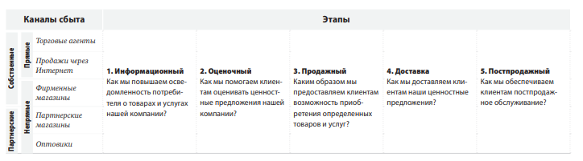
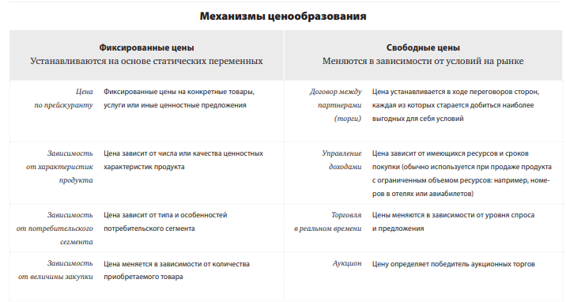

# Построение бизнес моделей

Бизнес-модель — это то, что отличает вас от других, это ваша уникальность, выраженная
через взаимосвязи между самыми критичными факторами вашего успеха. Бизнесмодель важнее миссии, стратегии и плана денежных потоков. Это основа вашего конкурентного преимущества.

Смысл инновационных бизнес-моделей в итоге сводится к созданию
ценности — для компаний, потребителей и общества в целом.

Суть процесса — замена устаревших моделей на современные.

Книга состоит из пяти разделов:
1. Шаблон бизнесмодели — общая схема описания, анализа и построения бизнес-модели. 
2. Стили бизнес-моделей,отражающие идеи лучших умов бизнеса. 
3. Практические методики, которые помогут вам в разработке бизнес-моделей. 
4. Переосмысление стратегии через призму бизнес-модели. 
5. Обобщенный метод, который поможет в разработке инновационных бизнес-моделей, связывающий воедино все концепции, методики и инструменты

## Шаблон

Шаблон бизнес-модели

Бизнес-модель служит для описания основных принципов создания, развития и успешной работы организации.

Бизнес-модель подобна стратегическому плану, который претворяется в жизнь через организационные структуры, процессы и системы.

**Девять структурных блоков**
1. Потребительские сегменты (ПС).Организация может обслуживать один или несколько потребительских сегментов
2. Ценностные предложения (ЦП).Организация старается решить проблемы и удовлетворить потребности клиентов, делая им определенные ценностные предложения.
3. Каналы сбыта (КС).Ценностные предложения поступают к потребителю через информационные, дистрибьюторские и торговые сети.
4. Взаимоотношения с клиентами (ВК). Взаимоотношения устанавливаются и поддерживаются всеми службами по работе с клиентами.
5. Потоки поступления доходов (ПД).Потоки поступления дохода возникают благодаря успеху ценностных предложений,сделанных клиентам. 
6. Ключевые ресурсы (КР). Ключевые ресурсы — средства, необходимые для предложения и доставки ранее описанных элементов.
7. Ключевые виды деятельности (КД) …посредством определенных ключевых видов деятельности.
8. Ключевые партнеры (КП). Какие-то виды деятельности передаются на аутсорсинг, а ресурсы — привлекаются со стороны.
9. Структура издержек (СИ).Структура издержек — результат взаимодействия всех элементов бизнес-модели.

### 1 Потребительские сегменты

**В этом структурном блоке определяется, какие группы людей и организаций предприятие рассчитывает привлекать и обслуживать.**

Клиенты — сердце любой бизнес-модели. Без (выгодных) клиентов не может существовать ни одна компания. Чтобы лучше удовлетворять нужды клиентов, желательно разбить их на группы по потребностям, особенностям поведения или иным признакам. Бизнес-модель охватывает один или несколько групп клиентов — потребительских сегментов. Организация должна сделать выбор, решая, какие сегменты обслуживать, а от каких отказаться. Когда решение принято, можно строить бизнес-модель, опираясь на четкое понимание
специфических нужд клиентов избранных сегментов.

Группы клиентов представляют различные сегменты, если:
- различия в их запросах обуславливают различия
в предложениях;
- взаимодействие осуществляется по разным каналам сбыта;
- взаимоотношения с ними нужно строить по-разному;
- их выгодность существенно различается;
- их привлекают разные аспекты предложения.

**Для кого мы создаем ценностное предложение?** 
**Какие клиенты для нас более важны?**

- Массовый рынок.Бизнес-модели, относящиеся к предложению товаров широкого потребления, не проводят различий между потребительскими сегментами. И ценностные предложения, и каналы сбыта, и структура взаимоотношений с клиентами ориентированы на большую группу потребителей, объединенных сходными потребностями и нуждами. Такой тип бизнес-модели характерен, например, для сферы бытовой техники.
- Нишевый рынок.Бизнес-модели нишевых рынков ориентированы на особые потребительские сегменты. Ценностные предложения, каналы сбыта и отношения с клиентами строятся в соответствии с требованиями рынка.Подобные бизнес-модели часто можно встретить в сфере поставок ресурсов и комплектующих. Так, многие производители автомобильных деталей находятся в жесткой зависимости от закупок, которые делают у них крупные автопроизводители. 
- Дробное сегментирование.Некоторые бизнес-модели выделяют сегменты рынка, незначительно отличающиеся по потребностям и запросам. Так, отделы розничного обслуживания в банках, например в Credite Suisse,могут выделить группу клиентов, вклады которых превышают $100 000, а из них — группу наиболее состоятельных клиентов с вкладами более $500 000.Потребности и проблемы клиентов в этих сегментах имеют некоторые отличия, что важно для других структурных блоков бизнес-модели Credite Suisse, в частности для ценностных предложений, каналов сбыта, взаимоотношений с клиентами, потоков поступления доходов. Аналогично действует Micro Precision System, специализирующаяся на решениях в области микромеханики. Она обслуживает три потребительских сегмента, и ценностные предложения для каждого из них имеют свои особенности.
- Многопрофильные предприятия. Организация с многопрофильной бизнес-моделью обслуживает два совершенно разных потребительских сегмента с различными потребностями и запросами. Так, в 2006 г. Amazon.com решила диверсифицировать розничный сектор, предложив услуги по «облачной обработке данных» — место для хранения данных в Сети с подключением к серверу по запросу. В результате компания стала взаимодействовать с абсолютно новым для нее потребительским сегментом — веб-компаниями, которым требовалось совершенно иное ценностное предложение. Стратегическое обоснование диверсификации можно найти в мощной ИT-инфраструктуре Amazon.com, которая позволяет одновременно обеспечивать и розничные продажи, и новую «облачную» службу.
- Многосторонние платформы (или многосторонние рынки).Некоторые организации обслуживают два или больше взаимосвязанных потребительских сегмента. Например, компании, выпускающей кредитные карты, нужна огромная база держателей карт, а также база торговых и сервисных предприятий, принимающих эти карты. Точно так же предприятие,предлагающее бесплатную прессу, нуждается в большом числе читателей, чтобы привлечь рекламодателей, и заинтересовано в рекламодателях, чтобы финансировать производство и распространение. Для того чтобы такая бизнес-модель работала, необходимы оба сегмента.

### 2 Ценностные предложения

**Блок включает описание товаров и услуг, которые представляют ценность для определенного потребительского сегмента.**

Ценностные предложения — причина, почему клиенты отдают предпочтение одной компании перед другой. Они решают проблемы клиентов или удовлетворяют их потребности. Каждое ценностное предложение представляет собой определенную совокупность товаров и/или услуг, которые отвечают запросам определенного потребительского сегмента. Иными словами, ценностное предложение — это совокупность преимуществ, которые компания готова предложить потребителю. Одни ценностные предложения могут быть инновационными, т. е. новыми или революционными. Другие — подобными тем, что уже есть на рынке, но с некоторыми отличиями, с какими-то новыми характеристиками. 

**Какие ценности мы предлагаем потребителю?**
**Какие проблемы помогаем решить нашим клиентам?**
**Какие потребности удовлетворяем?**
**Какой набор товаров и услуг мы можем предложить каждому потребительскому сегменту?**
Ценностное предложение создает преимущества для конкретного потребительского сегмента за счет определенного сочетания элементов, отвечающего требованиям этого сегмента. Преимущества могут быть количественными (такие как цена, скорость обслуживания) или качественными (например, дизайн, положительные эмоции клиента).
Ниже перечислены лишь некоторые элементы, из которых складывается ценность товара или услуги для потребителя.
- Новизна.Некоторые ценностные предложения ориентированы на удовлетворение совершенно новых потребностей, которых на рынке раньше просто не существовало. Подобные ценностные предложения иногда были связаны с технологическими достижениями. Таковы, например, сотовые телефоны, которые положили начало совершенно новой отрасли — мобильной связи. А вот создание инвестиционных фондов на этических принципах не имеет к новым технологиям практически никакого отношения.
- Производительность. Повышение эффективности, или производительности, традиционно используется для создания ценностного предложения. Например,
компьютерная отрасль полагалась на этот фактор, выводя на рынок все более и более мощные машины. Но рост производительности имеет
свои пределы. Так, в последнее время компьютеры с большей скоростью работы, огромным объемом памяти и лучшей графикой уже не дают
пропорционального увеличения потребительского спроса. 
- Изготовление на заказ. Товары и услуги, удовлетворяющие индивидуальные запросы клиентов или узкие потребительские сегменты, имеют высокую ценность. В последние годы спрос на изготовление товаров по индивидуальным заказам и с участием самого клиента, неуклонно растет. Такой подход позволяет учитывать индивидуальные пожелания клиентов и в то же время сохранять экономию за счет роста производства.
- «Делать свою работу». Ценность можно создать и за счет помощи клиенту в выполнении работы. Это прекрасно понимают в компании RollsRoyce: ее клиенты-авиаперевозчики полностью полагаются на Rolls-Royce в вопросах производства и обслуживания самолетных двигателей.Это позволяет клиентам компании сосредоточиться исключительно на авиаперевозках.Со своей стороны, авиалинии платят Rolls-Royce за каждый час работы их двигателей. 
- Дизайн. Дизайн — очень важный элемент, с большим
трудом поддающийся оценке. Продукт может выделяться среди аналогичных только за счет дизайна. В индустрии моды и производстве бытовой техники дизайн может стать наиболее важным элементом ценностного предложения. 
- Бренд/стату. С точки зрения потребителя ценность может заключаться просто в демонстрации определенного бренда. Так, Rolex на руке — характерная черта богатого человека. А скейтбордисты, например, предпочитают одежду никому не известных «андерграундных» брендов, чтобы показать, что они «в теме».
- Цена.Предложение тех же преимуществ по более низкой цене — стандартный путь удовлетворения запросов чувствительных к ценам потребительских сегментов. Такие предложения имеют большое значение для всей бизнес-модели в целом. Дешевые авиаперевозчики, такие как Southwest, easyJet и Ryanair, строят свой бизнес с расчетом высокого спроса на услуги, предоставляемые на низкой цене. Другой пример — автомобиль Nano, разработанный и выпускаемый индийской компанией Tata. Низкая цена делает автомобиль доступным для совершенного нового сегмента индийских граждан. В последнее время в разнообразных отраслях все большее место занимают бесплатные предложения — бесплатные газеты, электронная почта, услуги мобильной связи и т. д. 
- Уменьшение расходов.Помощь потребителям в снижении их расходов — отличный способ создания ценности. Например, Salesforce.com продает хостинг для Customer Relation Management (CRM), который избавляет покупателей от необходимости тратить дополнительные средства и силы на покупку, установку и управление этой программой.
- Снижение риска.Существенной ценностью для потребителя может стать снижение уровня риска, с которым он сталкивается при покупке товаров и услуг. Например, для покупателя подержанного автомобиля годовое гарантийное обслуживание снижает риск, связанный с ремонтом. Гарантированный уровень обслуживания частично снижает риск покупателя при заказе ИT-услуг.
- Доступность Еще один путь создания ценности — сделать товары и услуги доступными для тех групп граждан, которые ранее не имели к ним доступа. Это достигается инновационными бизнес-моделями, новыми технологиями или сочетанием того и другого. Например, NetJets популяризировала идею долевого владения частными реактивными самолетами. С помощью инновационной бизнесмодели NetJets предлагает частным лицам и корпорациям в пользование реактивные самолеты, что раньше было недоступной для большинства услугой. Еще один пример создания преимущества с помощью повышения доступности — открытые инвестиционные фонды, которые открывают для людей со скромным достатком доступ к рынку инвестиций.
- Удобство/применимость Ценностью может стать и удобство использования товара. Создав iPod и iTunes, компания Apple предложила потребителям более удобные поиск, приобретение, загрузку и прослушивание музыки. Благодаря этому компания в настоящее время доминирует на рынке.

### 3 Каналы сбыта

**Этот блок описывает, как компании взаимодействуют с потребительскими сегментами и доносят до них свои ценностные предложения.**

Каналы связи, распространения и продаж составляют систему взаимодействия компании с потребителем.

Эти каналы — точки контакта потребителя с продавцом — выполняют ряд функций, в частности:
- повышают степень осведомленности потребителя о товарах и услугах
компании;
- помогают оценить ценностные предложения компании;
- позволяют потребителю приобретать определенные товары и услуги;
- знакомят потребителя с ценностными предложениями;
- обеспечивают постпродажное обслуживание.

**Какие каналы взаимодействия были бы желательны для наших потребительских сегментов? Как мы взаимодействуем с ними сейчас? Как связаны наши каналы между собой? Какие из них наиболее эффективны? Какие более выгодны?**
Каналы сбыта представляют собой пять этапов продвижения товара к потребителю. Каждый канал может включать все этапы или лишь часть из них. Можно выделить прямые и непрямые каналы сбыта, а также собственные и партнерские.Найти правильные каналы сбыта, отвечающие ожиданиям потребителей, — важный аспект представления ценностного предложения на рынке. Организация может выбирать, какие каналы использовать: собственные, партнерские или сочетание тех и других. Собственные каналы могут быть как прямыми (продажи через торговых агентов или сайт фирмы), так и непрямыми (например, магазины, которыми владеет или управляет компания). Партнерские каналы — непрямые пути сбыта, представленные широким спектром вариантов: оптовая торговля, розничные сети или партнерские сайты. Партнерские каналы приносят меньшую прибыль, однако позволяют добиться большего охвата и дают преимущество за счет сильных сторон партнера. Собственные каналы, особенно прямые, обеспечивают большую прибыль, однако их организация и управление могут обходиться дороже. Важно поддерживать верный баланс между различными каналами сбыта и найти такое их сочетание, которое обеспечит наилучшие отзывы потребителей и максимальный доход.

### 4 Взаимоотношения с клиентами

**Блок описывает типы отношений, которые устанавливаются у компании с отдельными потребительскими сегментами.**

Компания должна четко определить, какой тип взаимо отношений она хочет установить с каждым из потребительских сегментов. Взаимоотношения могут варьировать от персональных до автоматизированных.

Мотивы, определяющие эти отношения, могут быть
различными:
- приобретение клиентов;
- удержание клиентов;
- увеличение продаж

Например, на заре развития мобильной связи взаимоотношения операторов с клиентами строились на основе агрессивных стратегий привлечения, которые включали в том числе и предложения бесплатных телефонов. С насыщением рынка стратегия изменилась, и операторы сосредоточились на удержании клиентов и получении максимальной прибыли от каждого из них. Блок взаимоотношений с клиентами, предусмотренный бизнес-моделью компании, оказывает значительное влияние на поведение потребителя.

**Отношений какого типа ждет каждый потребительский сегмент? Какие отношения установлены? Каких расходов они требуют? Как они интегрированы в общую схему бизнес-модели?**
Можно выделить несколько типов взаимоотношений с клиентами, существующих в рамках отношений компании с каждым потребительским сегментом.
- Персональная поддержка.Такой тип отношений основан на личных контактах. Клиент может общаться напрямую с представителем компании, получая от него помощь в процессе покупки и после нее. Это может происходить на месте продажи, через колл-центр, по электронной почте или другими путями.
- Особая персональная поддержка.В данном случае представитель компании прикреплен к конкретному клиенту, с которым у него складываются свои взаимоотношения. Такие отношения наиболее глубоки и обычно развиваются в течение длительного времени. Например, в частных банках с наиболее крупными клиентами работают специальные представители. Подобные взаимоотношения с клиентами складываются и в других отраслях.
- Самообслуживание. При таком типе взаимоотношений компания не поддерживает непосредственных отношений с клиентами, но обеспечивает их всем необходимым, чтобы они могли обслуживать себя самостоятельно.
- Автоматизированное обслуживание.Этот тип взаимоотношений представляет сочетание более сложной формы самообслуживания с автоматизацией процессов. Например, регистрация клиентов на сайте компании дает им доступ к персональным услугам. Автоматизация обслуживания позволяет распознавать отдельных клиентов и предоставлять им информацию, необходимую для отправки заказа или заключения сделки. В идеальном случае автоматизированные сервисы стимулируют личные взаимоотношения (например, рекомендуя книгу или фильм).
- Сообщества.Компании все чаще используют интернет-сообщества для привлечения клиентов, а также содействуют установлению более тесных связей между членами таких сообществ. Многие компании поддерживают онлайн-сообщества, предоставляя пользователям возможность обмениваться знаниями. Сообщества помогают компаниям лучше понимать нужды своих клиентов. Фармацевтический гигант GlaxoSmithKline, например, основал частное онлайн-сообщество, когда в продажу было запущено alli — новое средство для похудения. GlaxoSmithKline стремился лучше понять проблемы людей с избыточным весом и при помощи сообщества более эффективно управлять потребительскими ожиданиями.
- Совместное создание. Многие компании сегодня выходят за рамки традиционных отношений продавец — покупатель и создают ценность совместно с потребителем. Так, Amazon.com предлагает клиентам писать рецензии, таким образом создавая ценность для других книголюбов. Другие компании привлекают клиентов к созданию дизайна продуктов. А такие, как YouTube.com, дают возможность пользователям самим создавать контент.

### 5 Потоки поступления дохода

**Блок потоков поступления дохода включает материальную прибыль, которую компания получает от каждого потребительского сегмента (чтобы получить размер чистой прибыли, необходимо вычесть из доходов все издержки).**

Если клиенты — сердце любой бизнес-модели, то потоки доходов — ее артерии. Компания должна спросить себя: за что готовы платить потребители? Правильный ответ на этот вопрос позволит создать один или несколько потоков поступления доходов от каждого потребительского сегмента. Каждый поток может иметь свой механизм ценообразования: фиксированные или договорные цены, аукционные торги, Потоки поступления дохода цены, зависящие от рынка или объема продаж, контроль выручки.

В бизнес-модели могут существовать два типа потоков доходов:
1) доход от разовых сделок;
2) регулярный доход от периодических платежей,
получаемых от клиентов за ценностные предложения
или постпродажное обслуживание.

**За что клиенты действительно готовы платить? За что они платят в настоящее время? Каким образом платят? Как они предпочли бы платить? Какую часть общей прибыли приносит каждый поток поступления доходов?**
Каждый поток доходов имеет свой механизм ценообразования. Тип избранного механизма может значительно влиять на получаемую прибыль. В зависимости от механизма ценообразования цены могут быть фиксированными или свободными.
Существует ряд способов создания потоков доходов. 
- Продажа активов. Самый очевидный поток поступления дохода — доходы от продажи прав собственности на материальный продукт. Amazon.com продает книги, диски, бытовую технику и др. Fiat — автомобили, которые покупатели могут водить, перепродавать и даже уничтожать.
- Плата за использование.Этот поток возникает из оплаты пользования определенной услугой. Чем больше клиент пользуется сервисом, тем больше он за него платит. Оператор мобильной связи может взимать с клиента плату за количество минут разговоров. В отеле постоялец платит за количество проведенных там дней. Служба доставки взимает плату за доставку посылки из одного пункта в другой.
- Оплата подписки.Это поток дохода от продажи продолжительности доступа к услуге. Тренажерный зал продает месячные или годовые абонементы, которые позволяют клиентам в течение этого срока пользоваться услугами зала. World of Warcraft Online, компьютерная сетевая игра, берет абонентскую плату за участие в игре в течение месяца, Nokia Comes with Music обеспечивает доступ к музыкальной библиотеке.
- Аренда/рента/лизинг.Этот поток создается путем передачи клиенту временных прав на пользование определенным активом в течение определенного периода времени за фиксированную плату. Арендодатель получает регулярный доход, а арендатор — возможность пользоваться предметом сделки без необходимости платить его полную стоимость. Прекрасный пример таких взаимоотношений — Zipcar.com. Компания предлагает клиентам почасовую аренду автомобилей. И многие пришли к решению не приобретать автомобиль в собственность, а пользоваться арендованным.
- Лицензии.В этом случае поток дохода создается за счет передачи прав на пользование защищенной интеллектуальной собственностью. Лицензирование позволяет держателям прав получать доход от собственности, не производя продукт и не предоставляя услуги. Например, в медиаиндустрии владелец авторских прав сохраняет их за собой, но продает лицензию на пользование собственностью третьей стороне. Подобным же образом осуществляется продажа патентов на технологии в промышленности.
- Брокерские проценты.Поток доходов поступает и от посреднических услуг, которые предоставляются двум или более сторонам в ходе сделки. Например, компания, распространяющая кредитные карты, получает процент от сделок, заключенных между продавцом карты и клиентом. Брокеры и агенты по недвижимости получают комиссионные за каждую успешно заключенную с их помощью сделку.
- Реклама.Данный поток доходов создает оплата рекламы товара, услуги или торговой марки. Традиционно СМИ и организаторы публичных мероприятий ориентируются на доходы от рекламы. В последнее время и другие отрасли, в том числе производители ПО и предприятия сферы услуг, стали больше зависеть от рекламного потока доходов.

### 6 Ключевые ресурсы

**В этом блоке описываются наиболее важные активы, необходимые для функционирования бизнес-модели.** 

Каждая бизнес-модель нуждается в определенных ключевых ресурсах. Эти ресурсы позволяют предприятию создавать и доносить до потребителя ценностные предложения, выходить на рынок, поддерживать связи с потребительскими сегментами и получать прибыль. Разные типы бизнес-моделей требуют разных ресурсов. Производителю микросхем нужны капиталоемкие производственные мощности, а разработчику микросхем важнее человеческие ресурсы. Ключевые ресурсы могут быть материальными, финансовыми, интеллектуальными или человеческими (персонал). Компания может быть собственником этих ресурсов, брать их в наем или же получать от ключевых партнеров.

**Какие ключевые ресурсы нужны для наших ценностных предложений? Наших каналов сбыта? Взаимоотношений с клиентами? Потоков доходов?**
Ключевые ресурсы можно классифицировать следующим образом.
- Материальные ресурсы. К этой категории относятся физические объекты, такие как производственные мощности, здания, оборудование, транспортные средства, точки продаж и сети дистрибуции. Ретейлеры, такие как Wal-Mart и Amazon.com, очень сильно зависят от материальных ресурсов, нередко требующих больших капиталовложений. Первый владеет огромной сетью магазинов и соответствующей инфраструктурой. Для второго характерно широкое использование ИT-технологий, развитая сеть хранения и доставки товаров.
- Интеллектуальные ресурсы.Интеллектуальная собственность, например торговые марки, закрытая информация, защищенная правами собственности, патенты и авторские права, партнерские и клиентские базы данных, — наиболее важные составляющие бизнес-модели. Интеллектуальные ресурсы нелегко создавать, однако в случае успеха они могут принести существенную прибыль. Для производителей товаров широкого потребления, таких как Nike или Sony, торговые марки являются ключевым ресурсом. Основа деятельности Microsoft и SAP — программное обеспечение и связанная с ним интеллектуальная собственность, созданные за годы существования компаний. Qualcomm, разработчик и поставщик микропроцессоров для широкополосной мобильной связи, построила свою бизнес-модель вокруг патентов на разработки ее конструкторов, получая немалый доход от продажи лицензий на производство другим компаниям.
- Персонал.Подбор персонала — важная задача для любого предприятия, но есть бизнес-модели, требующие особенно внимательного отношения к этому ресурсу, например в наукоемких производствах или творческих коллективах. В частности, для фарма цевтической компании, такой как Novartis, подбор персонала играет огромную роль: ее бизнесмодель включает в себя штат серьезных ученых и высококвалифицированных специалистов.
- Финансы. Ряд бизнес-моделей требует наличия определенных финансовых ресурсов и/или финансовых гарантий, таких как денежные средства, кредитные линии или фондовый резерв для найма сотрудников на руководящие должности. Как использовать финансовые ресурсы в качестве экономического рычага, можно продемонстрировать на примере бизнес-модели фирмы Ericsson, производителя оборудования для мобильной связи. Ericsson может брать займы у банков или на рынке, а затем использовать часть выручки на финансирование разработок по заказам клиентов; это служит гарантией, что они не станут заказывать оборудование у конкурентов.

### 7 Ключевые виды деятельности

**Блок описывает действия компании, которые необходимы для реализации ее бизнес-модели.** 

Каждая бизнес-модель включает определенное число ключевых видов деятельности. Это самые важные действия компании, без которых ее успешная работа невозможна. Ключевые виды деятельности, как и ключевые ресурсы, — обязательный компонент процесса создания и реализации ценностных предложений, выхода на рынок, поддержания взаимоотношений с клиентами и получения доходов. Они отличаются в бизнес-моделях разного типа. Так, среди ключевых видов деятельности Microsoft — разработка программного обеспечения. А в перечень ключевых видов деятельности компании Dell входит управление отношениями с поставщиками. Один из ключевых видов деятельности консалтинговой фирмы McKinsey — разрешение проблемных ситуаций.

**Каких видов деятельности требуют наши ценностные предложения? Наши каналы сбыта? Наши взаимоотношения с клиентами? Наши потоки поступления доходов?**
Ключевые виды деятельности можно классифицировать следующим образом.
- Производство. Эта деятельность включает разработку, создание и вывод на рынок продукта в требуемом объеме и/или наилучшем качестве. Производственная деятельность — главная для бизнес-моделей компаний-производителей.
- Разрешение проблем.Эта деятельность заключается в поиске оптимального решения проблем конкретного клиента. Ключевая активность этого типа преобладает в работе консалтинговых компаний, больниц и других организаций, оказывающих услуги. Эти бизнесмодели требуют управления знаниями и постоянной отработки профессиональных навыков.
- Платформы/сети.В бизнес-моделях, основанных на платформе как ключевом ресурсе, главными видами деятельности являются те, что связаны с этой платформой или сетью. В качестве платформы могут выступать компьютерные сети, коммерческие платформы, программное обеспечение и даже торговые марки. Бизнес-модель eBay требует постоянного развития и поддержки платформы компании: сайта eBay.com. Бизнес-модель Visa требует деятельности, связанной с платформой транзакций по кредитным картам Visa® для продавцов, покупателей и банков. Бизнес-модель Microsoft построена на платформе, позволяющей осуществлять синхронизацию стороннего программного обеспечения с операционной системой Windows®. Ключевая деятельность этого типа связана с управлением платформами, сервисным обеспечением и продвижением платформ.

### 8 Ключевые партнеры

**Блок описывает сеть поставщиков и партнеров, благодаря которым функционирует бизнес-модель.**

Компании строят партнерские отношения с разными целями, и они становятся основой многих бизнес-моделей. Фирмы создают партнерские союзы, чтобы оптимизировать свои бизнес-модели, снизить риски или получить ресурсы.

Можно выделить четыре типа партнерских отношений:
1. Стратегическое сотрудничество между неконкурирующими компаниями.
2. Соконкуренция: стратегическое партнерство между конкурентами.
3. Совместные предприятия для запуска новых бизнес-проектов.
4. Отношения производителя с поставщиками для гарантии получения качественных комплектующих.

**Кто является нашими ключевыми партнерами? Кто наши основные поставщики? Какие ключевые ресурсы мы получаем от партнеров? Какой ключевой деятельностью занимаются наши партнеры?**
Можно выделить три основных мотива создания партнерских отношений.
- Оптимизация и экономия в сфере производства.Эта основная форма партнерства или отношений между заказчиком и поставщиком с целью оптимизации распределения ресурсов и ведения деятельности. Компании нет смысла владеть всеми ресурсами или осуществлять все виды деятельности, связанные с выпуском ее продукции. Вступая в партнерство с целью оптимизации и экономии на масштабе, компания добивается снижения издержек; часто такая форма партнерства включает в себя привлечение ресурсов со стороны или совместное использование инфраструктуры.
- Снижение риска и неопределенности.Партнерские отношения могут помочь снизить риск в конкурентной среде, для которой характерна неопределенность. Нередко компании формируют стратегический союз в одной области, в других оставаясь конкурентами. Например, формат Blu-ray для оптических дисков разработан совместно группой фирм, лидирующих в сфере производстве бытовой техники, персональных компьютеров и электронных носителей.
- Поставки ресурсов и совместная деятельность.Лишь некоторые компании владеют всеми ресурсами или выполняют все виды деятельности, которые включает в себя их бизнес-модель. Обычно они передают функции добычи и поставки некоторых ресурсов и выполнение определенных действий своим партнерам. Партнерство может быть обусловлено необходимостью получения знаний, лицензионных прав или доступа к потребителю. Так, производитель мобильных телефонов может снабжать свои устройства операционной системой по лицензии, а не разрабатывать собственную. Страховая компания может передать продажу своих полисов независимым агентам, а не нанимать для этого сотрудников.

### 9 Структура издержек

**Структура издержек — это расходы, связанные с функционированием бизнес-модели.** 

Блок описывает наиболее существенные расходы, необходимые для работы в рамках конкретной бизнес-модели. Создание и воплощение ценностных предложений, поддержание взаимоотношений с клиентами, получение прибыли — все эти процессы связаны с какими-либо издержками. Расходы достаточно легко подсчитать, если вы точно определили ключевые ресурсы, ключевые виды деятельности и ключевых партнеров. Однако для некоторых бизнес-моделей издержки имеют намного большее значение, чем для других. Например, так называемые «народные» авиалинии намеренно строят свои бизнес-модели на основе низких издержек.

**Какие наиболее важные расходы предполагает наша бизнес-модель? Какие из ключевых ресурсов наиболее дороги? Какие ключевые виды деятельности требуют наибольших затрат?**
Минимизировать издержки следует в любой бизнес-модели. Однако для некоторых моделей снижение издержек имеет большее значение, чем для других. По структуре издержек имеет смысл разделить бизнес-модели на два класса: с преимущественным вниманием к издержкам и с преимущественным вниманием к ценности (большинство бизнес-моделей находятся где-то между этими двумя крайностями).
- Ориентация на издержки.Бизнес-модели, в которых большое внимание уделяется издержкам, предполагают формирование и поддержание минимальной структуры издержек, использование дешевых ценностных предложений, максимальную автоматизацию в обслуживании клиентов и широкое привлечение сторонних ресурсов. Компании дешевых авиаперевозок, такие как Southwest, easyJet и Ryanair, используют бизнесмодели, ориентированные на снижение издержек.
- Ориентация на ценность.Некоторые компании при создании бизнес-моделей ориентируются не на расходы, а на ценностные преимущества. Как правило, такие бизнес-модели отличаются высококлассным ценностным предложением и высоким уровнем личного сервиса. В эту категорию попадают, к примеру, роскошные отели с высоким уровнем обслуживания.

По структуре издержки можно разделить на следующие категории.
- Фиксированные издержки. Издержки, которые остаются неизменными вне зависимости от объема товаров или услуг. К ним относится заработная плата сотрудников, арендная плата и средства производства. Некоторые виды бизнеса, в частности производственные компании, отличаются большой долей фиксированных издержек.
- Переменные издержки.Издержки, которые меняются в зависимости от объема товаров или услуг. Для некоторых видов бизнеса, например организации музыкальных фестивалей, характерна большая доля переменных издержек.
- Экономия на масштабе.Снижение издержек, происходящее в результате увеличения выпуска продукции. Более крупные компании, например, получают скидки на закупки в больших объемах. Этот и другие факторы снижают расходы компании в пересчете на единицу продукции, в то время как ее общий выпуск растет.
- Эффект диверсификации Это преимущество компания получает в результате большего спектра операций. Например, крупное предприятие может использовать одни и те же виды маркетинговой деятельности или каналы сбыта для поддержки разнообразных продуктов.

### Девять структурных блоков бизнес-модели

Формируют основу инструмента, который мы назвали шаблоном бизнес-модели.
Этот инструмент напоминает набросок художника — с заранее нанесенной схемой 9 структурных блоков, — который позволит описать картину новой или уже существующей бизнесмодели. Шаблон бизнес-модели лучше распечатать как можно большего формата, так чтобы сразу много людей могли работать с бизнесмоделью с помощью стикеров или маркеров. Этот инструмент способствует пониманию и обсуждению, стимулирует творчество и помогает в анализе.

[рис_3 ](./bus_img/рис_3.png)

**Пример: бизнес-модель Apple iPod/iTunes**

[рис_4 ](./bus_img/рис_4.png)

В 2001 г. Apple запустила свой легендарный бренд: портативный медиаплеер iPod. Устройство работает с программным обеспечением iTunes, которое позволяет переносить музыкальные файлы и другую информацию с iPod на компьютер. Программное обеспечение также поддерживает постоянную связь с онлайн-магазином Apple, что позволяет приобретать и закачивать интересующий пользователей контент. Эта комбинация устройства, программного обеспечения и онлайн-магазина стала переворотом в музыкальной индустрии и вывела Apple на доминирующие позиции на рынке. Но Apple была не первой компанией, которая стала производить и продавать портативные медиаплееры. Конкуренты, такие как Diamond Multimedia с плеером Rio, имели успех, пока Apple не обошла их. Пример: бизнес-модель Apple iPod/iTunes Каким образом Apple удалось выйти в лидеры? Она использовала лучшую бизнес-модель. С одной стороны, компания предложила пользователям возможность наслаждаться музыкой без какихлибо проблем, объединив в одном предложении уникальное по дизайну устройство iPod, программное обеспечение iTunes и доступ к онлайн-магазину. Это ценностное предложение позволяло легко отыскивать, приобретать и прослушивать музыку. С другой стороны, чтобы сделать ценностное предложение реально возможным, Apple пришлось заключить соглашения со всеми звукозаписывающими компаниями для создания крупнейшей в мире музыкальной онлайн-библиотеки. Итог? Большую часть своих «околомузыкальных» доходов Apple получает от продажи iPod, а интеграция с музыкальным онлайн-магазином позволяет ей обходить конкурентов.

**ЛЕВОЕ ПОЛУШАРИЕ ЛОГИКА / ПРАВОЕ ПОЛУШАРИЕ Эмоции**

[рис_5 ](./bus_img/рис_5.png)

### КАК ВЫ ПОЛЬЗУЕТЕСЬ ШАБЛОНОМ

- Применив бизнесмодели «как есть» и «как должно быть». 
- Легко продемон стрировать финансовые выгоды этой модели
- Шаблон помогает анализировать бизнес-модели компаний и обновлять их.
- СОЗДАНИЯ И СТРУКТУРИРОВАНИЯ
- Показать всем участникам проекта и картину в целом, и их собственные (важные) роли в ней, и взаимозависимость ее компонентов
- Охватить все аспекты построения нового бизнеса
- ПРЕВРАЩЕНИЯ ИХ БИЗНЕС-ПЛАНОВ В БИЗНЕС ПРОЦЕССЫ
- Всесторонне проанализировать задачу и составить план
- Демонстрации связей между повседневными потребностями, возникающими на рабочем месте, и сервисом, который воспринимается людьми как нечто специализированное, не относящееся к первоочередным потребностям и не входящее в список приоритетов.
- Напоминая юным предприни мателям о необхо димости всегда держать перед глазами целостную картину своего дела и не зацикливаться на деталях
- Шаблон бизнесмоделирования позволил мне найти общий язык с коллегами.
- Совершить переход от государственного финансирования к коммерческой деятельности
- Какое новое ценностное предложение можно сделать клиентам и каков принцип его переноса во внутренние процессы
- Удобство использования, простота и логичность выстраивания причинно-следственных связей.
- СООТВЕТСТВИИ СВОИХ ЗАМЫСЛОВ ТРЕБОВАНИЯМ РЕАЛЬНОСТИ

## Стили

В этом разделе описываются бизнес-модели со сходными характеристиками, сходной структурой или сходным поведением,переосмысление хорошо известных бизнес-концепций и приведение их к единому стандарту — стандарту шаблона бизнес-модели.Мы рассматриваем подобные бизнес-модели как воплощение стиля.Мы выделили пять стилей бизнес-моделей, основываясь на идеях,описанных в бизнес-литературе. В одной бизнес-модели могут соединяться черты нескольких стилей.

Стили:
- Разделение бизнес-модели
- «Длинный хвост»
- Многосторонние платформы
- FREE как бизнес-модель
- Открытые бизнес

### Разделение бизнес модели

Концепция «разделения» предполагает РАЗДЕЛЕНИЕ БИЗНЕС МОДЕЛИ наличие трех фундаментальных форм бизнес-деятельности: бизнес ориентированный на клиентов, бизнес ориентированный на инновации, и бизнес ориентированный на инфраструктуру. 
- У каждой формы свои экономические, конкурентные и культурные правила. - Три формы деятельности могут сосуществовать в пределах одной компании, но в идеале они должны быть «разделены» с целью исключения конфликтных ситуаций или нежелательного влияния.

Пример: индустрия мобильной связи, частные банки.

64