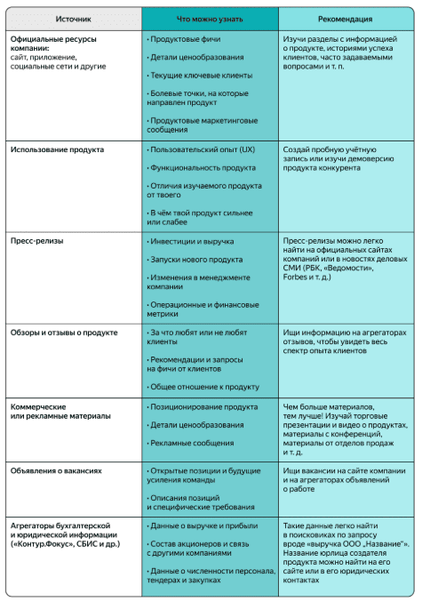
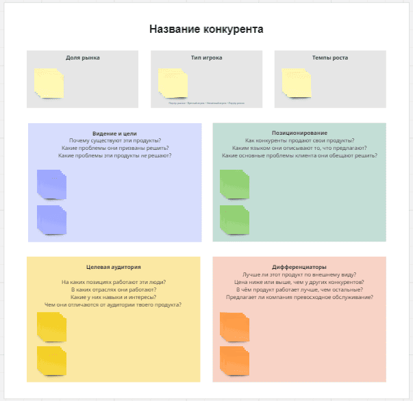
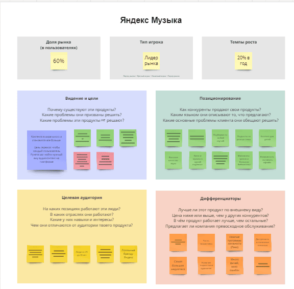

Одна из главных целей продакт-менеджера — поиск product/market fit, соответствия продукта рыночным потребностям.

# Спринт 1

## Введение в исследования рынка

Чтобы понять, что нужно клиентам, нужно исследовать клиентов и рынок в целом. Нельзя опираться только на свои представления и догадки.

###  Что такое рынок?

Твой цифровой продукт — это не просто набор функциональных возможностей (фич), сайт или мобильное приложение.

Цифровой продукт удовлетворяет потребности и решает задачи клиентов, у которых есть возможность выбрать другое решение своих задач. Каждый продукт находится во внешней среде — на рынке, где действуют разные участники: твоя компания, конкуренты, клиенты и так далее.

**Рынок** — это экономические отношения между потребителями цифрового продукта и его создателями.

Чтобы твой продукт был успешен, нужно учитывать внешнюю среду. Тебе нужно знать, кто готов купить твой продукт, а также кто помогает (или поможет в будущем) клиенту закрыть ту же потребность, что и твой продукт.

Удачной идеи продукта недостаточно для его успеха. Важно, как эта идея реализована и насколько она отвечает потребностям рынка.

Именно поэтому продакт-менеджеры инвестируют своё время и силы в исследования рынка — в понимание среды, в которой находится продукт.

### Что даёт исследование рынка?

Анализ рынка полезен по нескольким причинам.

1. **Исследование рынка бережёт время и ресурсы**

В результате твоя команда может проверить, насколько жизнеспособна ваша идея. Многие продукты провалились, так как на них не было достаточного спроса, или рынок оказался слишком узким, или команда сделала ставку на устаревшие технологии, или было ещё что-то. Если вложиться в изучение рынка перед запуском продукта, этих ошибок можно избежать.

**Пример.** Твоя команда сделала сервис: конструктор резюме. Вы оценили рынок жителей России, которым нужно составить резюме. Также вы установили стоимость ежемесячной подписки для клиентов: сравнили её с западными аналогами и сопоставили со средней зарплатой по стране. При этом вы не исследовали целевую аудиторию.

После запуска твоя команда увидела, что людей, готовых платить за сборку резюме, не так много (узкий рынок). Из-за особенностей и цикла поиска работы клиенты крайне редко продлевали подписку: они не увидели в ней ценности для себя. Всё это можно было выяснить до запуска и сэкономить ресурсы.

2. **Исследование рынка помогает рассчитать окупаемость**

Понимание рынка и оценка его объёма помогают убедиться в том, что выручка от продукта окупит инвестиции в него. Также исследование рынка повысит шансы на привлечение денег инвесторов. Используя цифры и факты, тебе нужно показать руководству и инвесторам, что ты знаком с рынком и аудиторией, а бизнес-идея продукта имеет потенциал.

**Пример.** Инвестиционный фонд хочет вложить деньги в сегмент телемедицины — удалённого предоставления медицинских услуг. На примете у фонда есть два стартапа на ранней стадии со схожей концепцией продукта.

Первый стартап в своей презентации оценил рынок телемедицины аж в 10% всего рынка медицинских услуг. Откуда такая цифра? Команда посмотрела на показатели некоторых зарубежных стран.

Вторая компания представила более скромную и реалистичную оценку рынка — втрое меньше. В презентации стартап описал ключевые драйверы и ограничения на рынке, а также представил результаты исследований клиентов и конкурентов по каждому сегменту медицинских услуг.

В итоге инвестфонд выбрал второй стартап, который показал, что сделал свою домашнюю работу и лучше понимает рынок.

3. **Исследование рынка помогает оценить состояние запущенного продукта**

На реальных рыночных данных проще понять, насколько продукт соответствует потребностям рынка, нужно ли менять его стратегию или бизнес-модель (так называемый пивот).

**Пример.** Макс уже сталкивался с исследованием рынка, но, видимо, забыл об этом. Когда он работал менеджером проектов в Melody, его команда делала новый продукт — прослушивание подкастов.

После запуска продакт-менеджер увидел, что изначальный план по привлечённым клиентам не выполняется. Чтобы разобраться, что не так, команда провела исследование. В итоге выяснилось, что клиенты были и так довольны другими сервисами, которые уже работали на рынке.

При этом у многих слушателей оставалась нерешённой другая проблема: сортировка подкастов по темам, популярным в их стране (путешествия, психология, саморазвитие и тому подобное). Благодаря новым вводным команда скорректировала идею продукта и сделала его более успешным.

4. **Исследование рынка определяет, как продвигать продукт**

Зная целевую аудиторию, проще выбрать каналы коммуникации с клиентами.

**Пример.** Твоя компания планирует запустить рекламу в метро. При этом исследование рынка показало, что большинство ваших клиентов водят машину и каждый день проводят за рулём час и более. В таком случае будет разумнее задействовать другие каналы и рекламные носители: например билборды вдоль крупных автодорог.

**Задание**. У продукта, который делает твоя команда, есть несколько проблем. В каких случаях нужно провести исследование рынка, а в каких можно обойтись без него?
Нужно:
- Вы собираетесь запустить продукт в новом регионе
- Вы хотите оценить потенциал развития продукта на три года
- Вы не знаете, отстаёт ли продукт от конкурентов
Не нужно:
- Вы стали медленнее выводить на рынок новые фичи продукта
- У продукта растут затраты и падает маржинальность

### Результаты анализа рынка

Итак, у нас есть продукт или идея продукта и мы хотим провести исследование рынка. В самом начале важно определить цель: что именно мы хотим изучить, на какие вопросы ответить? Вот что обычно содержится в таком исследовании.
- Описание рынка: границы, ключевые особенности, тенденции и так далее.
- Прогнозируемая доля рынка у нашего продукта: предполагаемая выручка, необходимые вложения, время достижения цели и так далее.
- Анализ конкурентов: доля рынка, главные фичи их продуктов, преимущества и недостатки.
- Анализ целевой аудитории продукта: описание, особенности и так далее.

Это ключевые вопросы в исследовании рынка. В следующих уроках мы подробнее разберём, как ответить на каждый из них.

Задание
Что мы можем узнать в результате исследования рынка? Отметьте все правильные варианты.
- Правильный ответ / Потенциал рынка, доступный для конкуренции
- Прогноз прибыли нашего продукта
- Правильный ответ /  Список ключевых конкурентов
- Оценка прибыльности продукта
- Тренды в отрасли и экономике . Исследование рынка включает в себя анализ экономических факторов, влияющих на рынок, а также ключевых тенденций самого рынка
- Правильный ответ / Приблизительный размер целевой аудитории

## Ключевые параметры рынка

Рынок состоит из экономических отношений между потребителями цифрового продукта и его создателями.

В этом уроке мы рассмотрим ключевые параметры рынка и факторы, которые на них влияют.

Современные рынки, особенно цифровые, имеют сложную структуру и характеристики. Всё это меняется вместе с предпочтениями потребителей и внешними факторами в ходе конкуренции между участниками.

Возьмём, к примеру, пассажирские перевозки. Пару веков назад горожане удовлетворяли эту потребность с помощью гужевых экипажей с извозчиками, которых они находили на улице.

Сейчас в крупнейших городах есть индустрия такси. В неё, помимо собственно водителей и их автомашин, входят таксопарки, платформы-агрегаторы такси, страховые и финансовые компании, поставщики автомобилей, государственные регуляторы и другие.

Для создания продукта, который будет решать задачи твоего клиента, нужно понимать систему всего рынка: из чего он состоит и каковы его ключевые параметры.

### Из чего состоит рынок?

Ключевые параметры рынка — это показатели, которые составляют рынок и позволяют оценить его состояние. Есть четыре основных параметра рынка.

1. **Спрос**

Это объём товаров или услуг, который готовы купить потенциальные покупатели. Также «спросом» называют количество товаров или услуг, которое потребители уже купили за определённый период времени по определённой цене.

**Пример.** Cпрос на рынке такси за месяц — это число поездок, которое хотели совершить пассажиры. Не весь спрос стал поездками: часть заказов сорвалась из-за высокой цены или отсутствия свободных машин.

В нашем примере пользователи 300 млн раз открыли приложение и согласились ехать по цене в 300 рублей. А вот такси за 400 рублей вызывали реже: 250 млн раз.

2. **Предложение**

Это количество товаров или услуг, которое продавцы готовы предложить на рынке в определённое время и по определённой цене.

**Пример.** Предложение на рынке такси в месяц — это число поездок, которое таксопарки и частные водители готовы совершить по запросу пассажиров. Например, сервис Яндекс Go собирает всё предложение в своём продукте (агрегирует) и предлагает поездки пользователям.

На рынке такси предложение зависит от доступности машин и баланса со спросом. Например, при цене в 300 рублей предложение составляет 200 млн поездок. Цена в 400 рублей таксистам ещё интереснее: предложение увеличивается до 250 млн поездок.

Агрегаторы такси балансируют предложение со спросом за счёт цены и комиссии, которую они удерживают за своё посредничество. Это стимулирует таксопарки увеличивать число машин, подключённых к агрегаторам, а водителей — менять продолжительность своего рабочего дня. На разных уровнях цен разные уровни спроса и предложения находят баланс.

В нашем примере при цене в 400 рублей такси вызвали 250 млн раз. Таким оказался баланс спроса и предложения, который принёс выручку в 100 млрд рублей.

3. **Внешняя среда и регулирование**

Это то, что влияет на рынок и регулирует его: экономика региона, законы, государство и так далее.

**Пример.** Пандемия коронавируса привела к тому, что потребители начали экономить на всех услугах и товарах. Из-за этого шокового события спрос на такси резко упал: весной 2020 года число поездок сократилось примерно вдвое по сравнению с мартом 2019 года. 

**Другой пример.** Чтобы поездки на такси были безопасными, государство вводит различные требования: например лимит часов, которые водитель может проводить за рулём.

4. **Поставщики и партнёры**

Это организации, которые оказывают услуги и поставляют товары другим организациям для создания ими собственных услуг и товаров.

**Пример.** Яндекс Go предоставляет услуги пассажирам и водителям, но не владеет машинами такси. В свою очередь таксопарки сдают автомобили в аренду водителям, которые возят клиентов Яндекс Go. В этой цепочке таксопарки — партнёры Яндекс Go.

Четыре пункта, описанные выше, — это ключевые параметры рынка. Их нужно анализировать вместе с внутренним состоянием компании.

**Задание**.
Какой параметр рынка нужно проанализировать, чтобы ответить на поставленный вопрос? Выбери вариант из выпадающего списка.
- Является ли новая продуктовая фича уникальной на рынке? / Предложение
- Сколько клиентов хотят решить эту проблему? / Спрос
- Какие законы вступят в силу с 1 января и как они повлияют на продукт? / Внешняя среда
- С какими дистрибьюторами можно быстрее вырастить твой продукт? / Поставщики и партнёры
- Сколько потребители готовы заплатить за подписку на твой продукт? / Спрос

### Спрос и его ключевые параметры

**Спрос** — это количество товаров или услуг, которое покупатели готовы приобрести по определённой цене, чтобы удовлетворить свою потребность.

**Ключевой закон спроса:** чем выше цены на продукт, тем ниже спрос, — и наоборот.

Когда цена снижается, потребители могут приобрести большее количество продукта. Также у продукта может вырасти целевая аудитория за счёт тех, кому подходит новая, сниженная цена.

Спрос на рынке имеет **эластичность по цене** — степень, с которой изменение цены влияет на объём спроса.

Спрос считается эластичным, когда снижение или увеличение цены заметно увеличивает или снижает продажи продукта. В случае неэластичного спроса колебания цены будут, напротив, слабо влиять на объём спроса.

На рынке, который ты анализируешь, могут быть сегменты спроса с разной эластичностью по цене. Например, в течение последних 10 лет снижение цен на рынке такси обычно вело к росту числа поездок, особенно в экономсегменте (спрос был эластичен).

В то же время удешевление поездок в бизнес-сегменте могло и не вызвать такого скачка в числе заказов: для этой категории клиентов цены не так критичны (спрос был менее эластичен).

Помимо цен, на объём спроса влияют неценовые факторы, которые важно учитывать.
- Структура и характеристики **населения**. Чем больше людей попадают в вашу целевую аудиторию и чем больше у них денег, тем выше спрос.
- Доступность **заменителей** твоего продукта. Когда клиентам дешевле и проще купить заменитель твоего продукта, удовлетворяющий ту же самую потребность, у конкурентов, спрос на твой продукт снижается.
- Смена потребительских **предпочтений**. Чтобы пользоваться спросом, твой продукт должен подходить под требования клиентов. Со временем они меняются. Речь о таких характеристиках, как состав продукта, внешний вид, упаковка, экологичность, сервис, скорость доставки, формат оплаты и так далее.
- Государственное **регулирование** и налогообложение. В частности, чем больше налогов нужно платить при покупке и обслуживании продукта, тем ниже будет спрос на него.

### Ключевые типы клиентов

При анализе спроса важно учитывать, кто является клиентами твоего продукта. От этого зависит сам продукт, который ты предлагаешь, а также способы его продвижения, привлечения клиентов, дистрибуции и коммуникации. Выделяют несколько типов рынков с точки зрения клиентов.

#### Потребительский рынок

Его также называют рынком business to customer(B2C), розничным или массовым рынком. Клиенты — это население, физические лица. 

Например, ключевой рынок для онлайн-ритейлера Ozon — B2C. В магазине Ozon может сделать заказ любое частное лицо: ты, твои родные или знакомые.

Для потребительского рынка важны следующие характеристики клиентов.
- Культурно-демографические: пол и возраст клиентов, география, круг их интересов и так далее.
- Экономические: уровень дохода, занятость, профессия.
- Потребительские привычки и паттерны поведения. Например, сколько по времени они пользуются мобильными приложениями или компьютером.

#### Корпоративный рынок

Он же business to business (B2B), бизнес-рынок. Клиенты здесь — юридические лица.

У того же Ozon есть продукты для B2B-рынка, клиентами которых являются юрлица со своими особенностями (например, ритейлер может заниматься продажей и доставкой канцелярских товаров в офисы компаний).

Для анализа корпоративного рынка нужно учитывать:
- доходы и расходы клиентов,
- ключевые потребности,
- особенности потребления.

Разновидность B2B — рынок, где клиентами являются госорганы или институты с государственным участием. Это рынок business to government (B2G).

#### Алгоритм анализа спроса

Для анализа спроса удобно использовать пошаговый алгоритм.
- Подсчитать число клиентов на рынке и определить их характеристики.
- Вычислить средний чек клиента, а также показатели, за счёт которых он растёт (например, общее число операций и доход с одной операции).
- Рассчитать общую величину спроса.
- Определить факторы, которые влияют и будут влиять на число клиентов.
- Определить факторы, которые влияют и будут влиять на средний чек.
- Проанализировать фактическую динамику спроса (при наличии данных) и сделать прогноз на будущее.

**Задание**. Определи, к чему ведёт каждый из перечисленных факторов: к росту или к снижению спроса на продукт?

Рост спроса:
- Ускорение доставки товара при той же цене
- Увеличение доходов потенциальных клиентов
- Рост населения в регионе

Снижение спроса:
- Появление дешёвых аналогов
- Рост налога на добавленную стоимость (НДС)

### Предложение и его ключевые параметры

**Предложение** — это деятельность поставщиков, которые производят и предлагают свой продукт на рынке для удовлетворения имеющегося спроса. Предложение считается как объём товаров или услуг, который готовы производить или оказывать компании в определённый момент времени по определённой цене.

Для тебя и твоего продукта предложение рынка — это игроки, конкурирующие с твоей командой за интерес и деньги клиентов. 

На предложение влияют ценовые и неценовые факторы. К неценовым факторам относятся:
- **Альтернативные возможности** производителя продукта. Если он имеет возможность быстро переключиться на производство более прибыльного продукта, на который растёт спрос, вместо текущего, менее привлекательного, то предложение текущего продукта снизится.
- Развитие **технологий** позволяет создавать более функциональный продукт при тех же или меньших затратах. Это подстёгивает рост предложения.
- Наличие у компаний **ресурсов** для запуска продукта также увеличивает предложение.
- Рост **налогов** снижает прибыльность продукта и ослабляет стимулы наращивать предложение — и наоборот.

**Алгоритм анализа предложения**
- Определить число и характеристики поставщиков; выделить ключевых поставщиков на рынке.
- Оценить выручку и средний чек поставщиков.
- Определить факторы, которые влияют и будут влиять на число поставщиков.
- Определить факторы, которые влияют и будут влиять на число клиентов.
- Проанализировать фактическую динамику объёма предложения и долей игроков; сделать прогноз на будущее.

**Задание**
Какие факторы вызовут рост предложения на рынке, а какие — снижение?

Рост предложения:
- Рост прибыльности производства продукта
- Дефицит предложения на рынке при растущем спросе
- Несколько компаний достигают product/market fit, их аудитории устойчиво растут

Снижение предложения
- Государство увеличило требования к затратам на продукт
- Растут затраты на персонал, спрос на продукт сохраняется

### Как меняются спрос и предложение?

Факторы, влияющие на спрос и предложение, со временем меняются. Поэтому важно регулярно анализировать спрос и предложение, чтобы отслеживать новые возможности и риски.

**Пример.** После ухода ряда зарубежных игроков из России в 2022 году появились новые сегменты, привлекательные для местных компаний. На месте, которое ранее занимал сервис для бронирования отелей Booking.com, возник неудовлетворённый спрос и рыночная возможность на несколько миллиардов рублей. В результате зашевелились как действующие, так и новые игроки, готовые побороться за долю рынка.

**Жизненный цикл рынка**

По спросу и предложению видно, на каком этапе жизненного цикла находится рынок. Жизненный цикл рынка схож с этапами развития продуктов и организаций, которые на нём действуют.

Так, в период становления рынка мы увидим высокие темпы роста, низкую конкуренцию и отсутствие продуктов-заменителей. На этом этапе у компаний есть большой потенциал. Этого нельзя сказать об этапе старения, на котором царит высокая конкуренция, мало современных технологий и идёт спад продаж по всем направлениям.

**Пример.** Рынок смартфонов во второй половине 2000-х и первой половине 2010-х годов был растущим, на нём появлялось много новых игроков.

Сейчас это зрелый рынок, и предложения гораздо больше, чем спроса. Многие производители готовы продавать гаджеты с низкой прибылью для себя, чтобы продукция не залёживалась на складах. Фокус производителей сместился на объёмы продаж, операционную эффективность и получение прибыли от сопутствующих цифровых услуг.

## Методы исследования рынков

Есть много методов сбора и систематизации данных в исследованиях рынка. Выбор метода зависит от целей продукта, сроков, бюджета и доступности информации.

В этом уроке мы определим основные типы исследований и опишем методы, которые продакт-менеджеры используют чаще всего.

### Категории исследовательских методов

Все исследовательские методы можно условно разделить на две крупные категории.
- **Количественные методы** основаны на сборе, анализе и сравнении числовых данных, которые могут быть измерены количественно и сопоставлены с другими типами данных. Отвечают на вопрос «Сколько?».
- **Качественные методы** носят описательный характер. Они направлены на получение глубокой и детальной информации о предмете исследования. Чаще отвечают на вопросы «Кто?», «Как?» и «Почему?».

И количественные, и качественные исследования применимы к задачам по исследованию рынка и продукта. Рассмотрим каждую категорию поподробнее.

### Количественные исследования

Количественные исследования дают числовой ответ на ваш исследовательский вопрос. Они обладают следующими особенностями.
- Требуют большого количества наблюдений: тебе нужно либо собрать данные самому, либо взять имеющиеся на рынке.
- Имеют строго структурированный формат искомых данных и источников для их поиска.
- Основаны на математических моделях и статистических методах.
- Дают ответы на заранее определённое ограниченное число вопросов.

Количественные исследования помогают со многими бизнес-задачами: от оценки объёма рынка и потенциала выручки до ценообразования и выбора маркетинговых каналов.

**Пример.** Компания делает образовательный продукт для детей и хочет выйти на новый для неё рынок Латинской Америки.

На первом этапе нужно понять, какие проблемы стоят перед её потенциальными клиентами. У компании есть ряд гипотез по приоритетным клиентам и продукту. Для каждой гипотезы она пытается оценить рынок и потенциал среднего чека.

Для этого компания проводит количественное исследование — онлайн-опрос клиентов. На большой выборке результаты опроса помогут выявить структуру сегментов и оценить сумму, которую клиенты готовы заплатить за решение своих проблем (средний чек).

**Преимущества количественных исследований**
- Основаны на большом числе наблюдений, которые позволяют сделать надёжные выводы.
- Исследования можно легко повторить на том же или на другом рынке.
- Увеличение размера выборки не приводит к пропорциональному увеличению затрат на проведение.
- Работу с данными можно ускорить и упростить за счёт автоматизации.

### Методы количественных исследований

Существует четыре основных метода количественных исследований. 

1. **Наблюдение**

**Наблюдение** — это метод, по которому исследователи целенаправленно и организованно следят за поведением группы пользователей.

Исследователи не вмешиваются в поведение клиента, а стараются увидеть естественное поведение. Данные используются для дальнейшего анализа.

Наблюдение бывает двух видов:
- прямое — когда исследователь изучает сам объект и его поведение;
- непрямое — когда исследователь изучает объект через косвенные данные, например, факты, статистику, мнения очевидцев и так далее.

**Пример.** Продакт-менеджер решила изучить поведение клиентов при выборе автомобиля офлайн. В течение месяца она с помощью исследовательской компании наблюдала за клиентами и фиксировала поведение всех приходящих в автосалон. Также она провела непрямое наблюдение: изучила архивные данные о покупках.

2. **Опрос**

**Опрос** — это исследование большого числа людей, которым задают один и тот же набор простых вопросов.

Цель: понять, что клиенты или группа людей думают о продукте, услугах на рынке и так далее. Может применяться в офлайн- и в онлайн-форматах. Опрос считается одним из самых популярных и экономически эффективных методов исследования рынка.

Опрос может проводиться разными способами: через анкетирование онлайн, обзвон базы респондентов, общение с прохожими на улице и так далее.

**Пример.** Компания из телеком-отрасли регулярно проводит опросы клиентов на своей онлайн-платформе и в офлайне силами сотрудников салонов. Исследование нужно как для общей оценки рынка и прощупывания конкурентов, так и для ответа на более конкретные вопросы. Например:
- Что пользователи думают о новых продуктах в области путешествий?
- Какие опции для семейного использования востребованы клиентами?
- Почему пользователи приобрели услугу или отказались от неё?
- Как часто за прошедший квартал пользователи посещали наши магазины и магазины конкурентов?
- Насколько пользователи удовлетворены оказываемыми услугами?

3. **Эксперимент**

**Эксперимент, или экспериментальное исследование**, — это метод, при котором исследователь активно вмешивается в процесс, чтобы выявить взаимосвязь между разными факторами. Исследователь изменяет один фактор и наблюдает, что происходит с другим фактором, с которым не производится никаких манипуляций. 

Эксперимент полезен, когда у продакта есть несколько недоказанных гипотез, которые тяжело проверить на практике до запуска. Тогда менеджер специально моделирует ситуацию и проводит эксперимент для подтверждения или опровержения гипотезы. 

При помощи этого метода продакты чаще всего хотят ответить на вопрос: как отреагирует клиент, если мы примем такое-то бизнес-решение?

**Пример.** Компания собирается запустить новую линейку тарифов, но не понимает, как это отразится на спросе. Продакт-менеджер проводит эксперимент. Он сравнивает метрики спроса у двух групп пользователей: той, которой рассказали про экспериментальные тарифы, и той, которой рассказали про существующие тарифы.

4. **Корреляционный анализ**

**Корреляционный анализ** — это метод исследования, который использует инструменты статистики и математики, чтобы определить отношения между двумя параметрами. С помощью корреляционного анализа можно увидеть, как один показатель влияет на другой.

**Пример.** Продакт-менеджер маркетплейса выдвинул гипотезу, что сильнее всего влияет на число покупок в категории косметики. Он собрал данные по изменению разных факторов и провёл корреляционный анализ.

В итоге он выяснил, что спрос больше всего зависит от сезонности, динамики отзывов в соцсетях и числа push-уведомлений в приложении. А вот реклама в других каналах и величина скидки влияют на продажи в меньшей степени.

**Задание**
Сопоставь задачу продакта и наиболее подходящий метод количественных исследований.
- Проверить гипотезу о том, что снижение цены на ваш продукт приведёт к понижению спроса на продукт конкурентов / Эксперимент
- Оценить число клиентов в разных сегментах, которые пользуются приложениями конкурентов / Опрос
- Проанализировать связь спроса на одну из категорий одежды на маркетплейсах с погодой и днями недели / Корреляционный анализ
- Используя данные Банка России, выявить тенденции спроса на кредитные продукты по регионам РФ перед экспансией продукта / Наблюдение

### Качественные исследования

**Качественные методы** стремятся ответить на вопросы «Почему?», «Кто?» и «Как?». С их помощью исследователь изучает субъективные мнения, убеждения, опыт, эмоции, отношения и взаимодействия клиентов путём сбора и анализа данных, которые плохо поддаются количественной оценке.

**Пример.** Команда продукта для обучения иностранным языкам хочет увеличить средний чек и снизить отток новых пользователей в первый квартал после привлечения.

Для поиска новых гипотез продакт-менеджер провела глубинные интервью с клиентами и партнёрами сервиса. Она выяснила, что клиенты имеют больше стимулов приходить на следующее занятие, когда чувствуют ответственность перед другими людьми. Продакт предположила, что добавить ответственности можно за счёт проведения уроков с двумя и более учениками схожего уровня.

Исследование конкурентов показало, что на рынке нет сервисов, предлагающих гибкую схему совмещения индивидуальных занятий с групповыми. Продуктовая команда запустила возможность группового обучения. В итоге клиенты стали чаще появляться на занятиях, зная, что их партнёры тоже придут на урок.

**Преимущества качественных исследований**
- Выявляют важные идеи, которые не могут быть раскрыты с помощью одних лишь цифр. В частности, помогают сформулировать новые гипотезы или расширить первоначальный взгляд исследователя на решаемую бизнес-задачу.
- Больше сфокусированы на опыте и мнениях конкретных людей.
- Более гибкие, чем другие методы: вопросы можно добавлять и изменять по ходу получения новой информации во время исследования.
- Способствуют более естественному общению, поскольку ответы не должны вписываться в заранее установленные ограничения.
- Фиксируют перемены взглядов и настроений внутри целевой группы.

Одним из ограничений качественных методов может быть субъективизм: одни и те же данные можно трактовать по-разному. Поэтому исследователи должны быть внимательны к методологии таких исследований, а также верифицировать результаты другими инструментами, в том числе количественными.

### Методы качественных исследований

Существует пять основных методов качественных исследований. Давай подробно рассмотрим каждый их них.

1. **Фокус-группа**

**Фокус-группа** — это обсуждение темы в группе из 5–10 человек, имеющих общие характеристики, под руководством модератора. Метод помогает узнать, что группа думает о конкретной проблеме или продукте.

Известно, что Стив Джобс ненавидел фокус-группы. «Очень сложно создавать продукты по фокус-группам. Люди часто не знают, чего хотят, пока вы им это не покажете», — говорил экс-глава Apple.

Когда ты работаешь над инновационным продуктом, не имеющим аналогов, фокус-группы действительно могут быть неэффективны. Но когда твой продукт можно назвать более традиционным и ты хочешь знать, нужен ли он или его новая функция твоим клиентам, фокус-группы будут очень полезны.

**Пример.** Продакт-менеджер нового музыкального стримингового сервиса с функциями соцсети собрал фокус-группу. Его цель — понять, как люди используют существующие сервисы, какие фичи для них важны и как они воспринимают социальную составляющую продукта.

2. **Наблюдение**

**Наблюдение** может быть как количественным, так и качественным методом исследования. Как мы уже отмечали выше, это метод, при котором исследователь целенаправленно и организованно фиксирует поведение группы пользователей.

В отличие от количественного, при качественном наблюдении исследователь фокусируется на сборе данных, которые сложно описать лишь цифрами. Например, на потребностях и желаниях аудитории, критериях отбора товара и часто задаваемых вопросах в поддержку и консультантам.

**Пример.** По итогам фокус-группы продакт-менеджер нового музыкального стримингового сервиса и соцсети сформулировал набор гипотез. Для их подтверждения он провёл наблюдение за пользователями других сервисов. В итоге он увидел, как часто и в каких случаях пользователи делятся информацией из сервиса в других социальных сетях.

3. **Интервью**

**Интервью** — разговор с клиентом. Выделяют три типа интервью.
- Структурированное интервью: ты составляешь строгий и подробный сценарий интервью, от которого нельзя отходить.
- Неструктурированное интервью: ты обозначаешь набор тем и направлений для обсуждения, а далее модерируешь свободную неформальную дискуссию.
- Полуструктурированное интервью — смешанный формат: у тебя есть заранее определённые темы или вопросы, но ты допускаешь их свободное обсуждение.

**Экспертное интервью** — разновидность интервью, в котором ты задаёшь вопросы не клиентам, а эксперту. Экспертами могут быть аналитики, маркетологи, сотрудники компаний или отраслевых ассоциаций, журналисты и блогеры, изучающие нужную тему.

**Пример.** У продакт-менеджера есть задача запустить сервис продажи подержанных автомобилей в Азии. В первую очередь, ему нужно сформировать понимание рынка и паттернов поведения клиентов. Он находит нескольких потенциальных клиентов с опытом продажи автомобилей за последние 12 месяцев и проводит с ними интервью.

4. **Опрос**

Опросы могут быть и количественными, и качественными.

В частности, **открытый опрос** — это метод качественного исследования. При открытом опросе исследователь задаёт респондентам вопросы для понимания их мыслей и идей по поводу продукта, их болей и потребностей, которые невозможно заранее сформулировать в виде определённых вариантов ответа.

**Пример.** Чтобы глубже понять процесс продажи подержанных автомобилей в Азии, вслед за интервью продакт-менеджер провёл онлайн-опрос группы клиентов. Он попросил их прокомментировать его гипотезы и добавить собственные.

5. **Эксперимент**

Эксперимент может быть качественным методом исследования с фокусом на более детальном рассмотрении каждого отдельного эксперимента без необходимости получить числовые результаты.

**Пример.** Продакт-менеджер занимается развитием форума по строительству загородных домов. Ей нужно понять, как клиент будет вести себя в сервисе, если в текущей модели монетизации появится новый сервис:
- по продаже услуг строителей;
- по продаже строительных материалов;
- по подбору строительной компании.

В итоге продакт-менеджер решила сделать несколько дизайнов MVP, провести эксперименты по использованию новых сервисов и зафиксировать мнение пользователей в каждом случае.

**Задание**.
Сопоставь задачу продакта и метод качественных исследований.
- Определить тенденции развития продукта конкурентов / Экспертное интервью
- Узнать у большой выборки клиентов, что им нравится и что не нравится в продуктах конкурентов / Опрос
- Узнать мнение группы людей о запуске нового личного кабинета компании и сравнить его с кабинетами конкурента / Фокус-группа
- Изучить привычки и проблемы небольшой группы клиентов, связанные с покупкой продукта / Интервью

## Первичный и вторичный анализ рынка

В предыдущем уроке мы разобрали, что такое количественные и качественные методы исследования.

В этом уроке мы поговорим про исследования рынка в другом разрезе: первичные и вторичные. Мы опишем, когда уместно проводить тот или иной тип исследований.

### Виды исследований по подходу к сбору информации

Для проведения эффективного анализа рынка важно иметь достаточное количество данных. Собрать эти данные можно разными способами. На основе способа можно выделить два вида исследования рынка.
- Исследование проводится тобой, твоей компанией или от её имени. Тебе нужно самостоятельно собрать данные, чтобы решить конкретную проблему. Это называется **первичным исследованием рынка**.
- Ты используешь существующие данные (например, собранные другими организациями). В таком случае ты проводишь **вторичное исследование рынка**.

**Пример**. Ты работаешь на компанию, которая запускает новый продукт. Твоя задача — помочь компании выбрать приоритетную платформу: веб, iOS или Android. Чтобы сделать это, тебе нужны данные по текущим и прогнозным долям рынка мобильных платформ.

В рамках первичного исследования ты можешь провести опрос целевой аудитории с вопросом: «Какое устройство вы используете для решения проблемы?» Вторичным исследованием тут будет поиск информации в интернете, в отчётах аналитиков и ваших конкурентов.

Теперь давай подробнее остановимся на каждом типе исследования.

### Первичное исследование

**Первичное исследование** — это сбор данных из первых рук: ты самостоятельно исследуешь объект своего интереса. Первичные исследования также называют «полевыми исследованиями».

При проведении первичного исследования ты обычно собираешь информацию, которая специфична для конкретной бизнес-задачи в конкретный период. Например, если тебе нужны данные о том, как изменилась платёжеспособность клиентов продукта за последние три месяца, то методы первичного исследования — отличный способ выполнить задачу.

**Преимущества первичного исследования:**
- Ты имеешь контроль над методологией исследования.
- Ты получаешь свежие данные: видишь текущие тенденции, а не прошлогодние.
- Можно изучить нужный сегмент, а не рынок целиком.
- Ты и твоя компания как сборщик данных сохраняете право собственности на них.
- У конкурентов нет доступа к результатам.

**Ограничения первичного исследования**
- Стоит дорого.
- Занимает много времени.
- Требует профессиональной подготовки: нужно составлять методологию и организовывать проведение исследования.

### Методы первичных исследований

Самые популярные способы проведения первичного исследования описаны в предыдущем уроке: это интервью, наблюдение, эксперименты, опросы и фокус-группы.

Выбор подходящего метода исследования зависит от цели исследования, доступных ресурсов и дедлайна для получения результатов. На основе этих вводных методы можно разделить на два типа.

1.**знакомительное исследование**. Этот вид первичного исследования рынка меньше связан с анализом тенденций и больше касается потенциальных проблем, которые стоило бы решить. Обычно ознакомительное исследование делается для подготовки к другому исследованию. Методы: интервью или опросы небольшого числа людей.
**Пример**. Компания планирует выводить продукт на новый рынок. Для начала продакт-менеджеру очень важно определить проблемы клиентов, характерные для нового рынка. Поэтому в рамках ознакомительного исследования продакт проводит интервью небольшой группы потенциальных клиентов с этого рынка.

2. **Специфическое исследование**. Оно следует за ознакомительным исследованием и используется, чтобы углубиться в проблемы или возможности, которые бизнес ранее определил как важные. В специфических исследованиях бизнес может сфокусироваться на целевом сегменте своей аудитории и задавать вопросы, направленные на решение конкретной проблемы.
**Пример**. После первичного ознакомления продакт-менеджер сформировала список ключевых фич, которые должны быть у продукта. Чтобы определить, насколько клиентам важна каждая из этих фич, продакт проводит специфическое исследование: опрос аудитории с закрытым списком конкретных вопросов.

### Вторичные исследования

**Вторичное исследование** — это тип исследования рынка, в котором используются данные из вторых рук. Эти данные были собраны и проанализированы другими людьми, и ты вынужден принять все ограничения и особенности их целей и методологии.

Большинство источников информации для вторичного исследования можно использовать бесплатно. Такие исследования также называют «кабинетными исследованиями».

Вторичное исследование идеально подходит в двух случаях.
- Когда продакт-менеджеру нужно провести исследование быстро и недорого. Например, если стоит задача получить первоначальное представление о рынке и конкурентах.
- Когда по твоему вопросу можно найти достоверную статистику по рынку. Если нужные данные уже есть, проводить своё первичное исследование будет напрасной тратой ресурсов.

**Преимущества вторичного исследования:**
- Стоит недорого.
- Помогает быстро получить общее представление о предмете.
- Результаты вторичных исследований помогают решить, нужно ли инвестировать в более дорогие первичные исследования.
- Данные несложно найти.
- Не требует компетенций для разработки методологии, организации и проведения собственного исследования.

**Ограничения вторичного исследования:**
- Не всегда можно найти специфичную информацию, нужную именно тебе.
- Найденная информация может устареть к текущему моменту.
- Не всегда можно использовать выводы из других исследований в твоей ситуации. Например, данные могут быть собраны для другой цели или сегмента рынка, которые не связаны с твоим продуктом.
- Нужно хорошо разобраться в методологии чужого исследования, чтобы быть уверенным в его достоверности и применимости для твоих целей.

### Источники вторичного исследования

Источники данных для вторичного исследования можно условно разделить на три группы.

1. **Публичные источники**.

Это ваш первый и наиболее доступный источник информации. Поскольку данные находятся в свободном доступе, исследование публичных источников обойдётся не так дорого. Вот список источников, на которые стоит обратить особое внимание:
- государственная статистика;
- данные отраслевых ассоциаций;
- отчёты исследовательских и консалтинговых компаний;
- сайты и отчёты конкурентов;
- СМИ и блоги;
- эксперты отрасли;
- сервисы аналитики и мониторинга данных (например, Яндекс Wordstat, SimilarWeb, Google Trends).

2. **Коммерческие источники**.

Это рыночные отчёты с отраслевой информацией, составленной исследовательскими и консалтинговыми компаниями (Gartner, Forrester и так далее). Как правило, полные отчёты являются платными, хотя зачастую можно бесплатно ознакомиться с их демо-версиями.

3. **Внутренние источники**.

Это рыночные данные, которые уже есть в вашей организации. Во многих компаниях можно найти ту или иную аналитику по рынку: оценки его объёма; исторические данные о состоянии старых и новых учётных записей клиентов; данные клиентской службы и сотрудников команды продаж; экспертное мнение коллег, давно работающих в отрасли.

**Задание**.
Сопоставь задачу и наиболее подходящий источник вторичной информации.
- Оценить популярность услуг психоаналитиков в интернете / Сервис статистики запросов в Яндексе
- Отследить динамику ставки по ипотечным кредитам в России / Отчёт Банка России
- Оценить уровень цен в онлайн-кинотеатрах / Сайты конкурентов
- Определить наиболее перспективные сегменты цифровых сервисов в Бразилии / Отчёты сервисов аналитики
- Узнать ключевые преимущества и недостатки товаров конкурентов (по мнению клиентов) / Отзывы и оценки на маркетплейсах

### Комбинирование видов исследования

Первичные и вторичные исследования рынка отличаются, но ни в коем случае не исключают друг друга.

Первичное исследование опишет рынок с фокусом на твоём бизнесе. Оно обычно стоит дороже и занимает больше времени, но даст более верифицированные результаты, чем вторичное исследование. 

Вторичное исследование расскажет, как обстоят дела у других компаний и как результаты твоих собственных исследований соотносятся с более крупной выборкой. Продакт-менеджеру нужно балансировать и комбинировать методы обоих типов.

**Задание**.
Какой вид исследования лучше использовать для поставленной бизнес-задачи?

Первичное исследование:
- Оценить долю клиентов, которые используют два и более источника для поиска вакансий за рубежом
- Определить лояльность клиентов к брендам ключевых игроков на рынке
- Выявить основные боли людей, которые покупают подержанный смартфон

Вторичное исследование:
- Определить крупнейших игроков на рынке страхования
- Понять структуру выручки и маржинальность конкурентов

## Анализ конкурентов

### Что такое анализ конкурентов и зачем он нужен?

**Анализ конкурентов (или конкурентный анализ)** — это процесс оценки сильных и слабых сторон компаний, которые предлагают продукты, аналогичны
е твоему или решающие те же задачи пользователей.

Анализ конкурентов позволяет получить данные для решения разных управленческих задач. Например:
- оценить текущую ситуацию — позиции и рыночные доли конкурентов;
- определить продуктовые возможности — какие продукты уже есть на рынке, а какие только появляются или уходят;
- изучить лучшие практики в части продуктовых фич, взаимоотношений с клиентами, ценообразования, дистрибуции и так далее;
- увидеть угрозы — рост конкурентов, запуск ими новых продуктов, начало стратегического сотрудничества с твоими партнёрами и так далее;
- понять ситуацию с конкурентами на новых рынках и подготовиться к выходу на них;
- подготовить новый продукт к запуску — отстроиться от продуктов конкурентов, собрать отзывы первых клиентов и так далее.

### Как провести конкурентный анализ?

Чтобы провести тщательный анализ конкурентов, тебе нужно сделать четыре шага.
- Определись с целью.
- Составь список прямых и косвенных конкурентов.
- Собери информацию о конкурентах из всех доступных источников (сайты компаний, отзывы клиентов, финансовая информация, пресс-релизы, собственный опыт использования и так далее).
- Собери аналитический отчёт по конкурентам (например, с помощью SWOT-анализа).

### Шаг 1. Определись с целью исследования

Определись, для чего тебе и твоей команде анализ конкурентов. Пойми, на какие аспекты исследования нужно сделать упор, и выбери дополнительный фокус (определённые рынки или сегменты), если это необходимо.

**Пример.** Продакт-менеджер онлайн-кинотеатра узнал, что клиентская база у нескольких конкурентов растёт в разы быстрее, чем у его площадки. Поэтому он решил провести исследование конкурентов. Он сфокусировался на трёх аспектах: продукте, дистрибуции и ценообразовании.

### Шаг 2. Выявление ключевых, прямых и косвенных конкурентов

На этом этапе нужно определить, с кем или с чем твой продукт соревнуется за клиентов на рынке. Есть три типа конкурентов.

1. **Ключевые конкуренты** — это компании (продукты таких компаний), которые работают в одном сегменте рынка и предоставляют похожие услуги. Клиенты могут переходить от одного ключевого конкурента к другому и существенно влиять на их прибыль.

Например, для сотового оператора МТС ключевыми конкурентами являются «Билайн», «МегаФон» и Tele2. Клиенты могут без смены номера телефона переходить из одной компании в другую и этим влиять на ключевые показатели компаний.

2. **Прямые конкуренты** — это компании, которые работают в одном сегменте рынка, производят похожий продукт и продают его одной и той же целевой аудитории.

Например, «Тинькофф мобайл» тоже предоставляет услуги сотовой связи и может считаться конкурентом МТС. Однако продукт «Тинькофф» нацелен в основном на клиентов одноимённого банка. Кроме того, «Тинькофф мобайл» не предоставляет такой широкий спектр услуг, как ключевые игроки рынка.

3. **Косвенные конкуренты** — это компании, которые производят продукты с разными характеристиками или совсем непохожие продукты, но продают их одной и той же целевой аудитории.

Например, WhatsApp и Telegram могут считаться косвенными конкурентами МТС, так как там можно совершать звонки и отправлять сообщения. Эти услуги заменяют людям голосовую сотовую связь и СМС-сообщения.

Составить полный список конкурентов помогут следующие источники.
- **Отзывы клиентов**. Пользователи часто упоминают твоих конкурентов в соцсетях, а также в общении с командой продаж или поддержкой твоего продукта.
- **Выдача поисковиков**. Введи категорию или ключевые слова твоего продукта (например, «онлайн-доска») в поисковую систему и посмотри, какие продукты появятся в результатах.
- **Платформы по аналитике**: SimilarWeb, Яндекс Wordstat и другие. С помощью аналитических платформ ты сможешь оценить темпы роста аудитории конкурентов и динамику спроса в сегменте.
- **Отраслевые журналы и порталы**. В них часто можно найти аналитику по конкурентам и новости о запусках. Совсем молодые продукты можно найти на сайтах Product Hunt и TechСrunch.

Оценка ключевых, прямых и косвенных конкурентов является ценным упражнением. 

Понимание сильных и слабых сторон твоих ключевых и прямых конкурентов поможет тебе обнаружить возможности, чтобы выделиться среди них и получить рыночное преимущество. 

Когда ты узнаешь о том, за чем твои потенциальные клиенты приходят к косвенным конкурентам, то сможешь разглядеть потребности, которые твой продукт мог бы удовлетворить более эффективно.

**Задание**. Представь, что твой продукт — это онлайн-платформа с самыми разными курсами дополнительного образования для взрослых.
Определи, к какому типу конкурентов относятся указанные продукты.

Ключевой
- Образовательный сервис Coursera
- Онлайн-сервис с образовательными курсами по культуре и истории

Прямой
- Приложение с мини-курсами цифровых профессий
- Офлайн-курсы дополнительного образования

Косвенный
- YouTube
- «Википедия»

### Шаг 3. Сбор информации о конкурентах

После того, как ты определил своих ключевых, прямых и косвенных конкурентов, начинай собирать ключевую информацию о каждом из них. Анализ конкурентов требует изучения широкого круга источников по каждому конкуренту: от обзоров продуктов и рекламных материалов до пресс-релизов и финансовой отчётности. 

Ключевые источники информации и возможные выводы представлены в таблице ниже.

### Шаг 4. Формирование выводов и результатов анализа
Структурируй всю информацию по следующим пяти пунктам.

1. **Общее понимание рынка и долей**

Представь себе карту конкурентов в виде сегментов, исходя из их размера и темпов роста (размер и рост можно считать, например, по выручке или по числу пользователей). Распредели своих конкурентов по четырём группам, описанным на картинке:

Затем ответь на вопросы:
- Почему растут лидеры рынка?
- Как лидеры рынка могут расти несмотря на и без того сильные рыночные позиции?
- Почему зрелые и нишевые игроки растут не так быстро?
- И любые другие вопросы по схеме.

2. **Видение и цели**

Определи ви́дение (англ. vision) конкурентов: в каком направлении они развивают свои продукты и чего стремятся достичь на рынке. Ответь на вопросы:
- Почему существуют эти продукты?
- Какие проблемы они призваны решить?
- Какие проблемы эти продукты не решают?

3. **Позиционирование**

Узнай, на какой позиции конкуренты видят себя на общем рынке. Лучше искать эту информацию в их же маркетинговых сообщениях на официальных сайтах, в соцсетях и отраслевых медиа.

Ключевые вопросы для анализа:
- Как конкуренты продают свои продукты?
- Каким языком они описывают то, что предлагают клиентам?
- Какие основные проблемы клиента они обещают решить?

4. **Целевая аудитория**

Узнай больше о целевой аудитории конкурирующих продуктов. На основе своего опыта использования этих продуктов и информации о них составь портреты пользователей — образы идеальных клиентов твоих конкурентов. Сверь эти образы с отзывами клиентов в интернете, поищи закономерности.

Вопросы для анализа:
- На каких позициях работают люди из целевых аудиторий конкурентов?
- В каких отраслях они работают?
- Какие у них навыки и интересы?
- Чем они отличаются от аудитории твоего продукта?

5. **Дифференциаторы**

Определи дифференциаторы — то, что заметно отличает продукт каждого конкурента от твоего продукта и остального рынка.

В ходе исследования сосредоточься на самых важных для потребителя факторах: простоте онбординга, доступности интерфейса, качестве обслуживания и цене.

Ключевые вопросы для анализа:
- Лучше ли этот продукт по внешнему виду?
- Его цена ниже или выше, чем у других конкурентов?
- В чём продукт работает лучше, чем остальные?
- Предлагает ли компания превосходное обслуживание?

### Шаблон для анализа конкурентов

На доске в Miro мы подготовили шаблон, который ты можешь использовать для оформления выводов из анализа каждого конкурента. Ты найдёшь его по ссылке. https://miro.com/app/board/uXjVMRKiY4k=/?moveToWidget=3458764552113181037&cot=14

### Выводы и результаты анализа конкурентов. Пример

На доске в Miro мы подготовили пример анализа Яндекс Музыки — прямого конкурента Melody. 

### SWOT-анализ

Есть ещё один хороший способ структурировать выводы по конкурентам: SWOT-анализ. Он состоит из четырёх частей, касающихся внутренней и внешней среды конкурентов.

**Внутренняя среда конкурентов**
- Сильные стороны (strengths) компании, благодаря которым она выигрывает конкуренцию на рынке. Ими могут быть, к примеру, интеллектуальная собственность, уникальные для рынка продукты или сильная команда.
- Слабые стороны (weaknesses) компании ухудшают её позицию на рынке и снижают эффективность её работы. Примеры: слишком сложное ценообразование, долгие ответы в службе поддержки, частая смена менеджмента.

**Внешняя среда конкурентов**
- Возможности (opportunities) — ключевые события во внешней среде, от которых компания может выиграть. Например, растущий спрос на рынке, развитие технологий или смягчение законодательства.
- Угрозы (threats) — ключевые события во внешней среде, которые могут плохо повлиять на компанию. Например, повышение налогов, экономический кризис или уход поставщиков из-за санкций.

На доске в Miro мы подготовили шаблон, который ты можешь использовать для проведения SWOT-анализа. Он доступен по ссылке.

### SWOT-анализ. Пример

На доске в Miro по ссылке мы провели анализ Яндекс Музыки — прямого конкурента Melody.

### Что делать со SWOT-анализом?

После того, как ты заполнишь матрицу по каждому конкуренту, ты сможешь сделать выводы для своего продукта. А именно:
- понять, как использовать их слабые стороны и угрозы;
- придумать, чем ответить на их сильные стороны: догонять и усиливать те же strengths в своей компании или сделать своим коньком что-то другое;
- определить собственные фокусы для позиционирования на рынке с учётом характеристик конкурентов.

**Задание**.
Определи, какие из характеристик, перечисленных ниже, относятся к сильным и слабым сторонам, возможностям и угрозам.
- Известный бренд / Сильные стороны
- Неэффективные B2B-продажи / Слабые стороны
- Ужесточение государственных требований к хранению персональных данных / Угрозы
- Простой и приятный онбординг в продукт (по отзывам клиентов) / Сильные стороны
- Уход зарубежных конкурентов / Возможность
- Высокая текучесть кадров / Внутренний недостаток управления командой — слабая сторона конкурента.
- Повышение налогов / Угрозы
- Развитая рекомендательная система в продукте / Сильные стороны
- Рост проникновения интернета в стране / Возможность
- Высокий уровень метрик лояльности / Сильные стороны

## Анализ аудитории