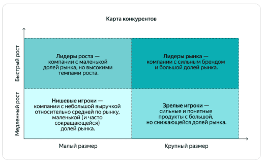
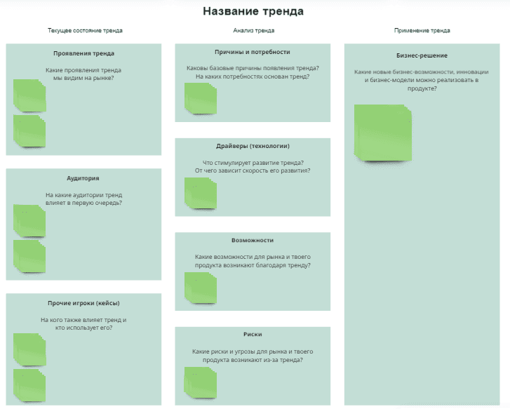
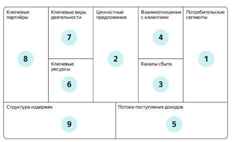
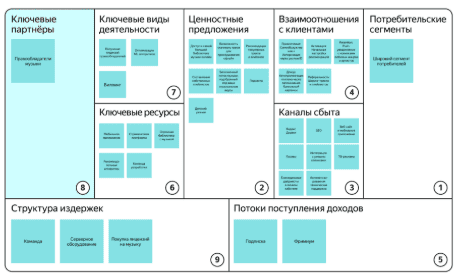

Одна из главных целей продакт-менеджера — поиск product/market fit, соответствия продукта рыночным потребностям.

# Спринт 1

## Введение в исследования рынка

Чтобы понять, что нужно клиентам, нужно исследовать клиентов и рынок в целом. Нельзя опираться только на свои представления и догадки.

###  Что такое рынок?

Твой цифровой продукт — это не просто набор функциональных возможностей (фич), сайт или мобильное приложение.

Цифровой продукт удовлетворяет потребности и решает задачи клиентов, у которых есть возможность выбрать другое решение своих задач. Каждый продукт находится во внешней среде — на рынке, где действуют разные участники: твоя компания, конкуренты, клиенты и так далее.

**Рынок** — это экономические отношения между потребителями цифрового продукта и его создателями.

Чтобы твой продукт был успешен, нужно учитывать внешнюю среду. Тебе нужно знать, кто готов купить твой продукт, а также кто помогает (или поможет в будущем) клиенту закрыть ту же потребность, что и твой продукт.

Удачной идеи продукта недостаточно для его успеха. Важно, как эта идея реализована и насколько она отвечает потребностям рынка.

Именно поэтому продакт-менеджеры инвестируют своё время и силы в исследования рынка — в понимание среды, в которой находится продукт.

### Что даёт исследование рынка?

Анализ рынка полезен по нескольким причинам.

1. **Исследование рынка бережёт время и ресурсы**

В результате твоя команда может проверить, насколько жизнеспособна ваша идея. Многие продукты провалились, так как на них не было достаточного спроса, или рынок оказался слишком узким, или команда сделала ставку на устаревшие технологии, или было ещё что-то. Если вложиться в изучение рынка перед запуском продукта, этих ошибок можно избежать.

**Пример.** Твоя команда сделала сервис: конструктор резюме. Вы оценили рынок жителей России, которым нужно составить резюме. Также вы установили стоимость ежемесячной подписки для клиентов: сравнили её с западными аналогами и сопоставили со средней зарплатой по стране. При этом вы не исследовали целевую аудиторию.

После запуска твоя команда увидела, что людей, готовых платить за сборку резюме, не так много (узкий рынок). Из-за особенностей и цикла поиска работы клиенты крайне редко продлевали подписку: они не увидели в ней ценности для себя. Всё это можно было выяснить до запуска и сэкономить ресурсы.

2. **Исследование рынка помогает рассчитать окупаемость**

Понимание рынка и оценка его объёма помогают убедиться в том, что выручка от продукта окупит инвестиции в него. Также исследование рынка повысит шансы на привлечение денег инвесторов. Используя цифры и факты, тебе нужно показать руководству и инвесторам, что ты знаком с рынком и аудиторией, а бизнес-идея продукта имеет потенциал.

**Пример.** Инвестиционный фонд хочет вложить деньги в сегмент телемедицины — удалённого предоставления медицинских услуг. На примете у фонда есть два стартапа на ранней стадии со схожей концепцией продукта.

Первый стартап в своей презентации оценил рынок телемедицины аж в 10% всего рынка медицинских услуг. Откуда такая цифра? Команда посмотрела на показатели некоторых зарубежных стран.

Вторая компания представила более скромную и реалистичную оценку рынка — втрое меньше. В презентации стартап описал ключевые драйверы и ограничения на рынке, а также представил результаты исследований клиентов и конкурентов по каждому сегменту медицинских услуг.

В итоге инвестфонд выбрал второй стартап, который показал, что сделал свою домашнюю работу и лучше понимает рынок.

3. **Исследование рынка помогает оценить состояние запущенного продукта**

На реальных рыночных данных проще понять, насколько продукт соответствует потребностям рынка, нужно ли менять его стратегию или бизнес-модель (так называемый пивот).

**Пример.** Макс уже сталкивался с исследованием рынка, но, видимо, забыл об этом. Когда он работал менеджером проектов в Melody, его команда делала новый продукт — прослушивание подкастов.

После запуска продакт-менеджер увидел, что изначальный план по привлечённым клиентам не выполняется. Чтобы разобраться, что не так, команда провела исследование. В итоге выяснилось, что клиенты были и так довольны другими сервисами, которые уже работали на рынке.

При этом у многих слушателей оставалась нерешённой другая проблема: сортировка подкастов по темам, популярным в их стране (путешествия, психология, саморазвитие и тому подобное). Благодаря новым вводным команда скорректировала идею продукта и сделала его более успешным.

4. **Исследование рынка определяет, как продвигать продукт**

Зная целевую аудиторию, проще выбрать каналы коммуникации с клиентами.

**Пример.** Твоя компания планирует запустить рекламу в метро. При этом исследование рынка показало, что большинство ваших клиентов водят машину и каждый день проводят за рулём час и более. В таком случае будет разумнее задействовать другие каналы и рекламные носители: например билборды вдоль крупных автодорог.

**Задание**. У продукта, который делает твоя команда, есть несколько проблем. В каких случаях нужно провести исследование рынка, а в каких можно обойтись без него?
Нужно:
- Вы собираетесь запустить продукт в новом регионе
- Вы хотите оценить потенциал развития продукта на три года
- Вы не знаете, отстаёт ли продукт от конкурентов
Не нужно:
- Вы стали медленнее выводить на рынок новые фичи продукта
- У продукта растут затраты и падает маржинальность

### Результаты анализа рынка

Итак, у нас есть продукт или идея продукта и мы хотим провести исследование рынка. В самом начале важно определить цель: что именно мы хотим изучить, на какие вопросы ответить? Вот что обычно содержится в таком исследовании.
- Описание рынка: границы, ключевые особенности, тенденции и так далее.
- Прогнозируемая доля рынка у нашего продукта: предполагаемая выручка, необходимые вложения, время достижения цели и так далее.
- Анализ конкурентов: доля рынка, главные фичи их продуктов, преимущества и недостатки.
- Анализ целевой аудитории продукта: описание, особенности и так далее.

Это ключевые вопросы в исследовании рынка. В следующих уроках мы подробнее разберём, как ответить на каждый из них.

Задание
Что мы можем узнать в результате исследования рынка? Отметьте все правильные варианты.
- Правильный ответ / Потенциал рынка, доступный для конкуренции
- Прогноз прибыли нашего продукта
- Правильный ответ /  Список ключевых конкурентов
- Оценка прибыльности продукта
- Тренды в отрасли и экономике . Исследование рынка включает в себя анализ экономических факторов, влияющих на рынок, а также ключевых тенденций самого рынка
- Правильный ответ / Приблизительный размер целевой аудитории

## Ключевые параметры рынка

Рынок состоит из экономических отношений между потребителями цифрового продукта и его создателями.

В этом уроке мы рассмотрим ключевые параметры рынка и факторы, которые на них влияют.

Современные рынки, особенно цифровые, имеют сложную структуру и характеристики. Всё это меняется вместе с предпочтениями потребителей и внешними факторами в ходе конкуренции между участниками.

Возьмём, к примеру, пассажирские перевозки. Пару веков назад горожане удовлетворяли эту потребность с помощью гужевых экипажей с извозчиками, которых они находили на улице.

Сейчас в крупнейших городах есть индустрия такси. В неё, помимо собственно водителей и их автомашин, входят таксопарки, платформы-агрегаторы такси, страховые и финансовые компании, поставщики автомобилей, государственные регуляторы и другие.

Для создания продукта, который будет решать задачи твоего клиента, нужно понимать систему всего рынка: из чего он состоит и каковы его ключевые параметры.

### Из чего состоит рынок?

Ключевые параметры рынка — это показатели, которые составляют рынок и позволяют оценить его состояние. Есть четыре основных параметра рынка.

1. **Спрос**

Это объём товаров или услуг, который готовы купить потенциальные покупатели. Также «спросом» называют количество товаров или услуг, которое потребители уже купили за определённый период времени по определённой цене.

**Пример.** Cпрос на рынке такси за месяц — это число поездок, которое хотели совершить пассажиры. Не весь спрос стал поездками: часть заказов сорвалась из-за высокой цены или отсутствия свободных машин.

В нашем примере пользователи 300 млн раз открыли приложение и согласились ехать по цене в 300 рублей. А вот такси за 400 рублей вызывали реже: 250 млн раз.

2. **Предложение**

Это количество товаров или услуг, которое продавцы готовы предложить на рынке в определённое время и по определённой цене.

**Пример.** Предложение на рынке такси в месяц — это число поездок, которое таксопарки и частные водители готовы совершить по запросу пассажиров. Например, сервис Яндекс Go собирает всё предложение в своём продукте (агрегирует) и предлагает поездки пользователям.

На рынке такси предложение зависит от доступности машин и баланса со спросом. Например, при цене в 300 рублей предложение составляет 200 млн поездок. Цена в 400 рублей таксистам ещё интереснее: предложение увеличивается до 250 млн поездок.

Агрегаторы такси балансируют предложение со спросом за счёт цены и комиссии, которую они удерживают за своё посредничество. Это стимулирует таксопарки увеличивать число машин, подключённых к агрегаторам, а водителей — менять продолжительность своего рабочего дня. На разных уровнях цен разные уровни спроса и предложения находят баланс.

В нашем примере при цене в 400 рублей такси вызвали 250 млн раз. Таким оказался баланс спроса и предложения, который принёс выручку в 100 млрд рублей.

3. **Внешняя среда и регулирование**

Это то, что влияет на рынок и регулирует его: экономика региона, законы, государство и так далее.

**Пример.** Пандемия коронавируса привела к тому, что потребители начали экономить на всех услугах и товарах. Из-за этого шокового события спрос на такси резко упал: весной 2020 года число поездок сократилось примерно вдвое по сравнению с мартом 2019 года. 

**Другой пример.** Чтобы поездки на такси были безопасными, государство вводит различные требования: например лимит часов, которые водитель может проводить за рулём.

4. **Поставщики и партнёры**

Это организации, которые оказывают услуги и поставляют товары другим организациям для создания ими собственных услуг и товаров.

**Пример.** Яндекс Go предоставляет услуги пассажирам и водителям, но не владеет машинами такси. В свою очередь таксопарки сдают автомобили в аренду водителям, которые возят клиентов Яндекс Go. В этой цепочке таксопарки — партнёры Яндекс Go.

Четыре пункта, описанные выше, — это ключевые параметры рынка. Их нужно анализировать вместе с внутренним состоянием компании.

**Задание**.
Какой параметр рынка нужно проанализировать, чтобы ответить на поставленный вопрос? Выбери вариант из выпадающего списка.
- Является ли новая продуктовая фича уникальной на рынке? / Предложение
- Сколько клиентов хотят решить эту проблему? / Спрос
- Какие законы вступят в силу с 1 января и как они повлияют на продукт? / Внешняя среда
- С какими дистрибьюторами можно быстрее вырастить твой продукт? / Поставщики и партнёры
- Сколько потребители готовы заплатить за подписку на твой продукт? / Спрос

### Спрос и его ключевые параметры

**Спрос** — это количество товаров или услуг, которое покупатели готовы приобрести по определённой цене, чтобы удовлетворить свою потребность.

**Ключевой закон спроса:** чем выше цены на продукт, тем ниже спрос, — и наоборот.

Когда цена снижается, потребители могут приобрести большее количество продукта. Также у продукта может вырасти целевая аудитория за счёт тех, кому подходит новая, сниженная цена.

Спрос на рынке имеет **эластичность по цене** — степень, с которой изменение цены влияет на объём спроса.

Спрос считается эластичным, когда снижение или увеличение цены заметно увеличивает или снижает продажи продукта. В случае неэластичного спроса колебания цены будут, напротив, слабо влиять на объём спроса.

На рынке, который ты анализируешь, могут быть сегменты спроса с разной эластичностью по цене. Например, в течение последних 10 лет снижение цен на рынке такси обычно вело к росту числа поездок, особенно в экономсегменте (спрос был эластичен).

В то же время удешевление поездок в бизнес-сегменте могло и не вызвать такого скачка в числе заказов: для этой категории клиентов цены не так критичны (спрос был менее эластичен).

Помимо цен, на объём спроса влияют неценовые факторы, которые важно учитывать.
- Структура и характеристики **населения**. Чем больше людей попадают в вашу целевую аудиторию и чем больше у них денег, тем выше спрос.
- Доступность **заменителей** твоего продукта. Когда клиентам дешевле и проще купить заменитель твоего продукта, удовлетворяющий ту же самую потребность, у конкурентов, спрос на твой продукт снижается.
- Смена потребительских **предпочтений**. Чтобы пользоваться спросом, твой продукт должен подходить под требования клиентов. Со временем они меняются. Речь о таких характеристиках, как состав продукта, внешний вид, упаковка, экологичность, сервис, скорость доставки, формат оплаты и так далее.
- Государственное **регулирование** и налогообложение. В частности, чем больше налогов нужно платить при покупке и обслуживании продукта, тем ниже будет спрос на него.

### Ключевые типы клиентов

При анализе спроса важно учитывать, кто является клиентами твоего продукта. От этого зависит сам продукт, который ты предлагаешь, а также способы его продвижения, привлечения клиентов, дистрибуции и коммуникации. Выделяют несколько типов рынков с точки зрения клиентов.

#### Потребительский рынок

Его также называют рынком business to customer(B2C), розничным или массовым рынком. Клиенты — это население, физические лица. 

Например, ключевой рынок для онлайн-ритейлера Ozon — B2C. В магазине Ozon может сделать заказ любое частное лицо: ты, твои родные или знакомые.

Для потребительского рынка важны следующие характеристики клиентов.
- Культурно-демографические: пол и возраст клиентов, география, круг их интересов и так далее.
- Экономические: уровень дохода, занятость, профессия.
- Потребительские привычки и паттерны поведения. Например, сколько по времени они пользуются мобильными приложениями или компьютером.

#### Корпоративный рынок

Он же business to business (B2B), бизнес-рынок. Клиенты здесь — юридические лица.

У того же Ozon есть продукты для B2B-рынка, клиентами которых являются юрлица со своими особенностями (например, ритейлер может заниматься продажей и доставкой канцелярских товаров в офисы компаний).

Для анализа корпоративного рынка нужно учитывать:
- доходы и расходы клиентов,
- ключевые потребности,
- особенности потребления.

Разновидность B2B — рынок, где клиентами являются госорганы или институты с государственным участием. Это рынок business to government (B2G).

#### Алгоритм анализа спроса

Для анализа спроса удобно использовать пошаговый алгоритм.
- Подсчитать число клиентов на рынке и определить их характеристики.
- Вычислить средний чек клиента, а также показатели, за счёт которых он растёт (например, общее число операций и доход с одной операции).
- Рассчитать общую величину спроса.
- Определить факторы, которые влияют и будут влиять на число клиентов.
- Определить факторы, которые влияют и будут влиять на средний чек.
- Проанализировать фактическую динамику спроса (при наличии данных) и сделать прогноз на будущее.

**Задание**. Определи, к чему ведёт каждый из перечисленных факторов: к росту или к снижению спроса на продукт?

Рост спроса:
- Ускорение доставки товара при той же цене
- Увеличение доходов потенциальных клиентов
- Рост населения в регионе

Снижение спроса:
- Появление дешёвых аналогов
- Рост налога на добавленную стоимость (НДС)

### Предложение и его ключевые параметры

**Предложение** — это деятельность поставщиков, которые производят и предлагают свой продукт на рынке для удовлетворения имеющегося спроса. Предложение считается как объём товаров или услуг, который готовы производить или оказывать компании в определённый момент времени по определённой цене.

Для тебя и твоего продукта предложение рынка — это игроки, конкурирующие с твоей командой за интерес и деньги клиентов. 

На предложение влияют ценовые и неценовые факторы. К неценовым факторам относятся:
- **Альтернативные возможности** производителя продукта. Если он имеет возможность быстро переключиться на производство более прибыльного продукта, на который растёт спрос, вместо текущего, менее привлекательного, то предложение текущего продукта снизится.
- Развитие **технологий** позволяет создавать более функциональный продукт при тех же или меньших затратах. Это подстёгивает рост предложения.
- Наличие у компаний **ресурсов** для запуска продукта также увеличивает предложение.
- Рост **налогов** снижает прибыльность продукта и ослабляет стимулы наращивать предложение — и наоборот.

**Алгоритм анализа предложения**
- Определить число и характеристики поставщиков; выделить ключевых поставщиков на рынке.
- Оценить выручку и средний чек поставщиков.
- Определить факторы, которые влияют и будут влиять на число поставщиков.
- Определить факторы, которые влияют и будут влиять на число клиентов.
- Проанализировать фактическую динамику объёма предложения и долей игроков; сделать прогноз на будущее.

**Задание**
Какие факторы вызовут рост предложения на рынке, а какие — снижение?

Рост предложения:
- Рост прибыльности производства продукта
- Дефицит предложения на рынке при растущем спросе
- Несколько компаний достигают product/market fit, их аудитории устойчиво растут

Снижение предложения
- Государство увеличило требования к затратам на продукт
- Растут затраты на персонал, спрос на продукт сохраняется

### Как меняются спрос и предложение?

Факторы, влияющие на спрос и предложение, со временем меняются. Поэтому важно регулярно анализировать спрос и предложение, чтобы отслеживать новые возможности и риски.

**Пример.** После ухода ряда зарубежных игроков из России в 2022 году появились новые сегменты, привлекательные для местных компаний. На месте, которое ранее занимал сервис для бронирования отелей Booking.com, возник неудовлетворённый спрос и рыночная возможность на несколько миллиардов рублей. В результате зашевелились как действующие, так и новые игроки, готовые побороться за долю рынка.

**Жизненный цикл рынка**

По спросу и предложению видно, на каком этапе жизненного цикла находится рынок. Жизненный цикл рынка схож с этапами развития продуктов и организаций, которые на нём действуют.

Так, в период становления рынка мы увидим высокие темпы роста, низкую конкуренцию и отсутствие продуктов-заменителей. На этом этапе у компаний есть большой потенциал. Этого нельзя сказать об этапе старения, на котором царит высокая конкуренция, мало современных технологий и идёт спад продаж по всем направлениям.

**Пример.** Рынок смартфонов во второй половине 2000-х и первой половине 2010-х годов был растущим, на нём появлялось много новых игроков.

Сейчас это зрелый рынок, и предложения гораздо больше, чем спроса. Многие производители готовы продавать гаджеты с низкой прибылью для себя, чтобы продукция не залёживалась на складах. Фокус производителей сместился на объёмы продаж, операционную эффективность и получение прибыли от сопутствующих цифровых услуг.

## Методы исследования рынков

Есть много методов сбора и систематизации данных в исследованиях рынка. Выбор метода зависит от целей продукта, сроков, бюджета и доступности информации.

В этом уроке мы определим основные типы исследований и опишем методы, которые продакт-менеджеры используют чаще всего.

### Категории исследовательских методов

Все исследовательские методы можно условно разделить на две крупные категории.
- **Количественные методы** основаны на сборе, анализе и сравнении числовых данных, которые могут быть измерены количественно и сопоставлены с другими типами данных. Отвечают на вопрос «Сколько?».
- **Качественные методы** носят описательный характер. Они направлены на получение глубокой и детальной информации о предмете исследования. Чаще отвечают на вопросы «Кто?», «Как?» и «Почему?».

И количественные, и качественные исследования применимы к задачам по исследованию рынка и продукта. Рассмотрим каждую категорию поподробнее.

### Количественные исследования

Количественные исследования дают числовой ответ на ваш исследовательский вопрос. Они обладают следующими особенностями.
- Требуют большого количества наблюдений: тебе нужно либо собрать данные самому, либо взять имеющиеся на рынке.
- Имеют строго структурированный формат искомых данных и источников для их поиска.
- Основаны на математических моделях и статистических методах.
- Дают ответы на заранее определённое ограниченное число вопросов.

Количественные исследования помогают со многими бизнес-задачами: от оценки объёма рынка и потенциала выручки до ценообразования и выбора маркетинговых каналов.

**Пример.** Компания делает образовательный продукт для детей и хочет выйти на новый для неё рынок Латинской Америки.

На первом этапе нужно понять, какие проблемы стоят перед её потенциальными клиентами. У компании есть ряд гипотез по приоритетным клиентам и продукту. Для каждой гипотезы она пытается оценить рынок и потенциал среднего чека.

Для этого компания проводит количественное исследование — онлайн-опрос клиентов. На большой выборке результаты опроса помогут выявить структуру сегментов и оценить сумму, которую клиенты готовы заплатить за решение своих проблем (средний чек).

**Преимущества количественных исследований**
- Основаны на большом числе наблюдений, которые позволяют сделать надёжные выводы.
- Исследования можно легко повторить на том же или на другом рынке.
- Увеличение размера выборки не приводит к пропорциональному увеличению затрат на проведение.
- Работу с данными можно ускорить и упростить за счёт автоматизации.

### Методы количественных исследований

Существует четыре основных метода количественных исследований. 

1. **Наблюдение**

**Наблюдение** — это метод, по которому исследователи целенаправленно и организованно следят за поведением группы пользователей.

Исследователи не вмешиваются в поведение клиента, а стараются увидеть естественное поведение. Данные используются для дальнейшего анализа.

Наблюдение бывает двух видов:
- прямое — когда исследователь изучает сам объект и его поведение;
- непрямое — когда исследователь изучает объект через косвенные данные, например, факты, статистику, мнения очевидцев и так далее.

**Пример.** Продакт-менеджер решила изучить поведение клиентов при выборе автомобиля офлайн. В течение месяца она с помощью исследовательской компании наблюдала за клиентами и фиксировала поведение всех приходящих в автосалон. Также она провела непрямое наблюдение: изучила архивные данные о покупках.

2. **Опрос**

**Опрос** — это исследование большого числа людей, которым задают один и тот же набор простых вопросов.

Цель: понять, что клиенты или группа людей думают о продукте, услугах на рынке и так далее. Может применяться в офлайн- и в онлайн-форматах. Опрос считается одним из самых популярных и экономически эффективных методов исследования рынка.

Опрос может проводиться разными способами: через анкетирование онлайн, обзвон базы респондентов, общение с прохожими на улице и так далее.

**Пример.** Компания из телеком-отрасли регулярно проводит опросы клиентов на своей онлайн-платформе и в офлайне силами сотрудников салонов. Исследование нужно как для общей оценки рынка и прощупывания конкурентов, так и для ответа на более конкретные вопросы. Например:
- Что пользователи думают о новых продуктах в области путешествий?
- Какие опции для семейного использования востребованы клиентами?
- Почему пользователи приобрели услугу или отказались от неё?
- Как часто за прошедший квартал пользователи посещали наши магазины и магазины конкурентов?
- Насколько пользователи удовлетворены оказываемыми услугами?

3. **Эксперимент**

**Эксперимент, или экспериментальное исследование**, — это метод, при котором исследователь активно вмешивается в процесс, чтобы выявить взаимосвязь между разными факторами. Исследователь изменяет один фактор и наблюдает, что происходит с другим фактором, с которым не производится никаких манипуляций. 

Эксперимент полезен, когда у продакта есть несколько недоказанных гипотез, которые тяжело проверить на практике до запуска. Тогда менеджер специально моделирует ситуацию и проводит эксперимент для подтверждения или опровержения гипотезы. 

При помощи этого метода продакты чаще всего хотят ответить на вопрос: как отреагирует клиент, если мы примем такое-то бизнес-решение?

**Пример.** Компания собирается запустить новую линейку тарифов, но не понимает, как это отразится на спросе. Продакт-менеджер проводит эксперимент. Он сравнивает метрики спроса у двух групп пользователей: той, которой рассказали про экспериментальные тарифы, и той, которой рассказали про существующие тарифы.

4. **Корреляционный анализ**

**Корреляционный анализ** — это метод исследования, который использует инструменты статистики и математики, чтобы определить отношения между двумя параметрами. С помощью корреляционного анализа можно увидеть, как один показатель влияет на другой.

**Пример.** Продакт-менеджер маркетплейса выдвинул гипотезу, что сильнее всего влияет на число покупок в категории косметики. Он собрал данные по изменению разных факторов и провёл корреляционный анализ.

В итоге он выяснил, что спрос больше всего зависит от сезонности, динамики отзывов в соцсетях и числа push-уведомлений в приложении. А вот реклама в других каналах и величина скидки влияют на продажи в меньшей степени.

**Задание**
Сопоставь задачу продакта и наиболее подходящий метод количественных исследований.
- Проверить гипотезу о том, что снижение цены на ваш продукт приведёт к понижению спроса на продукт конкурентов / Эксперимент
- Оценить число клиентов в разных сегментах, которые пользуются приложениями конкурентов / Опрос
- Проанализировать связь спроса на одну из категорий одежды на маркетплейсах с погодой и днями недели / Корреляционный анализ
- Используя данные Банка России, выявить тенденции спроса на кредитные продукты по регионам РФ перед экспансией продукта / Наблюдение

### Качественные исследования

**Качественные методы** стремятся ответить на вопросы «Почему?», «Кто?» и «Как?». С их помощью исследователь изучает субъективные мнения, убеждения, опыт, эмоции, отношения и взаимодействия клиентов путём сбора и анализа данных, которые плохо поддаются количественной оценке.

**Пример.** Команда продукта для обучения иностранным языкам хочет увеличить средний чек и снизить отток новых пользователей в первый квартал после привлечения.

Для поиска новых гипотез продакт-менеджер провела глубинные интервью с клиентами и партнёрами сервиса. Она выяснила, что клиенты имеют больше стимулов приходить на следующее занятие, когда чувствуют ответственность перед другими людьми. Продакт предположила, что добавить ответственности можно за счёт проведения уроков с двумя и более учениками схожего уровня.

Исследование конкурентов показало, что на рынке нет сервисов, предлагающих гибкую схему совмещения индивидуальных занятий с групповыми. Продуктовая команда запустила возможность группового обучения. В итоге клиенты стали чаще появляться на занятиях, зная, что их партнёры тоже придут на урок.

**Преимущества качественных исследований**
- Выявляют важные идеи, которые не могут быть раскрыты с помощью одних лишь цифр. В частности, помогают сформулировать новые гипотезы или расширить первоначальный взгляд исследователя на решаемую бизнес-задачу.
- Больше сфокусированы на опыте и мнениях конкретных людей.
- Более гибкие, чем другие методы: вопросы можно добавлять и изменять по ходу получения новой информации во время исследования.
- Способствуют более естественному общению, поскольку ответы не должны вписываться в заранее установленные ограничения.
- Фиксируют перемены взглядов и настроений внутри целевой группы.

Одним из ограничений качественных методов может быть субъективизм: одни и те же данные можно трактовать по-разному. Поэтому исследователи должны быть внимательны к методологии таких исследований, а также верифицировать результаты другими инструментами, в том числе количественными.

### Методы качественных исследований

Существует пять основных методов качественных исследований. Давай подробно рассмотрим каждый их них.

1. **Фокус-группа**

**Фокус-группа** — это обсуждение темы в группе из 5–10 человек, имеющих общие характеристики, под руководством модератора. Метод помогает узнать, что группа думает о конкретной проблеме или продукте.

Известно, что Стив Джобс ненавидел фокус-группы. «Очень сложно создавать продукты по фокус-группам. Люди часто не знают, чего хотят, пока вы им это не покажете», — говорил экс-глава Apple.

Когда ты работаешь над инновационным продуктом, не имеющим аналогов, фокус-группы действительно могут быть неэффективны. Но когда твой продукт можно назвать более традиционным и ты хочешь знать, нужен ли он или его новая функция твоим клиентам, фокус-группы будут очень полезны.

**Пример.** Продакт-менеджер нового музыкального стримингового сервиса с функциями соцсети собрал фокус-группу. Его цель — понять, как люди используют существующие сервисы, какие фичи для них важны и как они воспринимают социальную составляющую продукта.

2. **Наблюдение**

**Наблюдение** может быть как количественным, так и качественным методом исследования. Как мы уже отмечали выше, это метод, при котором исследователь целенаправленно и организованно фиксирует поведение группы пользователей.

В отличие от количественного, при качественном наблюдении исследователь фокусируется на сборе данных, которые сложно описать лишь цифрами. Например, на потребностях и желаниях аудитории, критериях отбора товара и часто задаваемых вопросах в поддержку и консультантам.

**Пример.** По итогам фокус-группы продакт-менеджер нового музыкального стримингового сервиса и соцсети сформулировал набор гипотез. Для их подтверждения он провёл наблюдение за пользователями других сервисов. В итоге он увидел, как часто и в каких случаях пользователи делятся информацией из сервиса в других социальных сетях.

3. **Интервью**

**Интервью** — разговор с клиентом. Выделяют три типа интервью.
- Структурированное интервью: ты составляешь строгий и подробный сценарий интервью, от которого нельзя отходить.
- Неструктурированное интервью: ты обозначаешь набор тем и направлений для обсуждения, а далее модерируешь свободную неформальную дискуссию.
- Полуструктурированное интервью — смешанный формат: у тебя есть заранее определённые темы или вопросы, но ты допускаешь их свободное обсуждение.

**Экспертное интервью** — разновидность интервью, в котором ты задаёшь вопросы не клиентам, а эксперту. Экспертами могут быть аналитики, маркетологи, сотрудники компаний или отраслевых ассоциаций, журналисты и блогеры, изучающие нужную тему.

**Пример.** У продакт-менеджера есть задача запустить сервис продажи подержанных автомобилей в Азии. В первую очередь, ему нужно сформировать понимание рынка и паттернов поведения клиентов. Он находит нескольких потенциальных клиентов с опытом продажи автомобилей за последние 12 месяцев и проводит с ними интервью.

4. **Опрос**

Опросы могут быть и количественными, и качественными.

В частности, **открытый опрос** — это метод качественного исследования. При открытом опросе исследователь задаёт респондентам вопросы для понимания их мыслей и идей по поводу продукта, их болей и потребностей, которые невозможно заранее сформулировать в виде определённых вариантов ответа.

**Пример.** Чтобы глубже понять процесс продажи подержанных автомобилей в Азии, вслед за интервью продакт-менеджер провёл онлайн-опрос группы клиентов. Он попросил их прокомментировать его гипотезы и добавить собственные.

5. **Эксперимент**

Эксперимент может быть качественным методом исследования с фокусом на более детальном рассмотрении каждого отдельного эксперимента без необходимости получить числовые результаты.

**Пример.** Продакт-менеджер занимается развитием форума по строительству загородных домов. Ей нужно понять, как клиент будет вести себя в сервисе, если в текущей модели монетизации появится новый сервис:
- по продаже услуг строителей;
- по продаже строительных материалов;
- по подбору строительной компании.

В итоге продакт-менеджер решила сделать несколько дизайнов MVP, провести эксперименты по использованию новых сервисов и зафиксировать мнение пользователей в каждом случае.

**Задание**.
Сопоставь задачу продакта и метод качественных исследований.
- Определить тенденции развития продукта конкурентов / Экспертное интервью
- Узнать у большой выборки клиентов, что им нравится и что не нравится в продуктах конкурентов / Опрос
- Узнать мнение группы людей о запуске нового личного кабинета компании и сравнить его с кабинетами конкурента / Фокус-группа
- Изучить привычки и проблемы небольшой группы клиентов, связанные с покупкой продукта / Интервью

## Первичный и вторичный анализ рынка

В предыдущем уроке мы разобрали, что такое количественные и качественные методы исследования.

В этом уроке мы поговорим про исследования рынка в другом разрезе: первичные и вторичные. Мы опишем, когда уместно проводить тот или иной тип исследований.

### Виды исследований по подходу к сбору информации

Для проведения эффективного анализа рынка важно иметь достаточное количество данных. Собрать эти данные можно разными способами. На основе способа можно выделить два вида исследования рынка.
- Исследование проводится тобой, твоей компанией или от её имени. Тебе нужно самостоятельно собрать данные, чтобы решить конкретную проблему. Это называется **первичным исследованием рынка**.
- Ты используешь существующие данные (например, собранные другими организациями). В таком случае ты проводишь **вторичное исследование рынка**.

**Пример**. Ты работаешь на компанию, которая запускает новый продукт. Твоя задача — помочь компании выбрать приоритетную платформу: веб, iOS или Android. Чтобы сделать это, тебе нужны данные по текущим и прогнозным долям рынка мобильных платформ.

В рамках первичного исследования ты можешь провести опрос целевой аудитории с вопросом: «Какое устройство вы используете для решения проблемы?» Вторичным исследованием тут будет поиск информации в интернете, в отчётах аналитиков и ваших конкурентов.

Теперь давай подробнее остановимся на каждом типе исследования.

### Первичное исследование

**Первичное исследование** — это сбор данных из первых рук: ты самостоятельно исследуешь объект своего интереса. Первичные исследования также называют «полевыми исследованиями».

При проведении первичного исследования ты обычно собираешь информацию, которая специфична для конкретной бизнес-задачи в конкретный период. Например, если тебе нужны данные о том, как изменилась платёжеспособность клиентов продукта за последние три месяца, то методы первичного исследования — отличный способ выполнить задачу.

**Преимущества первичного исследования:**
- Ты имеешь контроль над методологией исследования.
- Ты получаешь свежие данные: видишь текущие тенденции, а не прошлогодние.
- Можно изучить нужный сегмент, а не рынок целиком.
- Ты и твоя компания как сборщик данных сохраняете право собственности на них.
- У конкурентов нет доступа к результатам.

**Ограничения первичного исследования**
- Стоит дорого.
- Занимает много времени.
- Требует профессиональной подготовки: нужно составлять методологию и организовывать проведение исследования.

### Методы первичных исследований

Самые популярные способы проведения первичного исследования описаны в предыдущем уроке: это интервью, наблюдение, эксперименты, опросы и фокус-группы.

Выбор подходящего метода исследования зависит от цели исследования, доступных ресурсов и дедлайна для получения результатов. На основе этих вводных методы можно разделить на два типа.

1.**знакомительное исследование**. Этот вид первичного исследования рынка меньше связан с анализом тенденций и больше касается потенциальных проблем, которые стоило бы решить. Обычно ознакомительное исследование делается для подготовки к другому исследованию. Методы: интервью или опросы небольшого числа людей.
**Пример**. Компания планирует выводить продукт на новый рынок. Для начала продакт-менеджеру очень важно определить проблемы клиентов, характерные для нового рынка. Поэтому в рамках ознакомительного исследования продакт проводит интервью небольшой группы потенциальных клиентов с этого рынка.

2. **Специфическое исследование**. Оно следует за ознакомительным исследованием и используется, чтобы углубиться в проблемы или возможности, которые бизнес ранее определил как важные. В специфических исследованиях бизнес может сфокусироваться на целевом сегменте своей аудитории и задавать вопросы, направленные на решение конкретной проблемы.
**Пример**. После первичного ознакомления продакт-менеджер сформировала список ключевых фич, которые должны быть у продукта. Чтобы определить, насколько клиентам важна каждая из этих фич, продакт проводит специфическое исследование: опрос аудитории с закрытым списком конкретных вопросов.

### Вторичные исследования

**Вторичное исследование** — это тип исследования рынка, в котором используются данные из вторых рук. Эти данные были собраны и проанализированы другими людьми, и ты вынужден принять все ограничения и особенности их целей и методологии.

Большинство источников информации для вторичного исследования можно использовать бесплатно. Такие исследования также называют «кабинетными исследованиями».

Вторичное исследование идеально подходит в двух случаях.
- Когда продакт-менеджеру нужно провести исследование быстро и недорого. Например, если стоит задача получить первоначальное представление о рынке и конкурентах.
- Когда по твоему вопросу можно найти достоверную статистику по рынку. Если нужные данные уже есть, проводить своё первичное исследование будет напрасной тратой ресурсов.

**Преимущества вторичного исследования:**
- Стоит недорого.
- Помогает быстро получить общее представление о предмете.
- Результаты вторичных исследований помогают решить, нужно ли инвестировать в более дорогие первичные исследования.
- Данные несложно найти.
- Не требует компетенций для разработки методологии, организации и проведения собственного исследования.

**Ограничения вторичного исследования:**
- Не всегда можно найти специфичную информацию, нужную именно тебе.
- Найденная информация может устареть к текущему моменту.
- Не всегда можно использовать выводы из других исследований в твоей ситуации. Например, данные могут быть собраны для другой цели или сегмента рынка, которые не связаны с твоим продуктом.
- Нужно хорошо разобраться в методологии чужого исследования, чтобы быть уверенным в его достоверности и применимости для твоих целей.

### Источники вторичного исследования

Источники данных для вторичного исследования можно условно разделить на три группы.

1. **Публичные источники**.

Это ваш первый и наиболее доступный источник информации. Поскольку данные находятся в свободном доступе, исследование публичных источников обойдётся не так дорого. Вот список источников, на которые стоит обратить особое внимание:
- государственная статистика;
- данные отраслевых ассоциаций;
- отчёты исследовательских и консалтинговых компаний;
- сайты и отчёты конкурентов;
- СМИ и блоги;
- эксперты отрасли;
- сервисы аналитики и мониторинга данных (например, Яндекс Wordstat, SimilarWeb, Google Trends).

2. **Коммерческие источники**.

Это рыночные отчёты с отраслевой информацией, составленной исследовательскими и консалтинговыми компаниями (Gartner, Forrester и так далее). Как правило, полные отчёты являются платными, хотя зачастую можно бесплатно ознакомиться с их демо-версиями.

3. **Внутренние источники**.

Это рыночные данные, которые уже есть в вашей организации. Во многих компаниях можно найти ту или иную аналитику по рынку: оценки его объёма; исторические данные о состоянии старых и новых учётных записей клиентов; данные клиентской службы и сотрудников команды продаж; экспертное мнение коллег, давно работающих в отрасли.

**Задание**.
Сопоставь задачу и наиболее подходящий источник вторичной информации.
- Оценить популярность услуг психоаналитиков в интернете / Сервис статистики запросов в Яндексе
- Отследить динамику ставки по ипотечным кредитам в России / Отчёт Банка России
- Оценить уровень цен в онлайн-кинотеатрах / Сайты конкурентов
- Определить наиболее перспективные сегменты цифровых сервисов в Бразилии / Отчёты сервисов аналитики
- Узнать ключевые преимущества и недостатки товаров конкурентов (по мнению клиентов) / Отзывы и оценки на маркетплейсах

### Комбинирование видов исследования

Первичные и вторичные исследования рынка отличаются, но ни в коем случае не исключают друг друга.

Первичное исследование опишет рынок с фокусом на твоём бизнесе. Оно обычно стоит дороже и занимает больше времени, но даст более верифицированные результаты, чем вторичное исследование. 

Вторичное исследование расскажет, как обстоят дела у других компаний и как результаты твоих собственных исследований соотносятся с более крупной выборкой. Продакт-менеджеру нужно балансировать и комбинировать методы обоих типов.

**Задание**.
Какой вид исследования лучше использовать для поставленной бизнес-задачи?

Первичное исследование:
- Оценить долю клиентов, которые используют два и более источника для поиска вакансий за рубежом
- Определить лояльность клиентов к брендам ключевых игроков на рынке
- Выявить основные боли людей, которые покупают подержанный смартфон

Вторичное исследование:
- Определить крупнейших игроков на рынке страхования
- Понять структуру выручки и маржинальность конкурентов

## Анализ конкурентов

### Что такое анализ конкурентов и зачем он нужен?

**Анализ конкурентов (или конкурентный анализ)** — это процесс оценки сильных и слабых сторон компаний, которые предлагают продукты, аналогичны
е твоему или решающие те же задачи пользователей.

Анализ конкурентов позволяет получить данные для решения разных управленческих задач. Например:
- оценить текущую ситуацию — позиции и рыночные доли конкурентов;
- определить продуктовые возможности — какие продукты уже есть на рынке, а какие только появляются или уходят;
- изучить лучшие практики в части продуктовых фич, взаимоотношений с клиентами, ценообразования, дистрибуции и так далее;
- увидеть угрозы — рост конкурентов, запуск ими новых продуктов, начало стратегического сотрудничества с твоими партнёрами и так далее;
- понять ситуацию с конкурентами на новых рынках и подготовиться к выходу на них;
- подготовить новый продукт к запуску — отстроиться от продуктов конкурентов, собрать отзывы первых клиентов и так далее.

### Как провести конкурентный анализ?

Чтобы провести тщательный анализ конкурентов, тебе нужно сделать четыре шага.
- Определись с целью.
- Составь список прямых и косвенных конкурентов.
- Собери информацию о конкурентах из всех доступных источников (сайты компаний, отзывы клиентов, финансовая информация, пресс-релизы, собственный опыт использования и так далее).
- Собери аналитический отчёт по конкурентам (например, с помощью SWOT-анализа).

### Шаг 1. Определись с целью исследования

Определись, для чего тебе и твоей команде анализ конкурентов. Пойми, на какие аспекты исследования нужно сделать упор, и выбери дополнительный фокус (определённые рынки или сегменты), если это необходимо.

**Пример.** Продакт-менеджер онлайн-кинотеатра узнал, что клиентская база у нескольких конкурентов растёт в разы быстрее, чем у его площадки. Поэтому он решил провести исследование конкурентов. Он сфокусировался на трёх аспектах: продукте, дистрибуции и ценообразовании.

### Шаг 2. Выявление ключевых, прямых и косвенных конкурентов

На этом этапе нужно определить, с кем или с чем твой продукт соревнуется за клиентов на рынке. Есть три типа конкурентов.

1. **Ключевые конкуренты** — это компании (продукты таких компаний), которые работают в одном сегменте рынка и предоставляют похожие услуги. Клиенты могут переходить от одного ключевого конкурента к другому и существенно влиять на их прибыль.

Например, для сотового оператора МТС ключевыми конкурентами являются «Билайн», «МегаФон» и Tele2. Клиенты могут без смены номера телефона переходить из одной компании в другую и этим влиять на ключевые показатели компаний.

2. **Прямые конкуренты** — это компании, которые работают в одном сегменте рынка, производят похожий продукт и продают его одной и той же целевой аудитории.

Например, «Тинькофф мобайл» тоже предоставляет услуги сотовой связи и может считаться конкурентом МТС. Однако продукт «Тинькофф» нацелен в основном на клиентов одноимённого банка. Кроме того, «Тинькофф мобайл» не предоставляет такой широкий спектр услуг, как ключевые игроки рынка.

3. **Косвенные конкуренты** — это компании, которые производят продукты с разными характеристиками или совсем непохожие продукты, но продают их одной и той же целевой аудитории.

Например, WhatsApp и Telegram могут считаться косвенными конкурентами МТС, так как там можно совершать звонки и отправлять сообщения. Эти услуги заменяют людям голосовую сотовую связь и СМС-сообщения.

Составить полный список конкурентов помогут следующие источники.
- **Отзывы клиентов**. Пользователи часто упоминают твоих конкурентов в соцсетях, а также в общении с командой продаж или поддержкой твоего продукта.
- **Выдача поисковиков**. Введи категорию или ключевые слова твоего продукта (например, «онлайн-доска») в поисковую систему и посмотри, какие продукты появятся в результатах.
- **Платформы по аналитике**: SimilarWeb, Яндекс Wordstat и другие. С помощью аналитических платформ ты сможешь оценить темпы роста аудитории конкурентов и динамику спроса в сегменте.
- **Отраслевые журналы и порталы**. В них часто можно найти аналитику по конкурентам и новости о запусках. Совсем молодые продукты можно найти на сайтах Product Hunt и TechСrunch.

Оценка ключевых, прямых и косвенных конкурентов является ценным упражнением. 

Понимание сильных и слабых сторон твоих ключевых и прямых конкурентов поможет тебе обнаружить возможности, чтобы выделиться среди них и получить рыночное преимущество. 

Когда ты узнаешь о том, за чем твои потенциальные клиенты приходят к косвенным конкурентам, то сможешь разглядеть потребности, которые твой продукт мог бы удовлетворить более эффективно.

**Задание**. Представь, что твой продукт — это онлайн-платформа с самыми разными курсами дополнительного образования для взрослых.
Определи, к какому типу конкурентов относятся указанные продукты.

Ключевой
- Образовательный сервис Coursera
- Онлайн-сервис с образовательными курсами по культуре и истории

Прямой
- Приложение с мини-курсами цифровых профессий
- Офлайн-курсы дополнительного образования

Косвенный
- YouTube
- «Википедия»

### Шаг 3. Сбор информации о конкурентах

После того, как ты определил своих ключевых, прямых и косвенных конкурентов, начинай собирать ключевую информацию о каждом из них. Анализ конкурентов требует изучения широкого круга источников по каждому конкуренту: от обзоров продуктов и рекламных материалов до пресс-релизов и финансовой отчётности. 

Ключевые источники информации и возможные выводы представлены в таблице ниже.

### Шаг 4. Формирование выводов и результатов анализа
Структурируй всю информацию по следующим пяти пунктам.

1. **Общее понимание рынка и долей**

Представь себе карту конкурентов в виде сегментов, исходя из их размера и темпов роста (размер и рост можно считать, например, по выручке или по числу пользователей). Распредели своих конкурентов по четырём группам, описанным на картинке:

Затем ответь на вопросы:
- Почему растут лидеры рынка?
- Как лидеры рынка могут расти несмотря на и без того сильные рыночные позиции?
- Почему зрелые и нишевые игроки растут не так быстро?
- И любые другие вопросы по схеме.

2. **Видение и цели**

Определи ви́дение (англ. vision) конкурентов: в каком направлении они развивают свои продукты и чего стремятся достичь на рынке. Ответь на вопросы:
- Почему существуют эти продукты?
- Какие проблемы они призваны решить?
- Какие проблемы эти продукты не решают?

3. **Позиционирование**

Узнай, на какой позиции конкуренты видят себя на общем рынке. Лучше искать эту информацию в их же маркетинговых сообщениях на официальных сайтах, в соцсетях и отраслевых медиа.

Ключевые вопросы для анализа:
- Как конкуренты продают свои продукты?
- Каким языком они описывают то, что предлагают клиентам?
- Какие основные проблемы клиента они обещают решить?

4. **Целевая аудитория**

Узнай больше о целевой аудитории конкурирующих продуктов. На основе своего опыта использования этих продуктов и информации о них составь портреты пользователей — образы идеальных клиентов твоих конкурентов. Сверь эти образы с отзывами клиентов в интернете, поищи закономерности.

Вопросы для анализа:
- На каких позициях работают люди из целевых аудиторий конкурентов?
- В каких отраслях они работают?
- Какие у них навыки и интересы?
- Чем они отличаются от аудитории твоего продукта?

5. **Дифференциаторы**

Определи дифференциаторы — то, что заметно отличает продукт каждого конкурента от твоего продукта и остального рынка.

В ходе исследования сосредоточься на самых важных для потребителя факторах: простоте онбординга, доступности интерфейса, качестве обслуживания и цене.

Ключевые вопросы для анализа:
- Лучше ли этот продукт по внешнему виду?
- Его цена ниже или выше, чем у других конкурентов?
- В чём продукт работает лучше, чем остальные?
- Предлагает ли компания превосходное обслуживание?

### Шаблон для анализа конкурентов

На доске в Miro мы подготовили шаблон, который ты можешь использовать для оформления выводов из анализа каждого конкурента. Ты найдёшь его по ссылке. https://miro.com/app/board/uXjVMRKiY4k=/?moveToWidget=3458764552113181037&cot=14

### Выводы и результаты анализа конкурентов. Пример

На доске в Miro мы подготовили пример анализа Яндекс Музыки — прямого конкурента Melody. 

### SWOT-анализ

Есть ещё один хороший способ структурировать выводы по конкурентам: SWOT-анализ. Он состоит из четырёх частей, касающихся внутренней и внешней среды конкурентов.

**Внутренняя среда конкурентов**
- Сильные стороны (strengths) компании, благодаря которым она выигрывает конкуренцию на рынке. Ими могут быть, к примеру, интеллектуальная собственность, уникальные для рынка продукты или сильная команда.
- Слабые стороны (weaknesses) компании ухудшают её позицию на рынке и снижают эффективность её работы. Примеры: слишком сложное ценообразование, долгие ответы в службе поддержки, частая смена менеджмента.

**Внешняя среда конкурентов**
- Возможности (opportunities) — ключевые события во внешней среде, от которых компания может выиграть. Например, растущий спрос на рынке, развитие технологий или смягчение законодательства.
- Угрозы (threats) — ключевые события во внешней среде, которые могут плохо повлиять на компанию. Например, повышение налогов, экономический кризис или уход поставщиков из-за санкций.

На доске в Miro мы подготовили шаблон, который ты можешь использовать для проведения SWOT-анализа. Он доступен по ссылке.

### SWOT-анализ. Пример

На доске в Miro по ссылке мы провели анализ Яндекс Музыки — прямого конкурента Melody.

### Что делать со SWOT-анализом?

После того, как ты заполнишь матрицу по каждому конкуренту, ты сможешь сделать выводы для своего продукта. А именно:
- понять, как использовать их слабые стороны и угрозы;
- придумать, чем ответить на их сильные стороны: догонять и усиливать те же strengths в своей компании или сделать своим коньком что-то другое;
- определить собственные фокусы для позиционирования на рынке с учётом характеристик конкурентов.

**Задание**.
Определи, какие из характеристик, перечисленных ниже, относятся к сильным и слабым сторонам, возможностям и угрозам.
- Известный бренд / Сильные стороны
- Неэффективные B2B-продажи / Слабые стороны
- Ужесточение государственных требований к хранению персональных данных / Угрозы
- Простой и приятный онбординг в продукт (по отзывам клиентов) / Сильные стороны
- Уход зарубежных конкурентов / Возможность
- Высокая текучесть кадров / Внутренний недостаток управления командой — слабая сторона конкурента.
- Повышение налогов / Угрозы
- Развитая рекомендательная система в продукте / Сильные стороны
- Рост проникновения интернета в стране / Возможность
- Высокий уровень метрик лояльности / Сильные стороны

## Анализ аудитории

Успех продукта зависит от привлечения достаточного числа правильных клиентов. Поэтому анализ аудитории — важный этап исследования рынка. В этом уроке мы рассмотрим:
- что такое анализ аудитории и как его проводить;
- по каким характеристикам можно определить свою аудиторию;
- что такое сегментация рынка и как её проводить.

### Что такое анализ аудитории и зачем он нужен?

**Анализ аудитории** — это изучение группы людей, которые пользуются или могли бы пользоваться твоим продуктом.

Твоя конечная цель — определить целевую аудиторию и своего идеального клиента. Тебе нужно описать его или её уникальные характеристики: предпочтения, интересы, потребности и так далее.

Результаты анализа помогут тебе построить бизнес-стратегию, лучше адаптировать продукт к рынку и выбрать маркетинговые активности для вовлечения пользователей.

### Как определить свою аудиторию?

**Целевая аудитория** — это люди, которые с наибольшей вероятностью будут потреблять твой продукт. Поэтому в процессе анализа нужно определить черты, которые характерны для твоей целевой аудитории. Также важно определить её сегменты и характеристики, которые не являются фокусными для твоего продукта.

**Пример.** Твой продукт — деловой онлайн-журнал на русском языке, работающий в России. В теории ты можешь охватить любого человека, у которого есть доступ в интернет.

При этом далеко не всем будет интересен твой продукт. Большинство предпочтёт другие темы, которые ближе им по интересам. Поэтому имеет смысл сузить свою аудиторию. Например — до руководителей крупных отделов или целых компаний.

Чем точнее ты определишь целевую аудиторию и выберешь критерии для её выделения, тем успешнее будут твои продуктовая и маркетинговая стратегии.

1. **Демография**

Демографические характеристики связаны с численностью и структурой населения в регионе. Для определения целевой аудитории используются такие критерии, как:
- возраст,
- пол,
- местоположение,
- этническая принадлежность,
- семейное положение.

**Пример**. Твой продукт — нишевой интернет-магазин товаров для геймеров. Его аудитория в основном состоит из мужчин в возрасте от 20 до 25 лет. Зная это, ты смотришь за тем, чтобы рассылки о продукте соответствовали этой группе, затрагивали интересные ей темы.

Обрати внимание, что определять аудиторию только по демографическим факторам некорректно. Нужно брать в расчёт и другие факторы.

2. **Интересы**

Интересы могут включать в себя следующие пункты (не исчерпывающий список):
- увлечения,
- ценности и убеждения,
- политические взгляды,
- социальная активность,
- спорт и физическая активность,
- жанры музыки и фильмов.

Если ты согласуешь свои сообщения с убеждениями людей из своей аудитории, они с большей вероятностью зауважают твой продукт как бренд и захотят выслушать то, что ты им говоришь. А также — купить то, что ты продаёшь.

**Пример**. В ходе исследования ты выяснил, что целевые клиенты твоего продукта обеспокоены сохранением окружающей среды. Твоя компания может учесть эти ценности в своей бизнес-модели. Например, регулярно сообщать клиентам о снижении негативного влияния на экологию и уменьшать количество пластика и пакетов в упаковке заказа.

3. **Потребительское поведение**

Чтобы понять покупательские привычки и предпочтения клиентов, нужно изучить их поведение. Для этого важно уметь поставить себя на место клиента. Стоит прояснить следующие вопросы:
- Как клиенты привыкли удовлетворять свои потребности?
- Как они выбирают продукт?
- Какие факторы и источники информации влияют на них?
- Сколько времени они взаимодействуют с продуктом (твоим или конкурента) на каждом этапе?
- Как потребители предпочитают платить?
- Какими информационными ресурсами и соцсетями они пользуются?

**Пример**. Ты подсчитал, что от первого знакомства клиента с твоим продуктом до покупки проходит в среднем 3–4 месяца. Исходя из этого поведения, ты настраиваешь коммуникации с аудиторией в продукте и во внешних каналах. Ты подогреваешь интерес клиента к продукту и напоминаешь о себе в течение всего периода до предполагаемой покупки.

4. **Образование**

Узнай больше об образовании клиентов твоего продукта и продукта конкурентов, а именно:
- уровень образования,
- область образования,
- свежесть образования.

У подростков-школьников будут иные потребности, чем у тех, кто получает первое высшее или пишет докторскую диссертацию. Твой продукт и позиционирование должны соответствовать тому, на каком этапе своей жизни находятся клиенты.

**Пример**. Ты выяснил, что продукт онлайн-курсов профессиональной переподготовки лучше подходит для людей, у которых уже есть один диплом, но они получили его достаточно давно и по другой специальности.

Зная эти вводные, ты можешь точнее настроить под пользователя продукт и онбординг.  Например, тем, кто получил диплом вуза 10–15 лет назад, пригодятся инструкции по пользованию ключевыми диджитал-инструментами (Zoom, Miro, Пачка и другие), а также блок с советами, как эффективно организовать обучение на онлайн-курсе.

5. **Профессия/занятия**

Люди выбирают карьеру по определённым причинам. Их работа влияет на их интересы и образ жизни. Когда ты узнаёшь круг профессий или отраслей, в которых трудятся люди из твоей целевой аудитории, то сразу получаешь представление об их навыках, проблемах и потребностях.

**Пример**. Ты делаешь продукт для врачей. В рабочее время врачи часто сильно включены в работу с пациентами. Они не могут отвлекаться ни на что, в том числе на твой продукт. Исходя из этого, тебе нужно определить лучшее время для коммуникации с клиентами, чтобы не надоедать уведомлениями и звонками в самые неподходящие моменты.

6. **Доходы и платёжеспособность**

От уровня дохода и платёжеспособности потребителей зависит, будет ли твой продукт по карману целевой аудитории и по какой цене.

**Пример**. В сервисах такси (например Яндекс Go) есть разные тарифы. Их можно даже назвать разными продуктами для разных аудиторий: «Эконом», «Комфорт», «Комфорт+», «Бизнес» и так далее.

Самый дешёвый тариф подойдёт пользователям с низким и средним уровнем дохода. Более дорогие опции выберет финансово обеспеченная аудитория.

### Шаблон для анализа аудитории

На доске в Miro мы подготовили шаблон, который ты можешь использовать для оформления выводов из анализа аудитории. 

### Определение аудитории. Пример

Для примера мы провели анализ целевой аудитории Melody. 

**Задание**.
Вы — продакт B2C-продукта. Какие из этих данных нужно учесть при анализе аудитории, а какие — нет?

Учитываем:
- Предпочтения клиентов по контенту
- Привычки поиска информации о продукте
- Уровень образования потенциальных клиентов
- Уровень дохода аудитории

Не учитываем:
- Фичи продуктов конкурентов
- Готовое исследование особенностей B2B-рынка для твоего продукта
- Исследование структуры аудитории аналогичного продукта в Китае

### Как проводить анализ аудитории?

**Анализ аудитории включает в себя шесть этапов**.
1. Определение целей и гипотез исследования.
2. Выбор подходящего метода.
- Личные интервью дают более глубокое понимание клиентов, их болей и потребностей.
- Опросы аудитории. Анкеты и вопросы можно рассылать клиентам твоего продукта через имейл, push-уведомления, SMS, всплывающие окна или соцсети. Онлайн-опросы можно делать с помощью сервисов SurveyMonkey, Typeform и их аналогов.
- Фокус-группы помогут получить конкретную информацию по очень узкой теме. Например, какой логотип предпочитает твоя аудитория: синий или красный?
- Анализ отзывов в соцсетях и магазинах приложений позволит понять, как клиенты относятся к продуктам на рынке.
3. Определение критериев отбора респондентов, чтобы исключить нечестные ответы и искажения результатов исследования.
4. Сбор информации.
5. Анализ, обобщение и выводы.
6. Сегментация рынка (в зависимости от целей исследования).

### Что такое сегментация рынка и зачем она нужна?

**Сегментация рынка** — это процесс разделения широкой целевой аудитории на более узкие и конкретно определённые группы. 

Вот ключевые преимущества сегментации.
- Разработка более востребованных продуктов и фич. Сегментация помогает уточнить потребности твоей аудитории и придумать, как их удовлетворить.
- Более адресные сообщения аудитории. Когда ты знаешь конкретные болевые точки клиентов, то можешь не пытаться донести до всех общий одинаковый посыл и адаптировать сообщения под каждый сегмент.
- Выше эффективность рекламных кампаний. Чем точнее определена группа людей, тем выше будет конверсия в таргетинге и отдача от платной рекламы.
- Рост лояльности к бренду. Ты можешь удовлетворить больше потребностей, когда знаешь разные сегменты своей аудитории. От этого пользователи будут счастливее и с большей вероятностью останутся лояльными к бренду.
- Расширение охвата. Ты можешь выделить нишевые рынки. Если бы ты работал со всей своей аудиторией целиком, то мог бы их просто не заметить.

### Как проводить сегментацию рынка?

Компании используют пять основных типов сегментации рынка. 

1. **Демографическая сегментация**

Этот тип сегментации обычно полезен в бизнесе B2C, потому что демография характеризует базовые характеристики клиентов. 

Для начала нужно собрать информацию о целевой аудитории. Затем — разделить её по личным характеристикам (возрастная группа, пол, семейное положение, размер семьи и уровень образования).

Аналогом для B2B-рынков является фирмографическая сегментация. В ней ты используешь переменные для юридических лиц. Например: отрасль, местоположение, число сотрудников или размер выручки.

2. **Географическая сегментация**

Ты делишь аудиторию на основе того, где территориально она находится. 

Географическая сегментация важна для самых разных бизнесов: B2B, B2C, международных компаний, малых и средних предприятий, поставщиков услуг, розничных продавцов. 

С географией связаны язык и часовой пояс, а также покупательские привычки, уровень цен и культурные особенности потребителей.

3. **Поведенческая сегментация**

При поведенческой сегментации ты создаёшь группы на основе поведения потребителей офлайн и онлайн.

Для цифрового продукта, описанного показателями вовлечённости, в поведенческую сегментацию чаще всего входят такие факторы, как частота посещений, продолжительность посещений, показатель отказов и кликабельность (CTR). 

Можно исследовать и другие параметры. Например:
- каналы, по которым посетители попадают на сайт продукта;
- устройства, которые они используют для доступа к контенту продукта;
- предпочтительный способ оплаты.

Поведенческая сегментация полезна для любого бизнеса вне зависимости от сегмента или размера. Она характеризует ключевые паттерны взаимодействия с продуктом и решения проблем клиентов.

4. **Психографическая сегментация**

Учитывает интересы, ценности и эмоции посетителей сайта, их знания о твоей компании и её продуктах.

Психографические характеристики используются, чтобы помочь разработать позиционирование продуктов и маркетинговые сообщения для разных целевых групп.

Среди прочего психография помогает узнать:
- Как потребители на самом деле воспринимают твои продукты и услуги?
- Чего на самом деле хотят потребители и почему?
- Какие пробелы и болевые точки есть в твоих продуктах сейчас?
- Какие есть возможности для будущего взаимодействия?
- Как лучше общаться с целевой аудиторией?

5. **Уровень дохода**

Делим аудиторию по уровню дохода.

Для конечных потребителей в B2C мы берём деньги, которые человек получает за месяц или за год в виде зарплаты, доходов от бизнеса или инвестиций.

Пример: выделяем для продукта сегменты «эконом» (доход 20 тысяч рублей в месяц), «бизнес» (доход — 200 тысяч рублей в месяц) и другие.

Для клиентов-юрлиц (B2B) можно также взять размер компании и её выручку за месяц или за год. Часто берут такие сегменты:
- Малые компании со штатом до 100 сотрудников и годовой выручкой до 100 млн рублей.
- Средние компании с численностью до 500 сотрудников и годовой выручкой до 500 млн рублей.
- Крупные компании с численностью от 1000 человек и выручкой от 1 млрд рублей в год.

### Как выбрать нужный тип сегментации?

Подход к сегментации зависит от особенностей твоего продукта и бизнеса. Большинство компаний используют не один-единственный метод сегментации, а их сочетание.

Возьмём для примера Melody и музыкальные стриминги.

1. **Демографическая сегментация**

Хотя стриминг музыки популярен у всех возрастов, больше спроса — у молодой аудитории. Около трети пользователей относятся к сегменту 25–34 года; ещё четверть — моложе 24 лет.

2. **Географическая сегментация**

Около 80% аудитории — жители городов-миллионников. При этом 50% общей аудитории приходятся на две столицы.

3. **Поведенческая сегментация**

Среди пользователей по особенностям поведения можно выделить:
- слушателей собственного плейлиста;
- поклонников отдельных исполнителей;
- слушателей конкретных жанров;
- слушателей рекомендованного контента.

Пользователям обычно нравится персонализированный опыт, предлагаемый платформой. Более трети времени, проведённого в музыкальных стримингах, приходится на прослушивание плейлистов и рекомендаций. Для Melody релевантны последние два сегмента, поскольку команда сделала упор на развитие хорошей рекомендательной системы.

4. **Психографическая сегментация**

Популярность музыкальных стримингов коррелирует с отношением к аудиоконтенту среди молодой аудитории: 69% представителей поколения Z говорят, что прослушивание музыки каждый день делает их более счастливыми (исследование Spotify).

5. **Сегментация по доходам**

Наиболее заинтересованы в платных подписках и сервисах люди с доходами выше средних по своим городам.

**Задание**

Сопоставь критерий сегментации и её тип.
- Регион присутствия / Географическая
- Половозрастная структура / Демографическая
- Активность использования продукта / Поведенческая
- Семейный статус / Демографическая
- Отношение клиентов к здоровому образу жизни / Психографическая

## Анализ трендов рынка

Ситуация на рынках постоянно меняется. Чтобы выстроить правильную стратегию и тактику ведения бизнеса, нужно понимать направление и скорость трендов, которые влияют на рынок и твой продукт. Для этого проводят анализ трендов рынка.

В этом уроке мы рассмотрим, что такое тренд, какие тренды бывают и как их выявлять.

### Что такое тренд?

**Тренд** — это основная тенденция изменения чего-либо. Она наблюдается в определённый временной период через набор релевантных сигналов (фактов, явлений), которые подтверждают развитие тренда.

При анализе рынка под «трендами» подразумевают перемены в экономике, отрасли, технологиях, потребительских ожиданиях и моделях поведения. Процесс регулярного поиска трендов называют «трендвотчинг».

Тренд формируется под воздействием драйверов внешней среды. Драйвер — это значимый фактор, определяющий скорость и направление развития тренда. Иногда драйверы меняют тренд медленно и постепенно, иногда — очень быстро.

**Пример**. Появление интернета и проникновение его во все сферы жизни — это драйвер. Его влияние на другие отрасли и тренды нарастало десятилетиями. Интернет стимулировал разные тренды, в том числе постепенное распространение удалённой работы. Потом началась пандемия коронавируса, и переход на удалёнку произошёл за очень короткий срок.

### Зачем анализировать тренды?

1. Чтобы понимать возможные варианты развития рынка, на котором развивается твой продукт. Будет ли рынок расти, замедляться или падать?
2. Чтобы видеть потенциал и новые возможности, которые позволяют существенно улучшить результаты продукта. Например, изменения технологий и спроса создают новые драйверы роста.
3. Чтобы лучше понимать потенциальные угрозы на рынке, менять тактику и стратегию развития продукта. Важно вовремя заметить новую технологию на рынке, чтобы использовать её возможности и не отстать от конкурентов.
4. Чтобы предвидеть, где окажется рынок спустя какое-то время и создавать инновации на основе этого прогноза. Метафора из хоккея: находиться не там, где шайба сейчас, а там, где она будет. Полезно понимать, куда придут рынок и твоя аудитория через три года, чтобы делать нужный продукт уже сейчас.

### Виды трендов по степени и времени влияния

1. **Долгосрочные тренды**

Тренды со сроком влияния десять лет и более. Они протекают повсеместно и могут длиться десятилетиями.

Среди долгосрочных трендов выделяют мегатренды (характерные для всего мира) и макротренды (ограничены территорией страны или континента).

**Примеры долгосрочных трендов:** старение населения, развитие интернета, экономика совместного потребления (англ. sharing economy).

2. **Среднесрочные тренды**

Горизонт действия — от трёх до десяти лет. Среднесрочные тренды связаны с конкретной технологией и актуальны для отдельных отраслей или нескольких стран.

**Пример:** бум аренды самокатов и велосипедов (среднесрочный тренд) является частью долгосрочного тренда развития совместного потребления.

3. **Краткосрочные тренды**

Небольшое по масштабам изменение в отдельной отрасли, которое длится до трёх лет.

**Пример:** запуск аренды нишевых предметов (например, зонтов). Такие сервисы быстро перестают быть популярными, так как оказывается дешевле купить такие вещи, чем тратиться на их шеринг.

**Задание**
Раздели тренды по их типам.

Краткосрочный:
- Всплеск спроса на загородную недвижимость в пандеми
- Люди стали намного меньше путешествовать в 2020 году

Среднесрочный:
- Распространение планшетов в 2010-х годах

Долгосрочный:
- Постоянный рост потока информации
- Рост покупок с мобильных устройств

### Подход 1. Сверху вниз (top-down)

Это поиск трендов через формирование гипотез о верхнеуровневых глобальных тенденциях развития человечества. На верхнем уровне господствуют масштабные тренды, основанные на глубинных потребностях человека.

**Пример**. У человека от природы есть глубинный страх смерти и инстинкт самосохранения. Это порождает тренды на осознанное потребление и здоровый образ жизни. 

**Другой пример**. У людей есть желание быть взаимосвязанными с миром. Сейчас люди стремятся быть постоянно подключёнными к сети (англ. connectivity). Интернет охватывает всё большую часть планеты и проникает во все сферы жизни.

Продакт-менеджеру важно иметь в голове картинку самых крупных трендов, которые долгосрочно влияют на его продукт и движут клиентами.

### Подход 2. Снизу вверх (bottom-up)

Исследование снизу вверх заключается в поиске сигналов тренда, которые поддерживают, дополняют и формируют тренд. 

**Пример**. Мы видим развитие тренда на здоровый образ жизни в:
- росте популярности запросов в сети по ключевым словам;
- ускоряющемся росте продаж спортивного и здорового питания, товаров для спорта;
- росте сегмента фитнес-браслетов и приложений для отслеживания состояния здоровья.

В процессе поиска сигналов трендов мы увидим не только сигналы уже известных и понятных, но и новых трендов. Вот, где можно их найти.
- **Инвестиции**. Вкладываются ли инвесторы в новые технологии, новые отрасли или новые парадигмы, которые могут определить будущее?
- **Стартапы**. Появляются ли новые стартапы вокруг какой-то отрасли? Отслеживание новых финансовых вложений на сайтах вроде Crunchbase и AngelList поможет тебе понять, что происходит на разных стартап-рынках.
- **Изменение привычек потребителей**. Тратят ли они на что-то больше, чем тратили в прошлом?
- **Конкуренты**. Какие новые сервисы и фичи они запускают? Наращивают ли рекламные бюджеты?
- **Быстрый рост запросов** пользователей или публикаций на определённые темы.

Подход снизу вверх более трудозатратный, но при этом критически важный. Он позволяет собрать кейсы и сигналы не только для подтверждения, уточнения или опровержения существующих гипотез, но и для формирования новых.

Гипотезы, которые формируются подходом сверху вниз, подтверждаются сигналами, которые ищутся с помощью подхода снизу вверх. Вместе два подхода дают объёмную картинку существующих и зарождающихся трендов на рынке.

**Задание**.
Нужно ли учитывать эти сигналы в анализе рыночных трендов?
Да:
- Два сильных конкурента твоего продукта запустили новые подписки для премиум-пользователей
- Целевая аудитория твоего продукта увеличивала траты на мобильные приложения несколько кварталов подряд
- Инвесторы сократили вложения в сегмент рынка твоего продукта по сравнению с другими сегментами

Нет:
- На рынке выросли продажи и новые регистрации после рекламных кампаний «чёрной пятницы»
- Подорожали акции твоего конкурента. Ранее он отчитался о росте квартальной прибыли из-за снижения административных затрат

### Алгоритм анализа трендов**

На основе двух подходов по выявлению трендов можно составить алгоритм:
- Составить список трендов «Сверху вниз» в ключевых сферах.
- Составить список трендов «Снизу вверх» через сигналы в ключевых сферах.
- Приоритизировать тренды по степени важности для продукта.
- Проанализировать самые важные тренды по шаблону.
- Сделать выводы для продукта.

А теперь более детально разберём шаги алгоритма.

### В каких сферах анализировать тренды?

- **Политика и законодательство**. То, как политические события (конфликты, решения правительства и так далее) влияют на рынок твоего продукта; политика государства в отношении сегмента рынка, который ты исследуешь.
- **Экономика**. Уровень роста экономики, показатели инфляции, процентных ставок в банках, безработицы. Важно понимать, делаешь ли ты продукт в условиях экономического подъёма или спада.
- **Общество**. Численность населения, его менталитет и уровень образования.
- **Потребление**. Привычки и паттерны экономического поведения пользователей.
- **Технологии**. Крупные прорывы и постепенные улучшения технологий приведут к новым рыночным условиям и изменят ожидания клиентов.

### В каких источниках узнавать о трендах?

- **Новости в СМИ, отраслевые сайты и блогеры**. Составь список источников, которым ты доверяешь, и регулярно мониторь их. В результате ты сможешь отслеживать тренды, подтверждать или опровергать свои гипотезы кейсами и сигналами.
- **Описание долгосрочных трендов консалтинговыми компаниями (McKinsey, BCG, Deloitte и другие) и экспертами в твоей отрасли**. Также есть консалтинговые фирмы, которые специализируются на трендах (TrendWatching, Trend Hunter, TrendOne, Zukunftsinstitut). Выбор источников зависит от опыта конкретной компании в твоей отрасли.
- **Глубинные интервью с пользователями продукта и игроками рынка**. Спрашивай у целевой аудитории твоего продукта и продуктов конкурентов об их актуальных потребностях, способах их удовлетворения и так далее. Если в потребительских привычках происходят значительные изменения, то и продукт должен меняться.
- **Глубинные интервью с людьми, которые давно в отрасли**: коллегами по компании и внешними экспертами. Они могут указать тебе на неочевидные или только-только зарождающиеся тренды.

### По какому шаблону анализировать тренд?

На доске в Miro мы подготовили шаблон, который ты можешь использовать для анализа трендов. Ты найдёшь его по ссылке.

Шаблон включает в себя идентификацию тренда, описание текущей ситуации, анализ тренда, его влияния на твой продукт и рынок в целом, а также генерацию идей о том, как твой продукт может использовать тренд в свою пользу.

Шаблон помогает структурировать факты, отделить их от логических выводов и спуститься с верхнего уровня тренда к действиям в конкретном продукте. Чтобы работать с шаблоном быстрее, ты можешь не заполнять его целиком, а взять лишь отдельные, наиболее критичные, блоки.

### А можно пример?

Мы заполнили шаблон на примере тренда, который актуален для сервиса Melody, — роста потребления легального контента в интернете. 

## Определение размера рынка

В этом уроке мы рассмотрим ключевые показатели и методики оценки рыночного потенциала продукта.
Знание размеров рынка и доли твоего продукта на нём позволяет:
- ставить реалистичные цели по доходам;
- прогнозировать прибыль;
- понять, в чём инвестиционная привлекательность продукта.

### Ключевые метрики

Чтобы понять потенциал продукта, ты должен проанализировать единственную ключевую переменную — размер рынка (также её называют «потенциал рынка»). Под этим подразумевается общее число потенциальных клиентов или объём продаж за период времени (обычно год).

Есть три ключевые метрики для оценки рынка: TAM, SAM и SOM. Давай подробнее рассмотрим каждую из них.

### Общий объём рынка — TAM

**TAM** (total addressable market) — это весь объём рынка, на котором существует твой продукт.

**Пример**. Ты планируешь запустить интернет-магазин по продаже одежды в России. Тогда TAM для твоего продукта будет сумма всех продаж одежды в стране за год: как офлайн, так и онлайн.

Поскольку TAM — это размер всего рынка, в реальности маловероятно, что твоему продукту удастся занять его на 100%. Иначе можно говорить, что на рынке существует монополия какого-то крайне успешного игрока или государства.

И тем не менее TAM полезен для инвесторов, которые хотят оценить потенциальную масштабируемость стартапа и его максимально возможный доход на рынке.

### Доступный объём рынка — SAM

**SAM** (serviceable addressable market) — это часть потенциального рынка TAM, ограниченная географическими, нормативными, качественными и ценовыми параметрами.

SAM представляет собой часть рынка, на которую есть доступ у твоего продукта с учётом ограничений твоей бизнес-модели, стратегии, ресурсов, а также каналов продаж и дистрибуции.

**Пример**. Для интернет-магазина одежды SAM — это объём продаж одежды за год только через интернет-каналы: маркетплейсы, сай

### Реально достижимый объём рынка — SOM

**SOM** (англ. serviceable obtainable market) — это часть доступного рынка SAM, на достижение которой ты реально ориентируешь свой продукт с учётом ограниченности ресурсов, сильных конкурентов и уровня твоей осведомлённости о рынке.

Маловероятно, что твой продукт сможет захватить весь доступный рынок, тем более сразу после старта. SOM часто является краткосрочной целью компании. Также метрика часто выступает критерием, по которому потенциальные инвесторы оценивают успешность компании.

**Пример**. Для интернет-магазина одежды SOM — это доля рынка торговли одеждой в России, которую компания реалистично сможет занять с учётом конкуренции на рынке и своих возможностей в течение, допустим, трёх лет.

### Какую же метрику лучше взять?

Не стоит выбирать только одну из трёх метрик. Каждая из метрик подсвечивает рынок с определённой стороны, поэтому их все стоит включить в анализ.
- ТАМ оценивает потенциал роста твоего рынка.
- SAM оценивает сегмент рынка, который твой продукт может захватить в долгосрочной перспективе.
- SOM оценивает, какую часть SAM продукт сможет занять на короткой дистанции.

**Задание**.
Выбери, какой метрике лучше всего подходит описание.

TAM:
- Помогает инвесторам увидеть широкую картину потенциала всего рынка
- Оценивает объём дохода при полном захвате рынка

SAM:
- Учитывает ресурсные ограничения продукта и стратегические решения
- Описывает объём рынка, который может занять текущая версия продукта

SOM:
- Оценивает объём потенциального дохода в ближайшие год
- Учитывает наличие сильных лидеров на рынке

### Как посчитать TAM, SAM и SOM?

Определить размер рынка — это сложная (и интересная) исследовательская задача. 

Нет единого способа расчёта, который подходит для всех рынков. Какие-то рынки более понятны: уже есть информация по их объёму, структуре и ключевым метрикам. Какие-то — могут быть новыми или непрозрачными с точки зрения статистики. 

Нужно искать достоверные источники информации, критически относиться к собранным данным и пытаться верифицировать их альтернативными способами.

Также важно пользоваться оптимальными методиками для расчётов. Далее мы рассмотрим некоторые из них.

### Как посчитать TAM?

Для начала определи рынок, на котором ты работаешь.

Часто границы рынка бывают очевидны и понятны. Например, если ты продаёшь одежду, то твой рынок — это торговля одеждой.

Если границы рынка не вполне ясны, то нужно очертить пространство, где решается определённая проблема клиента, и анализировать его.

**Пример**. Твоя команда придумала новую систему — базу данных собственников и свободных помещений в уличном ритейле.

Такой системы на рынке нет. Твои потенциальные клиенты закрывают свою потребность через другие инструменты: порталы с объявлениями и базы данных отдельных брокеров. Поэтому в качестве рынка для твоего нового продукта ты берёшь рынок всех этих инструментов.

Как только рынок определён, можно посчитать его объём по одной из двух формул.
- **ТАМ = Количество продаж на рынке * Средняя стоимость продажи**
- **ТАМ = Количество на рынке * Средний чек клиента**

Давай рассмотрим каждую составляющую формулы.

### Средняя стоимость продаж и средний чек

Если твой продукт существует на рынке какое-то время, среднюю величину заказа можно посчитать на основе имеющихся данных.

Если продукт ещё не запущен и реальных данных нет, можно проанализировать статистические данные в открытом доступе, поговорить с действующими или потенциальными клиентами, а также поспрашивать у игроков рынка.

**Пример**. Продакт-менеджер нового онлайн-магазина одежды опросила нескольких своих клиентов и выяснила, что средняя цена купленной ими единицы одежды находится в диапазоне от 100 до 10 тысяч рублей. Эти данные мы и будем использовать для анализа.

### Количество продаж или клиентов

Для подсчёта числа клиентов или сделок с ними есть два способа.

**Способ 1. Top-down (сверху вниз)**

Оценка сверху вниз опирается на крупные макроэкономические тренды рынка. Часто такую оценку делают на основе отчётов отраслевых аналитиков. 

Области анализа будут включать потребительские тенденции, демографические данные, динамику ВВП, торговый баланс, цены на сырьё, опросы, промышленную активность, потребление энергии и так далее.

**Пример**. Продакт-менеджер хочет оценить объём продаж одежды в России. Она делает следующее.

Первый шаг: оценивает демографические данные, чтобы определить, сколько в стране людей за вычетом младенцев. Для России продакт решила взять приблизительную цифру в 140 миллионов человек.

Второй шаг: она делает допущение о том, сколько единиц одежды покупает средний россиянин за год. Для этого продакт собирает статистику и проводит опрос покупателей одежды в России. Итоговая оценка: примерно 10 единиц одежды на человека в год. 

Итак, получается: 140 миллионов человек * 10 единиц одежды на человека = 1,4 млрд единиц одежды в год.

**Способ 2. Bottom-up (снизу вверх)**

Ты оцениваешь количество продаж на небольшой области рынка. Например, у тебя есть данные некоторых компаний и на их основе ты описываешь весь рынок.

**Пример**. Для оценки рынка одежды продакт-менеджер нашла информацию об объёме продаж одежды через розничные сети — около 1 млрд единиц одежды в год.

Из опросов клиентов она узнала, что только каждый второй клиент покупает одежду в розничных сетях. Она предположила, что другая половина клиентов на рынке покупает примерно столько же, так что: 1 млрд единиц одежды в год * 2 = 2 млрд единиц одежды в год.

Продакт свела оценки сверху вниз и снизу вверх и получила диапазон от 1,4 млрд до 2 млрд единиц одежды в год.

### Как же оценить TAM?

Продакт-менеджер перемножила минимальные значения количества и цены единицы одежды (1,4 млрд единиц * 100 рублей) и максимальные значения этих метрик (2 млрд единиц * 10 тысяч рублей). Результат: финальное значение TAM лежит в диапазоне от 140 млрд до 20 трлн рублей. 

В зависимости от целей анализа можно взять минимальный (консервативный), максимальный (оптимистичный) или средний (компромиссный) вариант оценки. 

Для дальнейшего анализа продакт-менеджер взяла округлённое среднее арифметическое диапазона: (140 млрд + 20 трлн) / 2 ≈ 10 трлн рублей.

**Задание**.
Твой продукт — сервис онлайн-бронирования посуточной аренды квартир и домов в России. Ты хочешь оценить рынок съёмных квартир. У тебя есть следующие вводные:
- Объём предложения квартир для сдачи в аренду в России — 200 тысяч объектов.
- Средний показатель загрузки (доля дней, когда объект забронирован, от общего числа дней в году) — 55%.
- Средняя стоимость одних суток аренды — 1800 рублей.
- Средняя комиссия сервисов бронирования — 20%.

Рассчитай TAM.
Переведи ответ в миллиарды рублей. Округли число до одного знака после запятой и впиши в окошко ниже без указания валюты и слова «миллиардов» (например: 3,1).

Ваш ответ неправильный
3.1

Рассчитаем потенциальный объём рынка по формуле: TAM = Количество продаж на рынке * Средняя стоимость продажи.

Количество продаж на рынке = Число объектов * Число суток в году * Средняя загрузка = 200 000 квартир * 365 суток * 55% = 40 150 000 суток.

Средняя стоимость продажи = Средняя стоимость суток аренды * Средняя комиссия сервисов бронирования = 1800 * 20% = 360 рублей.

TAM = Количество продаж на рынке * Средняя стоимость продажи = 40 150 000 * 360 рублей = 14 454 000 000 рублей ≈ 14,5 млрд рублей (в окошко вписываем 14,5).

### Как посчитать SAM?

Доступный объём рынка (SAM) характеризует те сегменты потенциального рынка (TAM), которые твой продукт может обслужить. Отсюда формула:
- **SAM = TAM * Процент проникновения в ТАМ**

Уровень проникновения — это процент пользователей товара или услуги от всего объёма рынка. Эту долю можно вычислить двумя способами.
- В рамках опросов об использовании товаров или услуг. Например, можно задать пользователям вопросы об их любимом бренде молока и как часто они его покупают.
- Используя открытую статистику по числу покупателей товаров или услуг. Например, можно найти информацию о количестве автомобилей, зарегистрированных в том или ином регионе и таким образом оценить потенциал рынка автошин.

Также SAM можно вычислить через продажи или клиентов:
- **SAM = Колиечтсво доступных продаж * Средняя стоимость продажи**
- **SAM = Количество доступных клиентов * Средний чек клиента**

**Пример**. Продакт-менеджер считает SAM для интернет-магазина одежды. С учётом развития рынка и стратегии компании она делает фокус на онлайн-продажах в Москве и Санкт-Петербурге. Она отвечает на два вопроса.

Какой процент от всего населения России составляет население Москвы и Санкт-Петербурга? В Москве и Санкт-Петербурге вместе с Московской и Ленинградской областями проживает около 27 млн человек, что составляет около 19% населения страны.

Какова доля онлайн-продаж в продажах одежды в этих регионах? Продакт-менеджер нашла данные, что процент проникновения онлайн-продаж в Москве в сегменте одежды составляет 15%. Она делает предположение, что примерно та же доля будет в Подмосковье, Петербурге и Ленинградской области.

Данные для формулы собраны, можно посчитать доступный объём рынка: SAM = TAM * Процент проникновения в TAM = 10 трлн рублей * 19% * 15% = 285 млрд рублей.

**Задание**.
Вернёмся на рынок бронирования жилья. В предыдущем задании мы вычислили, что TAM составляет 14,5 млрд рублей. Теперь тебе нужно вычислить SAM — доступный объём рынка. Есть два ограничения для твоего продукта.
- Онлайн-бронирования составляют 40% от всех бронирований.
- Твоя компания не может обслуживать часовые пояса Сибири и Дальнего Востока, на которые приходится около 15% российского рынка.

Посчитай SAM.

Переведи ответ в миллиарды рублей. Округли число до одного знака после запятой и впиши в окошко ниже без указания валюты и слова «миллиардов» (например: 3,1).

Ваш ответ неправильный
3.1

SAM = TAM * Процент проникновения в SAM = TAM * Доля онлайн-бронирования * Доля географически доступного рынка = 14,5 млрд рублей * 40% * (100% - 15%) ≈ 4,9 млрд рублей.

### Как посчитать SOM?

SOM показывает долю, которую компания реалистично может занять на рынке в течение кратко- или среднесрочного периода, то есть на горизонте одного-трёх лет. SOM можно рассчитать по формуле:
- **SOM = SAM * Достижимая рыночная доля**

Для оценки достижимой рыночной доли нужно оценить ситуацию с конкурентами, а также возможности компании по производству, дистрибуции и маркетингу.

**Пример**. Продакт-менеджер интернет-магазина одежды проанализировала десятку своих сильнейших конкурентов. Она пришла к выводу, что с учётом конкурентной ситуации и доступных ресурсов её компания может претендовать на 5% рынка.

Это значит, что компания вряд ли войдёт в пятерку крупнейших онлайн-ритейлеров одежды, а вот в десятку вполне может (порог входа там как раз около 5%).

SOM = 285 млрд рублей * 5% = 14,25 млрд рублей.

Зная SOM, компания может сделать вывод о том, насколько потенциал ниши онлайн-продаж одежды соответствует амбициям основателей на ближайшие несколько лет.

**Задание**.
Нужно посчитать SOM для продукта — сервиса онлайн-бронирования квартир. 

На рынке сейчас есть пять лидеров: «Авито», «Циан», «Суточно.ру», Tvil.ru и Ostrovok.ru. На долю лидеров приходится около 80% выручки от всех бронирований. Доли остальных конкурентов в топ-10: от 1% до 3%.

Понимая свой бюджет и бюджеты на маркетинг конкурентов, ты понимаешь, что реалистично твой продукт может занять среднюю долю игроков, занимающих с 6 по 10 места на рынке.

Рассчитай SOM. В предыдущем задании мы рассчитали, что SAM составляет 4,9 млрд рублей.

Переведи ответ в миллиарды рублей. Округли число до одного знака после запятой и впиши в окошко ниже без указания валюты и слова «миллиардов» (например: 3,1).

Ваш ответ неправильный
3.1

Берём формулу: SOM = SAM * Потенциально достижимая доля на рынке

Потенциально достижимая доля на рынке — 2% (среднее между 1% и 3%). Итого: SOM = 4,9 млрд рублей * 2% ≈ 0,1 млрд рублей.

### А что насчёт точности?

Твоя оценка объёмов рынка часто будет неточной. Можно улучшить ситуацию: подготовь логическое обоснование своей оценки, так чтобы её можно было проверить и объяснить пользователям твоего анализа.

Например, откуда в твоём отчёте данные о том, что средний житель России покупает 10 единиц одежды в год? Какой источник у этой цифры? Корректна ли методология её расчёта? Насколько свежа эта информация? Поскольку на цифре 10 строятся все дальнейшие вычисления, важно, чтобы она была максимально точной.

Чем больше ты будешь анализировать рынок и проверять предпосылки на практике, тем точнее будет твоя оценка.
- Время
- Практика
- Рост точности оценки рынка

Также важно отдавать себе отчёт, как полученная оценка влияет на бизнес-решения, которые принимает команда. Насколько сильно они поменяются, если ты ошибёшься в оценке в полтора, в четыре, в десять раз? Проанализируй чувствительность финансового результата продукта к ошибке и проработай шаги по снижению рисков реализации проекта.

## Этапы исследования рынка. Сценарный анализ

В предыдущих восьми уроках мы изучили ключевые термины и концепции для проведения исследования рынка.
В этом уроке мы узнаем:
- как применить все эти знания сразу для проведения исследования рынка;
- как учесть неопределённость внешней среды при помощи сценарного анализа.

Проведение исследования рынка можно разделить на пять ключевых этапов.

### Шаг 1. Определить проблему

Нужно точно определить проблему, которую ты планируешь решить с помощью анализа рынка, определить цель исследования. Важно понять, может ли исследование рынка решить твою проблему.

**Пример**. У тебя проблема: замедлился рост выручки. Исследование рынка с такой формулировкой проблемы тебе не поможет. Но будет полезно ответить на вопрос, почему твой флагманский продукт растёт медленнее конкурентов.

### Шаг 2. Разработать план исследования

Ключевые вопросы этапа: какая информация необходима, чтобы достигнуть поставленной цели, и как можно её получить? 

Как мы говорили в прошлых уроках, в рамках анализа рынка можно провести следующие исследования:
- Определение границ рынка.
- Анализ аудитории, потребительских ценностей и сегментация.
- Анализ конкурентов.
- Определение размера рынка.
- Определение динамики и ключевых трендов рынка.

При ответе на вопрос, какие методы исследования должны быть использованы, тебе нужно сделать выбор подходящих инструментов исследования, балансируя между тремя ключевыми факторами:
- интересы ключевых сторон, заинтересованных в исследовании;
- глубина исследования;
- стоимость исследования и имеющиеся ресурсы.

Иными словами, тебе нужно максимизировать пользу от исследования для компании и при этом правильно выбрать его глубину в рамках доступных ресурсов. Чем выше возможная цена ошибки, тем больше внимания и инвестиций нужно вложить в анализ рынка.

**Пример**. Тебе нужно понять, насколько ценообразование твоего продукта соответствует рыночной практике, чтобы принять решение о том, какая должна быть цена на новый тариф при запуске.

При этом цена ошибки невелика: ты ожидаешь, что этот тариф принесёт не более 1,5% выручки. При этом изменить цену тарифа в большую или меньшую сторону можно будет достаточно быстро без привлечения команды разработки. Поэтому ты решаешь провести быстрое исследование цен на тарифы конкурентов и поставить среднее по ним значение. 

### Шаг 3. Провести исследование

Собственно исследование и сбор данных при помощи выбранных первичных и вторичных методов.

### Шаг 4. Проанализировать данные и сформировать рекомендации

Анализ собранных данных, интерпретация полученных результатов. Формирование отчёта по найденным инсайтам, формирование рекомендаций и ответов на вопросы в соответствии с поставленной бизнес-задачей.

### Шаг 5. Реализовать рекомендации в бизнесе

Сюда входит определение плана для применения выводов анализа в продукте, разработка и развитие продукта, а также уточнение выводов анализа рынка после внедрения рекомендаций.

### Исследование как регулярный процесс

Исследование рынка — это не только разовая задача, которая призвана решить краткосрочную потребность в информации.

Исследование рынка должно быть регулярным процессом, который позволит:
- поддерживать актуальность продукта;
- понимать, куда движется рынок и конкуренты;
- использовать рыночные возможности;
- минимизировать влияние рисков;
- лучше понимать и удовлетворять потребности клиентов.

Поэтому сразу после внедрения сформированных рекомендаций нужно снова переходить на первый этап, к определению проблемы, и двигаться далее по циклу.

Отдельные исследования рынка, которые можно собирать оперативно, лучше автоматизировать и регулярно собирать в отдельный дэшборд.

**Задание**.
По запросу клиента о добавлении фичи в продукт ты решаешь провести исследование рынка. Сопоставь свои действия и этап проведения исследования.
- Провести опрос клиентов и исследовать коммерческие предложения конкурентов / Шаг 3. Провести исследование
- Выявить самые частые запросы клиентов, сопоставить их с предложениями конкурентов, выстроить план разработки / Шаг 4. Проанализировать данные и сформировать рекомендации
- Сформулировать желаемый результат исследования вместе с командой / Шаг 1. Определить проблему
- Запустить фичу и проанализировать реакцию рынка на неёеняются на практике. / Шаг 5. Реализовать рекомендации в бизнесе
- Выбор оптимального набора инструментов для исследования рынка / Шаг 2. Разработать план исследования

### Сценарный анализ

За последние несколько лет как российская, так и мировая экономики столкнулись с рядом внезапных вызовов и шоков. Какие-то из них можно было спрогнозировать, какие-то — нет. Все они значимо повлияли и продолжают влиять на успех отдельных продуктов, компаний и целых индустрий.

Анализ рынка, который ты проведёшь, будет описывать один статичный вариант развития событий в будущем. При этом есть много факторов неопределённости, из-за которых реальность в итоге может сильно отличаться от твоего прогноза.

**Пример**. Ты делаешь продукт для рынка ипотеки. В предыдущие годы рынок рос, и ты прогнозируешь, что этот рост продолжится. Ты нанимаешь новых сотрудников в начале года. В мире происходит некое шоковое событие, из-за которого все сделки замораживаются на несколько месяцев. Твой стартап, не имея плана Б, вынужден резко урезать затраты, остановить развитие или даже закрыться.

Для того, чтобы твоя стратегия и операционная деятельность были более гибкими, можно использовать инструмент сценарного анализа.

**Сценарный анализ** — это создание предположений о том, каким будет будущее и как со временем изменится бизнес-среда для вашего продукта с учётом этого будущего.

В процессе сценарного анализа определяются самые критические неопределённости. Разрабатываются сценарии. Далее тебе вместе с командой нужно обсудить, какие последствия будут у каждого из сценариев и как на них реагировать.

В процессе определения сценариев ты фиксируешь определённые параметры будущего, чтобы снизить неопределённость. Если твоя команда заранее продумает, что может произойти и как на это реагировать, то у неё будет больше шансов адаптироваться к изменению реальности — даже если события пойдут не по одному из ожидаемых сценариев.

Чтобы лучше продумать сценарии и возможности развития твоего продукта в каждом из них, часто нужно собрать команду и экспертов внутри компании для брейншторма и обсуждения.

Сценарный анализ хорош тем, что:
- расширяет кругозор и понимание будущего;
- помогает снизить риски и затраты, а также не упустить возможности;
- помогает принимать более гибкие и обоснованные решения, которые выдерживают проверку большинством вариантов развития событий в будущем.

Рассмотрим последовательность действий при сценарном анализе.

### Алгоритм проведения сценарного анализа

1. **Определить ключевые драйверы будущего**

Определи, какие изменения в обществе, экономике, технологиях и политике могут сильнее всего повлиять на твой продукт в будущем.

**Пример**. Продакт-менеджер делает продукт онлайн-бронирования отелей. 

В марте 2022 года Booking.com приостановил работу России. В результате освободилось около 80% рынка поиска отелей. Поэтому возникла рыночная возможность запустить аналогичный продукт и занять долю на рынке.

Перед тем как это сделать, продакт-менеджер провёл сценарный анализ. Он начал с определения изменений, которые могут повлиять на потенциал его продукта. Список получился такой: возможный возврат Booking.com, развитие других конкурентов, динамика экономики России, изменение предпочтений клиентов.

2. **Выбрать две ключевые неопределённости**

Выбери из списка всех движущих сил рынка две, которые сильнее всего влияют на твой продукт.

**Пример**. Продакт-менеджер определил, что двумя критичными факторами неопределённости являются возможное возвращение Booking.com в Россию и динамика ВВП страны.

3. **Разработка наиболее вероятных сценариев**

Для проработки сценариев нарисуем матрицу с двумя критическими неопределённостями в качестве осей. В зависимости от того, в каком направлении будет развиваться каждая из неопределённостей, ты можешь описать четыре возможных сценария.

**Пример**. Вот какую матрицу составил продакт для сервиса онлайн-бронирования отелей в России.

4. **Обсуждение последствий**

Теперь тебе нужно описать возможные последствия каждого сценария для твоего бизнеса и сформулировать свои цели и планы с учётом каждого сценария.

**Пример**. Для каждого из сценариев продакт-менеджер сервиса онлайн-бронирования отелей сделал следующее:
- определил доступный объём рынка SAM;
- сопоставил с размером инвестиций в продукт;
- просчитал окупаемость инвестиций;
- прикинул варианты минимизации рисков;
- составил план возможных действий.

В результате он понял, что в трёх из четырёх сценариев продукт окупит инвестиции за три года. В одном из сценариев (Booking.com внезапно возвращается + в России сильный экономический кризис) окупаемость не соответствует критериям инвестирования.

По результатам сценарного анализа продакт-менеджер всё-таки решил разработать и запустить новый продукт бронирования отелей. Чтобы снизить риск неокупаемости инвестиций, он оптимизировал roadmap продукта и предусмотрел сокращение издержек в случае возврата Booking.com.

**Задание**.
Чтобы сформулировать стратегию, ты проводишь брейншторм команды по сценариям развития рынка на пять лет вперёд. Сопоставь результат деятельности группы и этап проведения сценарного анализа.
- Сформулировали десять самых важных изменений внешней бизнес-среды продукта / Шаг 1. Определение ключевых драйверов будущего
- Сформулировали ключевые риски и способы их смягчения в разных вариантах будущего / Шаг 4. Обсуждение последствий
- Спрогнозировали состояние рынка компании для четырёх возможных вариантов развития будущего / 
Шаг 3. Разработка наиболее вероятных сценариев
- С помощью голосования выбрали два фактора в будущем, к которым наиболее чувствителен финансовый результат компании / Шаг 2. Определение ключевых неопределённостей

## Итоги темы

Тема «Исследование рынка» подошла к концу. В ней мы узнали, почему продакт-менеджеру важно регулярно анализировать рынок, а также изучили методы и фреймворки для обзора рынка с разных сторон.

Мы разобрали, как продакт-менеджеру лучше анализировать конкурентов, целевую аудиторию, тренды и прогнозировать будущее рынка, а также оценить его объём, так чтобы это позволило принимать качественные бизнес-решения.

## Воркшоп
- Вебинар - знакомства

## Проектная работа
- Обязательная часть
- Дополнительная часть

# Cпринт 2

## Что такое бизнес-модель

Добро пожаловать в первый урок темы «Экономика и бизнес-модель продукта»!

Эта тема — фундаментальная, потому что продукт не живёт лишь как набор фич или функциональности, которой пользуются клиенты.

Продукт, как человек, зарабатывает и тратит деньги. Зарабатывает — с помощью покупок и платежей пользователей. Тратит — на зарплаты сотрудникам, оплату серверов, аренду офиса, маркетинговые кампании и прочее.

Чтобы продукт долго и успешно развивался, у него в перспективе должна быть положительная экономика: доходы должны превышать расходы.

В этом уроке мы рассмотрим несколько основных понятий:
- компания;
- производственная цепочка;
- цепочка формирования ценности;
- бизнес-модель, а также два её представления: количественное и качественное.

### Зачем нужны компании?

Прежде чем разбирать, как работают современные компании, взглянем на один из самых ярких примеров экономического рывка в истории человечества — Нидерланды начала XVII века.

В течение полутора столетий эта маленькая республика смогла создать самые крупные и современные по тем временам флот, биржу, мануфактуры, производство металлов, сельское хозяйство и эффективную армию.

Нидерланды экспортировали свои знания, навыки и технологии по всему миру, включая Россию Петра Великого. Голландская Ост-Индская компания превосходила британскую по размеру флота и количеству перевезённых грузов. До сих пор она считается самой большой по капитализации компанией в истории (хотя спустя два века она и сдала свои позиции британцам).

Одной из ключевых причин невероятного успеха стало умение голландцев объединять незначительные ресурсы множества людей во имя единой цели.

Одним из крупных проектов Нидерландов стало создание польдеров — искусственно осушенных участков морского дна, которые использовались в сельском хозяйстве. Для такого проекта нужно было построить целую инфраструктуру: дамбы, мельницы и сами поля. Это огромные вложения капитала, труда и времени.

Чтобы справиться с задачей, феодалы, зажиточные фермеры и государство объединяли ресурсы — создавали совместные предприятия по освоению новых земель. Созданные владения распределялись согласно договору концессий. 

Таким образом, кооперация стала основой экономики Нидерландов, хоть сам этот феномен появился задолго до возникновения этого государства. В современном мире подобные инициативы по объединению ресурсов называют «фирмой», или «компанией».

### Что такое компания?

**Компания** — это объединение людей или других компаний, создаваемое для достижения целей, которые не могут быть достигнуты по отдельности каждым из участников с желаемой степенью эффективности.

У компании есть свойства, которых нет у отдельных её частей или участников. Вот что может компания.
- **Аккумулировать ресурсы:** капитал, землю, оборудование, технологии, права на интеллектуальную собственность и так далее.
- **Снизить транзакционные издержки** на ведение экономической деятельности, что в конечном итоге позволит экономить на масштабе. Например, большинство сетевых продуктовых магазинов торгуют товарами, которые сами не производят. При этом магазины несут дополнительные издержки на покупку и логистику этих товаров до своих магазинов. Создание собственных торговых марок увеличивает маржинальность продаж и снижает часть издержек. Это значительно увеличивает прибыль в масштабе всей сети.
- **Выстроить производственные процессы** для достижения своих целей через конвертацию ресурсов, которыми обладает компания, в товары и услуги.

Итак, основа предпринимательской деятельности компаний — это возможность аккумулировать разные ресурсы, чтобы выстроить производственную цепочку по их превращению в товары и услуги для достижения поставленных целей с минимальными транзакционными издержками.

### Что такое производственная цепочка?

Процесс конвертации ресурсов в товары, услуги и прибыль называется **производственной цепочкой**. В зависимости от отрасли она может значительно отличаться по числу и сути своих этапов.

**Пример**. Вот так упрощённо выглядит производственная цепочка для молочной продукции, которую поставляют в сеть магазинов здорового питания.
1. Формируется рецептура изделия. Она отправляется на завод производителя.
2. Производитель выпускает товар по рецептуре. Например, сметану.
3. Сметану разливают по ёмкостям в фирменной упаковке.
4. Единицы товара собирают в большие партии и упаковывают.
5. Логисты развозят большие партии по логистическим хабам. Там их разгружают, инвентаризируют и разбивают на партии поменьше.
6. Другие логисты развозят партии по магазинам.
7. Магазины принимают партии на складах и распаковывают.
8. Сотрудники магазина выставляют свежий товар в холодильники.
9. Покупатели берут товар с витрины и оплачивают на кассе.
10. Проводится учёт проданных товаров. На его основе делается следующий заказ на сметану на уровне логистического хаба.

Как и в случае с голландскими польдерами, чтобы люди могли купить сметану в магазине у дома и добавить её в пельмени, задействуется много людей, производств и ресурсов.

### Цепочка формирования стоимости

Каждое звено в производственной цепочке имеет своё предназначение и стоимость. Такую цепочку часто называют **цепочкой формирования стоимости** (англ. value chain). Идея в том, что конечная стоимость товара строится на основе затрат в предыдущих звеньях цепочки.

Этот термин ввёл Майкл Портер — один из столпов современного менеджмента и экономики.

Производственная цепочка выстроена вокруг основной деятельности компании. Помимо неё, Портер выделяет вспомогательную деятельность, которая идёт параллельно основной цепочке: управление инфраструктурой и кадрами, развитие технологий, материально-техническое снабжение и так далее.

Может показаться, что в IT-компаниях, создающих цифровые продукты, понятие производственной цепочки нивелировалось. Однако это не так. Изменилась форма, но не содержание. Производство превратилось в разработку, а логистика — в деплой.

### Понятие бизнес-модели

Что действительно изменилось в цифровых продуктах, так это принцип формирования стоимости. В цифровых продуктах часто нет материального товара, а структура издержек отличается от офлайн-мира. Это привело к появлению новых способов монетизации ценности. Одновременно стало больше каналов привлечения, выросли их сложность и разнообразие.

Любая современная компания решает три основные бизнес-задачи:
- понять, какую ценность нужно создать;
- как донести ценность до потребителя;
- как получить от этого прибыль.

То есть можно говорить о **цепочке предоставления ценности потребителю**. Она начинается с определения потребности и заканчивается её удовлетворением.

Конфигурация сегмента потребителей, а также способов создания, дистрибуции и монетизации ценности для выполнения целей компании называется **бизнес-моделью**.

### Связь стартапа и бизнес-модели

Термин «стартап» популяризовали предприниматели Стив Бланк и Боб Дорф, которые создали методологию **customer development**. Согласно ей стартап — это временная организация, созданная с целью поиска масштабируемой бизнес-модели.

Получается, суть стартапа не в том, чтобы создать прорывной продукт с друзьями в гараже. Реальная задача стартапа: найти такую конфигурацию потребности клиента, продукта, каналов привлечения и монетизации, которая позволила бы свести экономику и предсказуемо масштабироваться.

### Два представления бизнес-модели

Звучит сложно, но любой хаос можно упорядочить. Чтобы научиться думать бизнес-моделями, тебе нужно выделить в ней самые главные элементы и посмотреть на взаимоотношения между ними. 

Для этого мы будем использовать два представления бизнес-модели.
- **Качественное представление** определяет главные элементы в структуре твоего бизнеса. В этом деле тебе пригодится шаблон бизнес-модели (англ. Business Model Canvas).
- **Количественное представление** определяет взаимоотношения между разными частями бизнес-модели, выраженные в метриках. С этим нам поможет модель юнит-экономики.

Каждое из этих представлений мы подробно разберём в следующих уроках темы.

**Задание**
Выбери верные утверждения.
- Объединение людей и организаций позволяет им достичь целей, которых они не смогли бы достичь по отдельности. В этом — основное преимущество компаний.
- Процесс производства товаров называется производственной цепочкой (-)
- Конечная стоимость товара определяется на основе суммы затрат на всех этапах производственной цепочки.
Это одна из причин, по которой Майкл Портер ввёл понятие цепочки формирования стоимости.
- Бизнес-модель — это конфигурация сегмента потребителей, а также способов создания, дистрибуции и монетизации ценности для выполнения целей компании.
- Основная цель стартапа — как можно быстрее принести прибыль.(-)

## Business Model Canvas

Чтобы построить производственную цепочку и отладить превращение ресурсов в прибыль, нужно уметь концептуально описывать то, что компания для этого делает. 

В этом уроке мы разберём, из чего состоит качественное представление бизнес-модели — Business Model Canvas (шаблон бизнес-модели), — и подробно остановимся на каждом его элементе.

### Структура шаблона

Методику Business Model Canvas разработал швейцарский бизнес-теоретик Александр Остервальдер.

Этот шаблон состоит из девяти прямоугольников. Каждый из них описывает один блок бизнес-модели.

Цифры от 1 до 9 на шаблоне показывают, в каком порядке лучше заполнять разные секции шаблона. Эта последовательность также отражает порядок формирования ценности и стоимости продукта.

В начале идут сегмент и его потребность (1 — что удовлетворяем), потом ценностное предложение (2 — как и за счёт чего удовлетворяем), каналы и взаимоотношения с клиентами (3 и 4 — как дистрибутируем ценность), доходы (5 — как на этом зарабатываем), ресурсы, деятельность и партнёры (6, 7 и 8 — как обеспечиваем всё это), издержки (9 — на что расходуем деньги).

Рассмотрим каждый блок подробнее на примере Melody.

### Потребительские сегменты

Понимание своего потребителя — это то, с чего начинается любой бизнес. Важно выбрать критерии и отделить по ним клиентов, которым ты приносишь ценность, от всех остальных потребителей на рынке.

В результате у тебя может получиться как один большой сегмент, так и несколько сегментов меньшего размера. Разделение на несколько сегментов нужно, когда:
- запросы разных групп требуют разных предложений;
- взаимодействие с ними происходит в разных каналах сбыта;
- с ними нужно по-разному строить отношения;
- суммы денег, которые они готовы платить за продукт, сильно отличаются;
- их привлекают разные качества твоего предложения.

**Пример**. Melody — стриминговая платформа, на которой слушают музыку и в Москве, и в Саратове, и те, кому 20, и те, кому два раза по 20, и на работе, и за рулём.

То есть продукт нацелен на широкий сегмент потребителей. Так и запишем в нашем шаблоне бизнес-модели Melody.

**Задание**

Ниже описаны потребительские сегменты.  Выбери продукт, который соответствует каждому сегменту или набору сегментов.

Поиск авиабилетов:
Сегмент 1: путешественники, летающие внутри страны на небольшие расстояния (в основном прямыми рейсами внутренних авиалиний).
Сегмент 2: путешественники за рубеж, в том числе летающие на дальние расстояния со стыковочными рейсами.
Сегмент 3: бизнес-путешественники, часто летающие в командировки.

Интернет-магазин одежды для взрослых и детей:
Сегмент 1: семьи с детьми с невысоким доходом. Предпочитают экономить на покупках и покупать товары со скидкой.
Сегмент 2: женщины и мужчины, работающие в офисе с дресс-кодом. Имеют потребность подбирать одежду в офис каждый день.
Сегмент 3: женщины с высоким доходом, живущие в крупных городах. Следят за новинками и трендами моды, часто обновляют гардероб.

Онлайн-кинотеатр:
Сегмент 1: женщины и мужчины в возрасте 50 лет и старше, выросшие на советских фильмах. Часто пересматривают киноклассику.
Сегмент 2: молодые люди 20–30 лет. Увлекаются популярными сериалами и фильмами-новинками.
Сегмент 3: семьи с детьми. Вместе смотрят мультфильмы.

Электронный почтовый ящик:
Сегмент 1: офисные сотрудники, ведущие деловую переписку по электронной почте каждый день.
Сегмент 2: люди любого возраста. Используют электронную почту в личных целях: пишут письма друзьям и близким, следят за рассылками интернет-магазинов и так далее.

### Ценностные предложения

В этом блоке нужно описать, в чём ценность товара или услуги, которую мы предлагаем, для каждого сегмента потребителей. 

Ценностное предложение создаёт преимущество. Преимущества могут быть количественными (например, цена или скорость обслуживания) или качественными (например, дизайн или сильные эмоции у клиента).

**Пример**. Самое большое преимущество Melody — это доступ к огромному количеству музыкальных треков для прослушивания.

Не нужно покупать сами треки и альбомы или скачивать их на устройство — все композиции доступны онлайн. Но если у кого-то возникает потребность слушать музыку без интернета, можно закачать треки на телефон в приложении.

Также на главной странице пользователь видит ежедневно обновляющиеся рекомендации популярных треков и альбомов. Из понравившихся треков можно собирать свои плейлисты или использовать удобный поиск по артистам, песням или альбомам.

Ещё в сервис зашиты алгоритмы искусственного интеллекта, которые обучаются на предпочтениях пользователей и рекомендуют им подходящую их вкусам музыку. Алгоритмы дают пользователю возможность нажать кнопку Play и слушать бесконечный музыкальный поток, так чтобы вообще не тратить время на поиск и выбор песен.

Наконец в Melody недавно появились подкасты, а сейчас разрабатывается детский режим специально для семей с детьми.

**Задание**.
Представь, что ты — продакт-менеджер продукта по сдаче квартир в аренду для собственников под ключ.

Собственнику нужно только оставить заявку на сдачу своей квартиры на сайте, а дальше всю работу по сдаче берёт на себя твой продукт (показы потенциальным арендаторам, заключение договора, страхование от неоплаты и ущерба арендатора, оплату налогов на прибыль с аренды).

Выбери, какие ценностные предложения есть у твоего продукта.
- Экономия времени и сил при сдаче объекта в аренду (+)
- Помощь и сопровождение последующей продажи объекта (-)
- Своевременное поступление денег за аренду (+)
- Поддержание чистоты объекта (-)

### Каналы

Каналы сбыта нам нужны, чтобы доставить наши ценностные предложения до клиентов. Автор Business Model Canvas Остервальдер выделяет пять этапов, которые проходят клиенты.
1. Информационный. Как клиенты узнают о твоём продукте?
2. Оценочный. Как ты помогаешь им оценить твоё предложение?
3. Продажный. Какие возможности для приобретения ты предоставляешь?
4. Доставка. Как ты доставляшь ценностные предложения? Как продукт передаётся от компании потребителю? Если речь о товарах, то имеется в виду физическая доставка. В случае цифровых продуктов клиент получает продукт через официальный сайт, магазины приложений и так далее.
5. Постпродажный. Как ты обслуживаешь клиента после покупки?

Важно отметить, что такое разделение каналов — лишь рекомендация со стороны Остервальдера, но не обязательное условие. Она помогает вам глубже проанализировать каналы, но для простоты от неё можно отказаться.

**Пример**. Рассмотрим все пять этапов применительно к Melody.
1. Информационный.

Главными каналами привлечения в сервис Melody является реклама в Яндекс Директе и веб-сайт, куда идёт органический трафик.

Также Melody запускает брендинговую рекламу и даёт рекламу (делает маркетинговые посевы) у популярных музыкальных блогеров. Чтобы выйти за пределы только интернет-аудитории, Melody теперь рекламируется на телевидении.

2. Оценочный.

Оценочный канал позволяет клиенту оценить ценность продукта для себя. Например, у сервиса Melody есть бесплатный период для новых пользователей с доступом к полному каталогу музыки. Также пользователи могут выбрать при регистрации своих любимых исполнителей и сразу же оценить мощь рекомендательного алгоритма сервиса.

3. Продажный.

Пользователи могут оформить ежемесячную подписку.

4. Доставка.

Пользователи могут взаимодействовать с сервисом либо на сайте, либо скачать приложение в магазине приложений. Недавно Melody сделали интеграцию своего сервиса с популярными моделями умных колонок и дали возможность слушать музыку через них.

5. Постпродажный.

Melody обеспечивает техническую поддержку с чат-ботом, который отвечает на наиболее распространённые вопросы пользователей. Еженедельные дайджесты в личном кабинете рассказывают о вышедших релизах любимых артистов и новых функциях сервиса.

**Задание**

Соотнеси канал сбыта продукта с этапом.
- Экспресс-доставка  физического товара покупателю / Доставка
- Бесплатная версия продукта на 14 дней с возможностью последующей оплаты / Оценочный
- Имейл-рассылки c новинками для действующих клиентов / Постпродажный
- Разные уровни платной подписки / Продажный
- Статья с обзором продукта на сайте новостного сервиса РБК / Информационный

### Взаимоотношения с клиентами

Здесь мы описываем отношения, которые мы хотим установить с каждым потребительским сегментом. Один из самых популярных способов структурировать своё мышление в этом вопросе — модель «пиратской» воронки AARRR (акроним, напоминающий крик пирата).

При взаимодействии с компанией клиент проходит через воронку, начиная с привлечения в продукт и заканчивая уходом из него или раздачей реферальных ссылок друзьям.
- Привлечения (Acquisition)
- Активация (Activation)
- Удержание (Retention)
- Выручка (Revenue)
- Распространение (Referral)

Попробуйте перебрать все этапы воронки, чтобы полностью описать схему взаимодействия с клиентами (к воронке AARRR мы вернёмся ещё не раз в этом курсе).

**Пример**. Вот такие взаимоотношения с потребителями выстраивает Melody на каждом из этапов.

**Acquisition**. Взаимодействие с Melody происходит без привлечения сотрудников для решения задач пользователей: последним достаточно открыть приложение и выбрать нужную функцию. Зарегистрироваться в Melody можно через разные сервисы идентификации, например, «Сбер ID» или Яндекс Паспорт.

**Activation**. Чтобы узнать предпочтения и настроить рекомендательные алгоритмы Melody предлагает прослушать разные треки после регистрации и выбрать жанр музыки, которая нравится пользователю. Благодаря этому повышается вероятность, что пользователи зацепятся за приложение с самого начала и захотят слушать музыку именно там (другими словами, произойдёт активация пользователей).

**Retention**. Чтобы возвращать пользователей в сервис, Melody рассылает push-уведомления с информацией о новых синглах или альбомах любимых исполнителей.

**Revenue**. При оплате данные банковской карточки пользователя запоминаются, что позволяет лишний раз не вводить её при списании платежа за следующий месяц.

**Referral**. Возможность шеринга треков и плейлистов позволяет завлечь в сервис тех, кто ещё не является пользователями Melody.

### Потоки поступления дохода

Время считать деньги. Потоки поступления дохода — это артерии, по которым бизнес подпитывается выручкой от каждого сегмента пользователей продукта.

Выделяют три основных модели монетизации.
- Подписная: регулярный доход от периодических платежей или подписки.
- Транзакционная: источник доходов — разовые сделки с пользователями.
- Рекламная: доход от показа рекламы пользователям.

Остальные механики поступления дохода — это вариации и сочетания трёх основных, в том числе:
- покупка единицы товара или услуги;
- покупка пакета товаров или услуг;
- аренда — покупка времени использования или доступа;
- аукцион;
- комиссия за что-либо;
- бартер;
- кросс-селлинг (англ. cross-selling) — увеличение чека клиента за счёт добавления другого товара или услуги;;
- апселлинг (англ. upselling) — замена товара или услуги на аналог, как правило, более дорогой;
- предоплата;
- постоплата — оплата по факту использованных ресурсов;
- фримиум — бесплатная версия с предложением заплатить за дополнительный функционал.

**Пример**. Melody использует модель подписки для монетизации своей ценности. При этом есть фримиум-версия с ограниченным функционалом.

**Задание**.
Выбери модель монетизации, которая приносит деньги продукту.
- Онлайн-кинотеатр с возможностью получить доступ к полному каталогу при оплате подписки / Подписная
- Интернет-магазин по продаже детских товаров / Транзакционная
- Новостной сайт с бесплатным доступом ко всем материалам и рекламными баннерами / Рекламная

### Ключевые ресурсы

В этом блоке нужно описать наиболее важные активы, необходимые для работы компании.

Ключевые ресурсы могут быть материальными, финансовыми, интеллектуальными или человеческими. Компания может владеть этими ресурсами, брать их в аренду или же получать от ключевых партнёров.

**Пример**. Ключевые ресурсы Melody связаны с обеспечением её деятельности. Это само мобильное приложение и стриминговая платформа, серверы, огромная библиотека с музыкой, ML-алгоритмы и команда разработки, которая всё это создаёт и поддерживает.

**Задание**.
Сопоставь ресурс и его тип.
- Серверы / Материальный
- Патенты на изобретения / Интеллектуальный
- Резервный запас денежных средств на балансе компании  / Финансовый
- Компьютеры для работы сотрудников / Материальный
- Команда разработчиков / Человеческий

### Ключевые виды деятельности

Это самые важные активности компании, без которых её успешная работа невозможна.

Для описания ключевых ресурсов и видов деятельности можно вспомнить понятие производственной цепочки и попытаться расписать её от начала до конца. В Business Model Canvas не нужно вписывать абсолютно все шаги этой цепочки — достаточно указать лишь самые значимые.

**Пример**. В случае Melody ключевыми видами деятельности являются получение лицензий правообладателей музыки, оптимизация ML-алгоритмов для рекомендации музыки и биллинг для совершения регулярных платежей.

### Структура издержек

Структура издержек — это самые важные расходы, за счёт которых работает бизнес-модель. 

В этом блоке также будет полезно обратиться к value chain (цепочке формирования стоимости), поскольку её основная задача — показать, на каких этапах создания и дистрибуции ценности компания тратит деньги.

Для некоторых бизнес-моделей издержки имеют более критичное значение, чем для других. Например, авиакомпании-лоукостеры строят свои бизнес-модели на основе низких издержек. Если вы когда-нибудь летали рейсами лоукостера, то наверняка прочувствовали эту тотальную экономию на себе.

**Пример**. Ключевые издержки Melody — зарплаты команды, серверное оборудование и покупка лицензий на музыку.

### Ключевые партнёры

Как писал английский поэт Джон Донн, «нет человека, который был бы как Остров, сам по себе». Так нет и бизнеса, который бы существовал без партнёров.

В этом блоке Business Model Canvas мы описываем поставщиков и подрядчиков, благодаря которым функционирует бизнес-модель.

Остервальдер выделяет четыре типа партнёрских отношений:
1. Стратегическое сотрудничество между неконкурирующими компаниями.
2. Соконкуренция: стратегическое партнёрство между конкурентами.
3. Совместные предприятия для запуска новых бизнес-проектов.
4. Отношения производителя с поставщиками для гарантии получения качественных комплектующих.

**Пример**. Ключевым партнёром Melody будут правообладатели, которые предоставляют музыку для сервиса.

**Задание**
Ты работаешь над продуктом-приложением по заказу такси онлайн. Выбери из списка ниже своих партнёров.
- Таксопарки (+)
- Сервисы карт и геолокации (+)
- Онлайн-кинотеатры (-)
- Страховые компании (+)

### Готово!

Мы закончили описание всех блоков Business Model Canvas для Melody. Такой формат визуализации облегчает понимание бизнес-модели, её анализ и поиск творческих решений, а также стимулирует её обсуждение в команде.

Остервальдер предлагал использовать для заполнения шаблона большие листы бумаги и стикеры, чтобы как можно больше людей могли работать с бизнес-моделью.

С теми же целями удобно использовать виртуальные 
доски в Miro. Ты можешь взять пустой шаблон Business Model Canvas по этой ссылке или поближе рассмотреть шаблон, заполненный на примере Melody, по другой ссылке.https://miro.com/app/board/uXjVMMGIv-8=/?moveToWidget=3458764553441442405&cot=14

## Популярные бизнес-модели

Бизнес-модель — это конфигурация сегмента потребителей и способов создания, дистрибуции и монетизации ценности, которая удовлетворяет потребности клиентов.

Качественным способом представления бизнес-модели является шаблон Business Model Canvas, включающий девять структурных блоков.

В этом уроке при помощи Business Model Canvas мы изучим несколько популярных бизнес-моделей и посмотрим, какие задачи решает каждая из них.

### Розничная торговля

Простейшая бизнес-модель — это торговля в розницу, когда потребитель покупает единицу товара или услуги за оговорённую цену в рублях, долларах, драгоценных металлах, деривативах или лисьих шкурах.

**Пример**. Курс, который ты сейчас проходишь, продаётся по бизнес-модели розничной торговли. В обмен на оплату в рублях Практикум оказывает тебе образовательную услугу.

Из-за разнообразия условий на рынках, потребителей и условий поставок у этой модели есть много модификаций. Вот несколько примеров.

У тебя была опция не оплачивать стоимость курса сразу целиком, а разбить её на части, которые ты выплачиваешь постепенно. По этому принципу продаётся высшее образование. Ты не платишь за весь бакалавриат сразу, а отдаёшь деньги поэтапно, за каждый год учёбы.

Это меняет блок «Потоки поступления доходов»: вместо оплаты за весь курс там будет оплата за годы получения услуги. При этом сама бизнес-модель от этого не меняется.

В какой-то момент люди поняли, что если одинаковые товары объединить в группы и скидывать часть цены, то можно увеличить спрос. Так родилась **оптовая торговля**. Хороший пример — это торговцы магнитиками на холодильник, которые снижают цену за каждый магнит, если ты покупаешь сразу несколько. 

Если к основному товару предложить покупателю дополняющий товар из другой категории, можно увеличить сумму среднего чека. Так работает **кросс-селл-модель** (от англ. cross-sell).

По ней работает магазин, который продал Максу корм для попугаев и ещё кучу всего в придачу, а также ритейлеры электроники, которые предлагают покупателю смартфона также приобрести чехол, защитное стекло и пауэрбанк.

Ещё можно предложить клиенту заменить один товар на другой такой же, более качественный и дорогой. Это уже **апселл-модель** (от англ. upsell). Например, при покупке ноутбука продавец предлагает клиенту другую модель — с более мощным процессором, большим объёмом памяти или большей диагональю экрана.

### Длинный хвост

Самый популярный способ торговли потребительскими товарами для широкой аудитории — это бизнес-модель длинного хвоста. 

Её суть: чтобы удовлетворить спрос большинства, нужно предложить максимальное количество товаров из разных категорий. При этом часть товаров или категорий товаров продаётся намного лучше, чем большинство других.

Эта бизнес-модель названа «длинным хвостом» в честь графика, отражающего эту идею:

На горизонтальной оси отложены разные наименования товаров. На вертикальной — объём продаж каждого из них. Этот график говорит о том, что 20% ассортимента товаров компании приносят ей 80% дохода. Соответственно, остальные 80% товаров приносят 20% дохода.

**Пример**. По этой модели торгуют все крупные магазины, ориентированные на массового потребителя: «Пятерочка», «Магнит», «Перекресток», Amazon, Ozon, Netflix, книжные издательства и так далее. Всюду есть хиты продаж и все остальные товары.

Возникает вопрос: почему бы просто не взять и не отрубить хвост? Ведь таким образом можно было бы сократить издержки на хранение и логистику, связанную с 80% ассортимента.

Дело в том, что эти 80% позволяют применять различные схемы вовлечения в покупку, которые увеличивают средний чек. 

Кроме того, если у кого-то из покупателей есть особый запрос и они не смогут найти товар у тебя, они уйдут к конкурентам и, возможно, больше к тебе не вернутся. Поэтому модель длинного хвоста в числе прочего увеличивает конверсию посетителя сайта или магазина в покупателя.

Такой подход как бы размывает отдельные товары и услуги: они становятся менее значимыми сами по себе, а на первый план выходит компания как канал удовлетворения потребности. В голове потребителя вместо идеи «Я хожу туда, потому что там есть мой любимый товар» появляется другая: «Я хожу туда, потому что там я смогу купить что угодно».

### Фабрика и сырьё

Эта бизнес-модель предполагает продажу не одного товара, а товаров двух разных типов: товара-фабрики и товара-сырья.

Фабрика не может работать без сырья, а сырьё бесполезно без фабрики. Фабрику можно купить один раз, а сырьё нужно покупать постоянно.

Другое популярное название этой бизнес-модели — «наживка и крючок», хотя метафора фабрики и сырья лучше отражает её смысл.

**Пример**. К этой бизнес-модели относится достаточно большой спектр разных продуктов. Например:
- бритвенный станок и сменные лезвия;
- лазерный принтер и лицензионные картриджи к нему;
- спутниковая тарелка и кабельное телевидение;
- роутер и доступ в интернет.

Целью такой бизнес-модели является увеличение прибыли с одного клиента за длительный срок. Это достигается за счёт того, что товар-фабрика продаётся по низкой цене (иногда меньше себестоимости), чтобы увеличить конверсию в клиента. А прибыль получается уже за счёт постоянных продаж товара-сырья.

**Задание**.
Определи, по какой бизнес-модели работают указанные продукты.

Розничная торговля:
- Сервис реставрации винтажной мебели Stoolstory
- Tasty Coffee — обжарщики и продавцы кофе
- Сервис печати фотокниг «Периодика»

Фабрика и сырьё:
- Онлайн-магазин камер моментальной печати Instax
- Бутик кофе и кофемашин Nespresso

Длинный хвост:
- Магазин товаров для строительства и ремонта «Леруа Мерлен»
- «ВкусВилл»

### Реселлер

Модель реселлера (англ. reseller) — это модель, когда бизнес является каналом передачи товара или услуги от того, кто его производит, до того, кто его потребляет. Это заметно снижает расходы производителя, а клиент получает товары быстрее.

**Пример**. Почти все потребительские товары используют схему реселлера: «Перекресток», «Ситилинк», автодилеры, магазины приложений, туристические компании, Яндекс Лавка и так далее.

Выгода реселлера заключается в наценке, которую он добавляет к закупочной стоимости товара или услуги и тем самым зарабатывает прибыль. 

Основанием для этой добавочной стоимости являются дополнительные ценностные предложения, которые не может предоставить сам производитель. Например, более быстрое получение товара, дополнительная страховка, кастомизация силами реселлера, возможность поставить товары, которые иначе не поставляются в регион покупателя, и так далее.

### Многосторонняя платформа

Цифровая эра создала уникальные цифровые пространства, в которых встречаются разные сегменты: продавцы предлагают свои услуги, а потребители их получают. Оказалось, что это можно использовать для того, чтобы создать бизнес нового типа, который называется «многосторонняя платформа» (она же «двусторонняя платформа», «агрегатор» или «маркетплейс»).

Её главное отличие от прежних моделей в том, что предложение для удовлетворения спроса создаётся не самой компанией-платформой, а другими компаниями, которых платформа привлекает для обслуживания агрегированного спроса. 

Фокус этой бизнес-модели смещается с удовлетворения потребности клиента своими силами на привлечение продавцов и покупателей в единое пространство, а также организацию взаимодействия между ними.

Продукт здесь — это канал, объединяющий спрос с предложением. Через платформу клиент вступает в контакт с продавцом в определённом тачпоинте. Платформа получает доход за счёт транзакций между продавцами и покупателями.

**Пример**. Яндекс Маркет является платформой, которая с одной стороны объединяет покупателей, с другой — продавцов. Сам Яндекс Маркет не закупает товары — довольно долго у него не было даже складов. При этом он помогал покупателям совершать покупки, а магазинам и производителям — продавать. Другие примеры: «Ситимобил», YouTube, Aviasales.

Для покупателей платформа выгодна тем, что позволяет найти товары сразу от нескольких разных продавцов и выбрать лучшее предложение по цене и качеству. Платформа предлагает дополнительную ценность в виде удобного поиска и интерфейса сравнения предложений.

Платформа гарантирует, что сделки будут совершены честно, за счёт предварительной валидации продавца.

Продавцу платформа выгодна тем, что представляет собой стабильный канал продаж.

У многосторонних платформ есть и узкие места. Если на платформе будет много продавцов, но мало покупателей, то она не будет выгодна для продавцов из-за низкого спроса. 

Обратная ситуация так же плоха. Если будет много покупателей и мало продавцов, то спрос не будет удовлетворён и покупатели уйдут.

Одной из важнейших задач платформы является поиск баланса между покупателями и продавцами. Для этого необходима мощная инфраструктура, а следовательно, значительные издержки на неё.

### Рекламная площадка

Одним из популярных видов платформ является бизнес-модель рекламной площадки. На ней, с одной стороны, есть рекламодатели, а с другой — потребители рекламы.

Для рекламодателей продукты с бизнес-моделью рекламной площадки являются стабильным каналом привлечения целевой аудитории, который сокращает время получения клиента. 

Рекламная площадка берёт комиссию за каждый просмотр рекламы либо за каждый клик, и на этом зарабатывает основную выручку. Поэтому одна из главных задач такой компании — это привлечение в продукт релевантного трафика, который мог бы конвертироваться в просмотр или клик на рекламу.

**Пример**. Яндекс Директ, YouTube, Дзен, газета Metro и многие другие игроки — это примеры рекламных площадок.

**Задание**.
Определи, по какой бизнес-модели работают все эти продукты.

Рекламная площадка:
- Дзен
- Яндекс Почта
- Журнал Forbes

Реселлер
- Туроператор Coral Travel
- Сеть магазинов «Ситилинк»

Многосторонняя платформа:
- Uber
- Ozon

### Франшиза

Франшиза — это бизнес-модель, которая предполагает продажу бизнес-модели. Продаваемая бизнес-модель, как правило, проверена на практике, имеет гарантию успеха и даёт предсказуемые результаты.

В других бизнес-моделях, масштабирование обычно происходит через увеличение объёма продаж либо открытие новых бизнес-юнитов (например, строительство новых магазинов или запуск новых продуктов).

Во франшизе масштабирование происходит за счёт того, что кто-то другой запускает за тебя бизнес-юниты. Ты делегируешь эту задачу франчайзи, который покупает у тебя франшизу.

Ты получаешь часть прибыли, но не несёшь расходы на запуск самого бизнес-юнита. За одно и то же время можно либо построить один свой магазин, либо открыть десять по франшизе с помощью десяти разных франчайзи.

Основная схема монетизации франшиз — это паушальный взнос и роялти. Паушальный взнос франчайзи делает в момент покупки у тебя франшизы. Роялти — это периодические платежи, которые франчайзи платит за право работы по твоей франшизе.

При этом монетизация может быть различной. Например, McDonald’s взимает с франчайзи плату за аренду недвижимости, где размещены рестораны сети. KFC берёт комиссионные от объёма продаж. А для какой-то франшизы автосервисов это могут быть просто фиксированные суммы.

Рассмотрим примеры популярных франшиз.
- Пункты выдачи Ozon или Яндекс Маркет. Основная деятельность франчайзи — это приём товаров на склад, выдача заказов и оформление возвратов. Инвестиции для запуска минимальны, паушальный взнос и роялти отсутствуют. Для маркетплейсов сейчас основной задачей является завоевание доли рынка, а для этого нужно очень быстро масштабироваться. Ситуация выгодна всем сторонам.
- Франшиза «1С:БухОбслуживание» позволяет бухгалтерским компаниям перестроить свою работу по стандартам 1С. В результате 1С создаёт сеть фирм-партнёров, которые внедряют 1С в компаниях-клиентах. Франчайзи же могут зарабатывать больше за счёт оптимизации процессов и опыта 1С.
- Франшиза автосервисов Fit Service помогает запустить свой бизнес индивидуальным предпринимателям с опытом в обслуживании автомобилей.
- Аналогично работают лабораторные службы «Инвитро» и «Хеликс», кофейни Cofix, рестораны «IL Патио», магазины электроинструментов «220 Вольт», зоомагазины «Ле’Муррр» и другие.

### Комбинирование бизнес-моделей

Многие реальные бизнес-модели компаний имеют признаки описанных выше видов и выстраиваются из разных элементов, как из кирпичиков.

Например, кто-то одновременно может заниматься и розничной, и оптовой торговлей.

Бывает, что продукты как предлагают доступ к своим платформам с помесячной оплатой для отдельных пользователей, так и делают уникальные B2B-предложения для корпораций с отдельным типом взаимоотношений и каналами привлечения.

Или, например, многие рекламные площадки объединяют в себе рекламную модель и модель аукциона, когда стоимость рекламы повышается при высокой конкуренции за доступ к какой-либо аудитории.

## Введение в юнит-экономику

