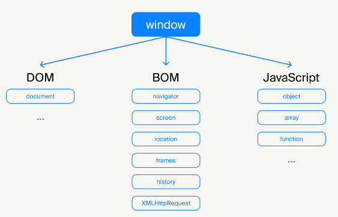
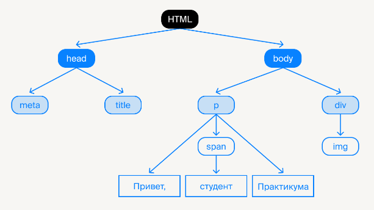
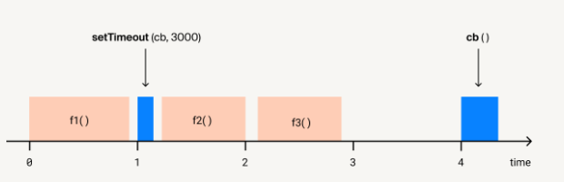
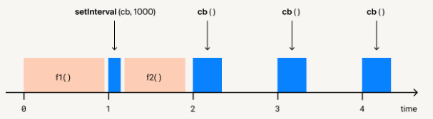

# JS краткий курс

## ВВодное

Хороший разработчик использует инструмент, а не подчиняется ему. Вы разрабатываете на JavaScript, а не на React, Vue или Angular.

## Переменные


```jsx
//Область видимости таких переменных ограничивается функцией или скриптом (если переменная глобальная)
var a = 2;

{
  var a = 3;
  console.log(a); // 3
}

console.log(a) // 3
```

ECMAScript 6 дал разработчикам инструменты для управления областью видимости на уровне блоков, то есть ключевые слова const и let
```jsx
let a = 2;

{
  let a = 3;
  console.log(a); // 3
}

console.log(a) // 2
```

Const. Когда переменная объявлена через это ключевое слово, изменить её значение уже не удастся:
```jsx
const a = 2;

a = 3 // TypeError

console.log(a) 
```

Примитивные типы данных передаются по значению, а объекты — по ссылкам. 
```jsx
{
  const ARR = [5, 6, 7];

  console.log(ARR); // [5,6,7]
  ARR = 10; // TypeError — мы не можем изменить ссылку на массив...
  ARR[0] = 3; // ...но свободно меняем элементы массива
  console.log(ARR); // [3,6,7]
}
```

Основные особенности let и const:
- let и const не существуют до своего объявления;
- область видимости let и const совпадает с блоком объявления переменной;
- нельзя объявить переменную через const и не присвоить ей значение.
- советуем отказаться от var

## Типы данных

Примитивные типы данных:
- логический (Boolean),
- числа (Number),
- большие числа (BigInt),
- строки (String),
- символы (Symbol),
- undefined,
- null.

Не примитивный тип:
- объект (Object).

Получить тип аргумента можно с помощью оператора typeof

```jsx
typeof undefined // "undefined"
typeof 0 // "number"
typeof 10n // "bigint"
typeof true // "boolean"
typeof "foo" // "string"
typeof Symbol("id") // "symbol"
typeof Math // "object" 
typeof null // "object" - результат данной операции является официально признанной ошибкой языка
typeof alert // "function"
typeof NaN; // "number"
```

Явное и неявное преобразование в JavaScript. Для приведения любого типа данных к Boolean, необязательно делать именно Boolean(someVar), достаточно !!someVar

**Числа**

Необычные примеры сравнений и вычислений
```jsx
Math.sqrt(-1);         // NaN
"не число" / 2;        // NaN
0 / 0;                 // NaN
NaN === NaN;           // false
isNaN(Math.sqrt(-1));  // true
Number.isNaN(Math.sqrt(-1)); // true
```

В JavaScript вы можете получить максимальный и минимальный 64-битный Number
```jsx
Number.MAX_VALUE; // 1.79e+308
Number.MIN_VALUE; // 5e-324, самое близкое к нулю

Number.MAX_SAFE_INTEGER;  // 2^53 - 1 или 9007199254740991
Number.MAX_SAFE_INTEGER + 1 === Number.MAX_SAFE_INTEGER + 2; // true

Number.MIN_SAFE_INTEGER;  // -(2^53 - 1) или -9007199254740991
Number.MIN_SAFE_INTEGER - 1 === Number.MIN_SAFE_INTEGER - 2; // true
        
Number.isSafeInteger(Math.pow(2, 54)); // false
Number.isSafeInteger(-Math.pow(2, 54)); // false
// всё это не поддерживается в IE
```

Особенности при вычислении чисел
```jsx
0.1 + 0.2 = 0.30000000000000004;
0.1 + 0.2 === 0.3; // false
```

BigInt — это встроенный объект, предоставляющий способ представлять целые числа больше  наибольшего числа, которое JavaScript может надёжно представить.
```jsx
const theBiggestInt = 9007199254740991n;

const alsoHuge = BigInt(9007199254740991);
// ↪ 9007199254740991n
```

**Строки**
Строки можно писать как в одинарных, так и в двойных кавычках

```jsx
const escapeCodesString = 'a\'b'; // a'b
escapeCodesString.length; // 3
        
const escapeCodesString = "a\"b"; // a"b
escapeCodesString.length; // 3

const escapeCodesString = 'a\\b'; // a\b
escapeCodesString.length; // 3

const escapeCodesString = 'a\n\tb'; // a
                                    //     b
escapeCodesString.length; // 4

// Поддерживаются все символы из Unicode
const utf8String = '中文 español English বাংলা 日本語 ਪੰਜਾਬੀ';
utf8String.length; // 35
```

Как соединить строки? Существует классический оператор +
```jsx
const concatStr = 'hello' + ' world'; // hello world

const name = 'Vasya';
const helloVasya = 'Hello, ' + name + '!'; // Hello, Vasya!
```

В ES6 появился механизм «шаблонных строк», работают быстрее, чем классическое сложение
```jsx
const name = 'Vasya';
const concatStr = `Hello, ${name}!`; // Hello, Vasya!
```

Строки — иммутабельный тип данных, то есть они неизменяемы
```jsx
const someStr = 'собака';

// Возможно обращение к символу по индексу
someStr[1]; // 'о'

// Редактирование невозможно
someStr[1] = 'и';
someStr; // 'собака'
```

При работе со строками могут помочь различные методы, которые уже существуют в строке. Но почему строка имеет методы и свойства, если строка — это не тип данных Object?

Всё просто. Разработчики языка добавили такую возможность в этот тип данных, чтобы работа со строками была в удовольствие.
```jsx
// Обрезаем строку в 135 символов до 30 символов
const longString = 'Мы с бэкенда получили очень длинный текст, 
который неудобно вставлять в интерфейс, 
и хотим обрезать часть строки, заменив конец на "..."'

let shortString = longString;

if (longString.length > 30) {
  shortString = longString.slice(0, 29) + '…';
}

shortString; // 'Мы с бэкенда получили очень д…'

const tweet = 'Мой твит #hash';

// Находим индекс первого вхождения подстроки в строке
tweet.indexOf('#hash'); // 9
// Искомая подстрока отсутствует
tweet.indexOf('#hack'); // -1
```

На строках определены также операции сравнения
```jsx
'a' === 'a'; // true

'a' < 'b';     // true
'a' < 'ab';    // true
'bar' < 'foo'; // true

'1' > '12';    // false
'2' > '12';    // true
'12' < '5';    // true
```

Примеры преобразований строки в число:
```jsx
Number('123');     // 123
Number('12.8');    // 12.8
Number('12.8  ');  // 12.8
Number('  12.8');  // 12.8
Number('   ');     // 0
Number('');        // 0
Number('12.8s')    // NaN
Number('s12.8')    // NaN

parseFloat('123');     // 123
parseFloat('12.8');    // 12.8
parseFloat('12.8  ');  // 12.8
parseFloat('  12.8');  // 12.8
parseFloat('   ');     // NaN
parseFloat('');        // NaN
parseFloat('12.8s');   // 12.8
parseFloat('s12.8');   // NaN
```

Есть ещё много полезных методов

**Операторы сравнения**

несколько операторов сравнения: == и ===
```jsx
// == – обычное сравнение
'01' == 1; // true
null == undefined; // true

// === – строгое сравнение
'1' === 1; // false
null === undefined; // false
```

## Функции

Функция — блок кода, который позволяет переиспользовать существующий код.Также это «вызываемый» объект

**Объявление функций (Function Declaration)**

Обычное объявление. Такую функцию можно вызвать до объявления — благодаря эффекту всплытия (Hoisting).
```jsx
function greet(name) {
  return `Hello ${name}`;
}

greet('Sergey'); // Hello Sergey

//////////////

greet('Sergey'); // Hello Sergey

function greet(name) {
  return `Hello ${name}`;
}
```

**Функциональные выражения (Function Expression)**

Функция будет присвоена переменной и описана без имени. Такую функцию нельзя вызвать до объявления

```jsx
const greet = function (name) {
  return `Hello ${name}`;
};

greet('Sergey'); // Hello Sergey
```

**Стрелочные функции (Arrow function)**

Существенное отличие — это контекст. У стрелочных функций нет своего this. Он берётся из верхнего окружения.

```jsx
const greet = (name) => {
  return `Hello ${name}`;
};

const greet = (name) => `Hello ${name}`;    

const greet = name => `Hello ${name}`;

//----
const test = {
	name: 'we want it',
	makeAnonFunction: function() {
	  return function() {
	    console.log(this.name);
	  };
	},
	
	makeArrowFunction: function() {
	  return () => {
	    console.log(this.name);
	  };
	}//undefined
};
```

**Аргументы функций**

В функции аргументы можно передать по ссылке и по значению.

```jsx
const message = {
  user: {
    messages: 4210
  }
};
        
function incrementCount(count) {
  count++;
}
        
incrementCount(message.user.messages);
message.user.messages; // 4210

//////////////////

//Но если передать всю ссылку на объект, как во втором случае, то после выполнения incrementCount2 можно увидеть ожидаемое увеличенное значение.
function incrementCount2(user) {
  user.messages++;
}
        
incrementCount2(message.user);
message.user.messages; // 4211


//Функции умеют принимать как заданное число аргументов, так и неопределённое.
function sumNumbers() {
  let sum = 0;

  for (let i = 0; i < arguments.length; i++) {
    sum += arguments[i];
  }

  return sum;
}

sumNumbers(1, 2, 3); // 6

//////////////////////////////////

function sumNumbers() {
  const args = Array.from(arguments); // Это старый способ получения аргументов

  let sum = 0;

  args.forEach(function (num) {
    sum += num;
  });

  return sum;
}

sumNumbers(1, 2, 3); // 6

//////////////////////////////////

function sumNumbers(...args) { // Это способ из ES6+
  return args.reduce((sum, num) => {
    return sum + num;
  }, 0);
}

sumNumbers(1, 2, 3); // 6
```

В функциях можно описывать значения по умолчанию
```jsx
function some(a, b) {
	a = a || 0;
	b = b || function() {};
}

function some(a = function() {}) {
	console.log(a);
}
some(''); // Теперь мы получим пустую строку в консоли
```

Сами функции можно передать в качестве аргументов. Именно это свойство делает их объектами высшего порядка. 
```jsx
// Выбираем только пользователей с тегами "javascript"
function filterMessagesByTag(message) {
	const {tags} = message;

  if (Array.isArray(tags) && tags.includes('javascript')) {
      result.push(message);
  }
}

// Теперь в result лежат отфильтрованные твиты
messages.forEach(filterMessagesByTag);
```

Преобразования можно выделять в целые цепочки вызовов
```jsx
let result = messages
  .filter(filterMessagesByTag)
  .map(getHTML)
  .join('\n');
```

**Особенности функций**

Может возвращать или не возвращать значение (будет неявно возвращать undefined
```jsx
function noop() {
}


function noop() {
	return undefined;
}


function noop() {
	return;
}


console.log(noop()); // undefined
```

Может быть переданы в другие функции в качестве аргумента
```jsx
// Принимаем функцию в функции как аргумент
function modifyItems(items, modify) {
	return items.map(modify); // то же самое можно записать иначе: .map(item => modify(item))
}
const numbers = [1, 2, 3, 4];


// Пример с использованием стрелочной функции
const multiplyBy2 = item => item * 2;
const doubleValues = modifyItems(numbers, multiplyBy2);
// [2, 4, 6, 8]
```

**Каррирование**

По сути это трансформация функций таким образом, чтобы они принимали аргументы не как f(a, b, c), а f(a)(b)(c)

```jsx
function getRaiser(pow) {
  return function (num) {
    return num ** pow;
  }
}

const squared = getRaiser(2);
squared(2); // 4
squared(3); // 9

const cube = getRaiser(3);
cube(2); // 8
cube(3); // 27

// Или вот так

getRaiser(2)(3); // 9
getRaiser(3)(2); // 8
```

## Массивы

В JavaScript можно объявить массив несколькими способами
```jsx
const arr = new Array();
const arr = []; // чаще всего используется такой вариант — он проще и красивее.
```

Массивы — упорядоченный набор элементов. Каждый его элемент получает номер — индекс элемента. Нумерация начинается с 0:
```jsx
let users = ['Vasya', 'Petya', 'Ivan'];
console.log(users); // ['Vasya', 'Petya', 'Ivan']
console.log(users[0]); // 'Vasya'
console.log(users[2]); // 'Ivan'’

users[1] = 'Николай';
console.log(users[1]) // 'Николай'
```

Элементы массива могут принадлежать к разным типам данных
```jsx
const someArray = ['string', 2, {c: 3}, [4, 5, 6], true, () => null];
```

**Изменение массивов**

В JS есть специальные методы, которые изменяют массив:
- push — добавляет элемент в конец массива и возвращает новую длину массива,
- pop — удаляет последний элемент массива и возвращает его значение,
- shift — удаляет элемент из начала и сдвигает в начало остальную часть массива (второй элемент станет первым, третий — вторым и так далее),
- unshift — добавляет элемент в начало массива и возвращает новую длину массива.
```jsx
const users = ['Vasya', 'Petya', 'Ivan'];

console.log(users.push('Kolya')); // 4
console.log(users); // ['Vasya', 'Petya', 'Ivan', 'Kolya']

console.log(users.pop()); // 'Kolya'
console.log(users); // ['Vasya', 'Petya', 'Ivan']

console.log(users.shift()); // 'Vasya'
console.log(users); // ['Petya', 'Ivan']

console.log(users.unshift('Vasya')); // 3
console.log(users); // ['Vasya', 'Petya', 'Ivan']
```

**Массивы как объекты**

Массив в JS — объект. К нему применимо всё, что применимо к объектам, поэтому ему можно добавить свойство.

Массивы копируются по ссылке, а не по значению. Присвоив массив другой переменной, мы получим две ссылки на одну и ту же область памяти.

**Перебор элементов**

- Цикл for..in выполняет перебор всех свойств объекта
- Цикл for..in оптимизирован под произвольные объекты

**Метод forEach**

не возвращает результат
```jsx
const arr = [1, 2, 3];

arr.forEach((item, i, arr) => {
  console.log(i, item, arr);
});
```

**Метод filter**

Возвращает новый массив
```jsx
const arr = [1, 2, 3];

const comparator = number => number < 2;

const result = arr.filter(comparator); // [1]
```

**Методы every и some**

- метод every вернёт true, если вызов колбека вернёт true для каждого элемента массива;
- метод some вернёт true, если вызов колбека вернёт true хотя бы для одного элемента массива.
```jsx
const arr = [1, 2, 3];

const checker = number => number < 2;

arr.some(checker); // true
```

**Метод map**

Метод для преобразования элементов массива. Создаёт новый массив на основе существующего.Она возвращает значение, которое станет элементом нового массива.
```jsx
const statuses = ['approved', 'rejected', 'waiting'];

statuses.map((status, index) => ({value: index, title: status})); // [{value: 0, title: 'approved'}, ...]
```

**Методы reduce и reduceRight**

Они сводят массив к какому-то одному значению: числу, массиву, объекту. Работают одинаково, только reduce перебирает элементы массива слева направо, а reduceRight — справа налево.
```jsx
const arr = [1, 2, 3, 4, 5];
let result = 0;

arr.forEach(item => {
  result += (item * item + 100); // Занимаемся какой-то логикой, нужно посчитать формулу и сумму всех элементов массива
});
console.log(result) // Здесь какой-то результат

const arr = [1, 2, 3, 4, 5];
arr.reduce((result, item) => result + (item * item + 100), 0);
```

**Необычное свойство length**

Длину массива получают через свойство length и эту длину можно изменять. Так можно укоротить массив. Это не считается «хорошей практикой», поэтому не рекомендуем использовать этот способ.

```jsx
const arr = [1, 2, 3, 4, 5];
console.log(arr.length); // 5
arr.length = 3;
console.log(arr); // [1, 2, 3], вернуть длину 5 уже не сможем, будет undefined у элементов
```

## Объекты

Объекты в JavaScript представляют собой хранилище более сложных сущностей. Данный инструмент является одной из основ языка.

```jsx
// Пустой объект
const obj = {};

// Присвоение значения свойства через точечную нотацию
obj.propName = 'foo'; // { propName: 'foo' }
// Получение значения свойства через точечную нотацию
obj.propName; // 'foo'

// Удаление свойства (пользоваться аккуратно)
delete obj.propName;

console.log(obj); // {}
```

Если же ваша цель «обнулить» значение, то воспользуйтесь присваиванием null или undefined
```jsx
const users = ['Tanya', 'Olga', 'Simon', 'Dima']

// Вот так безопаснее:
users[3] = null; // Или undefined
```

Объект может содержать другие объекты, массивы и иные типы данных
```jsx
const someKey = 'surname';

// Объект с предопределённым набором свойств
const message = {
  id: '228',
  text: 'Привет, Вася.\r\nКак дела?',
  user: {
    id: 42,
    name: 'Николай',
    login: 'nikolashka',
		[someKey]: 'Петров',
  },
  'start-year': 2007,
};
message.id; // '228'
message.user.name; // 'Николай'
// Получение значения свойства через квадратные скобки
message['i' + 'd']; // '228'
// Обращение к ключу, содержащему '-'
message['start-year']; // 2007
// Можно делать ключом другую переменную
message.user.surname; // Петров
```

Очень важно уметь итерироваться по ключам объекта. Для этого используют метод Object.keys
```jsx
const keys = Object.keys(message);
console.log(keys); // ['id', 'text', 'user', 'start-year']

const someParams = keys.reduce((result, key) => ([
  ...result,
  {[message[key]]: key},
]), []);
/*
[
	{228: "id"},
	{"Привет, Вася. ↵Как дела?": "text"},
	{[object Object]: "user"},
	{2007: "start-year"},
]
*/
```

- values возвращает значения свойств массива,
- entries возвращает и ключи, и значения.
```jsx
Object.values(message); // ["228", "Привет, Вася.↵Как дела?", {…}, 2007]
Object.entries(message); // [["id", "228"], ["text", "Привет, Вася.↵Как дела?"], ...]
```

Можно проверить наличие свойства у объект.Важное отличие метода hasOwnProperty от оператора in заключается в том, что первый не проверяет существование в цепочке прототипов объекта.Оператор in не умеет различать свойства самого объекта и унаследованные от прототипа
```jsx
function Message() {}

Message.prototype.send = function(user, text) {
	this.isSent = true;
	this[user] = text;
};

const message = new Message();

message.send('Olga', 'You are the best!');

// В консоли увидим следующее:

'Olga' in message; // true
'Not found' in message; // false
'send' in message; // true

//_____
function Message() {}

Message.prototype.send = function(user, text) {
	this.isSent = true;
	this[user] = text;
};

const message = new Message();

message.send('Olga', 'You are the best!');

// В консоли увидим следующее:
message.hasOwnProperty('Olga'); // true
message.hasOwnProperty('Not found'); // false
```

Теперь увидим ожидаемое поведение — send не включается. Потому нужно быть осторожными, делая перебор через for..in. Нужно знать основные отличия for..in от for..of. И внутри for..in проверять — является ли свойство унаследованным от прототипа или нет, иначе можно получить багу из-за незнания, как работает инструмент:
```jsx
for (let key in obj) {
	if (obj.hasOwnProperty(key)) { /* logic */ }
}
```

**Квиз**
```jsx
//Что будет выведено в консоль?
function foo() {
  let user = admin = 'Иннокентий';
  return user;
}

foo();
console.log(typeof user);
//+) undefined, string
//Мы неявно объявили глобальную переменную. Поскольку интерпретатор JS не нашел её объявление ни в функции foo, ни вне её, она стала свойством window. Попробуйте вывести в консоль window.admin или просто admin, и вы увидите Иннокентия. А вот переменная user явно объявлена в функциональной области видимости, а значит к ней нельзя получить доступ извне функции foo.
```

```jsx
//Что будет выведено в консоль?
let user = { name: 'Соня' };
let newUser;

newUser = user;
user.name = 'Софья Петровна';

console.log(newUser.name);
//+ 'Софья Петровна - На самом деле переменные user и newUser хранят ссылки на один и тот же объект

let a = '42';
let b = new String(42);

console.log(a == b)
console.log(a === b)
//true, false

let number = 0;
console.log(number++);
console.log(++number);
console.log(number);
//+ 0, 2, 2
//постфиксный инкремент. Он сначала вернул текущее значение, а потом увеличил его на единицу. На этом шаге значение всё ещё 0
//Постфиксный инкремент увеличил значение на единицу, а значит number уже равен 1

function checkAnimal(data) {
  if (data === { animal: 'Кот' }) {
    console.log('Это кот');
  } else if (data == { animal: 'Кот' }) {
    console.log('Всё ещё кот');
  } else {
    console.log('Я таких животных не знаю');
  }
}
checkAnimal({ animal: 'Кот' });
//+) 'Я таких животных не знаю'
//Объекты, в отличии от примитивов, сравниваются по ссылкам. Объект, который мы передали в качестве аргумента, и тот, что внутри функции, хранятся в разных местах в памяти, а значит их ссылки не равны.

function getName(...args) {
  console.log(typeof args);
}
getName('Иннокентий');
//+ 'object' массив — это объект

0;
new Number(0);
'';
' ';
new Boolean(false);
undefined;
//+ 0, '', undefined , Строка ' ' не falsy, поскольку там есть пробел. Функции-конструкторы — это truthy значения.

console.log(typeof typeof 0);
//+ 'string' - Сначала typeof 0 вернёт 'number', дальше typeof 'number' вернёт 'string'

function addToList(item, list) {
  return list.push(item);
}
const result = addToList('стул', ['стол']);
console.log(result);
//+ 2А всё потому, что метод push возвращает не сам новый массив, а его длину.

//Это чистая функция?
function sum(a, b) {
  return a + b;
}
//(+) Да , Чистая функция всегда возвращает тот же результат. Если вы вызовете функцию sum c аргументами 1 и 2, а потом вызовете её с теми же аргументами ещё десять раз, у вас будет тот же результат — 3

//Какой из перечисленных способов модифицирует объект user?
const user = {
  name: 'Иннокентий',
  role: {
    admin: true
  },
};
Object.freeze(user);
//(+) user.role.admin = false ,Object.freeze «замораживает» объект только поверхностно, то есть на вложенные объекты «заморозка» не распространяется.

const arr = [1, 2, 3];
const anotherArr = arr;
arr.length = 0;
console.log(arr, anotherArr);
//+ [], [] , Указав, что длинна массива равна нулю, мы по сути его опустошили. Поскольку массив — это фактически объект, он копируется по ссылке, поэтому изменения в arr повлияли на anotherArr.

let obj1 = {
	value: 1
};
let obj2 = obj1;
obj2 = {};
console.log(obj1);
//Объекты копируются по ссылке, то есть переменные obj1 и obj2 ссылаются на один и тот же объект, который хранится в памяти. Когда мы присвоили переменной obj2 пустой объект, она начала ссылаться уже на него, что не повлияло на obj1.

let firstArr = [{ name: 'Соня' }, 2];
let secondArr = firstArr.slice();
secondArr[0].name = 'Софья Петровна';
secondArr[1] = 200;
console.log(firstArr);
//+) [{ name: 'Софья Петровна' }, 2] , Метод slice без аргументов создал новый массив c такими же элементами, как в firstArr. Поэтому изменение второго элемента в secondArr не повлияло на firstArr и там всё так же 2. Но slice создал только поверхностную копию, так что значение name изменилось в обоих массивах.

function foo() {
	bar()
	return;
  
	function bar() {
		console.log(typeof bar);
	}
}
foo();
//(+) 'function', Здесь необходимо вспомнить особенность Function Declaration (объявления функции). Такую функцию можно использовать до её объявления, потому что когда движок JS ещё только готовится выполнить код, он ищет Function Declaration и создаёт их. То есть на этапе подготовки к выполнению foo, движок нашел функцию bar и создал её, поэтому она доступна до return

const objA = new Object({foo: 'foo'});
const objB = new Object({foo: 'foo'});
console.log(objA == objB);
console.log(objA === objB);
//+ false, false, Объекты хранятся и копируются по ссылке. В условии объекты выглядят одинаково, но по факту они ссылаются на разные области памяти, а значит не равны. Примитивы в свою очередь сравниваются по значению
const foo = 'Я строка';
const bar = 'Я строка';
console.log(foo == bar);
console.log(foo === bar);
(-) true, false

const objA = {
  name: 'Иннокентий'
};
const objB = objA;
objB.name = 'Соня';
delete objA.name;
console.log(objA.name);
console.log(objB.name);
//+ undefined, undefined, Объекты были скопированы по ссылке, то есть указывают на одну и ту же область памяти. Удалив ключ name в objA, мы удалили его также и для objB

const arr = [10, 1, 9, 100];
arr.sort();
console.log(arr);
//+ [1, 10, 100, 9] ,Почему результат сортировки выглядит так, будто что-то пошло не так? На самом деле метод отсортировал элементы, но сначала преобразовал их в строки, а потом расставил в порядке следования кодовых символов Unicode. Если нужно задать определенный порядок сортировки, важно в качестве аргумента передать методу sort колбэк.
```

## DOM API

В JavaScript есть специальный объект, который содержит все глобальные переменные и функции. Это «глобальный объект»:
- в NodeJS это global,
- в браузере — window и this, который ссылается на window в глобальной области видимости.

Все глобальные переменные и функции — это его свойства. То есть присваивая или читая глобальную переменную, мы работаем со свойствами глобального объекта.

Существует несколько видов объектов:
- Нативные — поведение и свойства которых описаны в спецификации языка и не зависят от окружения: Object, Array, Date, eval.
- Хост-объекты — которые предоставляются окружением. В браузере это document, location, setInterval. В NodeJS — process.

**BOM**


BOM (Browser Object Model) — объекты, методы и свойства для работы с браузером:
- navigator — информация о браузере,
- location — информация про адресную строку и различные свойства,
- history — возможность работать с переходами и историей переходов,
- screen — информация об экране пользователя,
- стандартные функции alert, prompt или XMLHttpRequest.

**DOM**

DOM (Document Object Model) — интерфейс (API) для HTML или XML документов.

DOM представляет документ в виде дерева. Это проводник от веб-страницы до JavaScript, который позволяет изменять контент, стили и структуру документа.

```html
<!DOCTYPE html>
<html>
	<head>
		<meta name="description" content="description">
		<title>Title</title>
	</head>
		<body>
		<p>Привет, <span>студент</span> Практикума</p>
		<div>
			
		</div>
	</body>
</html>
```



Типы узлов
В DOM 12 видов узлов. Основные из них:
- document,
- теги,
- текст,
- комментарии.

**Зачем нужен DOM**

Он нужен, чтобы производить манипуляции над страницей:
- читать информацию из HTML,
- создавать элементы,
- изменять элементы,
- удалять элементы.

```js
document; // Хост-объект
document.documentElement; // узел HTML
document.header // узел HEAD
```

## Работа с узлами

**Перебор узлов**

```js
element.parentNode // родитель
 
element.childNodes // дочерние ноды
element.firstChild // первый ребёнок
element.lastChild // последний ребёнок
 
document.previousSibling // предыдущий «сосед»
document.nextSibling // следующий «сосед»

//находит элемент с заданным идентификатором ноды,
//возвращает первый найденный элемент,
//возвращает null, если элемент не найден
document.getElementById('id')
```

В общем случае для поиска и управления элементами используйте классы.
- находит элемент с соответствующим классом,
- метод определён у любого элемента,
- возвращает коллекцию.
```js
<div class="hello">
 <div class="greeting">Hello everybody!</div>
 <div class="greeting">Aloha</div>
</div>
<div class="greeting">Привет</div>

document.getElementsByClassName('greeting'); // 3 элемента
const parent = document.getElementsByClassName('hello')[0];
parent.getElementsByClassName('greeting'); // 2 элемента
```

document.getElementsByTagName('tag'):
- находит элемент с соответствующим тегом,
- метод определён у любого элемента,
- возвращает коллекцию.
```jsx
<div>
 <span>Hello everybody!</span>
 <span>Aloha</span>
</div>
<span>Goodbye</span>

document.getElementsByTagName('span'); // 3 элемента
const parent = document.getElementsByTagName('div')[0];
const elems = parent.getElementsByTagName('span'); // 2 элемента
```

document.querySelectorAll('selector'):
- можно работать с псевдоселекторами (:hover, :first-child…),
- возвращает коллекцию,
- выбрасывает исключение при невалидном селекторе.
```jsx
<div class="container">
 <div>Hello everybody!</div>
 <div>Aloha</div>
</div>
<div class="container">
 <div>Goodbye</div>
 <div>Aloha</div>
</div>

document.querySelectorAll('.container div:first-child');
// NodeList [ <div>Hello everybody!</div>, <div>Goodbye</div> ]
```

document.querySelector('selector'):
- возвращает первый найденный элемент по заданному селектору,
- выбрасывает исключение при невалидном селекторе.
```jsx
<div class="greeting">Goodbye</div>
<div class="container">
 <div class="greeting">Hello everybody!</div>
 <div class="greeting">Aloha</div>
</div>

document.querySelector('.greeting');
// <div class="greeting">Goodbye</div>
document.querySelector('.container .greeting');
// <div class="greeting">Hello everybody!</div>
```

closest('selector'):
- возвращает ближайший родительский элемент (или сам элемент), который соответствует заданному CSS-селектору,
возвращает null, если нет элемента, который соответствует селектору,
- при невалидном селекторе выбрасывает исключение,
- недоступен в IE и старых версиях браузеров.
```jsx
<div id="block" title="Я - блок">
 <a href="#">Я ссылка в никуда</a>
 <a href="http://site.ru">Я ссылка на сайт</a>
 <div>
 <div id="too"></div>
 </div>
</div>

const div = document.querySelector("#too");
div.closest("#block"); //<div id="block" title="Я - блок">
div.closest("div"); //Сам <div id="too">
div.closest("a"); //null
```

**Создание элементов**

```jsx
document.createElement(tag) // создаёт элемент с тегом tag
document.createTextNode(value) // создаёт текстовый узел
element.cloneNode(deep) // клонирует элемент
 
parent.appendChild(el) // вставляет узел в конец
parent.removeChild(el) // удаляет узел
parent.replaceChild(newEl, oldEl) // заменяет узел
parent.insertBefore(elem, nextSibling) // вставляет узел
```

## Свойства элементов

У DOM-элементов можно узнать, к какому типу принадлежит узел
- 1 — ELEMENT_NODE,
- 3 — TEXT_NODE

<div id="container"><span>Привет всем!</span>Aloha!</div>

```jsx
const container = document.getElementById('container');
console.log(container.firstChild.nodeType); // 1
console.log(container.lastChild.nodeType); // 3 
```

У примера выше есть подвох. Если внутри div перенести элемент span на новую строчку, то первый console.log вернёт 3. Почему? Потому что переносы строк и пробелы будут восприниматься как текст. Будьте внимательны.

У элемента есть ещё два важных свойства — tagName, innerHTML:
```jsx
<h1>Ссылка: <a href="/">тут</a></h1>
element.tagName // имя тега
h1.tagName // "H1"
```

Основные особенности других свойств:

- node.tagName:возвращает HTML-тег в UPPERCASE,
работает только для элемента.

- node.nodeName:для элемента вернёт tagName в UPPERCASE,
для типа узла TEXT_NODE — строку #text.

- element.innerHTML: вернёт содержимое в виде строки,
доступны как геттер, так и сеттер,
всегда только перезаписывается,
если в innerHTML добавят тег script — он не выполнится.

- element.outerHTML:содержит HTML-элемент целиком,
при записи в DOM — исходный элемент заменяется на новый,
изменить outerHTML элемента невозможно.

```jsx
let div = document.querySelector('div');
console.log(div); // <div>Привет</div>

div.innerHTML = 'Hi!'
console.log(div); // <div>Hi!</div>

div.outerHTML = '<h1>Aloha</h1>'
console.log(div) // <div>Hi!</div>
```

- data.nodeValue: содержимое узла или комментария,
можно изменить,
у некоторых типов узлов значение равно null — вопреки ожиданиям.

```jsx
console.log(document.firstChild.data); // Комментарий
console.log(document.firstChild.nodeValue); // Комментарий

console.log(document.lastChild.data); // undefined
console.log(document.lastChild.nodeValue); // null
```

- textContent: безопасный способ добавить текст — в большинстве случаев лучше использовать его.
```jsx
//<h1>Ссылка: <a href="/">тут</a></h1>
element.textContent // Содержит только текст внутри элемента без тегов
h1.textContent // "Ссылка: "
```

Не используйте innerHTML для вставки контента. Этот способ откроет в приложении XSS-уязвимость. Если innerHTML необходим, не забудьте экранировать символы. 

**Атрибуты**

```jsx
element.hasAttribute(name) // проверяет наличие атрибута
element.getAttribute(name) // получает значение атрибута
element.setAttribute(name, value) // устанавливает атрибут
element.removeAttribute(name) // удаляет атрибут
 
elem.attributes // получить все атрибуты
```

Атрибут hidden может принимать следующие значения:
- true — элемент не виден на экране,
- false — элемент виден на экране.

Для работы с классами используются следующие методы:
- className — возвращает класс в виде строки,
- classList — возвращает объект для работы с классами,
- classList.[add/remove] — добавить/удалить класс,
- classList.toggle — переключает класс,
- classList.contains — проверяет, есть ли класс.

В атрибуты можно добавить дополнительную информацию, которую удобно было бы передавать через DOM. Например, состояния дополнительного элемента или значения, которые можно получить позже. Для этого пользуются дата-атрибутами — data-*:
```html
<div data-chat-id="123" data-some-meta="meta-info"></div>
```
все data-* атрибуты доступны в объекте dataset,
префикс data- отбрасывается, оставшаяся часть трансформируется в camelCase. Так data-user-location доступен в element.dataset.userLocation.

## Эффективность методов DOM

DOM-дерево — сложная структура данных с множеством процессов и обработчиков. Каждый раз залезать в него — очень медленная операция. А если делать это в цикле с большим количеством элементов, можно получить критическую ошибку

**Оптимизации**

- Уменьшить число вызовов записи к DOM

Можно делать обновления небольшими порциями. Например, при вставке использовать фрагменты, которые добавляются в структуру данных JavaScript, и только после завершения цикла — вставить их в DOM:

```jsx
const fragment = document.createDocumentFragment();
for(let i = 0; i < 1000; i++){
  const element = document.createElement('div');
  fragment.appendChild(element);
}
document.body.appendChild(fragment);
```

- Не перестраивать постоянно DOM

Удаление узлов из DOM-дерева — тоже тяжеловесная операция. Если постоянно комбинировать её со вставкой, этого будет достаточно, чтобы браузер начал тормозить.

Подобные вещи решаются через CSS. Компонентам понадобится класс hidden, который будет их скрывать:

```css
.button__visible-hidden {
	display: none;
}
```
Такой класс можно переключать с помощью DOM API и метода toggle

- Мемоизация

Данный инструмент представляет собой механизм кеширования

```js
const result = someHardFunction(1, 2); // Супердолгие вычисления 
const result1 = someHardFunction(3, 4); // Супердолгие вычисления
const result3 = someHardFunction(1, 2); // Вычислений вообще не будет
```

```js
Что будет выведено в консоль?
<div class="block">Привет, я блок!</div>

console.log(document.getElementsByClassName("block"))
//(+) Псевдомассив с одним элементом.Если быть точнее, то метод getElementsByClassName вернёт HTMLCollection. Эта коллекция похожа на массив только структурой (есть length и элементы хранятся в индексах), но из-за отличий в прототипе у неё нет методов массива. Интересно, что метод document.querySelectorAll(".block")) тоже вернёт псевдомассив, но это уже будет NodeList. У него помимо длинны и индексов есть ещё, например, метод forEach. Так что псевдомассивы тоже могут отличаться.

//Что является «входной точкой» DOM?
//(+) document

//А DOM от BOM?
//(+) DOM даёт возможность работать с содержимым документа, а BOM — с браузером (окружением)

// Чем HTML-код отличается от DOM?
// (+) HTML — это просто разметка, а DOM — объектное представление HTML-документа
```

## Типы данных II

Можно сделать методы, которые возвращают этот же объект, и мы сможем сразу обратиться к его следующему свойству. Такой способ называется «цепочка

```jsx
const chat = {
	messages: 1042,
	get: function () {
		console.log(this.messages);
		return this;
	},
	set: function (value) {
		this.messages = parseInt(value) || 0;
		return this;
	},
};

chat.get().set(42).get(); // 1042 42
```

**Преобразования объектов**

//Объекты имеют свойство .toString(), которое приведёт данные к строке. Метод можно переопределя
```jsx
const chat = {
	messages: 1042,
	...
};

console.log(chat.toString()); // '[object Object]'

//////

const chat = {
	messages: 1042,
	toString: function () {
		return `Custom string with data: ${this.messages}`;
	},
	...
};

console.log(chat.toString()); // 'Custom string with data: 1042'
console.log(String(chat)); // 'Custom string with data: 1042'
console.log('' + chat); // 'Custom string with data: 1042'

//////

const array = [1, 2, 3];

console.log(array.toString()); // '1,2,3'
```

Приведение объекта к Boolean всегда выдаст true:
```jsx
if (chat) {
	console.log('I\'m here'); // мы попадём сюда
}
```

**Метод defineProperty**

Этот метод управляет дескрипторами данных или доступа
- Дескриптор данных — это свойство, имеющее значение, которое может быть (а может и не быть) записываемым
- Дескриптор доступа — это свойство, описываемое парой функций — геттером и сеттером

Object.defineProperty(obj, prop, descriptor)
- obj — объект, для которого определяется свойство,
- prop — имя свойства,
- descriptor — дескриптор свойства

```jsx
const chat = {};

Object.defineProperty(chat, 'title', {
	value: 'Chat name 1',
	writable: true,
	enumerable: true,
	configurable: true
});

console.log(chat.title); // 'Chat name 1'

// Пример добавления свойства к объекту через defineProperty() 
// с дескриптором доступа
let messagesCount = 42;
Object.defineProperty(chat, 'messages', {
	get: () => messagesCount,
	set: newMessagesCount ⇒ {
    messagesCount = newMessagesCount
},
	enumerable: true,
	configurable: true
});
console.log(chat.messages); // 42

// Нельзя скрестить оба подхода
Object.defineProperty(chat, 'error', {
	value: [1, 2, 4],
	get: () => [1, 2, 3],
});
// Будет исключение TypeError: свойство value применимо только в 
// дескрипторах данных, свойство get применимо только в дескрипторах 
// доступа
```

Свойство writable метода defineProperty определяет, сможет ли разработчик напрямую изменить значение. С его помощью создают полноценные приватные свойства.Существует интересный метод «заморозки» объекта, который тоже реализует такое поведение
```jsx
const chat = {
	messages: 1042,
};

Object.isFrozen(chat); // false
Object.getOwnPropertyDescriptor(chat, 'messages');
// { value: 1042,
// writable: true,
// enumerable: true,
// configurable: true }

Object.freeze(chat);
Object.isFrozen(chat); // true

Object.getOwnPropertyDescriptor(chat, 'messages');
// { value: 1042,
// writable: false,
// enumerable: true,
// configurable: false }

chat.messages = 11;
chat.messages; // 1042
delete chat.messages; // false


//____
//Похожий результат можно получить через IIFE — самовызывающуюся функцию
const obj = (function () {
	let __private = null;

	return {
		updateValue: newValue => {
			__private = newValue;
		},
		getValue: () => __private,
	};
})();

console.log(obj.__private); // undefined
obj.updateValue(11);
console.log(obj.getValue()); // 11
obj.__private = 43; //Будет добавлено свойство __private, но локальная переменная let __private не изменится. Таким образом, результат вызова метода getValue() останется прежним
console.log(obj.getValue()); // 1
```

**Date**

Разработчики часто преобразуют и форматируют даты, но при этом возникают сложности. Специальный объект Date не решает всех задач, поэтому используют «обёртки», такие, как, например, Moment.js. В основе их работы — тот же Date.

## ES6+

**Область видимости**

Как рассказывали в предыдущих темах — добавились ключевые слова let и const.

```jsx
console.log(typeof first); // undefined
console.log(typeof second); // undefined
 
var first = 'foo';
if (false) {
  var second = 42;
}
if (true) {
  let second = 42;
}
console.log(typeof first);  // ReferenceError
console.log(typeof second);  // ReferenceError
 
const first = 'foo';
first = 'baz';  // TypeError
```

**Шаблонные строки и Unicode**

```jsx
const name = 'Vasya';
const concatStr = `Hello, ${name}!`; // Hello, Vasya!

const getFullName = name => `${name} Pupkin`;
const concatStr = `Hello, ${getFullName('Vasya') + ' Petrov'}!`; // Hello, Vasya Pupkin Petrov!
// Unicode support
console.log('😀'.length); // 2
console.log('\u{1F600}'); // 😀
console.log('\uD83D\uDE00'); // 😀

const моя_переменная = {
	имя: 'Dima',
	статус: 'онлайн',
};
```

**String.prototype.replaceAll()**

Этот метод появился в ES12.

const p = 'Ярослав и Ярославна поселились в Ярославле. В Ярославле живут славно Ярослав и Ярославна.'

```jsx
p.replaceAll('Ярославле', 'Питере')
// Ярослав и Ярославна поселились в Питере. В Питере живут славно Ярослав и Ярославна.
```

**Стрелочные функции**

```jsx
const greet = (name) => {
  return `Hello ${name}`;
};

const greet = (name) => `Hello ${name}`;    

const greet = name => `Hello ${name
```

**Параметры по умолчанию**

```jsx
const greet = (name = 'Colin') => `Hello, ${name}`;
greet(); // 'Hello, Colin'
```

**Операторы логического присваивания**

```jsx
// Присвоить значение только если переменная слева равна null или undefined

let a = null;
a ??= 'Привет'; // Привет

// Присвоить значение только если значение в переменной слева истинно (truthy)

let a = 'яблоки';
a &&= 'груши'; // груши

let b = '';
b &&= 'груши'; // ''

// Присвоить значение только если значение в переменной слева ложно (falsy)

let a = 'яблоки';
a ||= 'груши'; // яблоки

let b = '';
b ||= 'груши'; // груши
```

**Разделители разрядов**

```jsx
const number = 100_000_000_000; // 100000000000
```

**spread и rest**

```jsx
// spread

function foo(x, y, z) {
  console.log(x, y, z); // 1 2 3
}

const arr = [1, 2, 3];
foo(...arr); // 1 2 3
// rest

function bar(...args) {
  console.log(args); 
}

bar(1, 2, 3, 4, 5); // [1, 2, 3, 4, 5]
```

**Дополнение к литералам объекта**

```jsx
const fieldName = 'user';

const chat = {
	[`${fieldName}Name`]: 'Farell',
};

console.log(chat.userName); // 'Farell'
```

**Дополнительные методы объекта**

```jsx
Object.is(value1, value2);
 
Object.is(1, 1);              // true
Object.is(1, '1');            // false
Object.is(false, false);      // true
Object.is({a: 42}, {a: 42});  // false
 
Object.is(NaN, NaN);    // true   (NaN === NaN) === false
Object.is(0, -0);       // false  (-0 === 0) === true
```

**Деструктуризация**

```jsx
function foo() {
  return [1, 2, 3];
}
let arr = foo(); // [1,2,3]

let [a, b, c] = foo();
console.log(a, b, c); // 1 2 3

function bar() {
	return {
	  x: 4,
	  y: 5,
	  z: 6
	};
}
let { x: a, y: b, z: c } = bar();
console.log(a, b, c); // 4 5 6
```

**for...in и for...of**

```jsx
let users = [1, 2, 3];
users.some = {a: 2};

for (let key in users) {
  console.log(key); // 0, 1, 2, some. В выдачу попали не только элементы массива, но и свойства.
}

for (let key of users) {
  console.log(key); // 1, 2, 3
}
```

**ООП**

В ES6 появились классы:

```jsx
class User {
  constructor(login, password) {
    this._login = login;
    this._password = password;
  }

  hello() {
    console.log(`Hello, ${this._login}`);
  }

	get login() { 
		return this._login; 
	}

  set password(value) {
	  this._password = value;
  }
}

const user1 = new User('Dom', 'furious');
const user2 = new User('Axe', 'billions');
 
user1.password = 'pswd228'; // Изменили пароль

user1.hello(); // Hello, Dom
user2.hello(); // Hello, Axe
```

**Новый тип данных Symbol**

```jsx
const chatId1 = Symbol('chat_id1');
const str = 'chat_id1';
const chatId2 = Symbol('chat_id1');

console.log(chatId1 === str); // false
console.log(chatId1 === chatId2); // false, так как все символы уникальны
console.log(chatId1); // Symbol(chat_id1)
```

**Promise**

```jsx
function request(url) {
	return new Promise((resolve, reject) => {
	  const xhr = new XMLHttpRequest();
	  xhr.open('GET', url, true);
	  xhr.onreadystatechange = function () {
	    if (xhr.readyState === 4) {
        resolve(JSON.parse(xhr.responseText));
	    }
	  }
	}
}
const user = new Promise((resolve, reject) => {  
  resolve({name: 'Simon'});
});

user.then(({name}) => `Привет, ${name}`)
 .then(str => `${str}!`)
 .then((str) => console.log(str)) // Привет, Simon!
```

**Итераторы и генераторы**

- value — значение массива,
- done — boolean значение, которое показывает последний ли это элемент в массиве.

```jsx
const arr = [11, 12, 13];
const itr = arr[Symbol.iterator]();

itr.next(); // { value: 11, done: false }
itr.next(); // { value: 12, done: false }
itr.next(); // { value: 13, done: false }

itr.next(); // { value: undefined, done: true }


const range = {
  from: 1,
  to: 5,
};

// 1. Вызов for..of сначала вызывает эту функцию
range[Symbol.iterator] = function() {

  // ...она возвращает объект итератора:
  // 2. Далее, for..of работает только с этим итератором, запрашивая у него новые значения
  return {
	  current: this.from,
    last: this.to,

    // 3. next() вызывается на каждой итерации цикла for..of
    next() {
      // 4. Он должен вернуть значение в виде объекта {done:.., value :...}
      if (this.current <= this.last) {
        return { done: false, value: this.current++ };
      } else {
        return { done: true };
      }
    }
  };
};

// Теперь работает!
for (let num of range) {
  console.log(num); // 1, 2, 3, 4, 5
}

//-------------
function* fibonacci(n = null, current = 0, next = 1) {
  if (n === 0) {
    return current;
  }

  let m = n !== null ? n - 1 : null;

  yield current;
  yield *fibonacci(m, next, current + next);
}
```

**async и await**

Генераторы и async / await можно применять к промисам.
```jsx
async function request(url) {
  const response = await fetch(url, {method: 'GET'});
  if (response.statusCode !== 200) {
    throw new Error(`Can not load json ${url}`);
  }
  const json = await response.json(); // Не очень хорошо делать return await code(); 
																			// Об этом в следующих спринтах
  return json;
}

///////////////

for await (const source of data) {
  console.log(source)
}
```

**Коллекции Map, Set**

```jsx
const map = new Map();
map.set(key, value);   // добавить значение
map.get(key);          // получить значение
map.has(key);          // проверить наличие ключа
map.delete(key);
map.clear(); 
map.size;              // размер Map
map.forEach(callback); // перебор ключей, свойств, значений
map.values();     
map.keys();   
map.entries()

const set = new Set();
set.add(value);          // добавить значение
set.has(value);          // проверить наличие значения
set.delete(value);   
set.clear(); 
set.size;              // размер Set
set.forEach(callback); // перебор ключей, свойств, значений
set.values();      
set.keys();   
set.entries();
```

**Оператор возведения в степень**

```jsx
console.log(2 ** 3);     // 8
console.log(81 ** 0.5);  // 9
```

**Полифиллы**

Полифилл — библиотека, которая добавляет в старые браузеры функциональность современных браузеров. Например, реализацию метода массива some.
```jsx
if (!Array.prototype.some) {
  Array.prototype.some = function(fun, thisArg) {
    'use strict';

    if (this === null) {
      throw new TypeError('Array.prototype.some called on null or undefined');
    }

    if (typeof fun !== 'function') {
      throw new TypeError();
    }

    const t = Object(this);
    const len = t.length >>> 0;

    for (let i = 0; i < len; i++) {
      if (i in t && fun.call(thisArg, t[i], i, t)) {
        return true;
      }
    }

    return false;
  };
}
```

**Транспайлинг**

Самый популярный и мощный компилятор JavaScript кода — Babel.
```jsx
// до
const f = num => `${num} в квадрате это ${num ** 2}`;
 
// после
var f = function (num) {
  return num + ' в квадрате это ' + Math.pow(num, 2);
};
```

## Замыкания

У каждой функции или блока кода есть скрытый объект, который содержит локальные переменные, ссылку на лексическое окружение внешней функции или блока кода и другую информацию. Объект лексического окружения состоит из двух частей:

Environment record — это объект, в котором содержатся локальные переменные и значение this как свойства,
ссылки на внешнее лексическое окружение.

Замыкание — это способность функции «запоминать» то лексическое окружение, в котором она была объявлена

**Замыкания «на пальцах»**

Это будет работать, но кажется, что не очень удобно каждый раз указывать метод. Перепишем httpRequest так, чтобы была возможность указать метод единожды, а дальше указывать только адреc.

Теперь лексическое окружение функции httpRequestBuilder не будет очищено из памяти до тех пор, пока существует функция getHttpRequest. Вы создали замыкание.
```jsx
function httpRequestBuilder(method) {
	return (url) => {
		// Реализация функции
	}
}

const getHttpRequest = httpRequestBuilder('get');

getHttpRequest('http://example.com');
getHttpRequest('http://example2.com');
getHttpRequest('http://example3.com');
```

**Внешние переменные**

```jsx
function sum(a) { // 3
  return function(b) { // 6
    return a + b;
		// LE = {b: 6}
		// .[[Scope]] = {a: 3}
  }
} // LE = {a: 3}
// sum.[[Scope]] = window
```

**Порядок инициализаци**

```jsx
// LE = {logger: func, func1: undefined, func2: undefined}
// func1 и func2 ещё не определены и при вызове до объявления будет выброшено исключение
logger(); // logger
func1(); // ReferenceError: Cannot access 'func1' before initialization
func2(); // Сюда не дойдёт из-за ошибки в func1
				 // Но если бы дошло, получили бы такую же ошибку
				 // ReferenceError: Cannot access 'func2' before initialization

function logger() {
  console.log('logger');
}

const func1 = () => {
  console.log('func1');
};

const func2 = function() {
  console.log('func2');
};
```

Если кратко, то замыкание — это лексическое окружение функции и принципы работы языка с этим лексическим окружением. Немного неточно называть замыкание «функцией» с внешними переменными.

## ООП

Создание экземпляра функции:

```jsx
function User(name) {
  this.sayHi = function() {
    console.log(`Hello, ${name}`);
  };
}

const petrov = new User('Петров');
petrov.sayHi(); // Hello, Петров
```

А теперь напишем класс с применением ключевого слова class:
```jsx
class Person {
  constructor(firstName, lastName) {
    this.firstName = firstName;
    this.lastName = lastName;
  }

  getFullName() {
    return `${this.firstName} ${this.lastName}`;
  }
}

let person = new Person('Dan', 'Abramov');
person.getFullName(); // "Dan Abramov"
person.firstName; // "Dan"
person.lastName; // "Abramov"

class User extends Person {
  constructor(firstName, lastName, email, password) {
    super(firstName, lastName);
    this.email = email;
    this.password = password;
   }

   getEmail() {
     return this.email;
   }

   getPassword() {
     return this.password;
   }
}

console.log(typeof User); // function
console.log(User === User.prototype.constructor); // true

let user = new User('Dan', 
  'Abramov', 
  'dan@abramov.com', 
  'iLuvES6'
);

user.getFullName(); // "Dan Abramov"
user.getEmail(); // "dan@abramov.com"
user.getPassword(); //> "iLuvES6"
user.firstName; // "Dan"
user.lastName; // "Abramov"
user.email; // "dan@abramov.com"
user.password; // "iLuvES6"
```

Как и у объектов, у классов есть «геттеры» и «сеттеры»:
```jsx
class User {
	somePrefix = 'Username';

  constructor(name) {
    // вызывает сеттер
    this.name = name;
  }

  get name() {
    return `${this.somePrefix}: ${this._name}`;
  }

  set name(value) {
    if (value.length < 4) {
      console.log('Имя слишком короткое.');
      return;
    }
    this._name = value;
  }

}

let user = new User('Иван');
console.log(user.name); // Username: Иван

user = new User(''); // Имя слишком короткое.
```

## Прототипы

 Объект, на который указывает ссылка в [[Prototype]], называется прототипом.

Если у объекта отсутствует собственный метод — интерпретатор ищет его в прототипе. Поиск будет идти до тех пор, пока интерпретатор не встретит null в поле [[Prototype]].

```jsx
const message = {
	send(text) { }
};
const textMessage = {
	formatter() {},
	[[Prototype]]: /* <ссылка на message> */
};

// Мы хотим вызвать send 
textMessage.send('text'); // TypeError: textMessage.send is not a function
```

Главная задача — научиться связывать эти объекты и пользоваться общим кодом.

Для создания такой связи есть специальное внутреннее поле [[Prototype]

Чтобы задать такую ссылку, используют метод setPrototypeOf:
```jsx
const message = {
	send(text) { }
};
const textMessage = {
	formatter() {},
};

Object.setPrototypeOf(textMessage, message);
textMessage.send('text'); // работает
```

Нельзя задавать цикличные ссылки друг на друга. JavaScript выбросит ошибку

**Object.prototype**

Object.prototype — это прототип для всех объектов по умолчанию. Он содержит общие методы для всех объектов

У массивов и функций есть свои прототипы:
```jsx

Array.prototype = {
	concat() {},
	slice() {},
	splice() {},
	forEach() {},
	filter() {},
	map() {},
	[[Prototype]]: <Object.prototype>
};

Function.prototype = {
	call() {},
	apply() {},
	bind() {},
	[[Prototype]]: <Object.prototype>
}
```

**Object.create**

Object.create работает намного быстрее, чем setPrototypeOf
```jsx
const message = {
	send(text) { }
};

const msg = Object.create(message);
msg.text = 'Hello';

//////////////////////

const message = {
	send(text) { }
};

const msg = Object.create(message, {
	text: {
		value: 'Hello'
	},
});
```

**Ссылка __proto__**

```jsx
const message = {
	send(text) { }
};
const textMessage = {
	formatter() {},
};

textMessage.__proto__ = message;

textMessage.send('text');

////////////

const message = {
	send(text) { }
};
const textMessage = {
	formatter() {},
	__proto__: message,
};

textMessage.send('text'); // Берётся из прототипа
```

**Переопределение метода**

```jsx
const message = {
	send(text) {
		return `parent: ${text}`;
	}
};
const textMessage = {
	formatter() {},
	__proto__: message,
};

textMessage.send = () => 'child';
textMessage.send(); // 'child'

//Пример с классами:

class Message {
	send(text) {  
		console.log('message');
	}
}

class TextMessage extends Message {
	send(text) {  
		console.log('text message');
	}
}

class FileMessage extends Message {
	send(text) {  
		super.send(text);
		console.log('file message');
	}
}

const message = new Message();
const textMessage = new TextMessage();
const fileMessage = new FileMessage();

message.send(); // message
textMessage.send(); // text message
fileMessage.send(); // message
					// file message
```

## Регулярные выражения

**Сигнатура**

- i — игнорирование регистра при сравнении (регистронезависимость),
- g — глобальный поиск. Когда в тексте есть несколько подходящих вариантов, но без флага g регулярное выражение вернёт только первое вхождение,
- m — многострочный режим.
```jsx
const regexp = new RegExp(pattern, flags);

const regexp = /pattern/; // без флагов
const regexp = /pattern/gi; // с флагами
```

**Методы строк**

```jsx
message.text = 'Node.js, и модули, Джеймс о проблемах Node.js\n#nodejs #modules';

// Проверяем, содержится ли регулярное выражение в строке
message.text.search(/js/); // 5
message.text.search(/abc/); // -1

// Находит первое совпадение в строке
const result = message.text.match(/js/);
result[0]; // js
result.index; // 5
result.input; // 'Node.js, и модули...' (вся поисковая строка)

message.text.match(/abc/); // null
```

Замена строк работает не только по аргументам replace(string, string), но и по сигнатуре replace(regexp, string) или replace(string | regexp, string | replacer).
```jsx
message.text.replace(/node/gi, 'NODE');
// 'NODE.js, и модули, Джеймс о проблемах NODE.js\n#NODEjs #modules'

function replacer(match, offset, str) {
 return match + offset;
};
message.text.replace(/node/gi, replacer);
// 'Node0.js, и модули, Джеймс о проблемах Node38.js #node47js #modules'
```

**Наборы символов**

В регулярных выражениях можно использовать наборы символов:
- \d — [0-9],
- \s — [\t\n\v\f\r ],
- \w — [a-zA-Z0-9_],
- ^ — все, кроме перечисленных,
- | — логическое «или»: X|Y соответствует и X, и Y.

```jsx
message.text.match(/[#\w]+/g);
// [ 'Node', 'js', 'Node', 'js', '#nodejs', '#modules' ]

message.text.match(/[^\s]+/g);
// [ 'Node.js,', 'и', 'модули,',
// 'Джеймс', 'о', 'проблемах',
// 'Node.js', '#nodejs', '#modules' ]

///////////////////////////

message.text;
// 'N0de.js, и модули, Джеймс о проблемах Node.js #nodejs #modules'
message.text.match(/N0de|Node/);
// [ 'N0de',
// index: 0,
// input: 'N0de.js, и модули, Джеймс о проблемах Node.js #nodejs #modules' ]
// Или чуть короче
message.text.match(/N(0|o)de/);
```

У регулярных выражений есть метод test для проверки корректности вхождения
```jsx
message.text;
// 'Node.js, и модули, Джеймс о проблемах Node.js #nodejs #modules'

/nodejs/.test(message.text); // true
/panda/.test(message.text); // false

const regexp = /nodejs/g;
regexp.test(message.text); // true
regexp.test(message.text); // false
```

Символ ^ проверяет вхождение в начало строки. Символ $ — вхождение в конец строк
```jsx
message.text;
// 'Node.js, и модули, Джеймс о проблемах Node.js #nodejs #modules'

/^Node/.test(message.text); // true
/^Hello/.test(message.text); // false

/modules$/.test(message.text); // true
/nodejs$/.test(message.text); // false
```

**Квантификаторы**

```jsx
const numbers = '+7 (999)-123-45-67'.match(/\d{1,}/g);

console.log(numbers); // 7,999,123,45,67
```

**Скобочные группы**

```jsx
message.text;
// 'Node.js, и модули, Джеймс о проблемах Node.js #nodejs #modules'

message.text.match(/\s[#\w]+/g);
// [' Node', ' #nodejs', ' #modules']
message.text.match(/(\s[#\w]+)(\s[#\w]+)/g);
// [' #nodejs #modules']
// Квантификатор применится ко всей скобке
message.text.match(/(\s[#\w]+)+/g);
// [' Node', ' #nodejs #modules']

message.text.match(/\s[#\w]+/);
// [ ' Node',
// index: 37,
// input: 'Node.js, и модули, Джеймс о проблемах Node.js #nodejs #modules' ]
// Выделяем часть совпадения в отдельный элемент массива
message.text.match(/\s([#\w]+)/);
// [ ' Node',
// 'Node',
// index: 37,
// input: 'Node.js, и модули, Джеймс о проблемах Node.js #nodejs #modules' ]
```

Проверьте себя - Существуют специальные сервисы для проверки регулярных выражений

## Синхронный код

Синхронное выполнение кода похоже на ходьбу. Сначала вы делаете один шаг, потом второй, дальше третий и так далее

```jsx
function prepareChatRoom() {
  console.log('Подготовить комнату');
}

function loadUsers() {
  console.log('Подгрузить пользователей');
}

function handleStart() {
  console.log('Запустили что-то после старта');
}
prepareChatRoom();
loadUsers();
handleStart();

//Сколько бы раз ни перезапускали код, порядок вывода не изменится:
prepareChatRoom(); // 'Подготовить комнату'
loadUsers(); // 'Подгрузить пользователей'
handleStart(); // 'Запустили что-то после старта'
```

## Стек вызовов

Чтобы увидеть порядок вызовов, используют метод console.trace():

```jsx
(function () {
	function preStart() {
		prepareChatRoom(); // Из предыдущего урока
	}

	function start() {
		preStart();
	}

	start();
})()
// prepareChatRoom <——— *вершина стека* 
// preStart
// start
// IIFE
```

В каждой функции строится собственный стек

Алгоритм продолжит работу до тех пор, пока стек не опустеет

## Очередь событий

```jsx
console.log('first'); // 1
// 2
setTimeout(function callback() { // 3
	console.log('third'); // 4
}, 3000); // 5
// 6
console.log('second'); // 7
```

- В начале на стек попадёт IIFE как вызывающая функция, а потом console.log('first'). В консоли появится строка 'first', а из стека удалится console.log, который вернёт управление IIFE. Указатель приведёт программу ко второй строке.

- Поскольку setTimeout не блокирует выполнение работы, он добавляет исполнение callback в специальный «планировщик» (от англ. scheduler). Для этого используется WEB API.Через три секунды планировщик переместит callback в очередь событий.

- интерпретатор придёт к строке console.log('second'). Всё отработает как в шаге один

- Спустя три секунды функция callback попадёт в очередь событий, интерпретатор поймёт, что очередь не пуста, и выгрузит из неё на стек функцию callb, наконец выполнится console.log('third').


## Как работает setTimeout

Метод setTimeout — это по сути таймер. Вы говорите ему, что и через какой период времени нужно выполнить, и он делает это, но ровно один раз
```jsx
setTimeout(() => {
	console.log('Я выполнюсь через 2 секунды')
}, 2000);

// Или так
setTimeout(console.log, 2000, 'Я выполнюсь через 2 секунды');
```



Потому что сначала интерпретатор закончил выполнять то, что лежит на стеке, и только после этого положил на стек колбэк из очереди событий.Всё потому, что выполнение на стеке всегда в приоритете. Метод setTimeout гарантирует, что событие выполнится не ранее указанного времени
```jsx
function hardWork() {
	const start = Date.now();
	while (Date.now() - start < 3000) {}
	console.log('hard work');
}

setTimeout(function cb() {
	console.log('after callback');
}, 1000);

hardWork();
```

Но как решить эту проблему?
- Разбивать сложную и рутинную работу на более мелкие части, то есть декомпозировать. В таком случае у интерпретатора будет возможность успеть прочитать очередь событий.
- Запускать сложные процессы в фоне, чтобы не блокировать главный процес

**Отмена процесса**

Чтобы отменить выполнение setTimeout, в функцию закрытия передают id процесса
```jsx
const id = setTimeout(/* ... */);
...
clearTimeout(id);
```

## Как работает setInterval

Метод setInterval похож на setTimeout, но у него есть важное отличие. Он будет выполнять запланированное действие регулярно, через заданный промежуток времени

```jsx
setInterval(() => {
	console.log('Я буду выполняться через каждые 2 секунды')
}, 2000);

// Или так
setInterval(console.log, 2000, 'Я буду выполняться через каждые 2 секунды');
```



## Вызов setTimeout из setTimeout

```jsx
setInterval(function() {
	console.log('interval');
}, 100);

setTimeout(function run() {
	console.log('timeout');
  setTimeout(run, 100);
}, 100);
```

В первом случае задержки каждый раз будут разными и, если процесс закончился раньше, будут заполняться пустым пространством до завершения всего интервала.
Во втором случае — все промежутки времени будут всегда равномерными, потому что setTimeout будет стартовать только после выполнения предыдущего куска кода.

## Нулевая задержка

Таким образом, даже с нулевой задержкой колбэк попадает в очередь событий. Он будет обработан после выполнения основного блока на стеке.

## Event loop

Цикл событий (Event loop) — это то, что позволяет выполнять блокирующие операции путём выгрузки операций в ядро системы (браузера), не блокируя основной поток

**Цикл событий**

Это бесконечный цикл. Он ожидает задачи, исполняет их с помощью движка JavaScript и снова ожидает. Его можно назвать неким «сервером», который принимает запросы, обрабатывает их и дальше ждёт запросов.

Может быть так, что к данному «серверу» поступает новая задача, но все процессы заняты и движок JavaScript уже что-то выполняет. В таком случае она попадает в очередь. Все вышеперечисленные примеры (загрузка и выполнение скрипта, setTimeout, событие в браузере) попадают в данную очередь.

Очередь с такими задачами называется «очередью макрозадач». Данный термин пришёл из движка v8 (Google).

Кроме макроочереди, существует ещё и очередь с микрозадачами. Микрозадачи могут попадать в очередь в основном от промисов, когда выполнятся обработчики then, catch, finally.

В JavaScript существует специальная функция, в которую можно явно передать другую функцию, и она попадает в очередь микрозадач (queueMicrotask).

## Callback и чейнинг

```jsx
http.post('/api/v1/signin', user, function (err, resp1) {
  if (err) { return console.error(err); }
  http.get(`/api/v1/chats/${resp1.id}`, function (err, resp2) {
    if (err) { return console.error(err); }
    http.post(`/api/v1/chats/${resp1.id}/messages`, {info: resp2}, function (err, avatar) {
      if (err) { return console.error(err); }
      // callback hell
    });
  });
});

//Избавление от вложенности

const callback = function (err, chats) {
  if (err) {
    throw err;
  }
  console.log('Chats: ', chats);
};
 
try {
  http.get('/user', callback);
} catch (err) {
  console.log(err); // Не выполнится
}
```

## Promises

Он позволяет обрабатывать результаты асинхронных операций так, как если бы они были синхронными: вместо конечного результата асинхронного метода будет возвращено обещание получить результат в некоторый момент в будущем.

Промис — это специальный объект, который может находиться в одном из трёх состояний:
- pending — ожидание,
- fulfilled — исполнено успешно,
- rejected — исполнено с ошибкой.

```jsx
const promise = new Promise(function(resolve, reject) {
  // Здесь можно выполнять любые действия

  // вызов resolve(result) переведёт промис в состояние fulfilled
  // вызов reject(error) переведёт промис в состояние rejected
});
 
// Можно создать сразу «готовый» промис
const fulfilled = Promise.resolve(result);
// const fulfilled = new Promise((resolve, _) => resolve(result));
const rejected = Promise.reject(error);
// const rejected = new Promise((_, reject) => reject(error));
```

Можно делать чейнинг промисов:

```jsx
const promise = Promise.resolve(42);
 
const p2 = promise
  .then(res => { 
		console.log(res); // 42
		return 'value 2';
	})
  .then(res => { 
		console.log(res); // 'value 2'
		return {}; 
	})
  .then(res => { 
		console.log(res); // {}
	});
 
p2 === promise // false

//Промисы позволяют удобно обрабатывать ошибки:

const promise = Promise.resolve(42);
 
promise
  .then(res => { // Выполнится первым
		console.log(res); // 42
		throw new Error('Error!'); 
	})
  .then(res => { console.log('foo'); })
  .then(res => { console.log('bar'); })
  .then(res => { console.log('baz'); })
  .catch(err => { 
		console.error(err.message); // Выполнится вторым
		return 'Error catched!'; 
	})
  .then(res => { console.log(res); }); // Выполнится третьим
```

Промис даже умеет возвращать другой промис

```jsx
const promise1 = Promise.resolve('promise 1 request 1')
  .then(res => { 
		console.log(res); // promise 1 request 1
		return 'promise 1 request 2'; 
	});    
 
const promise2 = Promise.resolve('promise 2 request 1')
  .then(res => { 
		console.log(res); // promise 2 request 1
		return promise1; 
	})  
  .then(res => { 
		console.log(res); // 'promise 1 request 2'
		return 'promise 2 request 2'; 
	})  
  .then(res => { 
		console.log(res); // promise 2 request 2
	}); 
```

**Промисификация**
Промисификация — это оборачивание «логики» в функцию, возвращающую промис:

```jsx
function promiseGet(url) {
  return new Promise(function (resolve, reject) {
    http.get(url, function (err, response) {
      if (err) { reject(err) }
      resolve(response);
    });
  });
}
```

## async, await

Ключевое слово await указывает на то, что нужно дождаться выполнение промиса. Если он завершится успешно, в переменную будет записан результат resolve, иначе — возникнет исключение, которое хорошо бы поймать.

Нельзя использовать await без обозначения функции asyn

```jsx
const userSigning = async () => {
	try {
		const resp1 = await http.post('/api/v1/signin', user);
		...
	}
	catch (error) {
		console.error(error);
	}
};

// или

async function userSigning() {
	try {
		const resp1 = await http.post('/api/v1/signin', user);
		...
	}
	catch (error) {
		console.error(error);
	}
}
```

Нативные промисы и async await работают быстрее и лучше, чем сторонние библиотеки вроде Promise Bluebird.

**Вернуть await**

Делать return await — плохая затея. Функция с async всегда возвращает зарезолвенный промис или выкидывает ошибку. Поэтому await заберёт дополнительное время, перед тем как сам промис разрезолвится или упадёт.

# Введение в алгоритмы

Их понимание помогает структурировать код на JavaScript и эффективно пользоваться возможностями языка. И наоборот, зная JavaScript, вы увидите, как абстрактные алгоритмы воплощаются в настоящем коде. Чередуя две эти темы, вы лучше освоите каждую из них.

# Сприант 1

## Структура веб-приложений

Когда фронтенд только зарождался, всё было относительно просто. С веб-сервера приходили сгенерированные HTML-страницы и пачка таких страниц называлась сайтом. Они оживлялись небольшим количеством JS и CSS, а люди были сосредоточены на их наполнении контентом.

Время шло, интерфейсы становились все сложнее и интерактивнее и в 2000-x начали появляться первые фреймворки и библиотеки для построения уже веб-приложений. Приложений, которые могут работать без перезагрузки страницы, прямо в браузере динамически формировать новые страницы и хранить состояние пользователя почти как нативные десктопные или мобильные программы.

**Окружение для разработки и структура проекта**

src/
- api/*
- components/*
- pages/*
- utils/*
- index.ts
- index.css

Каждый компонент содержит в себе представление, стили, тесты.
src/components/
- Message/
  - Message.ts
  - Message.css
  - Message.test.ts

**Интерфейс (Interface)**

В приложениях часто забывают или не уделяют внимания визуальной составляющей интерфейса, то есть вёрстке. Из двух плюс-минус одинаковых проектов пользователи будут выбирать тот, которым удобно пользоваться, где есть мобильная версия и красивый дизайн

**Представление (View)**

Одна из самых важных частей приложения — это движок для рендеринга. Он отвечает за генерацию DOM-дерева 


```html
<div id="app">
  Hello world
</div>
```

```jsx
const vNode = {
  tagName: "div",
  props: {
    id: "app"
  },
  children: [
    "Hello world"
  ],
}
```
Такой паттерн позволяет описывать интерфейсы в декларативном подходе, абстрагирует от прямой работы с DOM

**Состояние (State)**

Существует два популярных способа работы с данными: one-way data binding **(с англ. — одностороннее связывание данных) и **two-way data binding **(с англ. — двустороннее связывание данных).
- То есть получаем однонаправленный поток данных (обновляется состояния — обновляется представление). Данный подход реализован в Redux, Vuex и многих других библиотеках.

Реализовать такой подход несложно

```jsx
store.onChange = (store) => {
    renderApp(store);
};
```

- Другой же поход, two-way data binding, связывает две части состояния (внутри хранилища и внутри представления), образуя двухстороннюю связь.Например, при такой схеме можно менять значение инпута, и будет обновляться значение в хранилище, а можно, наоборот, изменить значение в хранилище, и оно изменится в представлении. Такой подход используется в Angular.

**Роутинг (Navigation)**

Реализовать навигацию лучше через шаблон проектирования «Посредник» (Mediator), который позволит не связывать страницы между собой и переключать их через специально выделенный для этого объект (Router). Он хранит информацию о всех страницах, слушает изменения URL и показывает активную страницу.

```jsx
const router = new Router();

router.use('/home', () => showHomePage());
router.use('/about', () => showAboutPage());

router.go('/home');
```

**итого**

В реальных проектах, в зависимости от выбранного решения, предоставляются библиотеки для каждой из частей, поэтому самому реализовывать их, скорее всего, не понадобится.

## Теория клиент-серверного взаимодействия (как работают сайты)

**Как жили раньше?**

- отображение статических HTML-страниц (HTML, CSS),
- контент на страницах, переходы по гиперссылкам.

**«Сервисы и динамические сайты»**

- отображение статических HTML-страниц (HTML, CSS),
- контент на страницах, переходы по гиперссылкам,
- взаимодействие с сервисом посредством форм.

**«Web-приложения»**

- хранение и доступ к статическому контенту (файлы стилей, скрипты),
- генерация и отображение пользовательского интерфейса,
- взаимодействие с пользователем и выполнение запросов к API,
- обновление пользовательского интерфейса в ответ на действия пользователя.

## Браузер: возможности и ограничения

- Пользовательский интерфейс — включает адресную строку, кнопки «назад» и «вперёд», меню закладок и т. д. В пользовательский интерфейс входит всё, что видит пользователь, за исключением окна с содержимым страницы.

- Движок браузера — обеспечивает взаимодействие между пользовательским интерфейсом и движком рендеринга.

- Механизм рендеринга — ****отвечает за отображение веб-страницы. Механизм рендеринга анализирует HTML и CSS и отображает содержимое на экране.

- Сеть — сетевые вызовы, такие как XHR-запросы. Их реализация различается в зависимости от платформы.

- Бэкенд пользовательского интерфейса — рисует основные виджеты, такие как флажки и окна. Этот бэкенд предоставляет универсальный интерфейс, который не зависит от платформы. Он использует методы пользовательского интерфейса операционной системы.

- Движок JavaScript — выполняет JavaScript. Например, V8 в Сhrome.

- Хранилище данных — возможно, вашему приложению потребуется хранить все данные локально. Типы механизмов хранения: localStorage, indexDB, Web SQL (не рекомендован, но знать о нём нужно), файловая система.

## Шпаргалка: команды терминала

Навигация по файловой системе
- pwd — покажи, в какой я папке;
- ls — покажи файлы в текущей папке. Чтобы увидеть подробную информацию о содержимом папки, используйте ls -lha (сокращённо от ls -l -h -a), где флаг -l означает, что вывод должен быть построчно, -h — «человекочитаемый» размер файлов, -a — показать все файлы (даже если они начинаются с точки);
- cd first-project — перейди в папку first-project;
- cd first-project/html — перейди в папку html, находящуюся в папке first-project;
- cd .. — перейди на уровень выше, в родительскую папку;
- cd ~ — перейди в домашнюю папку;
- cd - — вернись в директорию, где были до последнего cd.

**Работа с файлами**

- mkdir second-project — создай в текущей директории папку с именем second-project;
- rm about.html — удали файл about.html;
- rmdir images — удали папку images;
- rm -r second-project — удали папку second-project и всё, что она содержит;
- touch index.html — создай файл index.html в текущей папке;
- touch index.html style.css script.js — создай три файла в текущей папке;
- cp index.html index.html.backup — создай копию файла index.html с именем index.html.backup;
- mv index.html first-project — перенеси файл index.html в папку first-project;
- cat ./path/to/filename.extension — отобрази содержимое файла;
head filename или tail filename — покажи начало или конец файла (для длинных файлов, например, логов).

Чтобы не вводить названия файлов и папок полностью, введите первые символы и нажмите Tab. Командная строка допишет сама, если соответствующий файл или папка есть в текущей директории.

**Работа с сетью**

- ipconfig или ifconfig в зависимости от системы — покажи IP-адреса различных интерфейсов. Можно увидеть не только IPv4, но и IPv6 адреса. Можно посмотреть список подключённых интерфейсов;
- curl host — самая мощная утилита для отправки запросов из консоли. Может отправлять запросы с любыми заголовками и любыми методами. СURL-формат очень популярен и принимается многими GUI-платформами для отправки запросов.

**Сочетания клавиш**

Их использование упростит использование терминала. Ниже приведём несколько примеров, более полный список сможете найти в этой статье.

- Ctrl + L — аналог команды clear, очищает экран терминала;
- Ctrl + A — перемещение в начало строки;
- Ctrl + E — перемещение в конец строки;
- Ctrl + K — «вырезать» всё после курсора;
- Ctrl + U — «вырезать» всё до курсора;
- Ctrl + Y — вставить то, что было «вырезано»;
- Ctrl + C — прервать выполнение процесса;
- ↑ — показать предыдущую использованную команду (каждое нажатие будет перемещать вас по истории команд вверх);
- ↓ — показать следующую использованную команду (если вы уже использовали стрелку вверх);
- Alt + B — назад на одно слово;
- Alt + F — вперёд на одно слово;
- !! — выполнить последнюю использованную команду.

**Помощь**

Если вы хотите узнать, что означает команда или как её использовать, вам на помощь придут --help и man. В первом случае появится встроенная справка. А вот man — это сокращение от “manual”, то есть вызов этой команды покажет в терминале по сути страницу из документации.

Пример использования:

- pwd --help,
- man pwd.

## Хранение файлов в проекте

**Структура проекта**

Корневая папка проекта может выглядеть следующим образом:
.
├── build/
├── static/
├── src/
├── README.md
├── tsconfig.js
└── webpack.config.js

**Папка static**
В static складывается весь статичный контент, который не требует постобработки бандлером, а только копируется в корневой уровень build. В основном это:

- иконки разного размера для браузеров,
- картинки, которые не импортируются в модулях и не требуют обработки,
- шрифты,
- HTML-файлы,
- файлы для поисковых роботов.

**Папка build**

Бандлер обрабатывает файлы из srс и помещает их в папку build, затем копирует файлы из static в корневой уровень build. Файлы стилей рекомендуется импортировать из JavaScript, всё остальное стоит складывать в static. В библиотеках такая папка чаще всего называется dist (сокращённо от distributable — «подлежащий распределению»).

**Папка src**

Дерево проекта может выглядеть так:

src/
├── components/
│   └── button/
│       ├── button.*css
│       ├── button.js
│       ├── button.tmpl.js
│       └── index.js
├── layout/
│   └── main/
│       ├── main.*css
│       ├── main.js
│       ├── main.tmpl.js
│       └── index.js
├── modules/
│   └── chats/
│       ├── utils
│       │   └── getFullname.js
│       │   └── getIsOnline.js
│       ├── components/
│       │   └── message/
│       │       ├── message.*css
│       │       ├── message.js
│       │       ├── message.tmpl.js
│       │       └── index.js
│       ├── chats.*css
│       ├── chats.js
│       ├── chats.tmpl.js
│       └── index.js
├── pages/
│   ├── home/
│   │   ├── modules/
│   │   │   ├── login/
│   │   │   │   ├── login.*css
│   │   │   │   ├── login.js
│   │   │   │   ├── login.tmpl.js
│   │   │   │   └── index.js
│   │   │   └── logout/
│   │   │       ├── logout.*css
│   │   │       ├── logout.js
│   │   │       ├── logout.tmpl.js
│   │   │       └── index.js
│   │   ├── home.*css
│   │   ├── home.js
│   │   ├── home.tmpl.js
│   │   └── index.js
│   └── about/
│       ├── about.*css
│       ├── about.js
│       ├── about.tmpl.js
│       └── index.js
└── utils/
    ├── get.js
    ├── http.js
    ├── isEmpty.js
    └── templator.js

**Папка src/components**

Эти компоненты не должны зависеть от внешнего состояния или иметь сторонние эффекты. Если компонент будет использован только в одном модуле, стоит поместить его в локальную папку ./components для индикации явной зависимости. 

**Папка src/pages**

Если в проекте есть роутинг, то удобно держать страницы в папке pages

**Папка src/utils**

Многие приложения имеют утилитарные функции, которые могут использоваться как в одном, так и в нескольких местах. 

**Папка src/modules**

В некоторых проектах можно встретить папку src/modules. В ней собираются модули (иногда их называют контейнерами), которые являются связующим звеном между состоянием приложения и компонентами для его отображения. 

**Общие рекомендации**

У компонента должна быть единая точка входа. В index.js можно делать все необходимые экспорты, но в рамках текущей папки и вложенных в неё (если такие есть).

## Лёгкий сборщик

Parcel — «воздушный» сборщик web-приложений и библиотек, который в небольших приложениях не требует настройки.

Структура проекта будет такой:
.
├── index.html
├── package-lock.json
├── package.json
└── src
    ├── index.js
    └── modules
        └── sum.j

- npm init
- npm install parcel --save-dev

Обратите внимание на атрибут type="module" у элемента script. В наших JavaScript файлах есть инструкции import и export — это значит, что файлы являются модулями. Parcel очень ответственно относится к этому вопросу, поэтому если подключить скрипт без указания type, при сборке вы увидите ошибку о том, что «обычные» браузерные скрипты не могут иметь эти инструкции.

- $ npm run dev

package.json
```json
{
  "name": "new_pr",
  "version": "1.0.0",
  "main": "index.js",
  "scripts": {
    "dev": "parcel index.hbs",
    "build": "parcel build index.hbs"
  },
  "author": "",
  "license": "ISC",
  "description": "",
  "devDependencies": {
    "@anikin/parcel-transformer-handlebars": "^1.0.9",
    "parcel": "^2.12.0"
  }
}
```

**Parcel «под капотом»**
Parcel можно сконфигурировать практически под любые нужды. В документации есть список разных типов плагинов, которые можно подключить. Нас пока интересуют только трансформеры.

Трансформеры — плагины, которые позволяют изменять содержимое файлов так, чтобы после сборки получить желаемый результат.

- $ npm install @anikin/parcel-transformer-handlebars --save-dev

.parcelrc
```js
{
  "extends": "@parcel/config-default",
  "transformers": {
    "*.hbs": ["@anikin/parcel-transformer-handlebars"]
  }
}
```

Строчка "extends": "@parcel/config-default" нужна, чтобы сохранить трансформеры и другие плагины «из коробки».

Теперь переименуем файл index.html в index.hbs (не забудьте изменить имя файла в скриптах package.json) и заменим его контент на. До строки --- мы можем указать переменные шаблона и их значения в YAML формате. После следует Handlebars шаблон. 

вместо
```html
<!DOCTYPE html>
<html lang="en">
<head>
	<meta charset="UTF-8">
	<meta name="viewport" content="width=device-width, initial-scale=1.0">
	<script src="src/index.js" type="module"></script>
	<title>Document</title>
</head>
<body>
	<div id="root"></div>
</body>
</html>
```

преобразуем в hbs
```hbs
id: "root" 
---
<html>
	<head>
		<script src="src/index.js" type="module"></script>
	</head>
	<body>
		<div id="{{ id }}"></div>
	</body>
</html>
```

Чтобы все уложилось в голове, опишем алгоритм работы для трансформеров:
- Parcel получает контент файла и передаёт в соответствующий - трансформер.
- Трансформер получает контент и обрабатывает его нужным образом.
- Новый контент заменяет старый.

## 